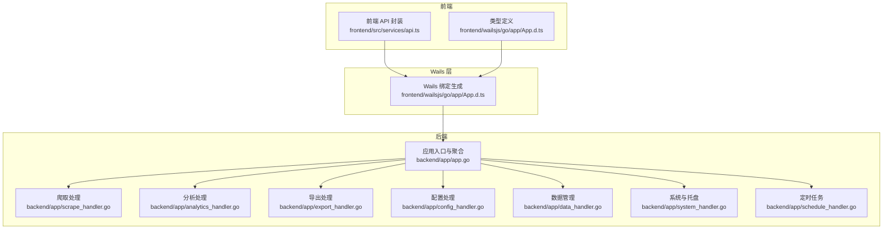
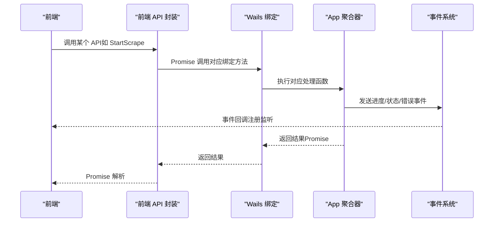
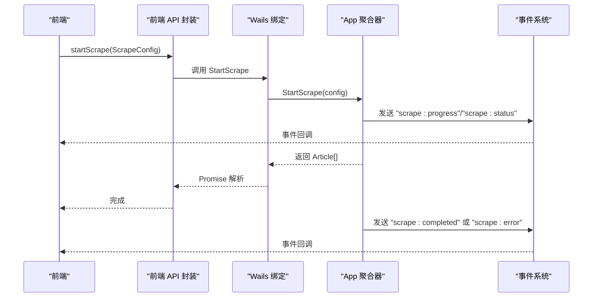
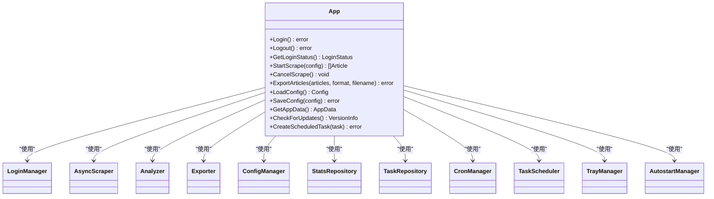

# API 文档

<cite>
**本文引用的文件**
- [backend/app/app.go](file://backend/app/app.go)
- [backend/app/scrape_handler.go](file://backend/app/scrape_handler.go)
- [backend/app/analytics_handler.go](file://backend/app/analytics_handler.go)
- [backend/app/export_handler.go](file://backend/app/export_handler.go)
- [backend/app/config_handler.go](file://backend/app/config_handler.go)
- [backend/app/data_handler.go](file://backend/app/data_handler.go)
- [backend/app/system_handler.go](file://backend/app/system_handler.go)
- [backend/app/schedule_handler.go](file://backend/app/schedule_handler.go)
- [frontend/src/services/api.ts](file://frontend/src/services/api.ts)
- [frontend/wailsjs/go/app/App.d.ts](file://frontend/wailsjs/go/app/App.d.ts)
- [backend/internal/models/config.go](file://backend/internal/models/config.go)
- [backend/internal/models/article.go](file://backend/internal/models/article.go)
- [backend/internal/models/account.go](file://backend/internal/models/account.go)
- [backend/internal/models/progress.go](file://backend/internal/models/progress.go)
- [backend/internal/models/analytics.go](file://backend/internal/models/analytics.go)
</cite>

## 目录
1. [简介](#简介)
2. [项目结构](#项目结构)
3. [核心组件](#核心组件)
4. [架构总览](#架构总览)
5. [详细组件分析](#详细组件分析)
6. [依赖关系分析](#依赖关系分析)
7. [性能考量](#性能考量)
8. [故障排查指南](#故障排查指南)
9. [结论](#结论)
10. [附录](#附录)

## 简介
本文件为 WeMediaSpider 的完整后端 API 文档，覆盖爬取、分析、导出、配置与系统管理等模块。文档详细说明了 Wails 绑定方法、前后端通信协议、事件系统、错误处理策略、安全与速率限制建议、版本控制与兼容性说明，并提供客户端实现指南与具体示例路径。

## 项目结构
WeMediaSpider 采用 Go 后端 + Wails 前端的混合架构。后端通过 Wails 将 Go 方法暴露为前端可调用的 API，并通过事件系统进行实时通信；前端通过自动生成的绑定层与后端交互。

**图表来源**
- [backend/app/app.go:1-85](file://backend/app/app.go#L1-L85)
- [frontend/src/services/api.ts:1-161](file://frontend/src/services/api.ts#L1-L161)
- [frontend/wailsjs/go/app/App.d.ts:1-140](file://frontend/wailsjs/go/app/App.d.ts#L1-L140)

**章节来源**
- [backend/app/app.go:1-85](file://backend/app/app.go#L1-L85)
- [frontend/src/services/api.ts:1-161](file://frontend/src/services/api.ts#L1-L161)
- [frontend/wailsjs/go/app/App.d.ts:1-140](file://frontend/wailsjs/go/app/App.d.ts#L1-L140)

## 核心组件
- 应用聚合器 App：负责初始化各子系统（登录、爬虫、分析、导出、配置、缓存、数据库、调度、托盘），并作为 Wails 绑定的统一入口。
- Wails 绑定：前端通过自动生成的 TypeScript 类型与 JS 绑定调用后端 Go 方法。
- 事件系统：后端通过 Wails 事件向前端推送实时进度、状态与错误信息。

**章节来源**
- [backend/app/app.go:25-83](file://backend/app/app.go#L25-L83)
- [frontend/wailsjs/go/app/App.d.ts:1-140](file://frontend/wailsjs/go/app/App.d.ts#L1-L140)
- [frontend/src/services/api.ts:103-160](file://frontend/src/services/api.ts#L103-L160)

## 架构总览
WeMediaSpider 的 API 通过 Wails 暴露，前端以 Promise 形式调用后端方法，后端在执行过程中通过事件通道向前端推送进度与状态，形成“请求-执行-事件”的闭环。

**图表来源**
- [frontend/src/services/api.ts:48-101](file://frontend/src/services/api.ts#L48-L101)
- [frontend/wailsjs/go/app/App.d.ts:9-139](file://frontend/wailsjs/go/app/App.d.ts#L9-L139)
- [backend/app/scrape_handler.go:126-244](file://backend/app/scrape_handler.go#L126-L244)

## 详细组件分析

### 登录与凭证管理
- 方法与用途
  - 登录/登出：建立/解除与目标平台的认证会话。
  - 获取登录状态：查询当前登录状态。
  - 清除登录缓存：清理本地登录缓存。
  - 导出/导入凭证：将加密后的登录凭证以文件形式保存或恢复。
- 前端绑定
  - 对应绑定方法：Login、Logout、GetLoginStatus、ClearLoginCache、ExportCredentials、ImportCredentials。
- 事件系统
  - 无直接事件推送，结果通过 Promise 返回。
- 参数与返回
  - 登录/登出：无参数，返回 Promise<void>。
  - 获取登录状态：返回 Promise<LoginStatus>。
  - 导出凭证：返回 Promise<string>（文件路径）。
  - 导入凭证：返回 Promise<void>。
- 安全与错误
  - 凭证文件以特定扩展名保存，导入时严格校验文件类型。
  - 用户取消操作时返回明确错误提示。
- 客户端实现要点
  - 使用前端 API 封装中的 login、logout、getLoginStatus、exportCredentials、importCredentials。
  - 监听 scrape 与 image 相关事件时需确保在登录后执行。

**章节来源**
- [backend/app/scrape_handler.go:20-102](file://backend/app/scrape_handler.go#L20-L102)
- [frontend/wailsjs/go/app/App.d.ts:39-83](file://frontend/wailsjs/go/app/App.d.ts#L39-L83)
- [frontend/src/services/api.ts:50-56](file://frontend/src/services/api.ts#L50-L56)

### 爬取与进度事件
- 方法与用途
  - 搜索公众号：根据关键词搜索目标账号。
  - 开始爬取：按配置并发抓取文章，支持最小/最大请求间隔。
  - 取消爬取：取消正在进行的爬取任务。
  - 提取文章内图片：从文章内容中提取图片信息。
  - 批量下载图片：按图片信息批量下载并上报进度。
  - 取消图片下载：取消正在进行的下载任务。
- 前端绑定
  - 绑定方法：SearchAccount、StartScrape、CancelScrape、ExtractArticleImages、BatchDownloadImages、CancelImageDownload。
- 事件系统
  - 爬取进度事件：scrape:progress（Progress）。
  - 爬取状态事件：scrape:status（AccountStatus）。
  - 爬取完成事件：scrape:completed（{ total: number }）。
  - 爬取错误事件：scrape:error（{ error: string }）。
  - 图片下载进度事件：image:progress（ImageDownloadProgress）。
  - 图片下载完成事件：image:completed（{ total: number }）。
  - 图片下载错误事件：image:error（{ error: string }）。
- 参数与返回
  - SearchAccount(query: string) -> Promise<Account[]>。
  - StartScrape(config: ScrapeConfig) -> Promise<Article[]>。
  - CancelScrape() -> Promise<void>。
  - ExtractArticleImages(content: string) -> Promise<ImageInfo[]>。
  - BatchDownloadImages(images: ImageInfo[], baseDir: string, maxWorkers: number) -> Promise<void>。
  - CancelImageDownload() -> Promise<void>。
- 错误处理
  - 取消操作（context.Canceled/DeadlineExceeded）不会发送错误事件。
  - 其他错误通过 scrape:error 或 image:error 事件上报。
- 客户端实现要点
  - 使用前端 API 封装中的 searchAccount、startScrape、cancelScrape、extractArticleImages、batchDownloadImages、cancelImageDownload。
  - 通过 events.onScrapeProgress/onScrapeStatus/onScrapeCompleted/onScrapeError 与 events.onImageProgress/onImageCompleted/onImageError 订阅事件。
  - 爬取前确保已登录。

**图表来源**
- [backend/app/scrape_handler.go:126-244](file://backend/app/scrape_handler.go#L126-L244)
- [frontend/src/services/api.ts:58-101](file://frontend/src/services/api.ts#L58-L101)
- [frontend/wailsjs/go/app/App.d.ts:111-129](file://frontend/wailsjs/go/app/App.d.ts#L111-L129)

**章节来源**
- [backend/app/scrape_handler.go:108-317](file://backend/app/scrape_handler.go#L108-L317)
- [frontend/src/services/api.ts:103-160](file://frontend/src/services/api.ts#L103-L160)
- [frontend/wailsjs/go/app/App.d.ts:9-139](file://frontend/wailsjs/go/app/App.d.ts#L9-L139)

### 分析与缓存
- 方法与用途
  - 获取分析数据：按日期范围与账号筛选，支持强制刷新。
  - 获取所有账号名称：用于前端选择。
  - 清除分析缓存：清空分析缓存。
- 前端绑定
  - 绑定方法：GetAnalyticsData、GetAllAccountNames、ClearAnalyticsCache。
- 参数与返回
  - GetAnalyticsData(startDate: string, endDate: string, accountNames: string[], forceRefresh: boolean) -> Promise<AnalyticsData>。
  - GetAllAccountNames() -> Promise<string[]>。
  - ClearAnalyticsCache() -> Promise<void>。
- 错误处理
  - 日期格式无效、分析器未初始化等情况返回错误。
- 客户端实现要点
  - 使用前端 API 封装中的 getAnalyticsData、getAllAccountNames、clearAnalyticsCache。

**章节来源**
- [backend/app/analytics_handler.go:13-71](file://backend/app/analytics_handler.go#L13-L71)
- [frontend/wailsjs/go/app/App.d.ts:47-51](file://frontend/wailsjs/go/app/App.d.ts#L47-L51)
- [frontend/src/services/api.ts:1-161](file://frontend/src/services/api.ts#L1-L161)

### 导出与数据导入
- 方法与用途
  - 导出文章：支持多种格式（CSV、Excel、JSON、Markdown）。
  - 选择保存文件：弹出保存对话框。
  - 导入 JSON 文件：从本地 JSON 恢复文章数据。
  - 导出到 JSON：按日期导出数据库数据为 JSON。
  - 保存 Base64 图片：将 Base64 数据保存为图片文件。
- 前端绑定
  - 绑定方法：ExportArticles、SelectSaveFile、ImportJSONFile、ExportToJSON、SaveBase64File。
- 参数与返回
  - ExportArticles(articles: Article[], format: string, filename: string) -> Promise<void>。
  - SelectSaveFile(defaultFilename: string, filters: FileFilter[]) -> Promise<string>。
  - ImportJSONFile(filePath: string) -> Promise<void>。
  - ExportToJSON(dateOrPath: string) -> Promise<string>。
  - SaveBase64File(filePath: string, base64Data: string) -> Promise<void>。
- 错误处理
  - 文件读取/解析失败、保存失败等场景返回错误。
- 客户端实现要点
  - 使用前端 API 封装中的 exportArticles、selectSaveFile、importJSONFile、exportToJSON、saveBase64File。

**章节来源**
- [backend/app/export_handler.go:33-206](file://backend/app/export_handler.go#L33-L206)
- [frontend/wailsjs/go/app/App.d.ts:37-41](file://frontend/wailsjs/go/app/App.d.ts#L37-L41)
- [frontend/src/services/api.ts:63-101](file://frontend/src/services/api.ts#L63-L101)

### 配置与缓存
- 方法与用途
  - 加载/保存配置：读取/写入应用配置。
  - 获取默认配置：返回内置默认值。
  - 选择目录：弹出目录选择对话框。
  - 清除缓存：清空全部或过期缓存。
  - 获取缓存统计：返回各类缓存条目数量。
- 前端绑定
  - 绑定方法：LoadConfig、SaveConfig、GetDefaultConfig、SelectDirectory、ClearCache、ClearExpiredCache、GetCacheStats。
- 参数与返回
  - LoadConfig() -> Promise<Config>。
  - SaveConfig(config: Config) -> Promise<void>。
  - GetDefaultConfig() -> Promise<Config>。
  - SelectDirectory() -> Promise<string>。
  - ClearCache() -> Promise<void>。
  - ClearExpiredCache() -> Promise<void>。
  - GetCacheStats() -> Promise<Record<string, number>>。
- 客户端实现要点
  - 使用前端 API 封装中的 loadConfig、saveConfig、getDefaultConfig、selectDirectory、clearCache、clearExpiredCache、getCacheStats。

**章节来源**
- [backend/app/config_handler.go:10-56](file://backend/app/config_handler.go#L10-L56)
- [frontend/wailsjs/go/app/App.d.ts:95-115](file://frontend/wailsjs/go/app/App.d.ts#L95-L115)
- [frontend/src/services/api.ts:66-79](file://frontend/src/services/api.ts#L66-L79)

### 数据管理
- 方法与用途
  - 获取应用数据：汇总统计与账号列表。
  - 列表数据文件：按公众号分组列出数据文件信息。
  - 加载数据文件：按 fakeid 加载文章。
  - 删除数据文件：按 fakeid 删除该账号所有文章。
  - 获取数据目录：返回默认数据目录路径。
  - 打开数据文件对话框：用于导入 JSON。
- 前端绑定
  - 绑定方法：GetAppData、ListDataFiles、LoadDataFile、DeleteDataFile、GetDataDirectory、OpenDataFileDialog。
- 参数与返回
  - GetAppData() -> Promise<AppData>。
  - ListDataFiles() -> Promise<DataFileInfo[]>。
  - LoadDataFile(fakeidOrPath: string) -> Promise<Article[]>。
  - DeleteDataFile(fakeidOrPath: string) -> Promise<void>。
  - GetDataDirectory() -> Promise<string>。
  - OpenDataFileDialog() -> Promise<string>。
- 客户端实现要点
  - 使用前端 API 封装中的 getAppData、listDataFiles、loadDataFile、deleteDataFile、getDataDirectory、openDataFileDialog。

**章节来源**
- [backend/app/data_handler.go:19-207](file://backend/app/data_handler.go#L19-L207)
- [frontend/wailsjs/go/app/App.d.ts:53-97](file://frontend/wailsjs/go/app/App.d.ts#L53-L97)
- [frontend/src/services/api.ts:83-98](file://frontend/src/services/api.ts#L83-L98)

### 系统与托盘、自启与版本检查
- 方法与用途
  - 启动/关闭：初始化系统配置、托盘、定时任务，关闭时释放资源。
  - 隐藏/显示窗口：托盘相关。
  - 系统配置：关闭到托盘、记住选择、更新忽略日期的读取与设置。
  - 自启动：检测与设置自启动（含静默模式）。
  - 版本检查：多源并发检查更新，带缓存与比较逻辑。
  - 日志：获取最近/全部日志，清空日志。
  - 时间：获取时间信息、立即同步时间。
- 前端绑定
  - 绑定方法：Startup、Shutdown、HideToTray、ShowWindow、SetCloseToTray、GetCloseToTray、SetRememberChoice、GetRememberChoice、SetUpdateIgnoredDate、GetUpdateIgnoredDate、IsAutostartEnabled、SetAutostart、IsAutostartSilent、CheckForUpdates、GetRecentLogs、GetAllLogs、ClearLogs、GetTimeInfo、SyncTimeNow。
- 事件系统
  - 系统配置变更事件：system-config-changed（包含 closeToTray、rememberChoice、updateIgnoredDate）。
  - 任务完成事件：task:completed（包含 taskID、status、articles、errMsg）。
- 参数与返回
  - Startup(ctx: Context) -> Promise<void>。
  - CheckForUpdates() -> Promise<VersionInfo>。
  - 其余方法多为 Promise<void> 或基础类型。
- 客户端实现要点
  - 使用前端 API 封装中的 startup、hideToTray、showWindow、setCloseToTray、getCloseToTray、setRememberChoice、getRememberChoice、setUpdateIgnoredDate、getUpdateIgnoredDate、isAutostartEnabled、setAutostart、isAutostartSilent、checkForUpdates、getRecentLogs、getAllLogs、clearLogs、getTimeInfo、syncTimeNow。
  - 订阅 system-config-changed 与 task:completed 事件。

**章节来源**
- [backend/app/system_handler.go:22-602](file://backend/app/system_handler.go#L22-L602)
- [frontend/wailsjs/go/app/App.d.ts:131-139](file://frontend/wailsjs/go/app/App.d.ts#L131-L139)
- [frontend/src/services/api.ts:103-160](file://frontend/src/services/api.ts#L103-L160)

### 定时任务管理
- 方法与用途
  - 创建/更新/删除定时任务：持久化任务并同步到 Cron 管理器。
  - 获取单个/列表任务：支持筛选启用状态与填充下次运行时间。
  - 立即运行/取消任务：手动触发或取消执行。
  - 获取执行日志：按任务 ID 与限制获取日志。
  - 验证 Cron 表达式：解析并返回下次运行时间或错误。
- 前端绑定
  - 绑定方法：CreateScheduledTask、UpdateScheduledTask、DeleteScheduledTask、GetScheduledTask、ListScheduledTasks、RunScheduledTaskNow、CancelScheduledTask、GetTaskExecutionLogs、GetRecentExecutionLogs、ValidateCronExpression。
- 参数与返回
  - CreateScheduledTask(task: ScheduledTask) -> Promise<void>。
  - UpdateScheduledTask(task: ScheduledTask) -> Promise<void>。
  - DeleteScheduledTask(id: number) -> Promise<void>。
  - GetScheduledTask(id: number) -> Promise<ScheduledTask>。
  - ListScheduledTasks(enabledOnly: boolean) -> Promise<ScheduledTask[]>。
  - RunScheduledTaskNow(id: number) -> Promise<void>。
  - CancelScheduledTask(id: number) -> Promise<void>。
  - GetTaskExecutionLogs(taskID: number, limit: number) -> Promise<TaskExecutionLog[]>。
  - GetRecentExecutionLogs(limit: number) -> Promise<TaskExecutionLog[]>。
  - ValidateCronExpression(expression: string) -> Promise<CronValidationResult>。
- 客户端实现要点
  - 使用前端 API 封装中的对应方法。
  - 订阅 task:completed 事件接收任务完成通知。

**章节来源**
- [backend/app/schedule_handler.go:42-262](file://backend/app/schedule_handler.go#L42-L262)
- [frontend/wailsjs/go/app/App.d.ts:31-75](file://frontend/wailsjs/go/app/App.d.ts#L31-L75)
- [frontend/src/services/api.ts:103-160](file://frontend/src/services/api.ts#L103-L160)

## 依赖关系分析

**图表来源**
- [backend/app/app.go:26-49](file://backend/app/app.go#L26-L49)
- [backend/app/scrape_handler.go:126-244](file://backend/app/scrape_handler.go#L126-L244)
- [backend/app/export_handler.go:33-50](file://backend/app/export_handler.go#L33-L50)
- [backend/app/analytics_handler.go:13-45](file://backend/app/analytics_handler.go#L13-L45)
- [backend/app/config_handler.go:10-18](file://backend/app/config_handler.go#L10-L18)
- [backend/app/system_handler.go:22-105](file://backend/app/system_handler.go#L22-L105)
- [backend/app/schedule_handler.go:42-72](file://backend/app/schedule_handler.go#L42-L72)

**章节来源**
- [backend/app/app.go:26-49](file://backend/app/app.go#L26-L49)

## 性能考量
- 并发与节流
  - 爬取并发由配置控制，建议结合目标平台速率限制合理设置 MaxWorkers 与 RequestInterval/Min/Max。
  - 图片下载同样受 MaxWorkers 与网络状况影响，建议分批下载并监控进度事件。
- 缓存策略
  - 分析与配置支持缓存，可通过 ClearCache/ClearExpiredCache/ClearAnalyticsCache 控制。
  - 导出统计与图片下载统计会在成功后自动更新，减少重复计算。
- I/O 与数据库
  - 批量保存文章与账号查找/创建会触发数据库写入，建议在任务完成后统一刷新统计。
- 事件驱动
  - 使用事件系统推送进度与状态，避免轮询，降低前端 CPU 占用。

[本节为通用指导，无需特定文件来源]

## 故障排查指南
- 登录与凭证
  - 导出/导入凭证失败：检查文件扩展名与权限，确认用户未取消操作。
  - 登录状态异常：调用 ClearLoginCache 后重试登录。
- 爬取与下载
  - 爬取/下载被取消：检查上下文取消信号，避免重复触发。
  - 进度不更新：确认事件监听已正确注册，且在登录后执行。
- 导出与导入
  - 导出失败：检查目标路径权限与磁盘空间。
  - 导入 JSON 失败：确认 JSON 结构与字段一致。
- 配置与缓存
  - 配置保存失败：检查配置文件所在目录权限。
  - 缓存清理无效：确认缓存管理器初始化状态。
- 系统与版本
  - 托盘图标加载失败：检查嵌入图标与回退路径。
  - 版本检查超时：多源并发检查，等待更快响应源返回。
- 日志
  - 获取日志：使用 GetRecentLogs/GetAllLogs，必要时 ClearLogs 清空缓冲。

**章节来源**
- [backend/app/scrape_handler.go:39-102](file://backend/app/scrape_handler.go#L39-L102)
- [backend/app/export_handler.go:56-121](file://backend/app/export_handler.go#L56-L121)
- [backend/app/config_handler.go:32-56](file://backend/app/config_handler.go#L32-L56)
- [backend/app/system_handler.go:22-105](file://backend/app/system_handler.go#L22-L105)

## 结论
WeMediaSpider 的 API 通过 Wails 实现前后端无缝集成，事件系统保障了实时交互体验。建议在生产环境中合理配置并发与速率限制，充分利用缓存与统计能力，并通过事件驱动优化用户体验。版本检查与系统配置提供了良好的可维护性与扩展性。

[本节为总结，无需特定文件来源]

## 附录

### Wails 绑定方法一览（按模块）
- 登录与凭证
  - Login、Logout、GetLoginStatus、ClearLoginCache、ExportCredentials、ImportCredentials
- 爬取与下载
  - SearchAccount、StartScrape、CancelScrape、ExtractArticleImages、BatchDownloadImages、CancelImageDownload
- 导出与数据导入
  - ExportArticles、SelectSaveFile、ImportJSONFile、ExportToJSON、SaveBase64File
- 配置与缓存
  - LoadConfig、SaveConfig、GetDefaultConfig、SelectDirectory、ClearCache、ClearExpiredCache、GetCacheStats
- 数据管理
  - GetAppData、ListDataFiles、LoadDataFile、DeleteDataFile、GetDataDirectory、OpenDataFileDialog
- 系统与托盘
  - Startup、HideToTray、ShowWindow、SetCloseToTray、GetCloseToTray、SetRememberChoice、GetRememberChoice、SetUpdateIgnoredDate、GetUpdateIgnoredDate、IsAutostartEnabled、SetAutostart、IsAutostartSilent、CheckForUpdates、GetRecentLogs、GetAllLogs、ClearLogs、GetTimeInfo、SyncTimeNow
- 定时任务
  - CreateScheduledTask、UpdateScheduledTask、DeleteScheduledTask、GetScheduledTask、ListScheduledTasks、RunScheduledTaskNow、CancelScheduledTask、GetTaskExecutionLogs、GetRecentExecutionLogs、ValidateCronExpression

**章节来源**
- [frontend/wailsjs/go/app/App.d.ts:9-139](file://frontend/wailsjs/go/app/App.d.ts#L9-L139)

### 事件类型与消息格式
- 爬取事件
  - scrape:progress：Progress（包含 type、current、total、message）
  - scrape:status：AccountStatus（包含 accountName、status、message、articleCount、progress）
  - scrape:completed：{ total: number }
  - scrape:error：{ error: string }
- 图片下载事件
  - image:progress：ImageDownloadProgress
  - image:completed：{ total: number }
  - image:error：{ error: string }
- 系统事件
  - system-config-changed：{ closeToTray, rememberChoice, updateIgnoredDate }
  - task:completed：{ taskID, status, articles, errMsg }

**章节来源**
- [backend/app/scrape_handler.go:159-176](file://backend/app/scrape_handler.go#L159-L176)
- [backend/app/system_handler.go:75-85](file://backend/app/system_handler.go#L75-L85)
- [frontend/src/services/api.ts:103-160](file://frontend/src/services/api.ts#L103-L160)

### 错误处理策略
- 用户取消：区分 context.Canceled/DeadlineExceeded，不发送错误事件。
- 文件操作：读取/写入失败、路径无效时返回明确错误。
- 配置与缓存：初始化失败时返回错误，避免空指针。
- 版本检查：多源并发，超时返回当前版本信息。

**章节来源**
- [backend/app/scrape_handler.go:233-241](file://backend/app/scrape_handler.go#L233-L241)
- [backend/app/export_handler.go:39-49](file://backend/app/export_handler.go#L39-L49)
- [backend/app/system_handler.go:354-362](file://backend/app/system_handler.go#L354-L362)

### 安全考虑
- 凭证存储：导出为加密文件，导入时严格校验扩展名。
- 权限控制：保存/读取文件前检查路径与权限。
- 网络安全：版本检查使用 HTTPS 源，多源并发提高可用性。

**章节来源**
- [backend/app/scrape_handler.go:39-102](file://backend/app/scrape_handler.go#L39-L102)
- [backend/app/system_handler.go:366-476](file://backend/app/system_handler.go#L366-L476)

### 速率限制与版本控制
- 速率限制
  - 建议通过 RequestInterval/Min/Max 与 MaxWorkers 控制请求节奏，避免触发目标平台风控。
- 版本控制
  - 当前版本字符串固定，版本检查通过外部 JSON 源获取最新版本并缓存 24 小时。
  - 比较算法支持主版本号、次版本号与修订号逐段比较。

**章节来源**
- [backend/app/system_handler.go:258-260](file://backend/app/system_handler.go#L258-L260)
- [backend/app/system_handler.go:279-363](file://backend/app/system_handler.go#L279-L363)
- [backend/app/system_handler.go:518-545](file://backend/app/system_handler.go#L518-L545)

### 客户端实现指南
- 初始化
  - 在应用启动时调用 Startup，订阅系统事件与任务完成事件。
- 登录流程
  - 先调用 Login，再调用 GetLoginStatus 确认状态。
- 爬取流程
  - 调用 SearchAccount 获取账号列表，准备 ScrapeConfig，调用 StartScrape 并订阅进度事件。
- 导出流程
  - 准备 Article 列表与目标格式，调用 ExportArticles。
- 配置流程
  - 调用 LoadConfig 获取当前配置，修改后调用 SaveConfig。
- 版本检查
  - 调用 CheckForUpdates 获取最新版本信息，按需引导用户更新。

**章节来源**
- [frontend/src/services/api.ts:48-101](file://frontend/src/services/api.ts#L48-L101)
- [backend/app/system_handler.go:22-86](file://backend/app/system_handler.go#L22-L86)