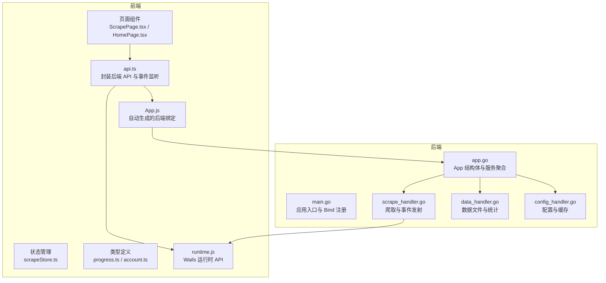
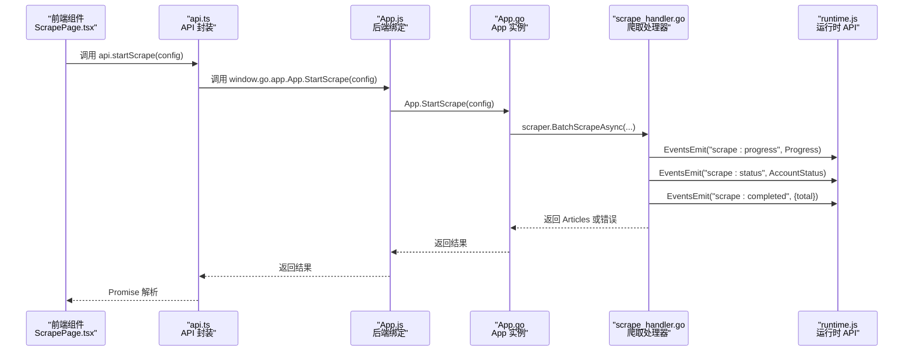
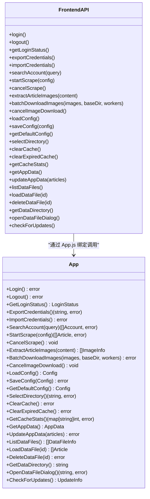
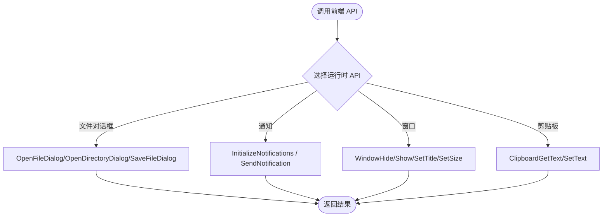
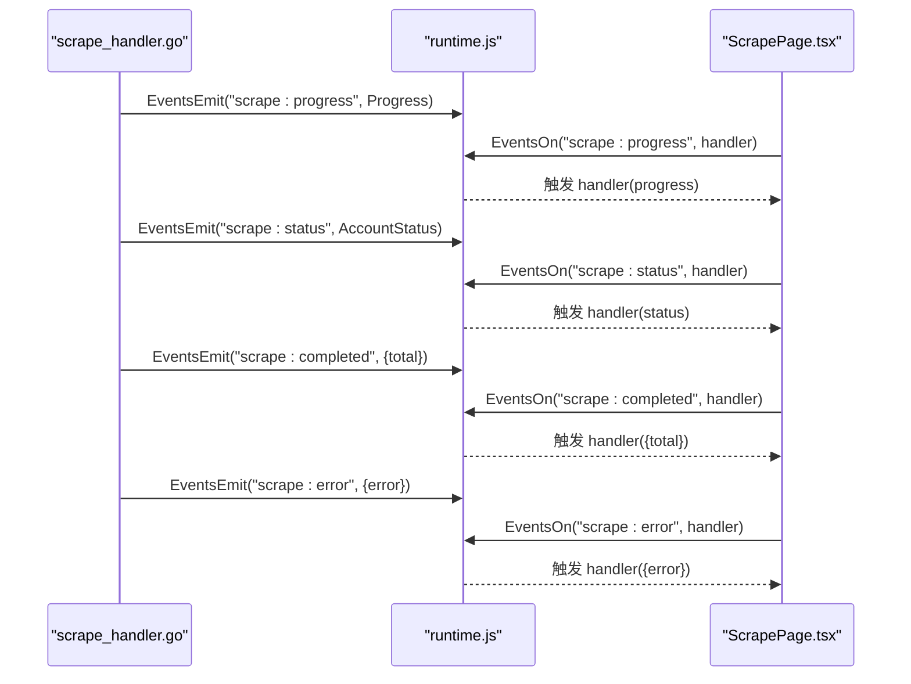
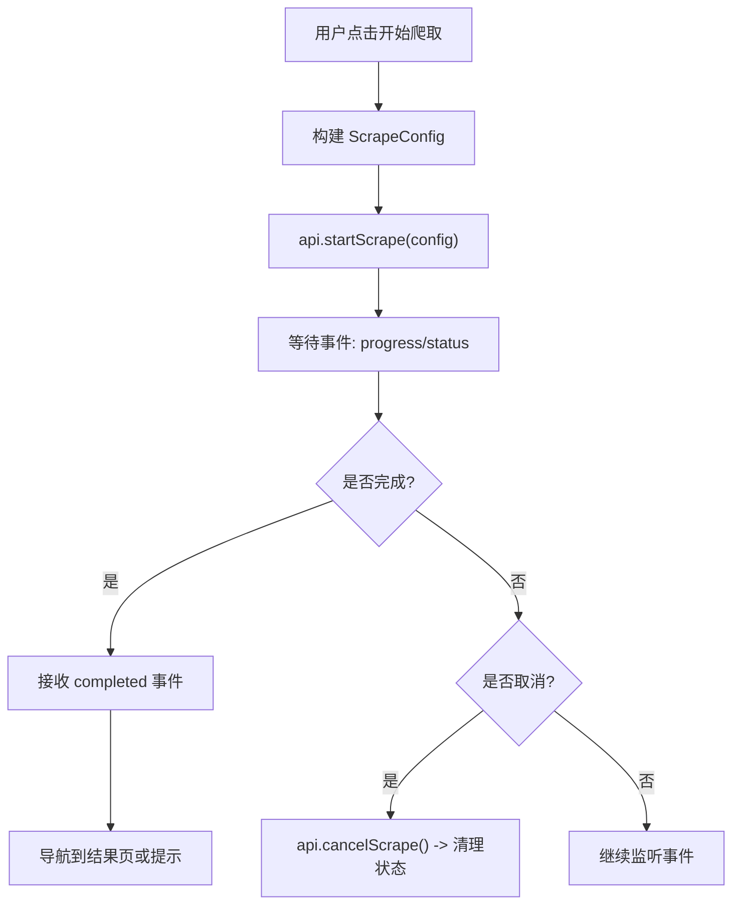
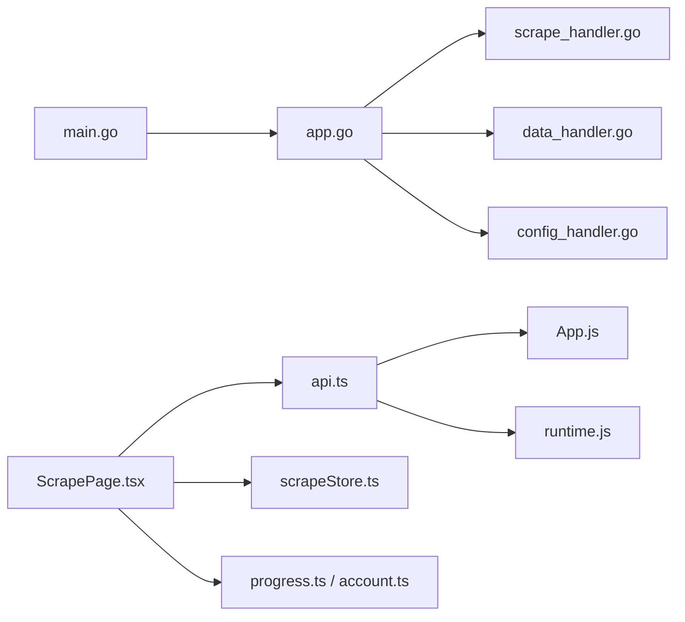

# 前后端通信机制

<cite>
**本文引用的文件**
- [main.go](file://main.go)
- [app.go](file://backend/app/app.go)
- [scrape_handler.go](file://backend/app/scrape_handler.go)
- [data_handler.go](file://backend/app/data_handler.go)
- [config_handler.go](file://backend/app/config_handler.go)
- [api.ts](file://frontend/src/services/api.ts)
- [App.js](file://frontend/wailsjs/go/app/App.js)
- [runtime.js](file://frontend/wailsjs/runtime/runtime.js)
- [ScrapePage.tsx](file://frontend/src/pages/ScrapePage.tsx)
- [HomePage.tsx](file://frontend/src/pages/HomePage.tsx)
- [LogViewer.tsx](file://frontend/src/components/LogViewer.tsx)
- [scrapeStore.ts](file://frontend/src/stores/scrapeStore.ts)
- [progress.ts](file://frontend/src/types/progress.ts)
- [account.ts](file://frontend/src/types/account.ts)
</cite>

## 目录
1. [简介](#简介)
2. [项目结构](#项目结构)
3. [核心组件](#核心组件)
4. [架构总览](#架构总览)
5. [详细组件分析](#详细组件分析)
6. [依赖关系分析](#依赖关系分析)
7. [性能考虑](#性能考虑)
8. [故障排查指南](#故障排查指南)
9. [结论](#结论)
10. [附录](#附录)

## 简介
本文件系统性阐述 WeMediaSpider 的前后端通信机制，基于 Wails 框架实现的 Go 与前端 JavaScript 的双向调用、事件系统、运行时 API 使用、数据序列化与反序列化、以及内存与性能优化策略。文档面向不同技术背景的读者，既提供高层概览也包含代码级细节与可视化图示。

## 项目结构
WeMediaSpider 采用 Wails v2 架构，Go 后端通过 Bind 暴露方法给前端，前端通过自动生成的 JS 绑定层调用后端方法，并通过 Wails Runtime API 访问系统能力（对话框、通知、剪贴板等）。事件系统用于后端向前端推送进度、状态与完成/错误信息。

**图表来源**
- [main.go:75-77](file://main.go#L75-L77)
- [app.go:26-50](file://backend/app/app.go#L26-L50)
- [scrape_handler.go:126-244](file://backend/app/scrape_handler.go#L126-L244)
- [data_handler.go:19-43](file://backend/app/data_handler.go#L19-L43)
- [config_handler.go:10-23](file://backend/app/config_handler.go#L10-L23)
- [api.ts:49-101](file://frontend/src/services/api.ts#L49-L101)
- [App.js:1-268](file://frontend/wailsjs/go/app/App.js#L1-L268)
- [runtime.js:1-298](file://frontend/wailsjs/runtime/runtime.js#L1-L298)

**章节来源**
- [main.go:23-84](file://main.go#L23-L84)
- [app.go:52-83](file://backend/app/app.go#L52-L83)

## 核心组件
- 应用入口与绑定注册：在应用启动时将 App 实例通过 Bind 暴露给前端，前端即可直接调用 App 上的方法。
- 后端处理器：按功能拆分为登录/爬取/数据/配置等处理器，统一由 App 聚合。
- 前端 API 封装：对自动生成的绑定与运行时 API 进行二次封装，提供语义化接口与事件监听器。
- 事件系统：后端通过 runtime.EventsEmit 发送进度、状态、完成与错误事件，前端通过 EventsOn 订阅。
- 类型与状态：前端使用 TypeScript 定义数据模型，配合 Zustand 管理爬取状态。

**章节来源**
- [main.go:75-77](file://main.go#L75-L77)
- [app.go:26-50](file://backend/app/app.go#L26-L50)
- [api.ts:49-161](file://frontend/src/services/api.ts#L49-L161)

## 架构总览
Wails 在 Go 侧提供 runtime.EventsEmit 与对话框等运行时 API，在前端通过 runtime.js 提供事件与系统能力；App.js 自动生成的绑定层负责将前端调用转发至 Go 方法。数据在复杂对象（如 Article、Progress、Account）之间传递，经由 Wails 序列化/反序列化。

**图表来源**
- [ScrapePage.tsx:414-482](file://frontend/src/pages/ScrapePage.tsx#L414-L482)
- [api.ts:49-101](file://frontend/src/services/api.ts#L49-L101)
- [App.js:245-247](file://frontend/wailsjs/go/app/App.js#L245-L247)
- [scrape_handler.go:126-244](file://backend/app/scrape_handler.go#L126-L244)
- [runtime.js:39-62](file://frontend/wailsjs/runtime/runtime.js#L39-L62)

## 详细组件分析

### Wails 绑定方法调用与映射
- 绑定注册：应用启动时将 App 实例加入 Bind 列表，前端通过 window.go.app.App 访问方法。
- 方法映射：App.js 为每个公开方法生成包装函数，签名与参数透传至 Go。
- 参数与返回值：前端调用返回 Promise，Go 方法可同步返回简单类型或错误；复杂对象通过 JSON 序列化传输。

**图表来源**
- [main.go:75-77](file://main.go#L75-L77)
- [App.js:1-268](file://frontend/wailsjs/go/app/App.js#L1-L268)
- [scrape_handler.go:20-102](file://backend/app/scrape_handler.go#L20-L102)
- [config_handler.go:10-56](file://backend/app/config_handler.go#L10-L56)
- [data_handler.go:19-180](file://backend/app/data_handler.go#L19-L180)

**章节来源**
- [main.go:75-77](file://main.go#L75-L77)
- [App.js:1-268](file://frontend/wailsjs/go/app/App.js#L1-L268)
- [api.ts:49-101](file://frontend/src/services/api.ts#L49-L101)

### Wails Runtime API 使用
- 对话框：通过 runtime.OpenFileDialog、runtime.SaveFileDialog、runtime.OpenDirectoryDialog 提供文件/目录选择。
- 系统通知：通过 runtime.InitializeNotifications、runtime.SendNotification、runtime.CheckNotificationAuthorization 等管理通知。
- 窗口控制：runtime.WindowHide、runtime.WindowShow、runtime.WindowSetTitle、runtime.WindowSetSize 等。
- 剪贴板：runtime.ClipboardGetText、runtime.ClipboardSetText。
- 日志：runtime.Log* 系列方法用于前端日志输出。

**图表来源**
- [runtime.js:11-37](file://frontend/wailsjs/runtime/runtime.js#L11-L37)
- [runtime.js:180-198](file://frontend/wailsjs/runtime/runtime.js#L180-L198)
- [runtime.js:200-206](file://frontend/wailsjs/runtime/runtime.js#L200-L206)
- [runtime.js:244-266](file://frontend/wailsjs/runtime/runtime.js#L244-L266)

**章节来源**
- [runtime.js:1-298](file://frontend/wailsjs/runtime/runtime.js#L1-L298)
- [scrape_handler.go:48-83](file://backend/app/scrape_handler.go#L48-L83)
- [config_handler.go:26-30](file://backend/app/config_handler.go#L26-L30)
- [data_handler.go:183-206](file://backend/app/data_handler.go#L183-L206)

### 事件系统工作原理
- 事件发射：后端在爬取过程中通过 runtime.EventsEmit 发送 "scrape:progress"、"scrape:status"、"scrape:completed"、"scrape:error" 等事件；图片下载类似地发送 "image:*" 事件。
- 事件监听：前端通过 api.events.* 或 runtime.EventsOn 订阅事件，回调接收事件数据。
- 事件数据格式：进度事件包含 type、current、total、message；账号状态事件包含 accountName、status、message、articleCount、progress 等；完成/错误事件携带统计或错误信息。

**图表来源**
- [scrape_handler.go:159-176](file://backend/app/scrape_handler.go#L159-L176)
- [scrape_handler.go:166-171](file://backend/app/scrape_handler.go#L166-L171)
- [scrape_handler.go:230-241](file://backend/app/scrape_handler.go#L230-L241)
- [scrape_handler.go:277-281](file://backend/app/scrape_handler.go#L277-L281)
- [scrape_handler.go:288-304](file://backend/app/scrape_handler.go#L288-L304)
- [api.ts:104-160](file://frontend/src/services/api.ts#L104-L160)
- [runtime.js:39-62](file://frontend/wailsjs/runtime/runtime.js#L39-L62)

**章节来源**
- [scrape_handler.go:126-244](file://backend/app/scrape_handler.go#L126-L244)
- [api.ts:104-160](file://frontend/src/services/api.ts#L104-L160)
- [progress.ts:3-19](file://frontend/src/types/progress.ts#L3-L19)
- [account.ts:1-15](file://frontend/src/types/account.ts#L1-L15)

### 数据序列化与反序列化
- 复杂对象传输：Article、Account、Progress、AccountStatus、AppData 等对象通过 Wails 自动序列化为 JSON 并在网络层传输。
- 类型转换：前端使用 TypeScript 接口约束数据结构，后端返回结构体字段与前端接口保持一致，便于类型推断与校验。
- 错误处理：错误通过字符串或结构体传递，前端统一解析 error 或 message 字段进行提示。

**章节来源**
- [progress.ts:3-19](file://frontend/src/types/progress.ts#L3-L19)
- [account.ts:1-15](file://frontend/src/types/account.ts#L1-L15)
- [scrape_handler.go:230-241](file://backend/app/scrape_handler.go#L230-L241)

### 前端调用后端方法与异步处理
- 登录/登出：前端调用 api.login()/api.logout()，后端通过 LoginManager 执行登录逻辑，返回错误或成功。
- 爬取流程：前端构建 ScrapeConfig，调用 api.startScrape(config)，后端启动异步爬取并在事件通道中推送进度与状态，完成后返回 Articles。
- 取消操作：前端调用 api.cancelScrape()，后端取消上下文，事件通道关闭，前端清理状态。
- 错误处理：前端捕获异常，区分“取消”与“真实错误”，分别处理提示与状态清理。

**图表来源**
- [ScrapePage.tsx:414-482](file://frontend/src/pages/ScrapePage.tsx#L414-L482)
- [ScrapePage.tsx:398-411](file://frontend/src/pages/ScrapePage.tsx#L398-L411)
- [api.ts:49-101](file://frontend/src/services/api.ts#L49-L101)

**章节来源**
- [ScrapePage.tsx:274-396](file://frontend/src/pages/ScrapePage.tsx#L274-L396)
- [api.ts:49-101](file://frontend/src/services/api.ts#L49-L101)

### 内存管理与性能优化
- 并发与锁：爬取与下载器通过互斥锁保护共享资源，避免竞态。
- 事件通道容量：进度与状态通道设置容量（如 100），平衡内存占用与吞吐。
- 大对象传输：尽量避免一次性传输超大数组，采用分批传输与事件驱动的方式。
- 缓存策略：后端提供 ClearCache/ClearExpiredCache/GetCacheStats，前端通过 api.clearCache()/clearExpiredCache()/getCacheStats() 控制缓存。
- 状态管理：使用 Zustand 管理爬取状态，避免不必要的重渲染。

**章节来源**
- [scrape_handler.go:144-152](file://backend/app/scrape_handler.go#L144-L152)
- [scrape_handler.go:155-156](file://backend/app/scrape_handler.go#L155-L156)
- [config_handler.go:33-56](file://backend/app/config_handler.go#L33-L56)
- [scrapeStore.ts:1-65](file://frontend/src/stores/scrapeStore.ts#L1-L65)

## 依赖关系分析
- 入口依赖：main.go 依赖 app.NewApp() 与 Wails 选项配置。
- App 聚合：app.go 聚合登录、爬取、数据、配置、缓存、调度等子系统。
- 前端依赖：api.ts 依赖自动生成的 App.js 与 runtime.js；页面组件依赖状态管理与类型定义。

**图表来源**
- [main.go:46](file://main.go#L46)
- [app.go:52-83](file://backend/app/app.go#L52-L83)
- [api.ts:33](file://frontend/src/services/api.ts#L33)
- [App.js:1-268](file://frontend/wailsjs/go/app/App.js#L1-L268)
- [runtime.js:1-298](file://frontend/wailsjs/runtime/runtime.js#L1-L298)

**章节来源**
- [main.go:46](file://main.go#L46)
- [app.go:52-83](file://backend/app/app.go#L52-L83)
- [api.ts:33](file://frontend/src/services/api.ts#L33)

## 性能考虑
- 事件驱动：通过事件通道而非轮询获取进度，降低 CPU 占用。
- 并发控制：合理设置 MaxWorkers 与请求间隔，避免触发平台风控。
- 缓存与去重：利用本地缓存减少重复请求，提高整体效率。
- 大数据分批：对大批量数据导出/下载采用分批处理与进度反馈。

## 故障排查指南
- 登录失败：检查浏览器是否正常打开、网络连通性与二维码状态；前端会区分“取消”与“失败”场景。
- 爬取中断：关注 "scrape:error" 事件，若包含“取消”字样则为预期行为；否则检查错误信息并重试。
- 事件未到达：确认事件监听是否正确注册与注销，避免重复订阅导致的消息堆积。
- 文件对话框：若返回空路径，通常表示用户取消；需在前端做相应提示。

**章节来源**
- [ScrapePage.tsx:377-396](file://frontend/src/pages/ScrapePage.tsx#L377-L396)
- [scrape_handler.go:234-241](file://backend/app/scrape_handler.go#L234-L241)
- [LogViewer.tsx:16-32](file://frontend/src/components/LogViewer.tsx#L16-L32)

## 结论
WeMediaSpider 的前后端通信以 Wails 为核心，通过 Bind 将 Go 方法暴露给前端，结合事件系统与运行时 API 实现了完整的用户交互与系统集成。类型定义与状态管理提升了开发体验与稳定性；事件驱动与缓存策略兼顾了性能与用户体验。建议在后续迭代中进一步细化错误码与日志分级，增强可观测性与可维护性。

## 附录
- 常用 API 快速索引
  - 登录：api.login(), api.logout(), api.getLoginStatus(), api.exportCredentials(), api.importCredentials()
  - 爬取：api.searchAccount(query), api.startScrape(config), api.cancelScrape()
  - 下载：api.extractArticleImages(content), api.batchDownloadImages(images, baseDir, workers), api.cancelImageDownload()
  - 配置：api.loadConfig(), api.saveConfig(config), api.getDefaultConfig(), api.selectDirectory()
  - 缓存：api.clearCache(), api.clearExpiredCache(), api.getCacheStats()
  - 数据：api.getAppData(), api.updateAppData(articles), api.listDataFiles(), api.loadDataFile(id), api.deleteDataFile(id), api.getDataDirectory(), api.openDataFileDialog()
  - 更新：api.checkForUpdates()