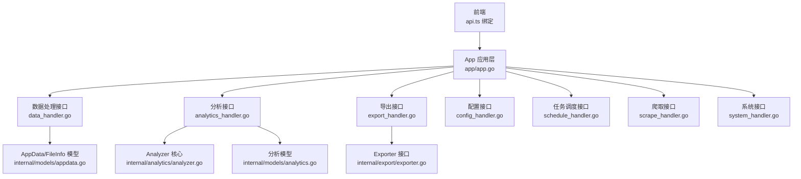
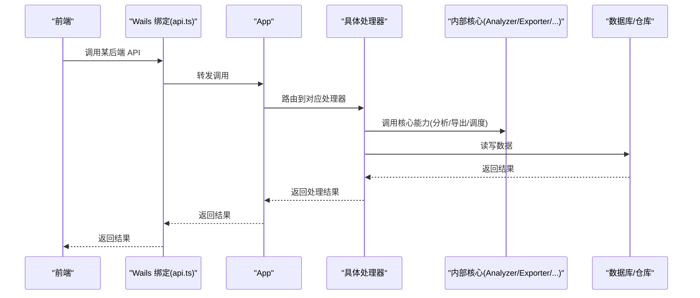
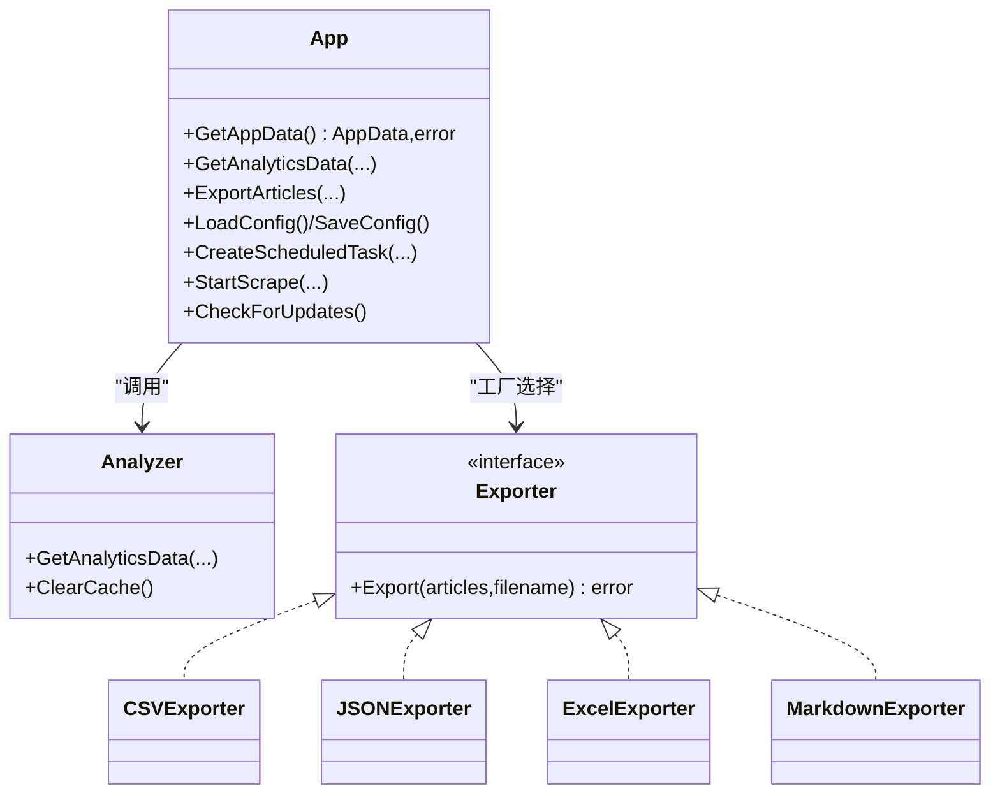

# 后端 API 接口

<cite>
**本文引用的文件**
- [backend/app/data_handler.go](file://backend/app/data_handler.go)
- [backend/app/analytics_handler.go](file://backend/app/analytics_handler.go)
- [backend/app/export_handler.go](file://backend/app/export_handler.go)
- [backend/app/config_handler.go](file://backend/app/config_handler.go)
- [backend/app/schedule_handler.go](file://backend/app/schedule_handler.go)
- [backend/app/scrape_handler.go](file://backend/app/scrape_handler.go)
- [backend/app/system_handler.go](file://backend/app/system_handler.go)
- [backend/app/app.go](file://backend/app/app.go)
- [backend/internal/analytics/analyzer.go](file://backend/internal/analytics/analyzer.go)
- [backend/internal/export/exporter.go](file://backend/internal/export/exporter.go)
- [backend/internal/models/appdata.go](file://backend/internal/models/appdata.go)
- [backend/internal/models/analytics.go](file://backend/internal/models/analytics.go)
- [frontend/src/services/api.ts](file://frontend/src/services/api.ts)
</cite>

## 目录
1. [简介](#简介)
2. [项目结构](#项目结构)
3. [核心组件](#核心组件)
4. [架构总览](#架构总览)
5. [详细组件分析](#详细组件分析)
6. [依赖分析](#依赖分析)
7. [性能考量](#性能考量)
8. [故障排查指南](#故障排查指南)
9. [结论](#结论)
10. [附录](#附录)

## 简介
本文件面向 WeMediaSpider 后端 API 的使用者与维护者，系统性梳理后端提供的全部接口，覆盖数据处理、分析、导出、配置、任务调度、爬取与系统管理等模块。文档逐项说明方法签名、参数定义、返回值类型、错误处理策略与典型使用场景，并解释接口的业务逻辑、数据流转与跨模块交互关系。

## 项目结构
后端采用按功能域划分的包结构，前端通过 Wails 生成的 JS 绑定调用后端方法。关键目录与职责如下：
- backend/app：应用层处理器，封装对外 API，协调服务与仓库层
- backend/internal/*：内部领域实现，如 analytics、export、repository、scheduler、spider、config 等
- backend/pkg/*：通用工具与基础设施
- frontend/src/services/api.ts：前端 API 调用封装与事件监听

图表来源
- [backend/app/app.go:25-50](file://backend/app/app.go#L25-L50)
- [backend/app/data_handler.go:19-43](file://backend/app/data_handler.go#L19-L43)
- [backend/app/analytics_handler.go:13-45](file://backend/app/analytics_handler.go#L13-L45)
- [backend/app/export_handler.go:34-50](file://backend/app/export_handler.go#L34-L50)
- [backend/app/config_handler.go:10-18](file://backend/app/config_handler.go#L10-L18)
- [backend/app/schedule_handler.go:42-72](file://backend/app/schedule_handler.go#L42-L72)
- [backend/app/scrape_handler.go:126-244](file://backend/app/scrape_handler.go#L126-L244)
- [backend/app/system_handler.go:280-363](file://backend/app/system_handler.go#L280-L363)

章节来源
- [backend/app/app.go:25-50](file://backend/app/app.go#L25-L50)
- [frontend/src/services/api.ts:1-161](file://frontend/src/services/api.ts#L1-L161)

## 核心组件
- App 应用实例：聚合登录、爬虫、缓存、数据库、仓库、分析器、调度器、托盘与自启动管理等能力，统一对外提供 API。
- 分析器 Analyzer：负责时间分布、关键词、长度分布、账号活跃度等分析，并带缓存控制。
- 导出器 Exporter：根据格式选择 CSV/JSON/Excel/Markdown 导出器。
- 模型层：AppData、DataFileInfo、AnalyticsData 及其子结构承载前后端数据契约。

章节来源
- [backend/app/app.go:25-50](file://backend/app/app.go#L25-L50)
- [backend/internal/analytics/analyzer.go:17-39](file://backend/internal/analytics/analyzer.go#L17-L39)
- [backend/internal/export/exporter.go:7-26](file://backend/internal/export/exporter.go#L7-L26)
- [backend/internal/models/appdata.go:3-24](file://backend/internal/models/appdata.go#L3-L24)
- [backend/internal/models/analytics.go:3-51](file://backend/internal/models/analytics.go#L3-L51)

## 架构总览
后端 API 通过 App 统一入口，按功能域拆分为多个处理器；分析与导出模块进一步内聚到 internal 子包中；前端通过 Wails 生成的绑定直接调用后端方法，并订阅运行时事件。

图表来源
- [frontend/src/services/api.ts:48-101](file://frontend/src/services/api.ts#L48-L101)
- [backend/app/analytics_handler.go:13-45](file://backend/app/analytics_handler.go#L13-L45)
- [backend/app/export_handler.go:34-50](file://backend/app/export_handler.go#L34-L50)
- [backend/app/schedule_handler.go:42-72](file://backend/app/schedule_handler.go#L42-L72)
- [backend/app/data_handler.go:19-43](file://backend/app/data_handler.go#L19-L43)
- [backend/app/scrape_handler.go:126-244](file://backend/app/scrape_handler.go#L126-L244)
- [backend/app/system_handler.go:280-363](file://backend/app/system_handler.go#L280-L363)

## 详细组件分析

### 数据处理接口
- GetAppData
  - 方法签名：GetAppData() -> AppData, error
  - 参数：无
  - 返回：应用统计与账号列表
  - 错误：数据库未初始化或查询失败
  - 业务逻辑：从统计仓库获取数据，从账号仓库获取账号名列表，转换为 AppData
  - 适用场景：首页概览、统计面板
  - 章节来源
    - [backend/app/data_handler.go:19-43](file://backend/app/data_handler.go#L19-L43)
    - [backend/internal/models/appdata.go:13-24](file://backend/internal/models/appdata.go#L13-L24)

- ListDataFiles
  - 方法签名：ListDataFiles() -> []DataFileInfo, error
  - 参数：无
  - 返回：按账号分组的数据文件信息列表（含最早/最晚发布日期、文章数）
  - 错误：数据库未初始化或查询失败
  - 业务逻辑：查询所有文章，按账号分组，计算时间范围与数量
  - 适用场景：数据文件管理、归档浏览
  - 章节来源
    - [backend/app/data_handler.go:55-123](file://backend/app/data_handler.go#L55-L123)
    - [backend/internal/models/appdata.go:3-11](file://backend/internal/models/appdata.go#L3-L11)

- LoadDataFile
  - 方法签名：LoadDataFile(fakeidOrPath string) -> []Article, error
  - 参数：账号 fakeid 或路径标识
  - 返回：该账号下的文章列表
  - 错误：数据库未初始化或查询失败
  - 业务逻辑：按 fakeid 查询文章并转换为应用模型
  - 适用场景：按账号加载历史数据
  - 章节来源
    - [backend/app/data_handler.go:125-139](file://backend/app/data_handler.go#L125-L139)

- DeleteDataFile
  - 方法签名：DeleteDataFile(fakeidOrPath string) -> error
  - 参数：账号 fakeid 或路径标识
  - 返回：无
  - 错误：数据库未初始化或删除失败
  - 业务逻辑：删除该账号下所有文章，更新统计
  - 适用场景：清理特定账号数据
  - 章节来源
    - [backend/app/data_handler.go:141-171](file://backend/app/data_handler.go#L141-L171)

- GetDataDirectory / OpenDataFileDialog
  - 方法签名：GetDataDirectory() -> string；OpenDataFileDialog() -> string, error
  - 参数：无
  - 返回：默认数据目录路径；用户选择的 JSON 文件路径
  - 错误：用户取消或系统异常
  - 业务逻辑：构造默认路径，弹窗选择文件
  - 适用场景：导入 JSON 数据
  - 章节来源
    - [backend/app/data_handler.go:173-206](file://backend/app/data_handler.go#L173-L206)

- UpdateAppData（已废弃）
  - 方法签名：UpdateAppData(articles []Article) -> error
  - 参数：文章切片
  - 返回：无
  - 错误：无
  - 业务逻辑：仅记录废弃提示，统计数据自动更新
  - 适用场景：兼容旧版本调用
  - 章节来源
    - [backend/app/data_handler.go:45-49](file://backend/app/data_handler.go#L45-L49)

### 分析接口
- GetAnalyticsData
  - 方法签名：GetAnalyticsData(startDate, endDate string, accountNames []string, forceRefresh bool) -> AnalyticsData, error
  - 参数：起止日期字符串、账号名数组、是否强制刷新缓存
  - 返回：包含时间分布、关键词、长度分布、账号排行的分析数据
  - 错误：分析器未初始化、日期解析失败、底层查询失败
  - 业务逻辑：解析日期、调整结束时间为当日 23:59:59、调用 Analyzer 获取数据并写入缓存
  - 适用场景：分析页面、报表生成
  - 章节来源
    - [backend/app/analytics_handler.go:13-45](file://backend/app/analytics_handler.go#L13-L45)
    - [backend/internal/analytics/analyzer.go:46-106](file://backend/internal/analytics/analyzer.go#L46-L106)
    - [backend/internal/models/analytics.go:44-51](file://backend/internal/models/analytics.go#L44-L51)

- GetAllAccountNames
  - 方法签名：GetAllAccountNames() -> []string, error
  - 参数：无
  - 返回：所有账号名称列表
  - 错误：查询失败
  - 业务逻辑：从账号仓库读取并返回名称数组
  - 适用场景：筛选、多选
  - 章节来源
    - [backend/app/analytics_handler.go:47-60](file://backend/app/analytics_handler.go#L47-L60)

- ClearAnalyticsCache
  - 方法签名：ClearAnalyticsCache() -> error
  - 参数：无
  - 返回：无
  - 错误：分析器未初始化
  - 业务逻辑：清空 Analyzer 缓存
  - 适用场景：强制刷新分析数据
  - 章节来源
    - [backend/app/analytics_handler.go:62-71](file://backend/app/analytics_handler.go#L62-L71)

### 导出接口
- ExportArticles
  - 方法签名：ExportArticles(articles []Article, format string, filename string) -> error
  - 参数：文章列表、目标格式、文件名
  - 返回：无
  - 错误：导出器导出失败、统计更新失败
  - 业务逻辑：根据 format 选择导出器，执行导出并更新导出统计
  - 适用场景：批量导出文章
  - 章节来源
    - [backend/app/export_handler.go:33-50](file://backend/app/export_handler.go#L33-L50)
    - [backend/internal/export/exporter.go:12-26](file://backend/internal/export/exporter.go#L12-L26)

- ExportToJSON
  - 方法签名：ExportToJSON(dateOrPath string) -> string, error
  - 参数：日期字符串
  - 返回：保存路径
  - 错误：日期格式无效、查询失败、序列化失败、用户取消或写入失败
  - 业务逻辑：查询指定日期文章，构建保存数据结构，弹窗选择保存路径并写入
  - 适用场景：按日导出 JSON
  - 章节来源
    - [backend/app/export_handler.go:123-189](file://backend/app/export_handler.go#L123-L189)

- SelectSaveFile
  - 方法签名：SelectSaveFile(defaultFilename string, filters []FileFilter) -> string, error
  - 参数：默认文件名、过滤器
  - 返回：用户选择的保存路径
  - 错误：用户取消
  - 业务逻辑：弹窗选择保存位置
  - 适用场景：通用保存对话框
  - 章节来源
    - [backend/app/export_handler.go:21-27](file://backend/app/export_handler.go#L21-L27)

- ImportJSONFile
  - 方法签名：ImportJSONFile(filePath string) -> error
  - 参数：JSON 文件路径
  - 返回：无
  - 错误：文件读取失败、JSON 解析失败、数据库保存失败
  - 业务逻辑：读取 JSON，转换为数据库模型，批量保存并更新统计
  - 适用场景：从备份恢复数据
  - 章节来源
    - [backend/app/export_handler.go:56-121](file://backend/app/export_handler.go#L56-L121)

- SaveBase64File
  - 方法签名：SaveBase64File(filePath string, base64Data string) -> error
  - 参数：目标路径、Base64 数据（可含 data URL 前缀）
  - 返回：无
  - 错误：解码失败、写入失败
  - 业务逻辑：去除前缀后解码并写入文件
  - 适用场景：保存前端传来的图片
  - 章节来源
    - [backend/app/export_handler.go:191-206](file://backend/app/export_handler.go#L191-L206)

- ExportToCSV / ExportToExcel / ExportToMarkdown / ExportToJSON（格式导出）
  - 方法签名：ExportToCSV/ExportToExcel/ExportToMarkdown/ExportToJSON(...) -> string, error
  - 参数：日期或路径、保存路径
  - 返回：保存路径
  - 错误：日期格式无效、查询失败、序列化失败、用户取消或写入失败
  - 业务逻辑：按格式导出到文件，弹窗选择保存路径
  - 适用场景：多格式导出
  - 章节来源
    - [backend/app/export_handler.go:123-189](file://backend/app/export_handler.go#L123-L189)
    - [backend/internal/export/exporter.go:12-26](file://backend/internal/export/exporter.go#L12-L26)

### 配置接口
- LoadConfig / SaveConfig / GetDefaultConfig
  - 方法签名：LoadConfig() -> Config, error；SaveConfig(Config) -> error；GetDefaultConfig() -> Config
  - 参数：配置对象
  - 返回：配置对象或默认配置
  - 错误：保存失败
  - 业务逻辑：委托配置管理器进行读写
  - 适用场景：加载/保存用户偏好
  - 章节来源
    - [backend/app/config_handler.go:10-23](file://backend/app/config_handler.go#L10-L23)

- SelectDirectory
  - 方法签名：SelectDirectory() -> string, error
  - 参数：无
  - 返回：用户选择的目录路径
  - 错误：用户取消
  - 业务逻辑：弹窗选择目录
  - 适用场景：选择输出目录
  - 章节来源
    - [backend/app/config_handler.go:25-30](file://backend/app/config_handler.go#L25-L30)

- ClearCache / ClearExpiredCache / GetCacheStats
  - 方法签名：ClearCache()/ClearExpiredCache() -> error；GetCacheStats() -> map[string]int, error
  - 参数：无
  - 返回：统计信息映射
  - 错误：缓存管理器未初始化
  - 业务逻辑：委托缓存管理器清理与统计
  - 适用场景：清理缓存、监控缓存
  - 章节来源
    - [backend/app/config_handler.go:32-56](file://backend/app/config_handler.go#L32-L56)

### 任务调度接口
- CreateScheduledTask / UpdateScheduledTask / DeleteScheduledTask
  - 方法签名：CreateScheduledTask(ScheduledTask) -> error；UpdateScheduledTask(ScheduledTask) -> error；DeleteScheduledTask(id uint) -> error
  - 参数：任务对象或 ID
  - 返回：无
  - 错误：仓库未初始化、Cron 表达式无效、持久化失败
  - 业务逻辑：校验 Cron 表达式，创建/更新/删除任务，并同步到 CronManager
  - 适用场景：新增/修改/删除定时任务
  - 章节来源
    - [backend/app/schedule_handler.go:42-124](file://backend/app/schedule_handler.go#L42-L124)

- ListScheduledTasks / GetScheduledTask
  - 方法签名：ListScheduledTasks(enabledOnly bool) -> []*ScheduledTask, error；GetScheduledTask(id uint) -> *ScheduledTask, error
  - 参数：是否仅列出启用的任务
  - 返回：任务列表或单个任务
  - 错误：仓库未初始化、查询失败
  - 业务逻辑：查询任务并填充下次运行时间
  - 适用场景：任务列表展示、详情查看
  - 章节来源
    - [backend/app/schedule_handler.go:146-172](file://backend/app/schedule_handler.go#L146-L172)
    - [backend/app/schedule_handler.go:126-144](file://backend/app/schedule_handler.go#L126-L144)

- RunScheduledTaskNow / CancelScheduledTask
  - 方法签名：RunScheduledTaskNow(id uint) -> error；CancelScheduledTask(id uint) -> error
  - 参数：任务 ID
  - 返回：无
  - 错误：调度器未初始化、取消失败
  - 业务逻辑：后台执行或取消任务
  - 适用场景：手动触发、取消执行
  - 章节来源
    - [backend/app/schedule_handler.go:174-199](file://backend/app/schedule_handler.go#L174-L199)

- GetTaskExecutionLogs / GetRecentExecutionLogs
  - 方法签名：GetTaskExecutionLogs(taskID uint, limit int) -> []*TaskExecutionLog, error；GetRecentExecutionLogs(limit int) -> []*TaskExecutionLog, error
  - 参数：任务 ID 与条数限制
  - 返回：执行日志列表
  - 错误：仓库未初始化、查询失败
  - 适用场景：任务执行审计
  - 章节来源
    - [backend/app/schedule_handler.go:201-235](file://backend/app/schedule_handler.go#L201-L235)

- ValidateCronExpression
  - 方法签名：ValidateCronExpression(expression string) -> CronValidationResult, error
  - 参数：Cron 表达式
  - 返回：校验结果（是否有效、下次运行时间、错误信息）
  - 错误：CronManager 未初始化
  - 业务逻辑：解析表达式并返回下次运行时间
  - 适用场景：表单校验
  - 章节来源
    - [backend/app/schedule_handler.go:237-262](file://backend/app/schedule_handler.go#L237-L262)
    - [backend/internal/models/analytics.go:3-8](file://backend/internal/models/analytics.go#L3-L8)

### 爬取接口
- Login / Logout / GetLoginStatus / ClearLoginCache
  - 方法签名：Login() -> error；Logout() -> error；GetLoginStatus() -> LoginStatus；ClearLoginCache() -> error
  - 参数：无
  - 返回：登录状态或无
  - 错误：登录流程异常
  - 业务逻辑：委托登录管理器处理
  - 适用场景：登录管理
  - 章节来源
    - [backend/app/scrape_handler.go:20-37](file://backend/app/scrape_handler.go#L20-L37)

- ExportCredentials / ImportCredentials
  - 方法签名：ExportCredentials() -> string, error；ImportCredentials() -> error
  - 参数：无
  - 返回：导出路径或无
  - 错误：用户取消、写入/读取失败
  - 业务逻辑：导出/导入加密凭证文件
  - 适用场景：凭据迁移
  - 章节来源
    - [backend/app/scrape_handler.go:39-102](file://backend/app/scrape_handler.go#L39-L102)

- SearchAccount
  - 方法签名：SearchAccount(query string) -> []Account, error
  - 参数：搜索关键词
  - 返回：账号列表
  - 错误：未登录或查询失败
  - 业务逻辑：确保登录后使用临时爬虫执行搜索
  - 适用场景：账号搜索
  - 章节来源
    - [backend/app/scrape_handler.go:108-123](file://backend/app/scrape_handler.go#L108-L123)

- StartScrape / CancelScrape
  - 方法签名：StartScrape(config ScrapeConfig) -> []Article, error；CancelScrape() -> void
  - 参数：爬取配置
  - 返回：文章列表或无
  - 错误：爬取过程中的非取消错误
  - 业务逻辑：创建异步爬虫，启动进度/状态事件通道，批量保存文章并更新统计，发送完成/错误事件
  - 适用场景：批量爬取
  - 章节来源
    - [backend/app/scrape_handler.go:125-244](file://backend/app/scrape_handler.go#L125-L244)

- ExtractArticleImages / BatchDownloadImages / CancelImageDownload
  - 方法签名：ExtractArticleImages(content string) -> []ImageInfo；BatchDownloadImages(images []ImageInfo, baseDir string, maxWorkers int) -> error；CancelImageDownload() -> void
  - 参数：内容/图片列表/目录/并发数
  - 返回：图片信息或无
  - 错误：下载过程中的非取消错误
  - 业务逻辑：提取图片链接，创建下载器，发送进度事件，完成后更新统计
  - 适用场景：图片提取与批量下载
  - 章节来源
    - [backend/app/scrape_handler.go:260-317](file://backend/app/scrape_handler.go#L260-L317)

### 系统接口
- GetAppVersion
  - 方法签名：GetAppVersion() -> string
  - 参数：无
  - 返回：当前版本号
  - 错误：无
  - 适用场景：显示版本
  - 章节来源
    - [backend/app/system_handler.go:258-260](file://backend/app/system_handler.go#L258-L260)

- CheckForUpdates
  - 方法签名：CheckForUpdates() -> VersionInfo, error
  - 参数：无
  - 返回：版本信息（当前、最新、是否有更新、更新链接、发行说明）
  - 错误：所有更新源均超时或失败
  - 业务逻辑：先读取缓存（24 小时），否则并发请求多个源，取最快成功结果，保存缓存并比较版本
  - 适用场景：检查更新
  - 章节来源
    - [backend/app/system_handler.go:279-363](file://backend/app/system_handler.go#L279-L363)

- ClearUpdateCache / GetUpdateIgnoredDate / SetUpdateIgnoredDate
  - 方法签名：ClearUpdateCache() -> error；GetUpdateIgnoredDate() -> string；SetUpdateIgnoredDate(date string) -> void
  - 参数：忽略日期
  - 返回：无或日期
  - 错误：无
  - 业务逻辑：清除缓存文件；读取/设置忽略日期并保存系统配置
  - 适用场景：调试更新检查、忽略特定版本
  - 章节来源
    - [backend/app/system_handler.go:478-516](file://backend/app/system_handler.go#L478-L516)
    - [backend/app/system_handler.go:165-189](file://backend/app/system_handler.go#L165-L189)

- GetTimeInfo / SyncTimeNow / GetRecentLogs / GetAllLogs / ClearLogs
  - 方法签名：GetTimeInfo() -> map[string]interface{}；SyncTimeNow() -> error；GetRecentLogs(count int) -> []string；GetAllLogs() -> []string；ClearLogs() -> void
  - 参数：日志条数
  - 返回：时间信息映射或日志列表
  - 错误：无
  - 业务逻辑：获取中国时间与时区信息，立即同步时间，读取/清空日志缓冲
  - 适用场景：时间校准、日志查看
  - 章节来源
    - [backend/app/system_handler.go:551-592](file://backend/app/system_handler.go#L551-L592)

- HideToTray / ShowWindow / SetCloseToTray / GetCloseToTray / SetRememberChoice / GetRememberChoice
  - 方法签名：HideToTray() -> void；ShowWindow() -> void；SetCloseToTray(enabled bool) -> void；GetCloseToTray() -> bool；SetRememberChoice(remember bool) -> void；GetRememberChoice() -> bool
  - 参数：布尔开关
  - 返回：无或布尔值
  - 错误：无
  - 业务逻辑：托盘与窗口管理，系统配置持久化与事件通知
  - 适用场景：窗口行为控制
  - 章节来源
    - [backend/app/system_handler.go:111-163](file://backend/app/system_handler.go#L111-L163)

- IsAutostartEnabled / SetAutostart / IsAutostartSilent
  - 方法签名：IsAutostartEnabled() -> bool；SetAutostart(enabled bool, silent bool) -> error；IsAutostartSilent() -> bool
  - 参数：启用开关与静默模式
  - 返回：布尔或错误
  - 错误：自启动管理器未初始化
  - 业务逻辑：查询/设置开机自启动
  - 适用场景：开机自启配置
  - 章节来源
    - [backend/app/system_handler.go:226-252](file://backend/app/system_handler.go#L226-L252)

- ForceQuit / ShouldBlockClose
  - 方法签名：ForceQuit() -> void；ShouldBlockClose() -> bool
  - 参数：无
  - 返回：无或布尔值
  - 错误：无
  - 业务逻辑：强制退出与关闭阻断
  - 适用场景：优雅退出
  - 章节来源
    - [backend/app/system_handler.go:211-220](file://backend/app/system_handler.go#L211-L220)

## 依赖分析
- 组件耦合
  - App 聚合多个子系统（登录、爬虫、缓存、数据库、分析、调度、托盘、自启动），通过处理器解耦对外 API。
  - 分析器 Analyzer 依赖仓库层进行数据查询，支持缓存与并发安全。
  - 导出器 Exporter 通过工厂方法按格式选择具体实现。
- 外部依赖
  - Wails 运行时事件系统用于前后端通信（如爬取进度、任务完成）。
  - 日志缓冲用于前端日志查看。
- 循环依赖
  - 未见直接循环依赖；各处理器通过 App 协调，避免相互直接调用。

图表来源
- [backend/app/app.go:25-50](file://backend/app/app.go#L25-L50)
- [backend/internal/analytics/analyzer.go:17-39](file://backend/internal/analytics/analyzer.go#L17-L39)
- [backend/internal/export/exporter.go:7-26](file://backend/internal/export/exporter.go#L7-L26)

章节来源
- [backend/app/app.go:25-50](file://backend/app/app.go#L25-L50)
- [backend/internal/analytics/analyzer.go:17-39](file://backend/internal/analytics/analyzer.go#L17-L39)
- [backend/internal/export/exporter.go:7-26](file://backend/internal/export/exporter.go#L7-L26)

## 性能考量
- 缓存策略：分析器内置缓存，默认 30 分钟，支持强制刷新；导出与更新检查使用短期缓存（24 小时）。
- 并发与事件：爬取与图片下载使用通道推送进度，避免阻塞 UI；异步执行任务，降低主线程压力。
- 数据批量：批量保存文章与图片下载，减少数据库往返。
- I/O 优化：导出前弹窗选择路径，避免无效写入；导入 JSON 时批量插入。

## 故障排查指南
- 常见错误类型
  - 数据库未初始化：检查 App 初始化顺序与依赖注入。
  - 用户取消操作：保存/打开对话框返回“用户取消”，需捕获并提示。
  - 非取消错误：爬取/下载错误事件会通过运行时事件上报，前端监听并展示。
  - Cron 表达式无效：使用 ValidateCronExpression 校验，修正后再创建/更新任务。
- 日志定位
  - 使用 GetRecentLogs/GetAllLogs/ClearLogs 查看/清理日志。
  - 更新检查失败：检查网络与多个更新源可用性。
- 事件监听
  - 前端通过 api.events 订阅 scrape/image 事件，及时反馈进度与结果。

章节来源
- [backend/app/scrape_handler.go:158-176](file://backend/app/scrape_handler.go#L158-L176)
- [backend/app/system_handler.go:576-600](file://backend/app/system_handler.go#L576-L600)
- [frontend/src/services/api.ts:103-160](file://frontend/src/services/api.ts#L103-L160)

## 结论
WeMediaSpider 后端 API 以 App 为核心，围绕数据处理、分析、导出、配置、任务调度、爬取与系统管理提供完备接口。通过清晰的分层与事件驱动机制，既保证了易用性，也兼顾了性能与可观测性。建议在前端侧完善错误处理与事件订阅，在后端侧持续优化缓存与批量操作策略。

## 附录
- 前端绑定一览（部分）
  - 登录与爬取：login、logout、getLoginStatus、clearLoginCache、exportCredentials、importCredentials、searchAccount、startScrape、cancelScrape
  - 导出与配置：exportArticles、loadConfig、saveConfig、getDefaultConfig、selectDirectory、selectSaveFile
  - 应用数据与文件：getAppData、updateAppData、listDataFiles、loadDataFile、deleteDataFile、getDataDirectory、openDataFileDialog
  - 更新检查：checkForUpdates
  - 章节来源
    - [frontend/src/services/api.ts:48-101](file://frontend/src/services/api.ts#L48-L101)