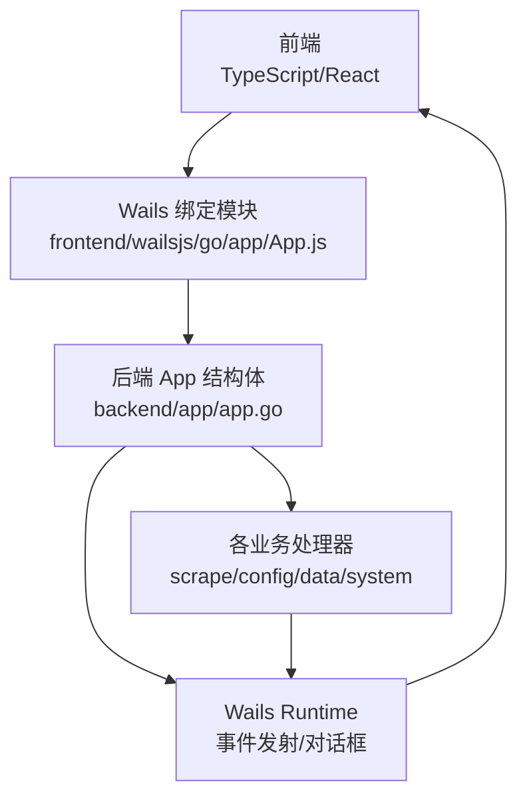
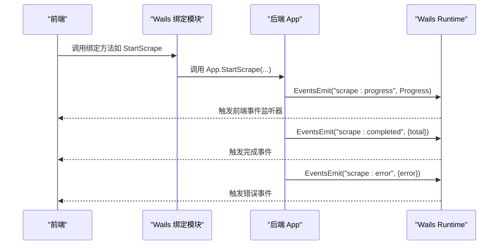
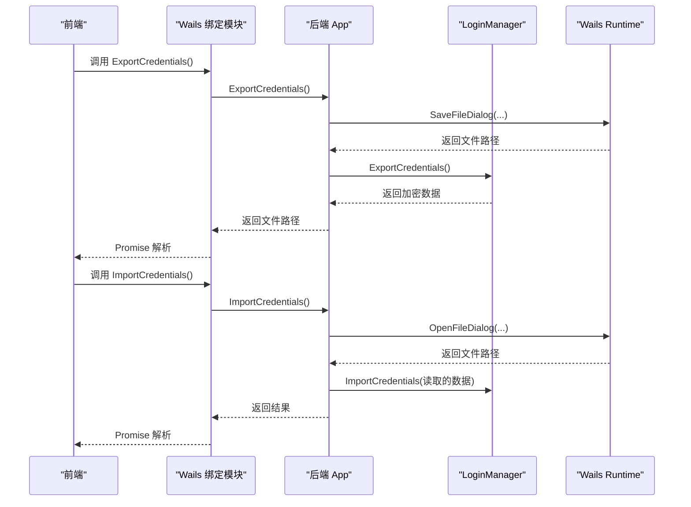
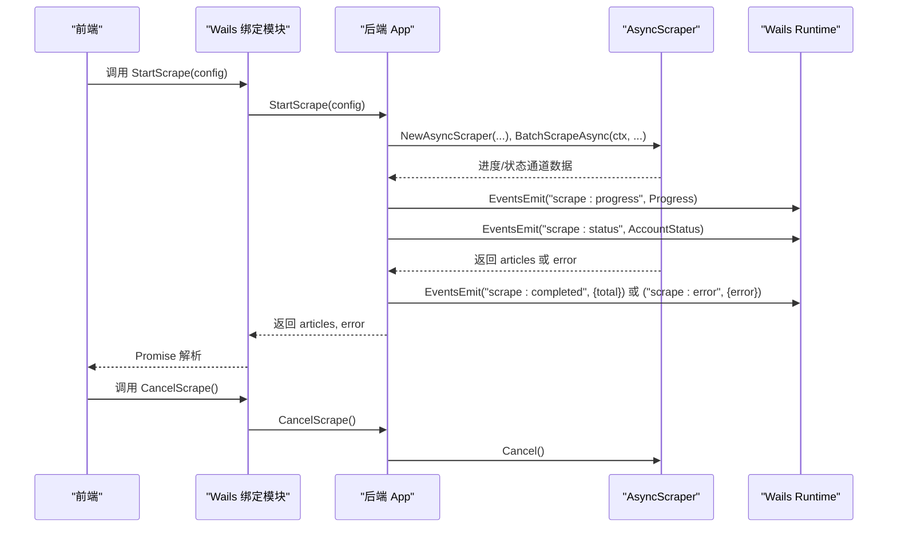
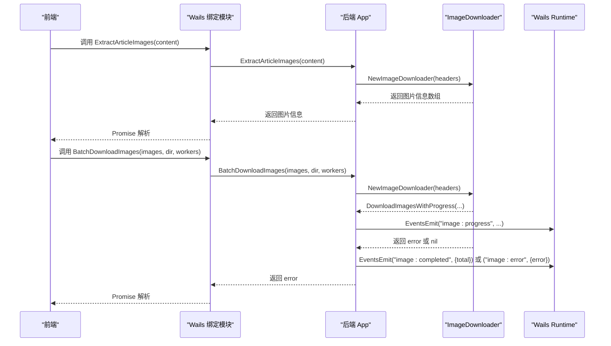
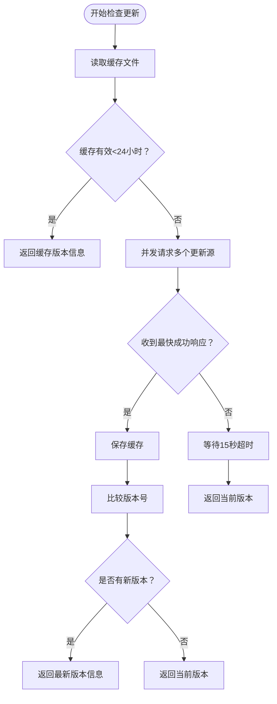
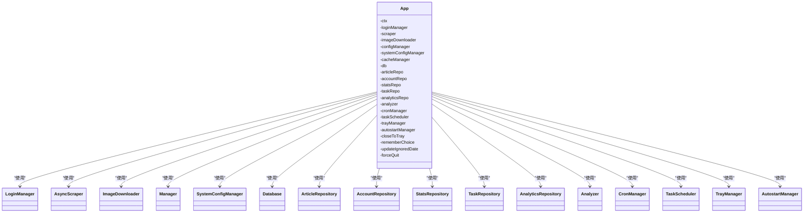

# API 服务层

<cite>
**本文引用的文件**
- [main.go](file://main.go)
- [api.ts](file://frontend/src/services/api.ts)
- [App.js](file://frontend/wailsjs/go/app/App.js)
- [app.go](file://backend/app/app.go)
- [init.go](file://backend/app/init.go)
- [scrape_handler.go](file://backend/app/scrape_handler.go)
- [data_handler.go](file://backend/app/data_handler.go)
- [config_handler.go](file://backend/app/config_handler.go)
- [system_handler.go](file://backend/app/system_handler.go)
- [index.ts](file://frontend/src/types/index.ts)
- [article.ts](file://frontend/src/types/article.ts)
- [account.ts](file://frontend/src/types/account.ts)
- [config.ts](file://frontend/src/types/config.ts)
- [progress.ts](file://frontend/src/types/progress.ts)
- [image.ts](file://frontend/src/types/image.ts)
</cite>

## 目录
1. [简介](#简介)
2. [项目结构](#项目结构)
3. [核心组件](#核心组件)
4. [架构总览](#架构总览)
5. [详细组件分析](#详细组件分析)
6. [依赖关系分析](#依赖关系分析)
7. [性能考虑](#性能考虑)
8. [故障排查指南](#故障排查指南)
9. [结论](#结论)
10. [附录](#附录)

## 简介
本文件面向 WeMediaSpider 的 API 服务层，系统性阐述前后端通信机制、Wails 绑定方法、事件系统与数据传递协议；详解 API 服务封装方式、请求处理与响应解析；解释错误处理机制、重试策略与超时控制；给出数据模型定义、类型安全与接口契约；提供 API 调用示例、性能优化与调试方法，并总结与后端服务的集成模式与通信协议规范。

## 项目结构
WeMediaSpider 采用 Wails 框架将 Go 后端与前端 TypeScript/React 前端结合。前端通过自动生成的 Wails 绑定模块调用后端方法，后端通过 Wails Runtime 发送事件到前端，形成双向通信闭环。

图表来源
- [main.go:75-77](file://main.go#L75-L77)
- [App.js:1-268](file://frontend/wailsjs/go/app/App.js#L1-L268)
- [app.go:25-50](file://backend/app/app.go#L25-L50)

章节来源
- [main.go:23-84](file://main.go#L23-L84)
- [app.go:25-83](file://backend/app/app.go#L25-L83)

## 核心组件
- Wails 应用入口与绑定
  - 在应用启动选项中将后端 App 实例绑定到前端，使前端可直接调用后端公开方法。
  - 通过 OnStartup/OnShutdown 生命周期钩子完成后端初始化与资源释放。
- 前端 API 封装
  - 统一导出后端绑定方法与事件监听器，提供类型化的调用接口。
- 事件系统
  - 后端通过 Wails Runtime 事件通道向前端推送进度、状态、完成与错误通知。
- 数据模型与类型安全
  - 前端定义了文章、账号、配置、进度、图片等类型，确保前后端数据契约一致。

章节来源
- [main.go:75-77](file://main.go#L75-L77)
- [api.ts:49-101](file://frontend/src/services/api.ts#L49-L101)
- [api.ts:104-160](file://frontend/src/services/api.ts#L104-L160)
- [index.ts:1-7](file://frontend/src/types/index.ts#L1-L7)

## 架构总览
Wails 将 Go 与前端桥接，形成如下交互链路：前端调用生成的绑定方法 → 后端 App 方法处理 → 通过 Runtime 发射事件 → 前端订阅事件更新 UI。

图表来源
- [App.js:245-247](file://frontend/wailsjs/go/app/App.js#L245-L247)
- [scrape_handler.go:179-243](file://backend/app/scrape_handler.go#L179-L243)
- [api.ts:104-135](file://frontend/src/services/api.ts#L104-L135)

## 详细组件分析

### 登录与凭证管理
- 功能要点
  - 登录/登出、获取登录状态、清理登录缓存。
  - 导出/导入加密凭证，使用系统文件对话框进行交互。
- 数据流
  - 前端调用绑定方法 → 后端 LoginManager 执行 → 成功/失败返回结果。
  - 导出/导入流程包含文件对话框与文件读写。
- 错误处理
  - 用户取消对话框返回特定错误；文件读写失败包装为可读错误信息。

图表来源
- [scrape_handler.go:39-102](file://backend/app/scrape_handler.go#L39-L102)
- [App.js:65-67](file://frontend/wailsjs/go/app/App.js#L65-L67)
- [App.js:153-155](file://frontend/wailsjs/go/app/App.js#L153-L155)

章节来源
- [scrape_handler.go:20-102](file://backend/app/scrape_handler.go#L20-L102)

### 公众号搜索与爬取
- 功能要点
  - 搜索公众号、批量异步爬取文章、取消爬取。
  - 爬取过程通过通道推送进度与状态事件，完成后持久化到数据库并更新统计。
- 并发与线程安全
  - 使用互斥锁保护异步爬虫与图片下载器的赋值与取消操作。
- 错误处理
  - 区分取消错误与业务错误，仅在非取消错误时发送错误事件。

图表来源
- [scrape_handler.go:125-254](file://backend/app/scrape_handler.go#L125-L254)
- [App.js:245-247](file://frontend/wailsjs/go/app/App.js#L245-L247)
- [App.js:17-19](file://frontend/wailsjs/go/app/App.js#L17-L19)

章节来源
- [scrape_handler.go:108-254](file://backend/app/scrape_handler.go#L108-L254)

### 图片提取与批量下载
- 功能要点
  - 从文章内容提取图片链接，批量下载图片并上报进度。
  - 支持取消图片下载，完成后更新统计。
- 数据流
  - 前端调用提取/下载绑定方法 → 后端创建 ImageDownloader → 通过通道推送进度 → 完成后发送事件。

图表来源
- [scrape_handler.go:261-317](file://backend/app/scrape_handler.go#L261-L317)
- [App.js:73-75](file://frontend/wailsjs/go/app/App.js#L73-L75)
- [App.js:257-263](file://frontend/wailsjs/go/app/App.js#L257-L263)

章节来源
- [scrape_handler.go:261-317](file://backend/app/scrape_handler.go#L261-L317)

### 配置与缓存管理
- 功能要点
  - 加载/保存应用配置、获取默认配置、选择目录。
  - 清理全部/过期缓存、获取缓存统计。
- 交互
  - 前端调用对应绑定方法，后端通过 Runtime 打开系统对话框。

章节来源
- [config_handler.go:10-57](file://backend/app/config_handler.go#L10-L57)
- [App.js:27-30](file://frontend/wailsjs/go/app/App.js#L27-L30)
- [App.js:49-51](file://frontend/wailsjs/go/app/App.js#L49-L51)

### 数据管理与导出
- 功能要点
  - 获取应用数据（统计与账号列表）、列出/加载/删除数据文件。
  - 打开数据文件选择对话框（导入 JSON）。
- 数据流
  - 通过仓储层查询数据库，转换为应用数据模型返回。

章节来源
- [data_handler.go:19-208](file://backend/app/data_handler.go#L19-L208)
- [App.js:169-171](file://frontend/wailsjs/go/app/App.js#L169-L171)
- [App.js:183-206](file://frontend/wailsjs/go/app/App.js#L183-L206)

### 系统与托盘、更新检查
- 功能要点
  - 应用启动/关闭、托盘显示/隐藏、强制退出与关闭阻断。
  - 自启动开关、系统配置变更事件。
  - 多源并发检查更新（GitHub API、jsdelivr CDN、ghproxy 镜像），带缓存与超时控制。
- 事件
  - 任务完成事件、系统配置变更事件。

图表来源
- [system_handler.go:279-363](file://backend/app/system_handler.go#L279-L363)
- [system_handler.go:412-443](file://backend/app/system_handler.go#L412-L443)
- [system_handler.go:366-410](file://backend/app/system_handler.go#L366-L410)
- [system_handler.go:446-476](file://backend/app/system_handler.go#L446-L476)

章节来源
- [system_handler.go:22-105](file://backend/app/system_handler.go#L22-L105)
- [system_handler.go:211-221](file://backend/app/system_handler.go#L211-L221)
- [system_handler.go:226-252](file://backend/app/system_handler.go#L226-L252)
- [system_handler.go:279-363](file://backend/app/system_handler.go#L279-L363)

### 数据模型与类型安全
- 文章模型
  - 字段覆盖标题、链接、摘要、内容、发布时间、关键词命中等。
- 账号模型
  - 名称、fakeid、别名、签名、头像、二维码、服务类型。
- 配置模型
  - 最大页数、请求间隔、最小/最大间隔、并发工人、是否包含正文、缓存过期、输出目录。
- 进度与状态
  - 进度类型、当前/总数、消息；账号状态含名称、状态、消息、文章数与可选进度。
- 图片信息
  - 图片 URL、索引、文件名、可选文章标题与账号名。

章节来源
- [article.ts:1-29](file://frontend/src/types/article.ts#L1-L29)
- [account.ts:1-15](file://frontend/src/types/account.ts#L1-L15)
- [config.ts:1-25](file://frontend/src/types/config.ts#L1-L25)
- [progress.ts:1-20](file://frontend/src/types/progress.ts#L1-L20)
- [image.ts:1-8](file://frontend/src/types/image.ts#L1-L8)
- [index.ts:1-7](file://frontend/src/types/index.ts#L1-L7)

## 依赖关系分析
- 组件耦合
  - App 结构体聚合多个子系统（登录、爬虫、缓存、数据库、调度、托盘、自启动），通过初始化函数集中装配。
  - 处理器方法通过 App 聚合对象执行具体业务，降低跨模块耦合。
- 外部依赖
  - Wails Runtime 提供事件与对话框能力。
  - 日志、时间同步、缓存、数据库等基础设施由独立包提供。
- 事件依赖
  - 爬取与图片下载两类事件通道，分别映射到前端的进度、完成、错误事件。

图表来源
- [app.go:25-50](file://backend/app/app.go#L25-L50)
- [init.go:43-134](file://backend/app/init.go#L43-L134)

章节来源
- [app.go:25-83](file://backend/app/app.go#L25-L83)
- [init.go:43-134](file://backend/app/init.go#L43-L134)

## 性能考虑
- 并发与限速
  - 爬取支持最大工人数量配置，请求间隔可设最小/最大值，避免对目标站点造成压力。
- 缓存策略
  - 系统级缓存管理器支持清理全部与过期缓存，降低重复请求成本。
- 事件驱动
  - 使用通道与事件机制异步推送进度，避免阻塞主线程。
- 更新检查
  - 多源并发检查与本地缓存，减少网络开销与等待时间。
- 数据库批处理
  - 爬取完成后批量写入数据库，减少事务次数。

章节来源
- [scrape_handler.go:125-151](file://backend/app/scrape_handler.go#L125-L151)
- [config_handler.go:32-56](file://backend/app/config_handler.go#L32-L56)
- [system_handler.go:279-363](file://backend/app/system_handler.go#L279-L363)
- [data_handler.go:205-212](file://backend/app/data_handler.go#L205-L212)

## 故障排查指南
- 常见问题定位
  - 登录/导出/导入凭证失败：检查用户是否取消对话框、文件权限与路径有效性。
  - 爬取/下载无事件：确认前端是否正确注册事件监听器，后端是否在运行上下文中。
  - 取消无效：确认并发锁保护下的取消调用是否正确执行。
  - 更新检查超时：检查网络连通性与多源可用性，必要时清除缓存重试。
- 日志与诊断
  - 后端使用结构化日志记录关键路径；前端可通过“最近日志”接口查看运行日志。
- 调试建议
  - 在前端使用事件监听器打印事件负载，核对进度与状态字段。
  - 对关键 API 调用增加超时与重试逻辑，避免长时间无响应。

章节来源
- [scrape_handler.go:39-102](file://backend/app/scrape_handler.go#L39-L102)
- [scrape_handler.go:179-243](file://backend/app/scrape_handler.go#L179-L243)
- [system_handler.go:577-600](file://backend/app/system_handler.go#L577-L600)

## 结论
WeMediaSpider 的 API 服务层通过 Wails 将 Go 后端与前端紧密集成，形成清晰的绑定方法与事件系统。后端以 App 为核心聚合各子系统，按领域拆分处理器，前端统一封装 API 与事件监听，配合完善的类型定义与错误处理，实现了稳定、可观测且可扩展的前后端通信方案。

## 附录

### API 调用示例（步骤说明）
- 登录与状态
  - 前端调用登录方法 → 后端执行登录流程 → 返回登录状态。
- 搜索与爬取
  - 前端传入搜索词 → 后端调用登录态下的搜索 → 返回账号列表。
  - 前端传入爬取配置 → 后端创建异步爬虫 → 通过事件推送进度/状态 → 完成后持久化并发送完成事件。
- 图片下载
  - 前端先提取图片信息 → 传入下载方法 → 后端创建下载器 → 推送进度 → 完成后发送完成事件。
- 配置与缓存
  - 前端调用加载/保存配置 → 后端通过系统对话框选择目录 → 清理缓存后返回统计。
- 更新检查
  - 前端触发检查 → 后端并发请求多个源 → 返回最新版本信息或当前版本。

章节来源
- [api.ts:49-101](file://frontend/src/services/api.ts#L49-L101)
- [App.js:185-187](file://frontend/wailsjs/go/app/App.js#L185-L187)
- [App.js:209-211](file://frontend/wailsjs/go/app/App.js#L209-L211)
- [App.js:245-247](file://frontend/wailsjs/go/app/App.js#L245-L247)
- [App.js:257-263](file://frontend/wailsjs/go/app/App.js#L257-L263)
- [App.js:27-30](file://frontend/wailsjs/go/app/App.js#L27-L30)
- [App.js:49-51](file://frontend/wailsjs/go/app/App.js#L49-L51)
- [system_handler.go:279-363](file://backend/app/system_handler.go#L279-L363)