# React 应用结构

<cite>
**本文档引用的文件**
- [frontend/src/main.tsx](file://frontend/src/main.tsx)
- [frontend/src/App.tsx](file://frontend/src/App.tsx)
- [frontend/vite.config.ts](file://frontend/vite.config.ts)
- [frontend/tsconfig.json](file://frontend/tsconfig.json)
- [frontend/tsconfig.node.json](file://frontend/tsconfig.node.json)
- [frontend/package.json](file://frontend/package.json)
- [frontend/index.html](file://frontend/index.html)
- [frontend/src/style.css](file://frontend/src/style.css)
- [frontend/src/components/Layout.tsx](file://frontend/src/components/Layout.tsx)
- [frontend/src/pages/HomePage.tsx](file://frontend/src/pages/HomePage.tsx)
- [frontend/src/services/api.ts](file://frontend/src/services/api.ts)
- [frontend/src/stores/configStore.ts](file://frontend/src/stores/configStore.ts)
- [frontend/src/stores/loginStore.ts](file://frontend/src/stores/loginStore.ts)
- [frontend/src/stores/scrapeStore.ts](file://frontend/src/stores/scrapeStore.ts)
- [frontend/src/types/index.ts](file://frontend/src/types/index.ts)
</cite>

## 目录
1. [简介](#简介)
2. [项目结构](#项目结构)
3. [核心组件](#核心组件)
4. [架构概览](#架构概览)
5. [详细组件分析](#详细组件分析)
6. [依赖分析](#依赖分析)
7. [性能考虑](#性能考虑)
8. [故障排除指南](#故障排除指南)
9. [结论](#结论)

## 简介

WeMediaSpider 是一个基于 Vite + React + TypeScript 的现代化桌面应用程序，采用 Wails 框架实现跨平台桌面应用开发。该应用专注于微信公众号文章的智能爬取和数据分析，提供了完整的前端架构解决方案。

本项目采用了最新的前端技术栈，包括：
- **Vite** 作为构建工具和开发服务器
- **React 18** 提供组件化 UI 开发
- **TypeScript** 确保类型安全和更好的开发体验
- **Ant Design** 提供丰富的 UI 组件库
- **Zustand** 轻量级状态管理方案
- **Wails** 实现 Go 后端与 React 前端的无缝集成

## 项目结构

前端项目的整体结构遵循现代 React 应用的最佳实践，采用功能模块化的组织方式：

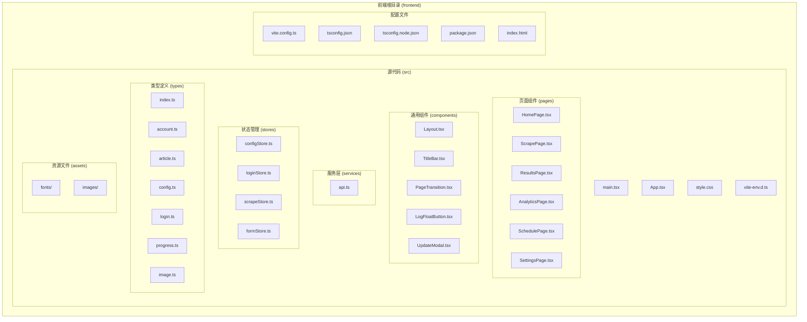

**图表来源**
- [frontend/src/main.tsx:1-25](file://frontend/src/main.tsx#L1-L25)
- [frontend/src/App.tsx:1-88](file://frontend/src/App.tsx#L1-L88)
- [frontend/vite.config.ts:1-8](file://frontend/vite.config.ts#L1-L8)

**章节来源**
- [frontend/src/main.tsx:1-25](file://frontend/src/main.tsx#L1-L25)
- [frontend/src/App.tsx:1-88](file://frontend/src/App.tsx#L1-L88)
- [frontend/vite.config.ts:1-8](file://frontend/vite.config.ts#L1-L8)

## 核心组件

### 应用入口点 (main.tsx)

应用的启动流程从入口文件开始，负责初始化 React 应用并配置全局行为：

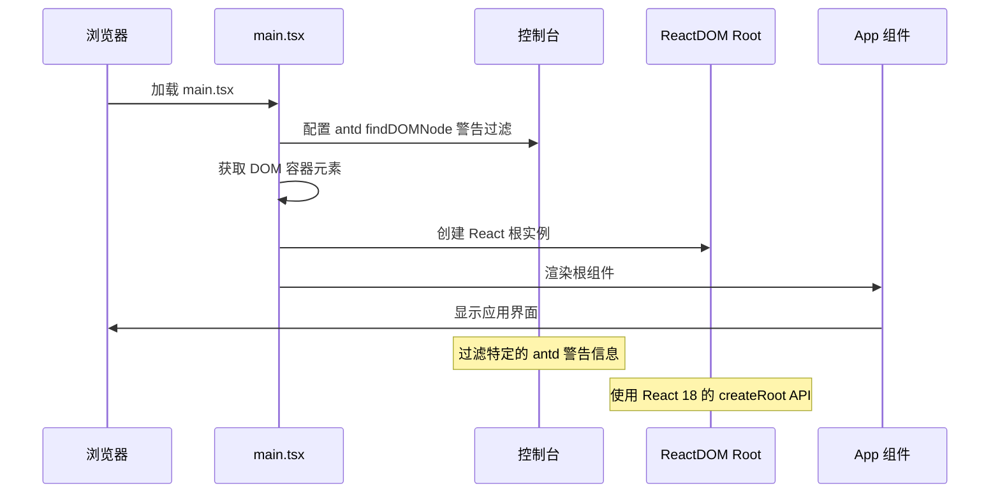

**图表来源**
- [frontend/src/main.tsx:6-24](file://frontend/src/main.tsx#L6-L24)

### 根组件 (App.tsx)

App 组件是整个应用的核心容器，负责全局状态管理和路由配置：

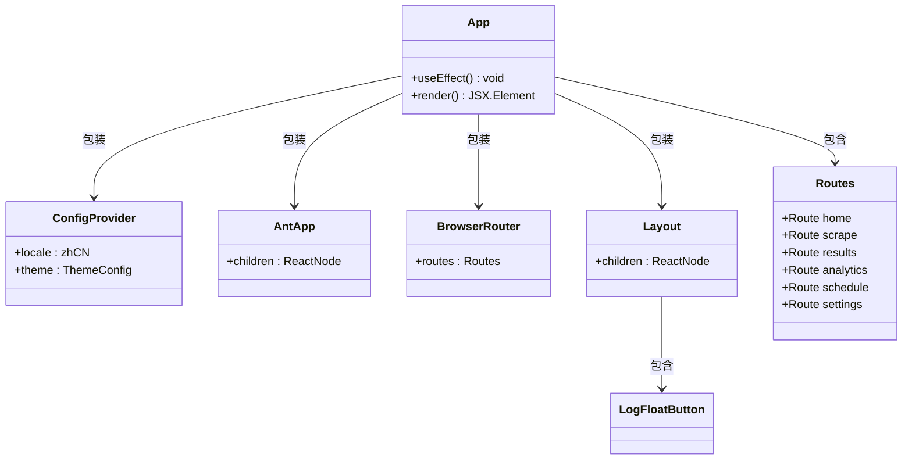

**图表来源**
- [frontend/src/App.tsx:15-84](file://frontend/src/App.tsx#L15-L84)

**章节来源**
- [frontend/src/main.tsx:1-25](file://frontend/src/main.tsx#L1-L25)
- [frontend/src/App.tsx:1-88](file://frontend/src/App.tsx#L1-L88)

## 架构概览

应用采用分层架构设计，清晰分离了展示层、业务逻辑层和服务层：

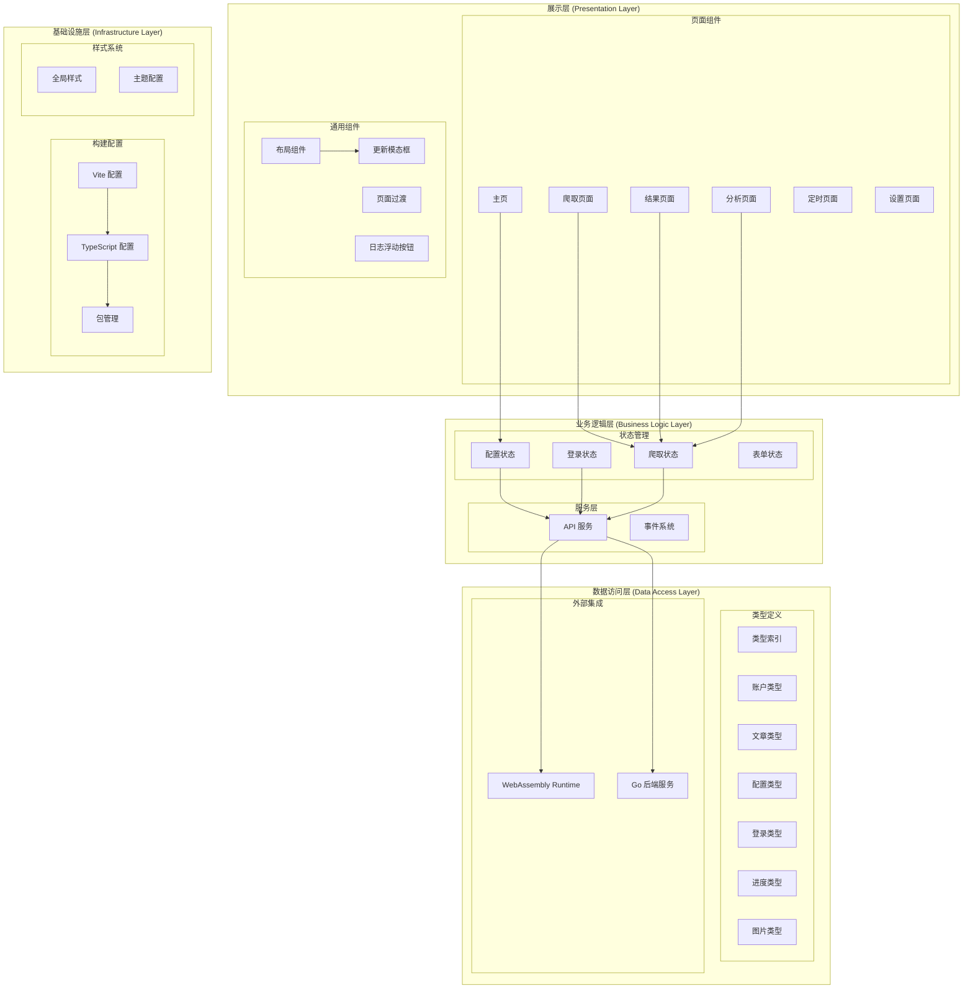

**图表来源**
- [frontend/src/App.tsx:1-88](file://frontend/src/App.tsx#L1-L88)
- [frontend/src/services/api.ts:1-161](file://frontend/src/services/api.ts#L1-L161)
- [frontend/src/stores/scrapeStore.ts:1-65](file://frontend/src/stores/scrapeStore.ts#L1-L65)

## 详细组件分析

### 布局组件 (Layout.tsx)

Layout 组件是应用的核心布局容器，提供了响应式的设计系统和动态缩放功能：

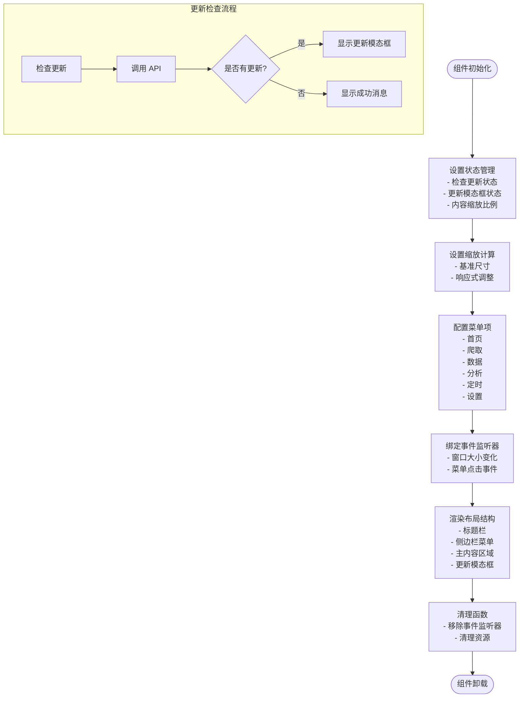

**图表来源**
- [frontend/src/components/Layout.tsx:33-140](file://frontend/src/components/Layout.tsx#L33-L140)

#### 动态缩放机制

Layout 组件实现了智能的动态缩放功能，确保应用在不同屏幕尺寸下都能完美适配：

| 设计基准 | 宽度 | 高度 | 缩放算法 |
|---------|------|------|----------|
| 基准窗口 | 1100px | 700px | `min(可用宽度/1050, 可用高度/660)` |
| 侧边栏宽度 | 50px | 固定 | 不参与缩放计算 |
| 标题栏高度 | 40px | 固定 | 不参与缩放计算 |

**章节来源**
- [frontend/src/components/Layout.tsx:1-277](file://frontend/src/components/Layout.tsx#L1-L277)

### 主页组件 (HomePage.tsx)

HomePage 是应用的主要入口页面，集成了登录状态管理、统计信息展示和更新检查功能：

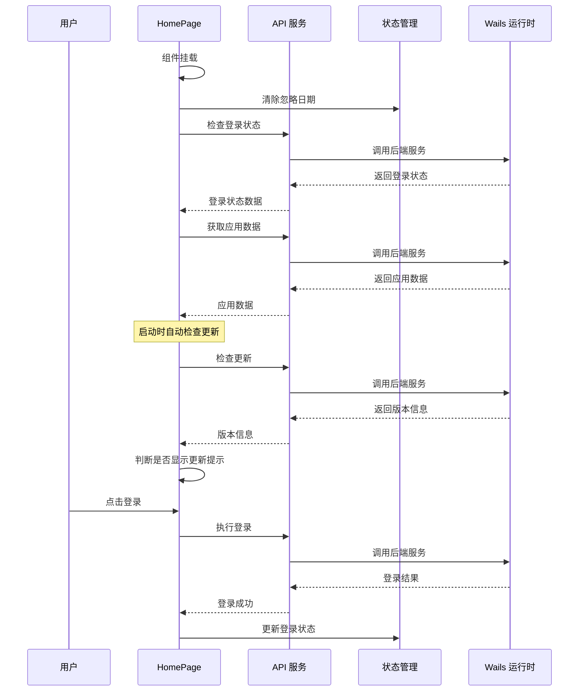

**图表来源**
- [frontend/src/pages/HomePage.tsx:132-199](file://frontend/src/pages/HomePage.tsx#L132-L199)
- [frontend/src/pages/HomePage.tsx:63-100](file://frontend/src/pages/HomePage.tsx#L63-L100)

#### 登录状态管理

应用实现了完整的登录状态管理系统，包括：

| 功能特性 | 描述 | 实现方式 |
|---------|------|----------|
| 登录状态检测 | 自动检查用户登录状态 | `checkLoginStatus()` 方法 |
| 凭证有效期 | 显示登录凭证剩余有效时间 | `getValidityPercent()` 计算 |
| 凭证导入导出 | 支持凭证的导入和导出备份 | `importCredentials()` 和 `exportCredentials()` |
| 登录超时处理 | 处理登录超时和取消情况 | 错误处理和用户提示 |

**章节来源**
- [frontend/src/pages/HomePage.tsx:1-772](file://frontend/src/pages/HomePage.tsx#L1-L772)

### API 服务层 (api.ts)

API 服务层封装了所有与后端交互的功能，提供了统一的接口访问方式：

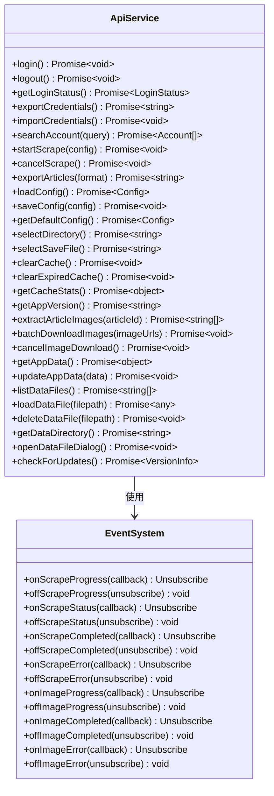

**图表来源**
- [frontend/src/services/api.ts:49-101](file://frontend/src/services/api.ts#L49-L101)
- [frontend/src/services/api.ts:104-160](file://frontend/src/services/api.ts#L104-L160)

**章节来源**
- [frontend/src/services/api.ts:1-161](file://frontend/src/services/api.ts#L1-L161)

### 状态管理 (Zustand)

应用使用 Zustand 实现轻量级的状态管理，提供了多个专门的状态存储：

#### 配置状态存储 (configStore.ts)

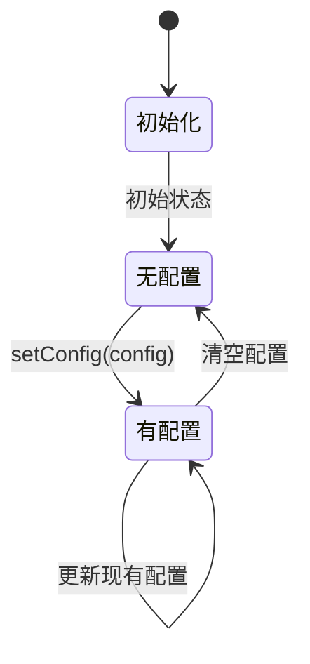

#### 登录状态存储 (loginStore.ts)

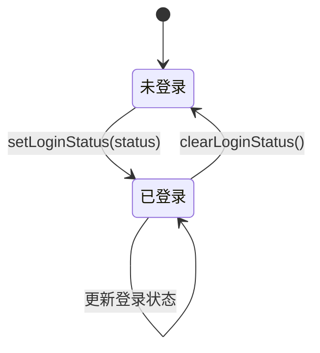

#### 爬取状态存储 (scrapeStore.ts)

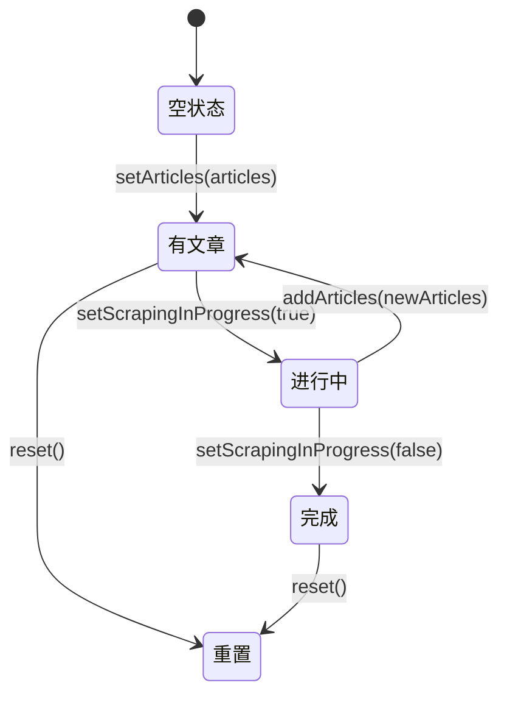

**图表来源**
- [frontend/src/stores/configStore.ts:9-12](file://frontend/src/stores/configStore.ts#L9-L12)
- [frontend/src/stores/loginStore.ts:10-14](file://frontend/src/stores/loginStore.ts#L10-L14)
- [frontend/src/stores/scrapeStore.ts:19-64](file://frontend/src/stores/scrapeStore.ts#L19-L64)

**章节来源**
- [frontend/src/stores/configStore.ts:1-13](file://frontend/src/stores/configStore.ts#L1-L13)
- [frontend/src/stores/loginStore.ts:1-15](file://frontend/src/stores/loginStore.ts#L1-L15)
- [frontend/src/stores/scrapeStore.ts:1-65](file://frontend/src/stores/scrapeStore.ts#L1-L65)

## 依赖分析

### 构建工具链

应用采用现代化的构建工具链，确保开发体验和构建效率：

```mermaid
graph LR
subgraph "开发工具链"
VITE[Vite 3.0.7]
TS[TypeScript 4.6.4]
PNPM[pnpm 8.x]
end
subgraph "React 生态"
REACT[React 18.2.0]
ROUTER[React Router 6.20.0]
ANT[Ant Design 5.12.0]
ZUSTAND[Zustand 4.4.7]
end
subgraph "开发依赖"
VITE_PLUGIN[@vitejs/plugin-react]
TYPES_REACT[@types/react]
TYPES_REACT_DOM[@types/react-dom]
end
subgraph "运行时依赖"
DAYJS[dayjs 1.11.10]
MARKED[marked 9.1.6]
ECHARTS[echarts 5.5.0]
WORDCLOUD[echarts-wordcloud 2.1.0]
end
VITE --> REACT
VITE --> TS
VITE --> VITE_PLUGIN
REACT --> ROUTER
REACT --> ANT
ANT --> ZUSTAND
REACT --> DAYJS
REACT --> MARKED
REACT --> ECHARTS
ECHARTS --> WORDCLOUD
```

**图表来源**
- [frontend/package.json:6-28](file://frontend/package.json#L6-L28)

### TypeScript 配置

应用使用双配置文件策略，确保开发时的类型检查和构建时的类型安全：

| 配置文件 | 目标 | 关键设置 |
|---------|------|----------|
| tsconfig.json | 应用源码 | `strict: true`, `module: ESNext`, `jsx: react-jsx` |
| tsconfig.node.json | 构建配置 | `module: ESNext`, `moduleResolution: Node` |

**章节来源**
- [frontend/package.json:1-30](file://frontend/package.json#L1-L30)
- [frontend/tsconfig.json:1-32](file://frontend/tsconfig.json#L1-L32)
- [frontend/tsconfig.node.json:1-12](file://frontend/tsconfig.node.json#L1-L12)

## 性能考虑

### 构建优化策略

应用采用了多项性能优化措施：

1. **Tree Shaking**: 通过 ES 模块导入实现按需加载
2. **代码分割**: React.lazy 和 Suspense 实现组件懒加载
3. **资源压缩**: Vite 默认启用代码压缩和资源优化
4. **缓存策略**: 浏览器缓存和 CDN 优化

### 运行时性能优化

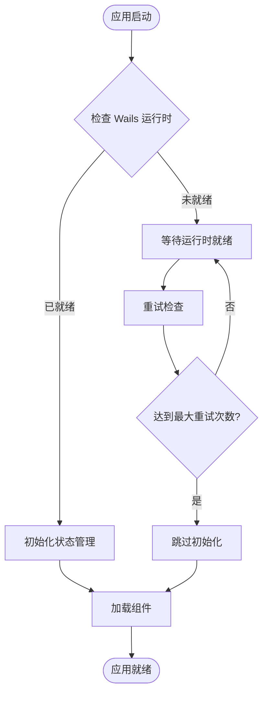

**图表来源**
- [frontend/src/pages/HomePage.tsx:155-178](file://frontend/src/pages/HomePage.tsx#L155-L178)

### 内存管理最佳实践

- **事件监听器清理**: 在组件卸载时移除所有事件监听器
- **定时器管理**: 使用清理函数确保定时器正确释放
- **状态更新优化**: 使用 React.memo 和 useMemo 优化重渲染
- **图片资源优化**: 实现图片懒加载和缓存策略

## 故障排除指南

### 常见问题及解决方案

#### 1. Wails 运行时未就绪

**症状**: 控制台出现 "Wails runtime not ready" 警告

**解决方案**:
- 检查后端服务是否正常启动
- 确认 Wails 运行时文件已正确生成
- 验证前端与后端的通信连接

#### 2. 更新检查失败

**症状**: 更新检查接口调用失败或返回错误

**解决方案**:
- 检查网络连接和代理设置
- 验证后端更新服务的可用性
- 查看控制台错误日志获取详细信息

#### 3. 登录状态异常

**症状**: 登录状态显示不正确或频繁切换

**解决方案**:
- 清除浏览器缓存和本地存储
- 检查登录凭证的有效期
- 验证后端认证服务的稳定性

**章节来源**
- [frontend/src/pages/HomePage.tsx:133-149](file://frontend/src/pages/HomePage.tsx#L133-L149)
- [frontend/src/components/Layout.tsx:93-139](file://frontend/src/components/Layout.tsx#L93-L139)

## 结论

WeMediaSpider 的 React 应用结构展现了现代前端开发的最佳实践，通过合理的架构设计和工具配置，实现了高性能、可维护的桌面应用程序。

### 核心优势

1. **现代化技术栈**: 采用 Vite + React + TypeScript + Ant Design 的组合
2. **清晰的架构分层**: 展示层、业务逻辑层、数据访问层职责明确
3. **优秀的开发体验**: 类型安全、热重载、快速构建
4. **良好的扩展性**: 模块化设计便于功能扩展和维护

### 技术亮点

- **响应式布局**: 智能缩放机制适应不同屏幕尺寸
- **状态管理**: 轻量级 Zustand 替代 Redux，简化状态管理
- **类型安全**: 完整的 TypeScript 类型定义确保代码质量
- **性能优化**: 多层次的性能优化策略提升用户体验

该应用为类似的企业级桌面应用开发提供了优秀的参考模板，展示了如何将现代前端技术与桌面应用开发框架有效结合。