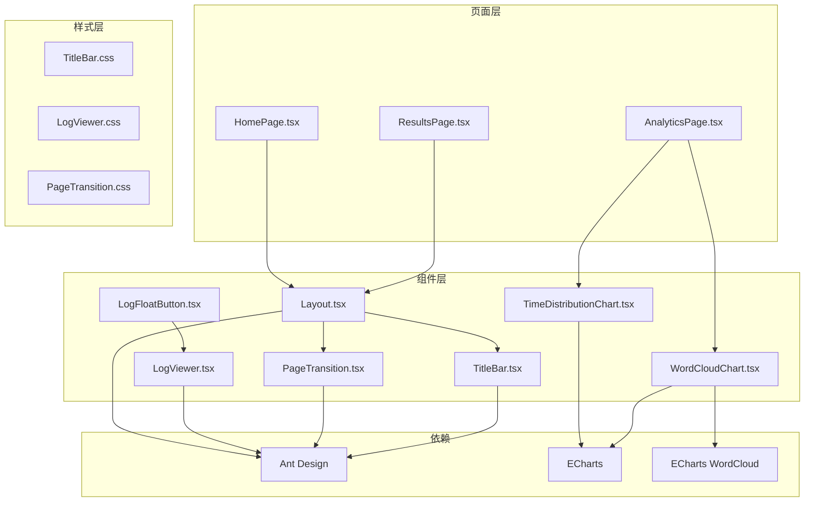
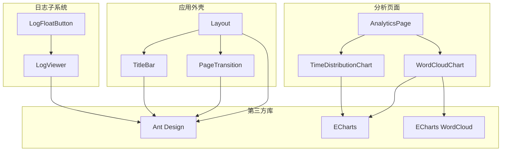
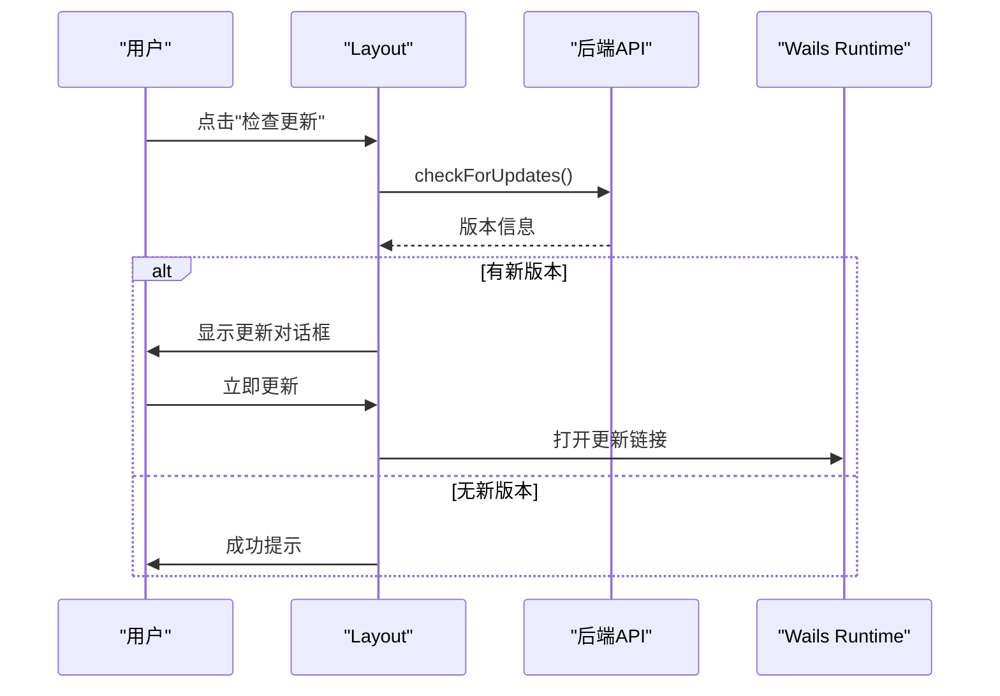
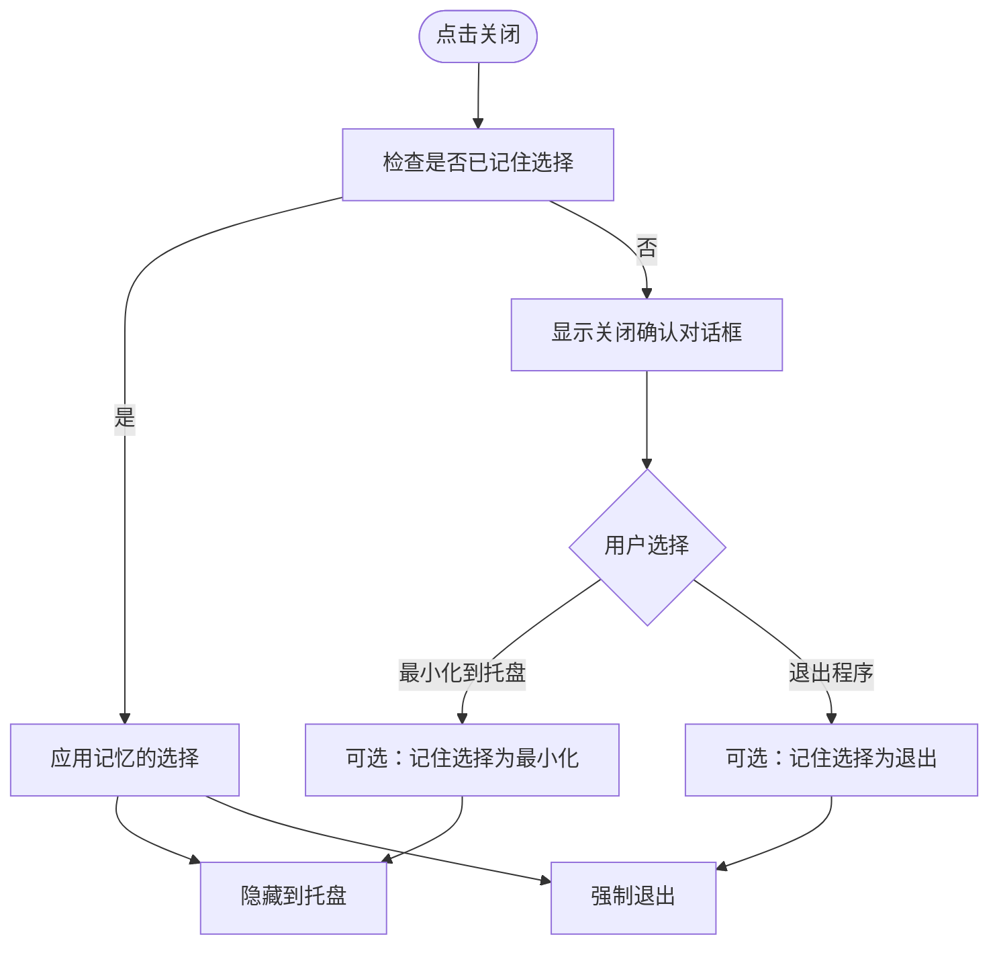
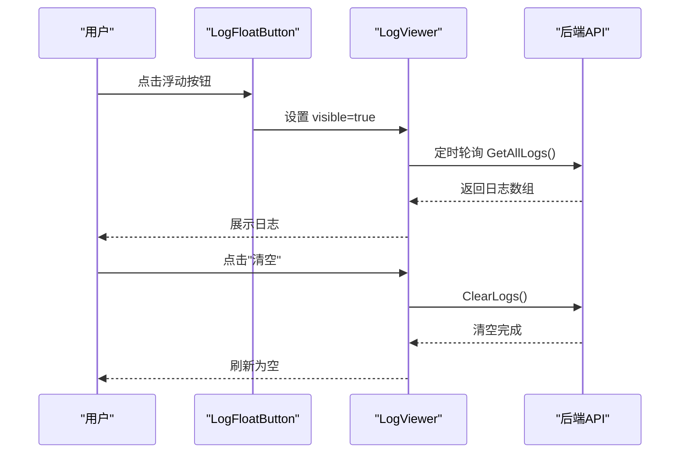
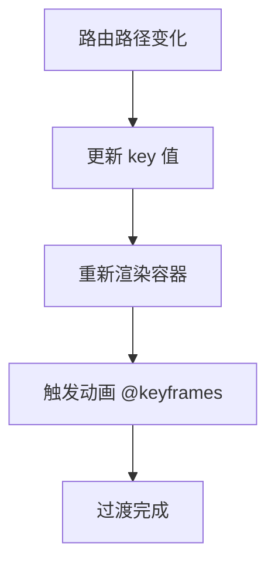
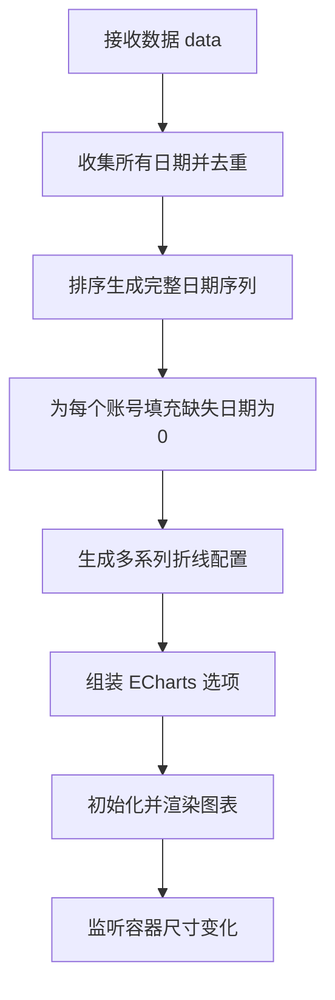
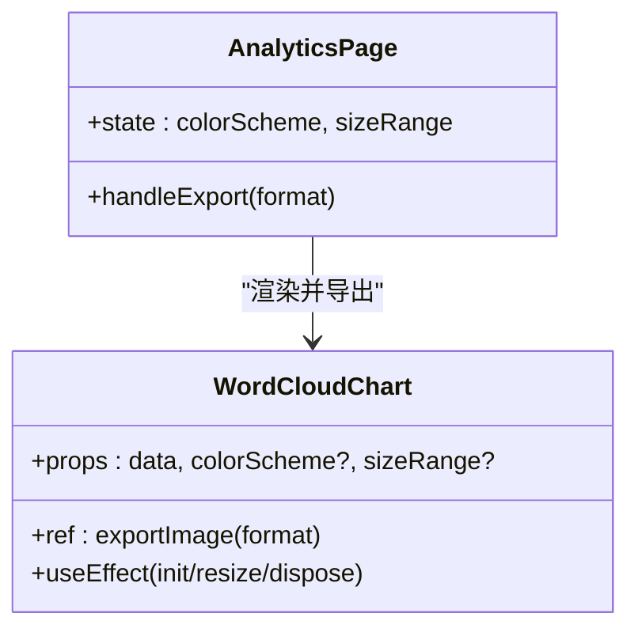
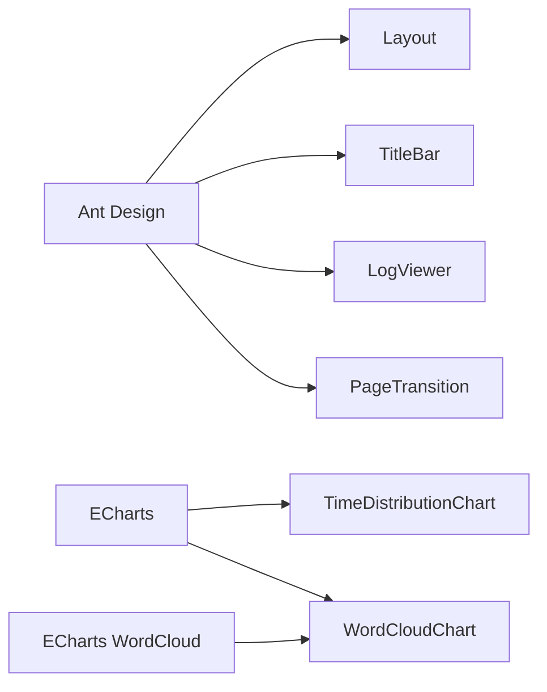

# UI 组件库

<cite>
**本文档引用的文件**
- [Layout.tsx](file://frontend/src/components/Layout.tsx)
- [TitleBar.tsx](file://frontend/src/components/TitleBar.tsx)
- [TitleBar.css](file://frontend/src/components/TitleBar.css)
- [LogViewer.tsx](file://frontend/src/components/LogViewer.tsx)
- [LogViewer.css](file://frontend/src/components/LogViewer.css)
- [LogFloatButton.tsx](file://frontend/src/components/LogFloatButton.tsx)
- [PageTransition.tsx](file://frontend/src/components/PageTransition.tsx)
- [PageTransition.css](file://frontend/src/components/PageTransition.css)
- [TimeDistributionChart.tsx](file://frontend/src/components/charts/TimeDistributionChart.tsx)
- [WordCloudChart.tsx](file://frontend/src/components/charts/WordCloudChart.tsx)
- [AnalyticsPage.tsx](file://frontend/src/pages/AnalyticsPage.tsx)
- [HomePage.tsx](file://frontend/src/pages/HomePage.tsx)
- [ResultsPage.tsx](file://frontend/src/pages/ResultsPage.tsx)
- [package.json](file://frontend/package.json)
</cite>

## 目录
1. [简介](#简介)
2. [项目结构](#项目结构)
3. [核心组件](#核心组件)
4. [架构概览](#架构概览)
5. [详细组件分析](#详细组件分析)
6. [依赖关系分析](#依赖关系分析)
7. [性能考虑](#性能考虑)
8. [故障排除指南](#故障排除指南)
9. [结论](#结论)
10. [附录](#附录)

## 简介
本文件系统性梳理 WeMediaSpider 前端 UI 组件库，涵盖布局组件、标题栏组件、日志查看器组件、页面过渡组件，以及基于 ECharts 的图表组件（时间分布图与词云图）。文档重点说明各组件的属性接口、事件处理、样式定制、复用模式、组合使用与扩展方法，并提供与 Ant Design 组件的集成方式及最佳实践。

## 项目结构
前端采用 React + TypeScript + Vite 构建，Ant Design 作为基础 UI 库，ECharts 用于数据可视化。组件主要位于 `frontend/src/components`，页面位于 `frontend/src/pages`，样式文件与组件一一对应。

**图表来源**
- [Layout.tsx:1-277](file://frontend/src/components/Layout.tsx#L1-L277)
- [TitleBar.tsx:1-122](file://frontend/src/components/TitleBar.tsx#L1-L122)
- [LogViewer.tsx:1-83](file://frontend/src/components/LogViewer.tsx#L1-L83)
- [LogFloatButton.tsx:1-24](file://frontend/src/components/LogFloatButton.tsx#L1-L24)
- [PageTransition.tsx:1-20](file://frontend/src/components/PageTransition.tsx#L1-L20)
- [TimeDistributionChart.tsx:1-207](file://frontend/src/components/charts/TimeDistributionChart.tsx#L1-L207)
- [WordCloudChart.tsx:1-132](file://frontend/src/components/charts/WordCloudChart.tsx#L1-L132)
- [AnalyticsPage.tsx:1-304](file://frontend/src/pages/AnalyticsPage.tsx#L1-L304)
- [HomePage.tsx:1-772](file://frontend/src/pages/HomePage.tsx#L1-L772)
- [ResultsPage.tsx:1-800](file://frontend/src/pages/ResultsPage.tsx#L1-L800)

**章节来源**
- [Layout.tsx:1-277](file://frontend/src/components/Layout.tsx#L1-L277)
- [package.json:1-30](file://frontend/package.json#L1-L30)

## 核心组件
本节概述四大布局与过渡组件：Layout、TitleBar、LogViewer、PageTransition。它们共同构成应用的基础骨架与交互体验。

- Layout：全局布局容器，集成侧边导航、标题栏、页面缩放、更新提示等。
- TitleBar：自定义窗口标题栏，支持最小化、关闭（含托盘/退出）、记忆选择。
- LogViewer：右侧抽屉式日志查看器，支持自动滚动、清空、定时刷新。
- PageTransition：页面切换过渡动画容器，基于路由路径 key 触发淡入动画。

**章节来源**
- [Layout.tsx:33-277](file://frontend/src/components/Layout.tsx#L33-L277)
- [TitleBar.tsx:11-122](file://frontend/src/components/TitleBar.tsx#L11-L122)
- [LogViewer.tsx:11-83](file://frontend/src/components/LogViewer.tsx#L11-L83)
- [PageTransition.tsx:9-20](file://frontend/src/components/PageTransition.tsx#L9-L20)

## 架构概览
下图展示组件间的依赖与调用关系，以及与 Ant Design 和 ECharts 的集成点。

**图表来源**
- [Layout.tsx:141-277](file://frontend/src/components/Layout.tsx#L141-L277)
- [TitleBar.tsx:97-122](file://frontend/src/components/TitleBar.tsx#L97-L122)
- [LogViewer.tsx:48-83](file://frontend/src/components/LogViewer.tsx#L48-L83)
- [LogFloatButton.tsx:6-24](file://frontend/src/components/LogFloatButton.tsx#L6-L24)
- [AnalyticsPage.tsx:1-304](file://frontend/src/pages/AnalyticsPage.tsx#L1-L304)
- [TimeDistributionChart.tsx:1-207](file://frontend/src/components/charts/TimeDistributionChart.tsx#L1-L207)
- [WordCloudChart.tsx:1-132](file://frontend/src/components/charts/WordCloudChart.tsx#L1-L132)

## 详细组件分析

### 布局组件 Layout
- 设计目标：提供统一的全局布局、响应式缩放、导航与更新管理。
- 关键特性：
  - 内容缩放：根据父容器尺寸动态计算缩放比例，保证基准分辨率下的视觉一致性。
  - 侧边导航：固定暗色主题侧栏，内嵌设置与更新入口。
  - 更新提示：通过 API 检查更新，支持“稍后”、“立即更新”、“今日不再提示”，并与后端状态同步。
- 属性接口：无对外 props，内部通过状态管理与 Wails 调用交互。
- 事件处理：检查更新、下载更新、忽略今日更新；与 Ant Design Message 协同反馈。
- 样式定制：通过内联样式与 Ant Design 组件属性实现主题与尺寸控制。
- 复用模式：作为根组件包裹页面内容，统一注入标题栏与过渡动画。
- 扩展方法：可在 Layout 中新增全局状态（如语言、主题）或通用工具栏。

**图表来源**
- [Layout.tsx:93-139](file://frontend/src/components/Layout.tsx#L93-L139)

**章节来源**
- [Layout.tsx:33-277](file://frontend/src/components/Layout.tsx#L33-L277)

### 标题栏组件 TitleBar
- 设计目标：跨平台窗口控制，提供最小化与关闭行为（可选择隐藏到托盘或强制退出），并支持记忆用户选择。
- 关键特性：
  - 关闭确认：弹窗询问最小化到托盘或退出，并可勾选“记住选择”。
  - 托盘集成：通过 Wails Runtime API 控制隐藏到托盘或强制退出。
  - 动画样式：按钮悬停、激活的渐变与阴影效果，符合暗色主题。
- 属性接口：无对外 props。
- 事件处理：最小化、关闭（带记忆逻辑）、动态更新按钮状态。
- 样式定制：通过 CSS 类与伪元素实现光晕、边框动画与图标变换。
- 复用模式：作为 Layout 的直接子组件，贯穿整个应用窗口。
- 扩展方法：可增加拖拽区域、双击最大化等行为。

**图表来源**
- [TitleBar.tsx:18-95](file://frontend/src/components/TitleBar.tsx#L18-L95)
- [TitleBar.css:1-148](file://frontend/src/components/TitleBar.css#L1-L148)

**章节来源**
- [TitleBar.tsx:11-122](file://frontend/src/components/TitleBar.tsx#L11-L122)
- [TitleBar.css:1-148](file://frontend/src/components/TitleBar.css#L1-L148)

### 日志查看器组件 LogViewer 与浮动按钮 LogFloatButton
- 设计目标：提供便捷的日志查看入口与实时日志展示。
- 关键特性：
  - 抽屉式展示：右侧抽屉，宽度适中，便于对比。
  - 自动滚动：开启时自动滚动到底部。
  - 定时刷新：可见时每秒轮询拉取最新日志。
  - 清空与手动刷新：一键清空后端日志并刷新界面。
- 属性接口：
  - LogViewer: visible（是否可见）、onClose（关闭回调）
  - LogFloatButton: 无 props，内部维护可见状态并通过浮层按钮切换
- 事件处理：点击浮动按钮切换抽屉显隐；抽屉关闭时同步状态。
- 样式定制：日志容器背景、字体、行高与悬停高亮。
- 复用模式：LogFloatButton 作为独立入口，复用 LogViewer 组件。
- 扩展方法：支持日志过滤、导出、复制等增强功能。

**图表来源**
- [LogViewer.tsx:16-46](file://frontend/src/components/LogViewer.tsx#L16-L46)
- [LogFloatButton.tsx:6-24](file://frontend/src/components/LogFloatButton.tsx#L6-L24)
- [LogViewer.css:1-27](file://frontend/src/components/LogViewer.css#L1-L27)

**章节来源**
- [LogViewer.tsx:11-83](file://frontend/src/components/LogViewer.tsx#L11-L83)
- [LogViewer.css:1-27](file://frontend/src/components/LogViewer.css#L1-L27)
- [LogFloatButton.tsx:6-24](file://frontend/src/components/LogFloatButton.tsx#L6-L24)

### 页面过渡组件 PageTransition
- 设计目标：为路由切换提供简洁的淡入过渡效果，提升用户体验。
- 关键特性：
  - 基于路由路径 key 的容器，每次路径变化重新渲染，触发动画。
  - 简洁的 CSS 动画，使用 cubic-bezier 曲线保证流畅度。
- 属性接口：children（子节点）
- 事件处理：无外部事件，仅负责动画触发。
- 样式定制：通过 @keyframes 定义入场动画，可调整时长与缓动曲线。
- 复用模式：作为 Layout 内容区的直接子组件，包裹页面内容。
- 扩展方法：可扩展为更复杂的转场效果（如滑动、缩放）。

**图表来源**
- [PageTransition.tsx:9-17](file://frontend/src/components/PageTransition.tsx#L9-L17)
- [PageTransition.css:1-18](file://frontend/src/components/PageTransition.css#L1-L18)

**章节来源**
- [PageTransition.tsx:9-20](file://frontend/src/components/PageTransition.tsx#L9-L20)
- [PageTransition.css:1-18](file://frontend/src/components/PageTransition.css#L1-L18)

### 图表组件 TimeDistributionChart（时间分布图）
- 设计目标：展示多个公众号在时间维度上的文章发布趋势。
- 关键特性：
  - 数据预处理：收集所有日期并生成完整日期序列，缺失日期补零。
  - 多系列折线：每个公众号一条线，平滑曲线与采样优化。
  - 响应式配置：坐标轴、网格、提示框、图例等均针对暗色主题优化。
  - 自适应：ResizeObserver 监听容器变化并自动 resize。
- 属性接口：data（AccountTimeDistribution[]）
- 事件处理：组件内部生命周期管理（初始化、更新、销毁）。
- 样式定制：颜色、字体、分割线、坐标轴样式均支持主题化。
- 复用模式：在 AnalyticsPage 中直接使用，传入聚合后的趋势数据。
- 扩展方法：支持更多统计指标（如平均值、累计值）叠加展示。

**图表来源**
- [TimeDistributionChart.tsx:17-184](file://frontend/src/components/charts/TimeDistributionChart.tsx#L17-L184)

**章节来源**
- [TimeDistributionChart.tsx:13-207](file://frontend/src/components/charts/TimeDistributionChart.tsx#L13-L207)
- [AnalyticsPage.tsx:221-228](file://frontend/src/pages/AnalyticsPage.tsx#L221-L228)

### 图表组件 WordCloudChart（词云图）
- 设计目标：展示关键词热力分布，支持导出图片。
- 关键特性：
  - 可导出：通过 ref 暴露 exportImage 方法，支持 PNG/JPEG。
  - 主题配色：内置绿色、蓝色、紫色、彩虹四种配色方案。
  - 动态配置：支持字号范围、随机颜色、强调聚焦与阴影。
  - 自适应布局：首次渲染后延迟一帧再 resize，确保容器稳定。
- 属性接口：data（[{word, count}]）、colorScheme（可选）、sizeRange（可选）
- 事件处理：组件内部生命周期管理与容器监听。
- 样式定制：颜色方案、字体、旋转角度、网格密度等均可配置。
- 复用模式：在 AnalyticsPage 中作为卡片内容使用，配合导出控件。
- 扩展方法：支持自定义形状、权重算法、交互行为（点击跳转）。

**图表来源**
- [WordCloudChart.tsx:25-132](file://frontend/src/components/charts/WordCloudChart.tsx#L25-L132)
- [AnalyticsPage.tsx:37-54](file://frontend/src/pages/AnalyticsPage.tsx#L37-L54)

**章节来源**
- [WordCloudChart.tsx:25-132](file://frontend/src/components/charts/WordCloudChart.tsx#L25-L132)
- [AnalyticsPage.tsx:283-295](file://frontend/src/pages/AnalyticsPage.tsx#L283-L295)

## 依赖关系分析
- 组件依赖 Ant Design：布局、导航、抽屉、按钮、模态框、统计组件等。
- 图表依赖 ECharts：TimeDistributionChart 与 WordCloudChart 均基于 ECharts。
- 词云扩展：WordCloudChart 依赖 echarts-wordcloud 插件。
- 跨平台：TitleBar 与更新逻辑通过 Wails Runtime 与后端交互。

**图表来源**
- [package.json:11-21](file://frontend/package.json#L11-L21)
- [TimeDistributionChart.tsx:1-3](file://frontend/src/components/charts/TimeDistributionChart.tsx#L1-L3)
- [WordCloudChart.tsx:1-4](file://frontend/src/components/charts/WordCloudChart.tsx#L1-L4)

**章节来源**
- [package.json:11-21](file://frontend/package.json#L11-L21)

## 性能考虑
- 图表性能：
  - TimeDistributionChart 使用采样与平滑曲线减少大数据量渲染压力。
  - WordCloudChart 在配色/尺寸变化时销毁重建，确保布局正确性。
- 布局缩放：
  - Layout 使用 scale 缩放而非像素级重排，降低重绘成本。
- 日志刷新：
  - LogViewer 可控的定时刷新与自动滚动，避免频繁 DOM 操作。
- 建议：
  - 对高频更新的数据（如日志）采用节流/防抖。
  - 图表容器使用 ResizeObserver 监听，避免全局 resize 事件风暴。

## 故障排除指南
- 标题栏关闭行为异常：
  - 检查 Wails Runtime 是否就绪，确认记忆选择与托盘状态读写。
  - 参考：[TitleBar.tsx:18-95](file://frontend/src/components/TitleBar.tsx#L18-L95)
- 图表不显示或空白：
  - 确认数据非空且包含有效日期范围；检查容器尺寸与 ResizeObserver。
  - 参考：[TimeDistributionChart.tsx:17-184](file://frontend/src/components/charts/TimeDistributionChart.tsx#L17-L184)
- 词云导出失败：
  - 确认 ref 已正确传递，导出前数据存在；检查文件选择与保存 API。
  - 参考：[WordCloudChart.tsx:32-41](file://frontend/src/components/charts/WordCloudChart.tsx#L32-L41)，[AnalyticsPage.tsx:37-54](file://frontend/src/pages/AnalyticsPage.tsx#L37-L54)
- 日志抽屉无法刷新：
  - 检查 visible 状态与定时器清理；确认后端日志接口可用。
  - 参考：[LogViewer.tsx:34-46](file://frontend/src/components/LogViewer.tsx#L34-L46)

**章节来源**
- [TitleBar.tsx:18-95](file://frontend/src/components/TitleBar.tsx#L18-L95)
- [TimeDistributionChart.tsx:17-184](file://frontend/src/components/charts/TimeDistributionChart.tsx#L17-L184)
- [WordCloudChart.tsx:32-41](file://frontend/src/components/charts/WordCloudChart.tsx#L32-L41)
- [AnalyticsPage.tsx:37-54](file://frontend/src/pages/AnalyticsPage.tsx#L37-L54)
- [LogViewer.tsx:34-46](file://frontend/src/components/LogViewer.tsx#L34-L46)

## 结论
WeMediaSpider 的 UI 组件库以 Ant Design 为基础，结合自定义布局与动画，辅以 ECharts 图表实现数据分析可视化。组件具备良好的可复用性与扩展性，通过清晰的属性接口、事件处理与样式定制，满足不同页面场景的需求。建议在后续迭代中进一步完善日志过滤、图表交互与主题切换能力。

## 附录
- 组件使用示例（路径参考）：
  - 在页面中引入并使用：[AnalyticsPage.tsx:221-295](file://frontend/src/pages/AnalyticsPage.tsx#L221-L295)
  - 作为根布局使用：[HomePage.tsx:313-769](file://frontend/src/pages/HomePage.tsx#L313-L769)
  - 数据驱动图表：[ResultsPage.tsx:1-800](file://frontend/src/pages/ResultsPage.tsx#L1-L800)
- 最佳实践：
  - 图表组件尽量在数据就绪后再渲染，避免空渲染。
  - 使用 ResizeObserver 监听容器变化，确保图表自适应。
  - 对高频交互（如日志刷新）进行节流，降低性能开销。
  - 标题栏与更新逻辑分离，便于测试与维护。