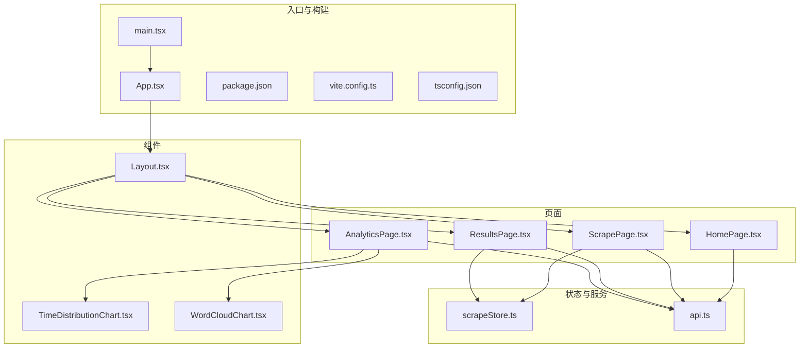
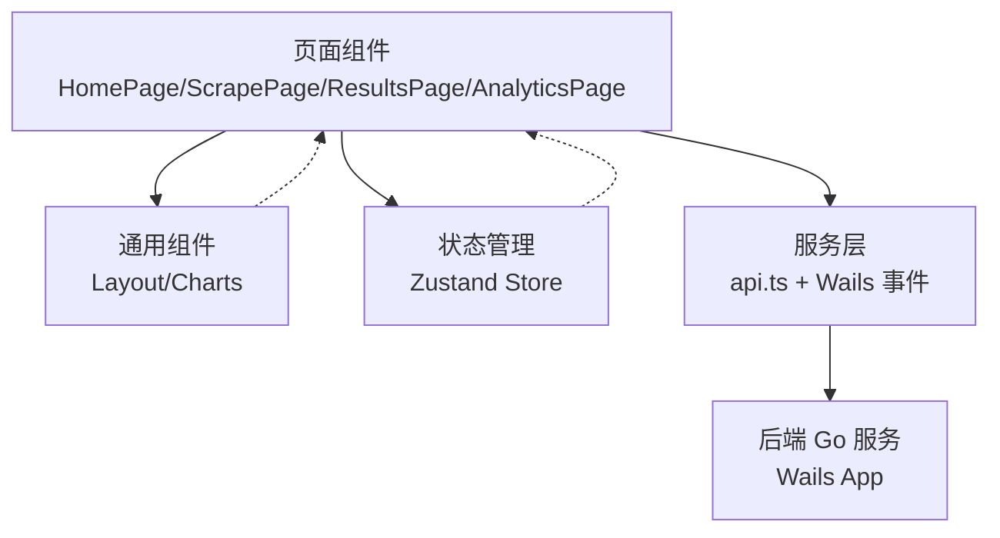
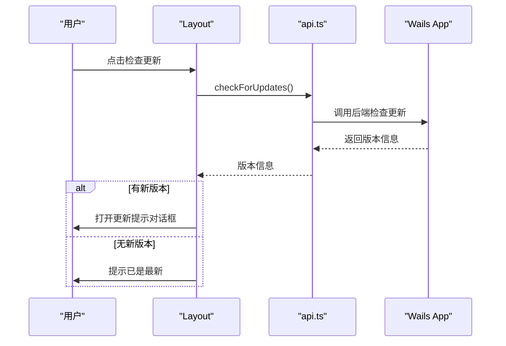
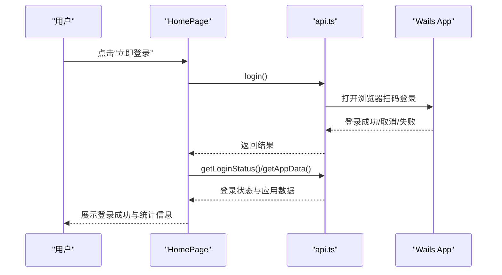
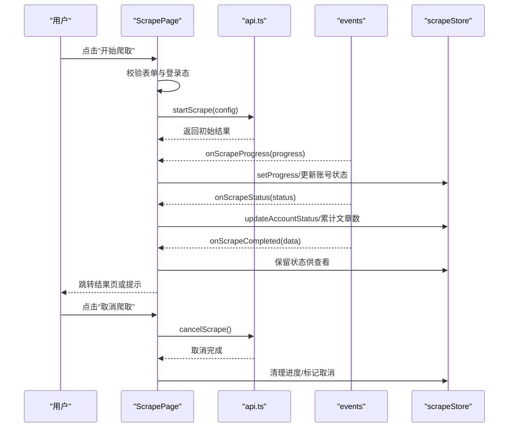
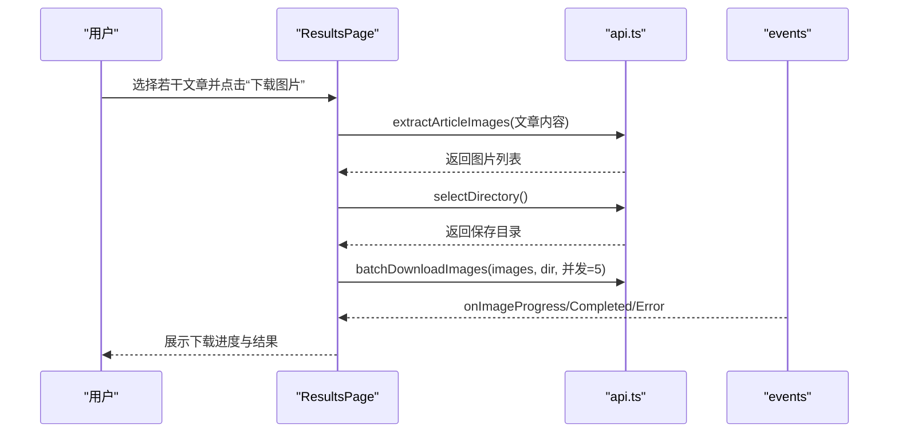
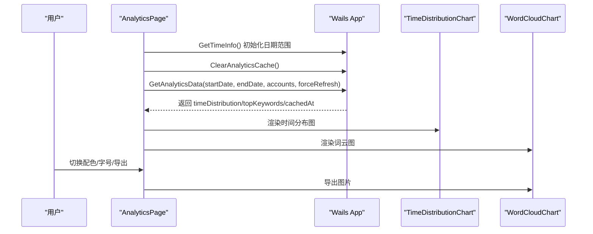
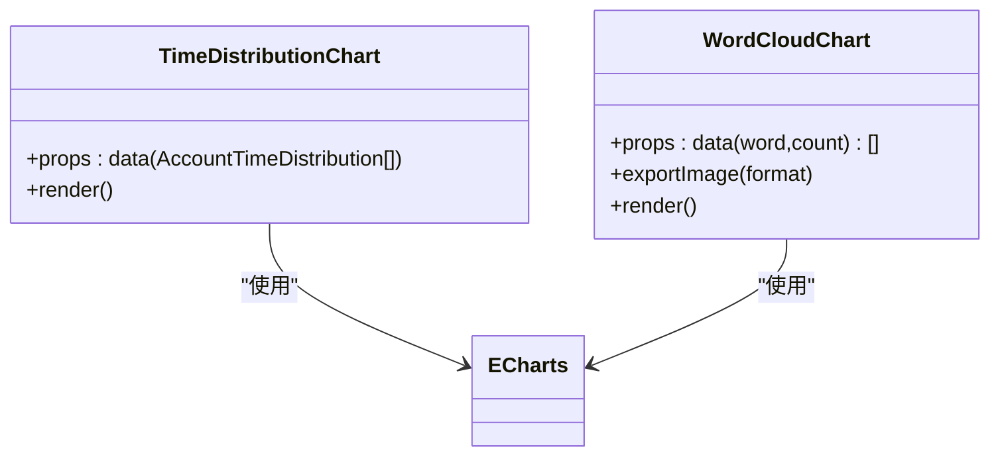
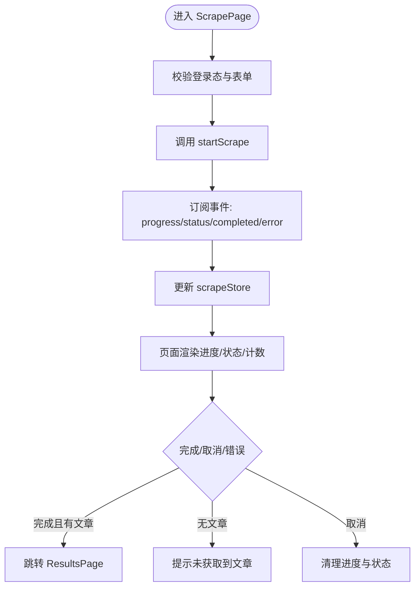
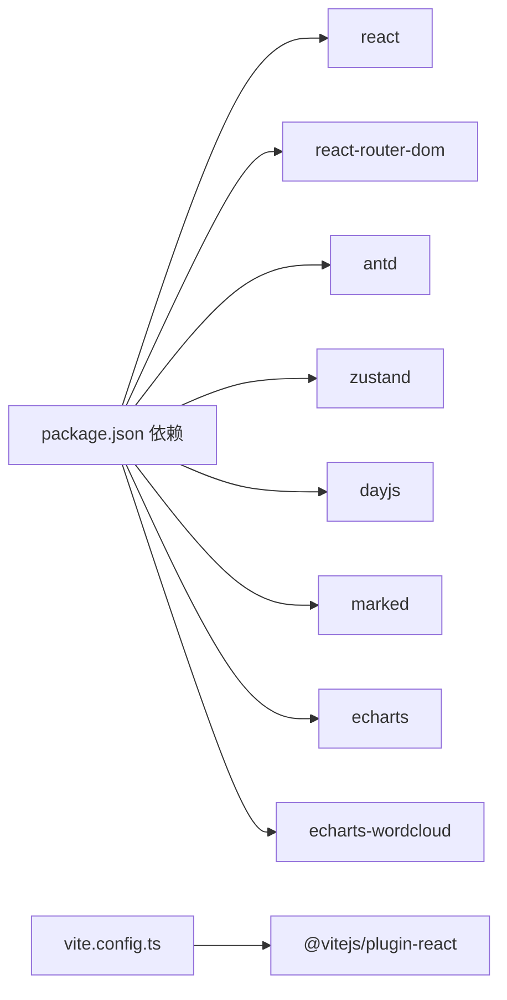

# 前端应用

<cite>
**本文引用的文件**
- [frontend/src/main.tsx](file://frontend/src/main.tsx)
- [frontend/src/App.tsx](file://frontend/src/App.tsx)
- [frontend/package.json](file://frontend/package.json)
- [frontend/vite.config.ts](file://frontend/vite.config.ts)
- [frontend/tsconfig.json](file://frontend/tsconfig.json)
- [frontend/src/components/Layout.tsx](file://frontend/src/components/Layout.tsx)
- [frontend/src/pages/HomePage.tsx](file://frontend/src/pages/HomePage.tsx)
- [frontend/src/pages/ScrapePage.tsx](file://frontend/src/pages/ScrapePage.tsx)
- [frontend/src/pages/ResultsPage.tsx](file://frontend/src/pages/ResultsPage.tsx)
- [frontend/src/pages/AnalyticsPage.tsx](file://frontend/src/pages/AnalyticsPage.tsx)
- [frontend/src/stores/scrapeStore.ts](file://frontend/src/stores/scrapeStore.ts)
- [frontend/src/services/api.ts](file://frontend/src/services/api.ts)
- [frontend/src/components/charts/TimeDistributionChart.tsx](file://frontend/src/components/charts/TimeDistributionChart.tsx)
- [frontend/src/components/charts/WordCloudChart.tsx](file://frontend/src/components/charts/WordCloudChart.tsx)
</cite>

## 目录
1. [简介](#简介)
2. [项目结构](#项目结构)
3. [核心组件](#核心组件)
4. [架构总览](#架构总览)
5. [详细组件分析](#详细组件分析)
6. [依赖关系分析](#依赖关系分析)
7. [性能考量](#性能考量)
8. [故障排查指南](#故障排查指南)
9. [结论](#结论)
10. [附录](#附录)

## 简介
本文件面向 WeMediaSpider 前端应用，基于 React + TypeScript + Ant Design 技术栈构建。应用采用暗色主题与绿色主色调，结合 Zustand 状态管理、Ant Design 组件库与 ECharts 图表，提供爬取配置、执行监控、结果浏览、数据分析与定时任务等完整功能闭环。前端通过 Wails 与后端 Go 服务进行双向通信，实现登录态管理、爬取任务调度、数据导出与图片下载等功能。

## 项目结构
前端位于 frontend 目录，采用 Vite + React + TypeScript 构建，Ant Design 提供 UI 组件，Zustand 管理轻量状态，ECharts 与词云插件负责可视化展示。页面按功能划分为首页、爬取、结果、分析、定时与设置六个路由页面；组件层包含布局、图表与通用 UI；服务层封装 Wails API 与事件订阅；状态层使用 Zustand 管理爬取相关全局状态。

**图表来源**
- [frontend/src/main.tsx:1-25](file://frontend/src/main.tsx#L1-L25)
- [frontend/src/App.tsx:1-88](file://frontend/src/App.tsx#L1-L88)
- [frontend/src/components/Layout.tsx:1-277](file://frontend/src/components/Layout.tsx#L1-L277)
- [frontend/src/pages/HomePage.tsx:1-772](file://frontend/src/pages/HomePage.tsx#L1-L772)
- [frontend/src/pages/ScrapePage.tsx:1-800](file://frontend/src/pages/ScrapePage.tsx#L1-L800)
- [frontend/src/pages/ResultsPage.tsx:1-800](file://frontend/src/pages/ResultsPage.tsx#L1-L800)
- [frontend/src/pages/AnalyticsPage.tsx:1-304](file://frontend/src/pages/AnalyticsPage.tsx#L1-L304)
- [frontend/src/stores/scrapeStore.ts:1-65](file://frontend/src/stores/scrapeStore.ts#L1-L65)
- [frontend/src/services/api.ts:1-161](file://frontend/src/services/api.ts#L1-L161)
- [frontend/src/components/charts/TimeDistributionChart.tsx:1-207](file://frontend/src/components/charts/TimeDistributionChart.tsx#L1-L207)
- [frontend/src/components/charts/WordCloudChart.tsx:1-132](file://frontend/src/components/charts/WordCloudChart.tsx#L1-L132)

**章节来源**
- [frontend/src/main.tsx:1-25](file://frontend/src/main.tsx#L1-L25)
- [frontend/src/App.tsx:1-88](file://frontend/src/App.tsx#L1-L88)
- [frontend/package.json:1-30](file://frontend/package.json#L1-L30)
- [frontend/vite.config.ts:1-8](file://frontend/vite.config.ts#L1-L8)
- [frontend/tsconfig.json:1-32](file://frontend/tsconfig.json#L1-L32)

## 核心组件
- 应用入口与主题配置：入口文件渲染根组件，过滤特定控制台警告；App 组件配置 Ant Design 国际化与主题，注册路由与全局布局。
- 布局组件：提供侧边导航、内容缩放适配、更新检查与设置入口，承载页面切换动画与标题栏。
- 页面组件：首页负责登录态与应用数据展示、更新检查；爬取页负责配置表单、任务执行与账号状态监控；结果页负责文章列表、筛选、导出与图片批量下载；分析页负责时间分布与词云展示。
- 图表组件：时间分布折线图与词云图，支持导出与动态配色。
- 状态管理：Zustand 管理爬取文章、进度、账号状态与执行中标识。
- 服务层：统一封装 Wails API 与事件订阅，屏蔽前后端差异。

**章节来源**
- [frontend/src/App.tsx:15-88](file://frontend/src/App.tsx#L15-L88)
- [frontend/src/components/Layout.tsx:33-277](file://frontend/src/components/Layout.tsx#L33-L277)
- [frontend/src/stores/scrapeStore.ts:19-65](file://frontend/src/stores/scrapeStore.ts#L19-L65)
- [frontend/src/services/api.ts:49-161](file://frontend/src/services/api.ts#L49-L161)

## 架构总览
前端采用“页面-组件-状态-服务”分层：
- 页面层：各功能页面负责业务编排与用户交互。
- 组件层：通用布局与图表组件复用性高。
- 状态层：Zustand 聚合爬取相关全局状态，减少 props drilling。
- 服务层：api.ts 对接 Wails 生成的 Go 方法与事件系统，统一错误处理与消息提示。

**图表来源**
- [frontend/src/pages/HomePage.tsx:1-772](file://frontend/src/pages/HomePage.tsx#L1-L772)
- [frontend/src/pages/ScrapePage.tsx:1-800](file://frontend/src/pages/ScrapePage.tsx#L1-L800)
- [frontend/src/pages/ResultsPage.tsx:1-800](file://frontend/src/pages/ResultsPage.tsx#L1-L800)
- [frontend/src/pages/AnalyticsPage.tsx:1-304](file://frontend/src/pages/AnalyticsPage.tsx#L1-L304)
- [frontend/src/components/Layout.tsx:1-277](file://frontend/src/components/Layout.tsx#L1-L277)
- [frontend/src/stores/scrapeStore.ts:1-65](file://frontend/src/stores/scrapeStore.ts#L1-L65)
- [frontend/src/services/api.ts:1-161](file://frontend/src/services/api.ts#L1-L161)

## 详细组件分析

### 布局组件 Layout 分析
- 功能要点
  - 侧边导航：固定宽度、折叠样式，支持首页、爬取、数据、分析、定时、设置入口。
  - 内容缩放：根据父容器尺寸按基准窗口比例缩放，保证不同分辨率下的视觉一致性。
  - 更新检查：调用 API 检查更新，支持立即下载、稍后提示与今日忽略。
  - 设置入口：底部设置按钮，悬停高亮，区分当前激活页。
- 交互流程（更新检查）

**图表来源**
- [frontend/src/components/Layout.tsx:93-139](file://frontend/src/components/Layout.tsx#L93-L139)
- [frontend/src/services/api.ts:99-101](file://frontend/src/services/api.ts#L99-L101)

**章节来源**
- [frontend/src/components/Layout.tsx:33-277](file://frontend/src/components/Layout.tsx#L33-L277)

### 首页 HomePage 分析
- 功能要点
  - 登录态检查与应用数据加载：登录成功后展示凭证有效期与登录时间等信息。
  - 更新检查：启动时自动检查更新，尊重“今日不再提示”设置；手动点击可强制检查。
  - 登录/登出/凭证导入导出：通过 API 调用后端能力，配合消息提示反馈。
  - 顶部统计卡片：展示总文章数、公众号数、图片下载数与今日文章数。
- 用户体验
  - 自动全选数值输入框，提升配置效率。
  - 实时时间显示，增强时效感。
- 交互流程（登录）

**图表来源**
- [frontend/src/pages/HomePage.tsx:223-253](file://frontend/src/pages/HomePage.tsx#L223-L253)
- [frontend/src/pages/HomePage.tsx:133-149](file://frontend/src/pages/HomePage.tsx#L133-L149)
- [frontend/src/services/api.ts:50-56](file://frontend/src/services/api.ts#L50-L56)

**章节来源**
- [frontend/src/pages/HomePage.tsx:33-772](file://frontend/src/pages/HomePage.tsx#L33-L772)

### 爬取页面 ScrapePage 分析
- 功能要点
  - 配置表单：支持公众号列表、日期范围、关键词过滤、最大页数、请求间隔、是否包含正文等。
  - 常用公众号：本地存储常用列表，支持添加、移除与一键选择。
  - 爬取执行：校验登录态，发起爬取任务，订阅进度、状态、完成与错误事件，实时更新账号状态与文章计数。
  - 频率限制处理：检测到频率限制时自动取消任务并提示。
  - 结果跳转：爬取完成后根据文章数量决定是否跳转至结果页。
- 状态管理
  - 使用 scrapeStore 管理 articles、progress、accountStatuses 与 isScrapingInProgress。
- 交互流程（开始/取消爬取）

**图表来源**
- [frontend/src/pages/ScrapePage.tsx:414-482](file://frontend/src/pages/ScrapePage.tsx#L414-L482)
- [frontend/src/pages/ScrapePage.tsx:273-375](file://frontend/src/pages/ScrapePage.tsx#L273-L375)
- [frontend/src/stores/scrapeStore.ts:19-65](file://frontend/src/stores/scrapeStore.ts#L19-L65)
- [frontend/src/services/api.ts:104-160](file://frontend/src/services/api.ts#L104-L160)

**章节来源**
- [frontend/src/pages/ScrapePage.tsx:42-800](file://frontend/src/pages/ScrapePage.tsx#L42-L800)
- [frontend/src/stores/scrapeStore.ts:19-65](file://frontend/src/stores/scrapeStore.ts#L19-L65)

### 结果页面 ResultsPage 分析
- 功能要点
  - 文章列表：支持关键词搜索、公众号筛选、日期范围筛选、分页与批量选择。
  - 数据导入：列出本地数据文件，支持覆盖导入与追加导入，自动去重。
  - 导出功能：支持 CSV、JSON、Excel、Markdown 多格式导出。
  - 图片下载：从文章内容提取图片链接，支持批量下载与进度监控。
  - 网盘链接提取：从标题、摘要与正文提取常见网盘链接，支持复制与分页查看。
- 交互流程（批量下载图片）

**图表来源**
- [frontend/src/pages/ResultsPage.tsx:199-270](file://frontend/src/pages/ResultsPage.tsx#L199-L270)
- [frontend/src/pages/ResultsPage.tsx:436-487](file://frontend/src/pages/ResultsPage.tsx#L436-L487)
- [frontend/src/services/api.ts:137-160](file://frontend/src/services/api.ts#L137-L160)

**章节来源**
- [frontend/src/pages/ResultsPage.tsx:113-800](file://frontend/src/pages/ResultsPage.tsx#L113-L800)

### 分析页面 AnalyticsPage 分析
- 功能要点
  - 时间分布：按公众号维度展示文章发布趋势折线图，支持日期范围与公众号筛选。
  - 热门关键词：词云展示高频词，支持配色方案、字号范围与 PNG/JPEG 导出。
  - 缓存与刷新：支持强制刷新与缓存时间显示。
- 交互流程（分析数据加载）

**图表来源**
- [frontend/src/pages/AnalyticsPage.tsx:56-140](file://frontend/src/pages/AnalyticsPage.tsx#L56-L140)
- [frontend/src/components/charts/TimeDistributionChart.tsx:17-184](file://frontend/src/components/charts/TimeDistributionChart.tsx#L17-L184)
- [frontend/src/components/charts/WordCloudChart.tsx:43-113](file://frontend/src/components/charts/WordCloudChart.tsx#L43-L113)

**章节来源**
- [frontend/src/pages/AnalyticsPage.tsx:22-304](file://frontend/src/pages/AnalyticsPage.tsx#L22-L304)

### 图表组件分析
- 时间分布折线图
  - 输入：按公众号聚合的日期-数量序列。
  - 特性：平滑曲线、滚动图例、自适应标签旋转、ResizeObserver 自适应。
- 词云图
  - 输入：词-频序列。
  - 特性：多种配色方案、字号范围、强调聚焦、导出为 PNG/JPEG。

**图表来源**
- [frontend/src/components/charts/TimeDistributionChart.tsx:13-207](file://frontend/src/components/charts/TimeDistributionChart.tsx#L13-L207)
- [frontend/src/components/charts/WordCloudChart.tsx:25-132](file://frontend/src/components/charts/WordCloudChart.tsx#L25-L132)

**章节来源**
- [frontend/src/components/charts/TimeDistributionChart.tsx:1-207](file://frontend/src/components/charts/TimeDistributionChart.tsx#L1-L207)
- [frontend/src/components/charts/WordCloudChart.tsx:1-132](file://frontend/src/components/charts/WordCloudChart.tsx#L1-L132)

### 状态管理分析
- Zustand 状态
  - 爬取状态：articles、progress、accountStatuses、isScrapingInProgress。
  - 操作：setArticles、addArticles、setProgress、addAccountStatus、updateAccountStatus、clearAccountStatuses、setScrapingInProgress、reset。
- 使用场景
  - ScrapePage：接收事件更新进度与账号状态，累计文章总数。
  - ResultsPage：展示文章列表与筛选结果，支持批量选择与导出。
  - HomePage：展示登录状态与应用数据。

**图表来源**
- [frontend/src/pages/ScrapePage.tsx:273-375](file://frontend/src/pages/ScrapePage.tsx#L273-L375)
- [frontend/src/stores/scrapeStore.ts:19-65](file://frontend/src/stores/scrapeStore.ts#L19-L65)

**章节来源**
- [frontend/src/stores/scrapeStore.ts:1-65](file://frontend/src/stores/scrapeStore.ts#L1-L65)

### API 服务层分析
- API 包装
  - 登录/登出/凭证导入导出/登录状态：login、logout、exportCredentials、importCredentials、getLoginStatus。
  - 爬取：startScrape、cancelScrape、searchAccount。
  - 导出：exportArticles。
  - 配置：loadConfig、saveConfig、getDefaultConfig。
  - 文件系统：selectDirectory、selectSaveFile。
  - 缓存：clearCache、clearExpiredCache、getCacheStats。
  - 应用数据：getAppData、updateAppData。
  - 图片下载：extractArticleImages、batchDownloadImages、cancelImageDownload。
  - 数据管理：listDataFiles、loadDataFile、deleteDataFile、getDataDirectory、openDataFileDialog。
  - 更新检查：checkForUpdates。
- 事件系统
  - 爬取事件：onScrapeProgress、onScrapeStatus、onScrapeCompleted、onScrapeError。
  - 图片事件：onImageProgress、onImageCompleted、onImageError。

**章节来源**
- [frontend/src/services/api.ts:49-161](file://frontend/src/services/api.ts#L49-L161)

## 依赖关系分析
- 构建与运行
  - Vite 插件：@vitejs/plugin-react。
  - 依赖：react、react-dom、react-router-dom、antd、zustand、dayjs、marked、echarts、echarts-wordcloud。
- 类型与国际化
  - TypeScript 配置启用严格模式与 JSX 转译。
  - Ant Design 国际化 zhCN 与暗色主题算法。
- 组件耦合
  - 页面与服务层解耦：通过 api.ts 封装调用。
  - 图表组件与 ECharts 解耦：通过 props 输入数据，内部初始化销毁实例。
  - 布局组件与页面解耦：通过路由与菜单项驱动导航。

**图表来源**
- [frontend/package.json:11-21](file://frontend/package.json#L11-L21)
- [frontend/vite.config.ts:6](file://frontend/vite.config.ts#L6)

**章节来源**
- [frontend/package.json:1-30](file://frontend/package.json#L1-L30)
- [frontend/vite.config.ts:1-8](file://frontend/vite.config.ts#L1-L8)
- [frontend/tsconfig.json:1-32](file://frontend/tsconfig.json#L1-L32)

## 性能考量
- 图表性能
  - 时间分布图启用采样与平滑曲线，避免大数据量渲染卡顿。
  - 词云图按需重建实例，确保布局与导出效果。
- 爬取性能
  - 并发与请求间隔参数可调，降低频率限制风险。
  - 进度与状态事件流式更新，避免全量重渲染。
- UI 体验
  - 数值输入框自动全选，提升配置效率。
  - 内容缩放适配不同分辨率，保证布局一致性。
  - 分页与自适应行高，优化长列表滚动性能。

## 故障排查指南
- 登录失败
  - 现象：登录弹窗关闭或提示取消。
  - 排查：检查浏览器是否被提前关闭；确认后端服务可用。
  - 处理：重新尝试登录或导入凭证。
- 爬取中断/频率限制
  - 现象：账号状态报错包含“频率限制”，自动取消任务。
  - 排查：适当提高请求间隔，降低并发。
  - 处理：调整配置后重试。
- 导出/下载失败
  - 现象：导出/下载弹窗取消或报错。
  - 排查：确认文件路径权限与磁盘空间；检查网络与后端服务。
  - 处理：更换保存路径或稍后重试。
- 图表空白
  - 现象：分析页图表无数据。
  - 排查：确认日期范围与公众号筛选条件；尝试强制刷新。
  - 处理：清空筛选或扩大日期范围。

**章节来源**
- [frontend/src/pages/ScrapePage.tsx:377-396](file://frontend/src/pages/ScrapePage.tsx#L377-L396)
- [frontend/src/pages/ResultsPage.tsx:179-186](file://frontend/src/pages/ResultsPage.tsx#L179-L186)
- [frontend/src/pages/AnalyticsPage.tsx:103-121](file://frontend/src/pages/AnalyticsPage.tsx#L103-L121)

## 结论
WeMediaSpider 前端以清晰的分层架构与完善的组件体系，实现了从配置、执行、结果到分析的完整工作流。通过 Ant Design 的一致交互与暗色主题，Zustand 的轻量状态管理，以及 ECharts 的可视化能力，为用户提供高效、直观的使用体验。建议后续持续优化大列表渲染与图表交互细节，进一步完善错误恢复与日志追踪。

## 附录
- 响应式设计最佳实践
  - 使用 Ant Design 的栅格系统与紧凑尺寸，适配不同窗口。
  - 图表组件使用 ResizeObserver 自适应容器变化。
  - 表格与列表采用分页与自适应行高，避免一次性渲染过多节点。
- 用户体验优化
  - 自动全选数值输入框，减少重复操作。
  - 事件驱动的进度与状态更新，及时反馈任务进展。
  - “今日不再提示”与“稍后提示”机制，平衡打扰与信息传达。