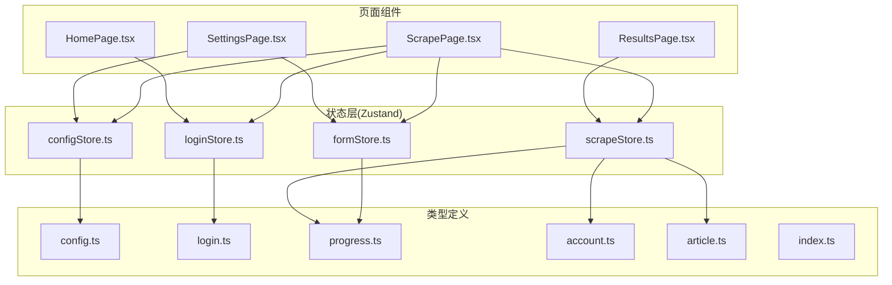
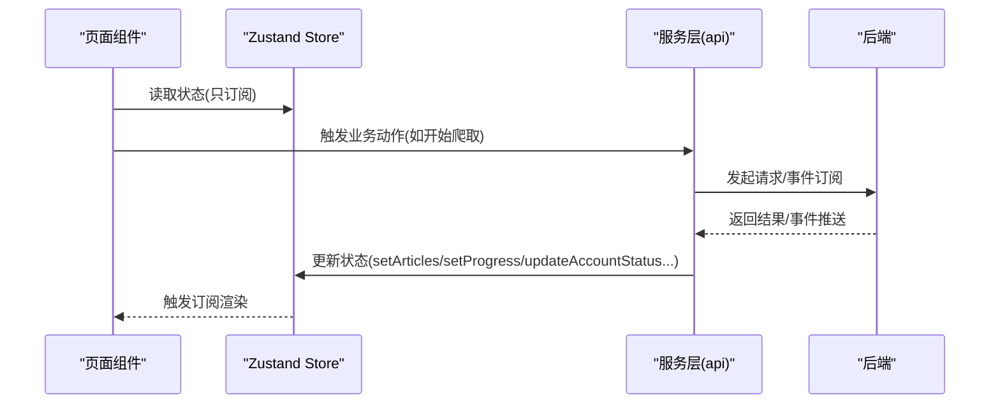
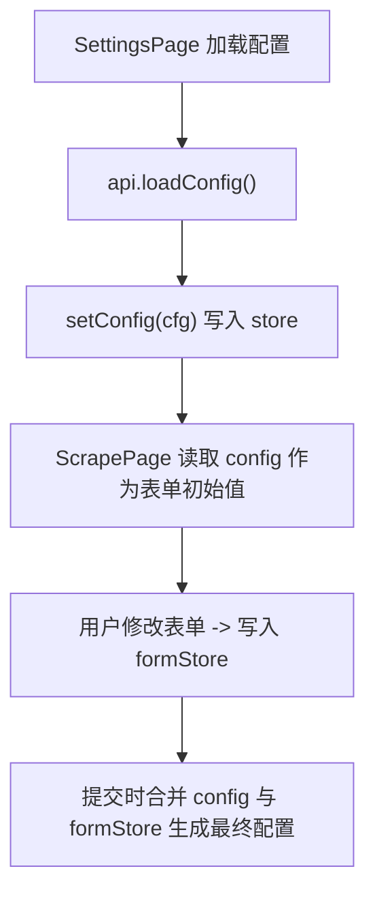
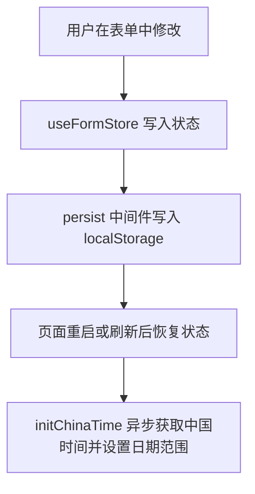
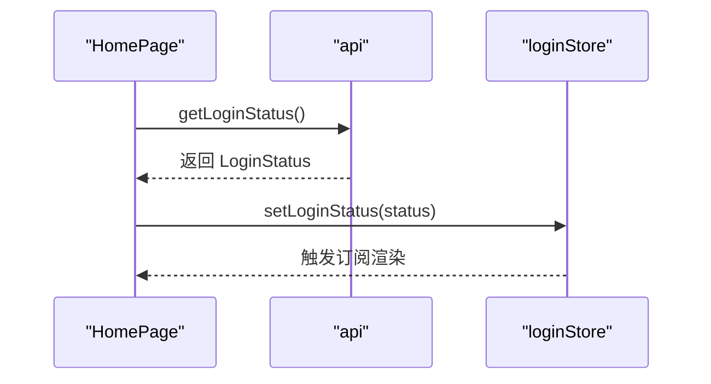
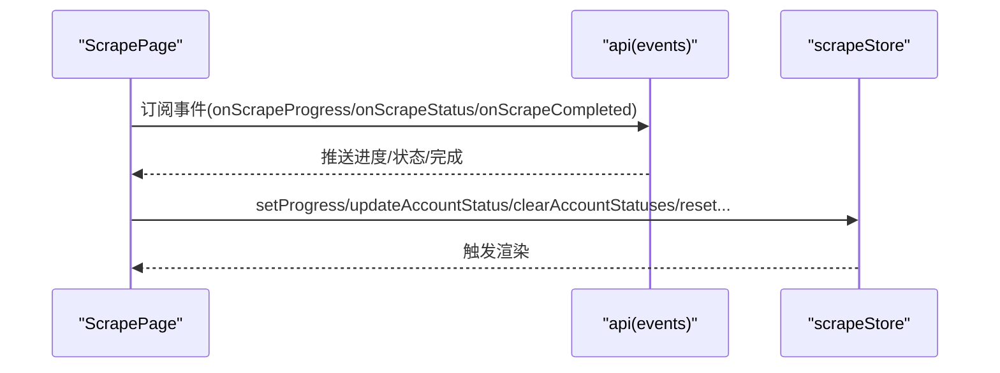
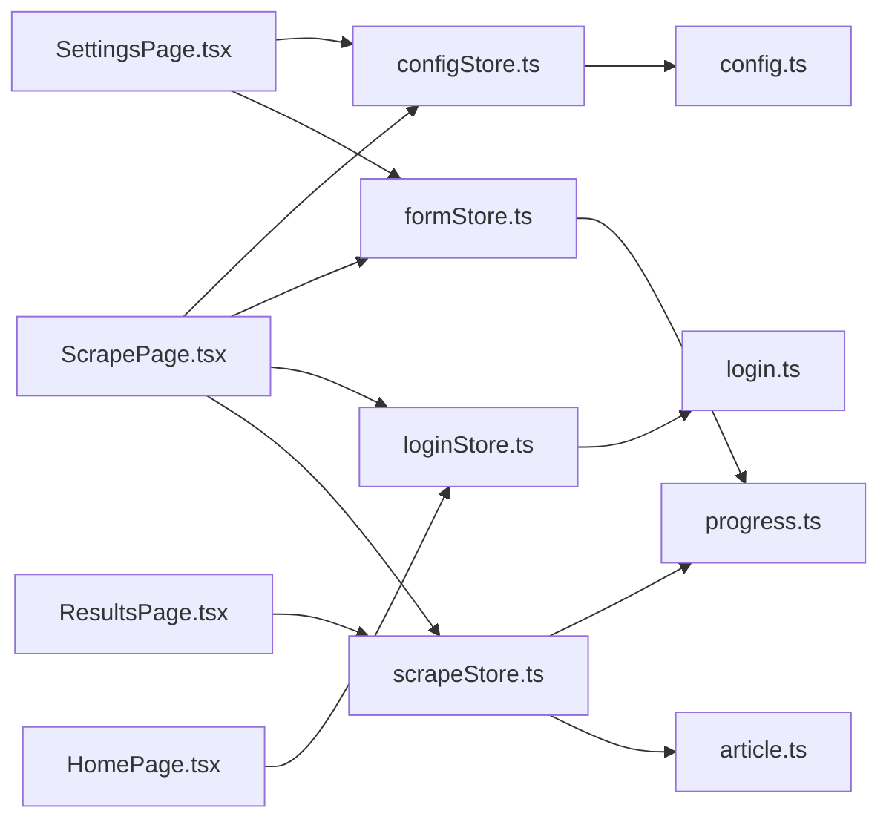

# 状态管理

<cite>
**本文引用的文件**
- [configStore.ts](file://frontend/src/stores/configStore.ts)
- [formStore.ts](file://frontend/src/stores/formStore.ts)
- [loginStore.ts](file://frontend/src/stores/loginStore.ts)
- [scrapeStore.ts](file://frontend/src/stores/scrapeStore.ts)
- [config.ts](file://frontend/src/types/config.ts)
- [login.ts](file://frontend/src/types/login.ts)
- [progress.ts](file://frontend/src/types/progress.ts)
- [account.ts](file://frontend/src/types/account.ts)
- [article.ts](file://frontend/src/types/article.ts)
- [index.ts](file://frontend/src/types/index.ts)
- [ScrapePage.tsx](file://frontend/src/pages/ScrapePage.tsx)
- [SettingsPage.tsx](file://frontend/src/pages/SettingsPage.tsx)
- [ResultsPage.tsx](file://frontend/src/pages/ResultsPage.tsx)
- [HomePage.tsx](file://frontend/src/pages/HomePage.tsx)
</cite>

## 目录
1. [简介](#简介)
2. [项目结构](#项目结构)
3. [核心组件](#核心组件)
4. [架构总览](#架构总览)
5. [详细组件分析](#详细组件分析)
6. [依赖关系分析](#依赖关系分析)
7. [性能考量](#性能考量)
8. [故障排查指南](#故障排查指南)
9. [结论](#结论)
10. [附录](#附录)

## 简介
本文件系统性梳理 WeMediaSpider 前端基于 Zustand 的状态管理架构，覆盖配置状态、表单状态、登录状态与爬取状态的设计与实现。重点阐述各 store 的数据结构、操作方法、持久化与同步机制、异步更新与事件驱动流程、状态订阅与派发、以及最佳实践与性能优化建议。同时给出与组件的数据流绑定方式与调试技巧，帮助开发者快速理解与维护状态层。

## 项目结构
WeMediaSpider 前端采用“按领域划分”的 store 组织方式，每个 store 聚焦单一职责：
- 配置状态：集中管理后端下发的全局配置与前端表单配置的同步
- 表单状态：管理爬取参数的本地持久化与默认值恢复
- 登录状态：管理登录态与凭证有效期等信息
- 爬取状态：管理文章列表、进度、账号状态与爬取进行中标识

**图表来源**
- [configStore.ts:1-13](file://frontend/src/stores/configStore.ts#L1-L13)
- [formStore.ts:1-113](file://frontend/src/stores/formStore.ts#L1-L113)
- [loginStore.ts:1-15](file://frontend/src/stores/loginStore.ts#L1-L15)
- [scrapeStore.ts:1-65](file://frontend/src/stores/scrapeStore.ts#L1-L65)
- [config.ts:1-25](file://frontend/src/types/config.ts#L1-L25)
- [login.ts:1-10](file://frontend/src/types/login.ts#L1-L10)
- [progress.ts:1-20](file://frontend/src/types/progress.ts#L1-L20)
- [account.ts:1-15](file://frontend/src/types/account.ts#L1-L15)
- [article.ts:1-29](file://frontend/src/types/article.ts#L1-L29)
- [index.ts:1-7](file://frontend/src/types/index.ts#L1-L7)
- [ScrapePage.tsx:1-888](file://frontend/src/pages/ScrapePage.tsx#L1-L888)
- [SettingsPage.tsx:1-556](file://frontend/src/pages/SettingsPage.tsx#L1-L556)
- [ResultsPage.tsx:1-1280](file://frontend/src/pages/ResultsPage.tsx#L1-L1280)
- [HomePage.tsx:1-772](file://frontend/src/pages/HomePage.tsx#L1-L772)

**章节来源**
- [configStore.ts:1-13](file://frontend/src/stores/configStore.ts#L1-L13)
- [formStore.ts:1-113](file://frontend/src/stores/formStore.ts#L1-L113)
- [loginStore.ts:1-15](file://frontend/src/stores/loginStore.ts#L1-L15)
- [scrapeStore.ts:1-65](file://frontend/src/stores/scrapeStore.ts#L1-L65)
- [config.ts:1-25](file://frontend/src/types/config.ts#L1-L25)
- [login.ts:1-10](file://frontend/src/types/login.ts#L1-L10)
- [progress.ts:1-20](file://frontend/src/types/progress.ts#L1-L20)
- [account.ts:1-15](file://frontend/src/types/account.ts#L1-L15)
- [article.ts:1-29](file://frontend/src/types/article.ts#L1-L29)
- [index.ts:1-7](file://frontend/src/types/index.ts#L1-L7)
- [ScrapePage.tsx:1-888](file://frontend/src/pages/ScrapePage.tsx#L1-L888)
- [SettingsPage.tsx:1-556](file://frontend/src/pages/SettingsPage.tsx#L1-L556)
- [ResultsPage.tsx:1-1280](file://frontend/src/pages/ResultsPage.tsx#L1-L1280)
- [HomePage.tsx:1-772](file://frontend/src/pages/HomePage.tsx#L1-L772)

## 核心组件
- 配置状态 store（configStore）
  - 状态：config: Config | null
  - 操作：setConfig(config: Config)
  - 用途：承载后端下发的全局配置，供页面组件读取与展示
- 表单状态 store（formStore）
  - 状态：账户列表、日期范围、最大页数、请求间隔上下限、并发数、是否包含正文、关键词过滤、默认值等
  - 操作：setAccounts、setDateRange、setMaxPages、setRequestIntervalMin、setRequestIntervalMax、setMaxWorkers、setIncludeContent、setKeywordFilter、reset、initChinaTime
  - 持久化：使用 persist 中间件，自定义 storage 与 partialize，处理 dayjs 对象序列化与排除敏感字段
- 登录状态 store（loginStore）
  - 状态：loginStatus: LoginStatus | null
  - 操作：setLoginStatus(status: LoginStatus)，clearLoginStatus()
  - 用途：统一管理登录态与凭证有效期
- 爬取状态 store（scrapeStore）
  - 状态：articles、progress、accountStatuses、isScrapingInProgress
  - 操作：setArticles、addArticles、setProgress、addAccountStatus、updateAccountStatus、clearAccountStatuses、setScrapingInProgress、reset
  - 用途：承载爬取过程中的文章、进度与账号状态，支撑实时可视化

**章节来源**
- [configStore.ts:4-12](file://frontend/src/stores/configStore.ts#L4-L12)
- [formStore.ts:6-112](file://frontend/src/stores/formStore.ts#L6-L112)
- [loginStore.ts:4-14](file://frontend/src/stores/loginStore.ts#L4-L14)
- [scrapeStore.ts:4-64](file://frontend/src/stores/scrapeStore.ts#L4-L64)

## 架构总览
Zustand store 通过 hooks 在页面组件中订阅与更新状态；页面通过服务层与后端交互，事件驱动地更新爬取状态；类型模块提供强类型约束，保证跨模块协作的一致性。

**图表来源**
- [ScrapePage.tsx:210-482](file://frontend/src/pages/ScrapePage.tsx#L210-L482)
- [ResultsPage.tsx:162-197](file://frontend/src/pages/ResultsPage.tsx#L162-L197)
- [scrapeStore.ts:19-64](file://frontend/src/stores/scrapeStore.ts#L19-L64)

## 详细组件分析

### 配置状态 store（configStore）
- 设计模式
  - 简洁的 create 模式，仅包含状态与 setter
  - 与后端配置解耦：页面从后端拉取配置后写入全局 store，避免重复请求
- 状态结构
  - config: Config | null
- 操作方法
  - setConfig(config: Config)
- 数据流
  - SettingsPage 从后端加载配置并调用 setConfig；ScrapePage 读取 config 作为默认值来源之一
- 与类型的关系
  - Config 与 ScrapeConfig 分离，前者用于前端展示与系统设置，后者用于爬取请求体

**图表来源**
- [SettingsPage.tsx:54-86](file://frontend/src/pages/SettingsPage.tsx#L54-L86)
- [ScrapePage.tsx:209-251](file://frontend/src/pages/ScrapePage.tsx#L209-L251)
- [configStore.ts:9-12](file://frontend/src/stores/configStore.ts#L9-L12)
- [config.ts:1-25](file://frontend/src/types/config.ts#L1-L25)

**章节来源**
- [configStore.ts:1-13](file://frontend/src/stores/configStore.ts#L1-L13)
- [config.ts:1-25](file://frontend/src/types/config.ts#L1-L25)
- [SettingsPage.tsx:54-86](file://frontend/src/pages/SettingsPage.tsx#L54-L86)
- [ScrapePage.tsx:209-251](file://frontend/src/pages/ScrapePage.tsx#L209-L251)

### 表单状态 store（formStore）
- 设计模式
  - 使用 persist 中间件实现本地持久化
  - 自定义 storage：对 dayjs 对象进行序列化/反序列化
  - partialize：排除 accounts 字段，避免持久化敏感的公众号列表
  - 提供 initChinaTime 异步初始化日期范围
- 状态结构
  - accounts、dateRange、maxPages、requestIntervalMin、requestIntervalMax、maxWorkers、includeContent、keywordFilter
- 操作方法
  - setters、reset、initChinaTime
- 数据流
  - ScrapePage 与 SettingsPage 通过 useFormStore 读写表单状态；ScrapePage 在表单变更时写入 store，避免重复请求
- 与类型的关系
  - dateRange 使用 Dayjs 类型，需在持久化时转换为字符串再恢复

**图表来源**
- [formStore.ts:50-112](file://frontend/src/stores/formStore.ts#L50-L112)
- [ScrapePage.tsx:254-263](file://frontend/src/pages/ScrapePage.tsx#L254-L263)
- [SettingsPage.tsx:179-222](file://frontend/src/pages/SettingsPage.tsx#L179-L222)

**章节来源**
- [formStore.ts:1-113](file://frontend/src/stores/formStore.ts#L1-L113)
- [ScrapePage.tsx:254-263](file://frontend/src/pages/ScrapePage.tsx#L254-L263)
- [SettingsPage.tsx:179-222](file://frontend/src/pages/SettingsPage.tsx#L179-L222)

### 登录状态 store（loginStore）
- 设计模式
  - 简单状态与 setter，便于在多个页面共享登录态
- 状态结构
  - loginStatus: LoginStatus | null
- 操作方法
  - setLoginStatus(status: LoginStatus)，clearLoginStatus()
- 数据流
  - HomePage 定时轮询登录状态并写入 store；ScrapePage 在进入前校验登录态

**图表来源**
- [HomePage.tsx:133-149](file://frontend/src/pages/HomePage.tsx#L133-L149)
- [loginStore.ts:10-14](file://frontend/src/stores/loginStore.ts#L10-L14)

**章节来源**
- [loginStore.ts:1-15](file://frontend/src/stores/loginStore.ts#L1-L15)
- [login.ts:1-10](file://frontend/src/types/login.ts#L1-L10)
- [HomePage.tsx:133-149](file://frontend/src/pages/HomePage.tsx#L133-L149)

### 爬取状态 store（scrapeStore）
- 设计模式
  - 集中式管理爬取产物与过程状态
  - 支持增量添加文章、更新账号状态、重置状态等
- 状态结构
  - articles: Article[]
  - progress: Progress | null
  - accountStatuses: AccountStatus[]
  - isScrapingInProgress: boolean
- 操作方法
  - setArticles、addArticles、setProgress、addAccountStatus、updateAccountStatus、clearAccountStatuses、setScrapingInProgress、reset
- 数据流
  - ScrapePage 通过事件订阅接收进度与状态，实时更新 store；ResultsPage 展示文章与导出

**图表来源**
- [ScrapePage.tsx:398-411](file://frontend/src/pages/ScrapePage.tsx#L398-L411)
- [ResultsPage.tsx:162-197](file://frontend/src/pages/ResultsPage.tsx#L162-L197)
- [scrapeStore.ts:19-64](file://frontend/src/stores/scrapeStore.ts#L19-L64)

**章节来源**
- [scrapeStore.ts:1-65](file://frontend/src/stores/scrapeStore.ts#L1-L65)
- [progress.ts:1-20](file://frontend/src/types/progress.ts#L1-L20)
- [article.ts:1-29](file://frontend/src/types/article.ts#L1-L29)
- [ScrapePage.tsx:398-411](file://frontend/src/pages/ScrapePage.tsx#L398-L411)
- [ResultsPage.tsx:162-197](file://frontend/src/pages/ResultsPage.tsx#L162-L197)

## 依赖关系分析
- store 与类型
  - configStore 依赖 Config/ScrapeConfig
  - loginStore 依赖 LoginStatus
  - scrapeStore 依赖 Article、Progress、AccountStatus
  - formStore 依赖 Dayjs（通过 dayjs 库），并在持久化时做序列化处理
- 页面与 store
  - ScrapePage 同时依赖 configStore、formStore、loginStore、scrapeStore
  - SettingsPage 依赖 configStore、formStore
  - ResultsPage 依赖 scrapeStore
  - HomePage 依赖 loginStore

**图表来源**
- [configStore.ts:1-13](file://frontend/src/stores/configStore.ts#L1-L13)
- [loginStore.ts:1-15](file://frontend/src/stores/loginStore.ts#L1-L15)
- [scrapeStore.ts:1-65](file://frontend/src/stores/scrapeStore.ts#L1-L65)
- [formStore.ts:1-113](file://frontend/src/stores/formStore.ts#L1-L113)
- [config.ts:1-25](file://frontend/src/types/config.ts#L1-L25)
- [login.ts:1-10](file://frontend/src/types/login.ts#L1-L10)
- [progress.ts:1-20](file://frontend/src/types/progress.ts#L1-L20)
- [article.ts:1-29](file://frontend/src/types/article.ts#L1-L29)
- [ScrapePage.tsx:1-888](file://frontend/src/pages/ScrapePage.tsx#L1-L888)
- [SettingsPage.tsx:1-556](file://frontend/src/pages/SettingsPage.tsx#L1-L556)
- [ResultsPage.tsx:1-1280](file://frontend/src/pages/ResultsPage.tsx#L1-L1280)
- [HomePage.tsx:1-772](file://frontend/src/pages/HomePage.tsx#L1-L772)

**章节来源**
- [index.ts:1-7](file://frontend/src/types/index.ts#L1-L7)

## 性能考量
- 避免不必要的订阅
  - 仅在需要的页面订阅相关 store，减少渲染次数
- 合理使用持久化
  - formStore 的 partialize 排除敏感字段，降低存储体积与安全风险
  - 自定义 storage 对 dayjs 对象做序列化，避免复杂对象导致的性能问题
- 事件驱动更新
  - 爬取过程通过事件订阅更新进度与状态，避免轮询带来的性能损耗
- 函数式更新
  - scrapeStore 的 updateAccountStatus 使用函数式更新，避免闭包陷阱与重复渲染
- 批量更新
  - addArticles 使用展开运算符一次性更新，减少多次 set 调用

[本节为通用指导，无需特定文件来源]

## 故障排查指南
- 登录态异常
  - 检查 loginStore 的 loginStatus 是否正确写入；确认 HomePage 的定时轮询逻辑
- 爬取无响应
  - 检查事件订阅是否建立；确认 ScrapePage 的事件处理函数是否正确解析消息并更新 store
- 表单状态丢失
  - 检查 formStore 的 persist 配置与 storage 实现；确认 dayjs 对象序列化是否正确
- 进度显示异常
  - 检查 ScrapePage 的进度解析逻辑与 scrapeStore 的 setProgress 调用时机
- 导出/导入失败
  - 检查 ResultsPage 的导出流程与文件选择回调；确认错误信息是否包含“取消”关键字

**章节来源**
- [HomePage.tsx:133-149](file://frontend/src/pages/HomePage.tsx#L133-L149)
- [ScrapePage.tsx:274-396](file://frontend/src/pages/ScrapePage.tsx#L274-L396)
- [formStore.ts:75-111](file://frontend/src/stores/formStore.ts#L75-L111)
- [ResultsPage.tsx:436-487](file://frontend/src/pages/ResultsPage.tsx#L436-L487)

## 结论
WeMediaSpider 的状态管理以 Zustand 为核心，围绕“配置、表单、登录、爬取”四大维度构建清晰的 store 边界。通过类型约束、持久化与事件驱动机制，实现了稳定、可维护且高性能的状态流。遵循本文的最佳实践与调试方法，可有效提升开发效率与系统可靠性。

[本节为总结，无需特定文件来源]

## 附录

### 状态与组件绑定方式
- 在页面组件中通过 hooks 订阅 store，如：
  - const { config, setConfig } = useConfigStore()
  - const formStore = useFormStore()
  - const { loginStatus } = useLoginStore()
  - const { articles, setArticles } = useScrapeStore()

**章节来源**
- [ScrapePage.tsx:46-60](file://frontend/src/pages/ScrapePage.tsx#L46-L60)
- [SettingsPage.tsx:41-43](file://frontend/src/pages/SettingsPage.tsx#L41-L43)
- [ResultsPage.tsx:114-115](file://frontend/src/pages/ResultsPage.tsx#L114-L115)
- [HomePage.tsx:36-37](file://frontend/src/pages/HomePage.tsx#L36-L37)

### 数据流控制要点
- 单向数据流：页面读取 store，服务层发起请求，事件回调写回 store
- 合并策略：ScrapePage 将后端配置与前端表单配置合并，生成最终请求参数
- 清理策略：取消爬取时清理进度与账号状态，避免脏数据残留

**章节来源**
- [ScrapePage.tsx:430-446](file://frontend/src/pages/ScrapePage.tsx#L430-L446)
- [ScrapePage.tsx:484-524](file://frontend/src/pages/ScrapePage.tsx#L484-L524)