# 页面组件

<cite>
**本文档引用的文件**
- [App.tsx](file://frontend/src/App.tsx)
- [HomePage.tsx](file://frontend/src/pages/HomePage.tsx)
- [ScrapePage.tsx](file://frontend/src/pages/ScrapePage.tsx)
- [ResultsPage.tsx](file://frontend/src/pages/ResultsPage.tsx)
- [AnalyticsPage.tsx](file://frontend/src/pages/AnalyticsPage.tsx)
- [SchedulePage.tsx](file://frontend/src/pages/SchedulePage.tsx)
- [SettingsPage.tsx](file://frontend/src/pages/SettingsPage.tsx)
- [TimeDistributionChart.tsx](file://frontend/src/components/charts/TimeDistributionChart.tsx)
- [WordCloudChart.tsx](file://frontend/src/components/charts/WordCloudChart.tsx)
- [scrapeStore.ts](file://frontend/src/stores/scrapeStore.ts)
- [api.ts](file://frontend/src/services/api.ts)
- [article.ts](file://frontend/src/types/article.ts)
- [config.ts](file://frontend/src/types/config.ts)
- [progress.ts](file://frontend/src/types/progress.ts)
</cite>

## 目录
1. [简介](#简介)
2. [项目结构](#项目结构)
3. [核心组件](#核心组件)
4. [架构概览](#架构概览)
5. [详细组件分析](#详细组件分析)
6. [依赖关系分析](#依赖关系分析)
7. [性能考虑](#性能考虑)
8. [故障排除指南](#故障排除指南)
9. [结论](#结论)
10. [附录](#附录)

## 简介
WeMediaSpider 是一个基于 Electron+Wails 技术栈开发的微信公众号文章智能爬虫桌面应用。本文档详细分析了前端页面组件的设计与实现，涵盖首页、爬取页面、分析页面、定时任务页面、设置页面和结果页面的功能特性、交互逻辑和数据流。

## 项目结构
应用采用模块化的页面组件架构，主要分为以下层次：

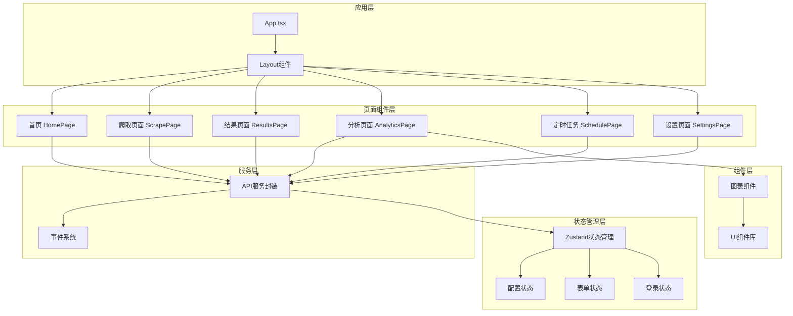

**图表来源**
- [App.tsx:15-88](file://frontend/src/App.tsx#L15-L88)
- [HomePage.tsx:33-772](file://frontend/src/pages/HomePage.tsx#L33-L772)
- [ScrapePage.tsx:42-888](file://frontend/src/pages/ScrapePage.tsx#L42-L888)
- [ResultsPage.tsx:113-1280](file://frontend/src/pages/ResultsPage.tsx#L113-L1280)

**章节来源**
- [App.tsx:15-88](file://frontend/src/App.tsx#L15-L88)

## 核心组件
应用的核心组件包括路由配置、页面组件和状态管理系统。每个页面都有明确的职责分工和独立的状态管理。

**章节来源**
- [App.tsx:28-84](file://frontend/src/App.tsx#L28-L84)

## 架构概览
应用采用前后端分离的架构设计，前端通过 Wails 桥接与后端进行通信：

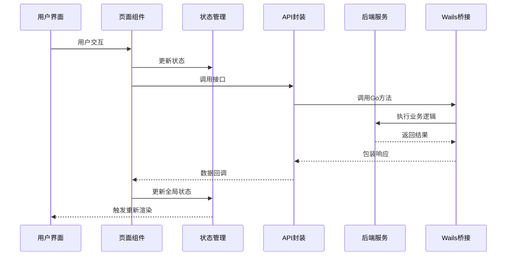

**图表来源**
- [api.ts:49-101](file://frontend/src/services/api.ts#L49-L101)
- [scrapeStore.ts:19-65](file://frontend/src/stores/scrapeStore.ts#L19-L65)

## 详细组件分析

### 首页组件 (HomePage)
首页作为应用的入口页面，提供了登录状态管理和应用信息展示功能。

#### 组件结构
首页采用卡片式布局设计，包含以下主要区域：
- **顶部欢迎区**: 展示应用标识和实时时间
- **统计数据区**: 显示文章总数、公众号数量、图片下载量等关键指标
- **功能介绍区**: 展示核心功能特性
- **登录状态区**: 管理用户登录状态和凭证导出导入

#### 状态管理
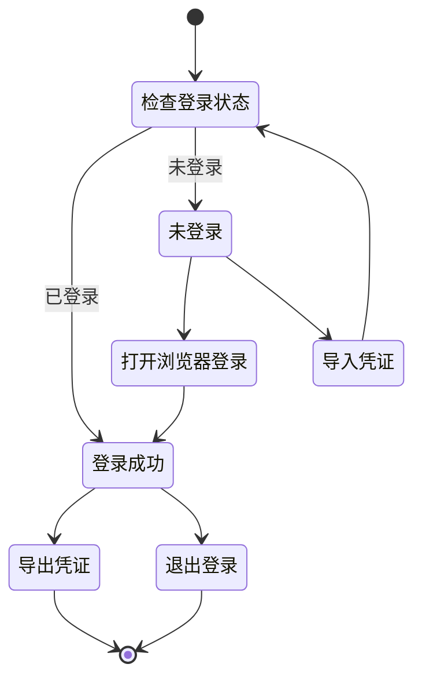

**图表来源**
- [HomePage.tsx:133-253](file://frontend/src/pages/HomePage.tsx#L133-L253)

#### 用户交互流程
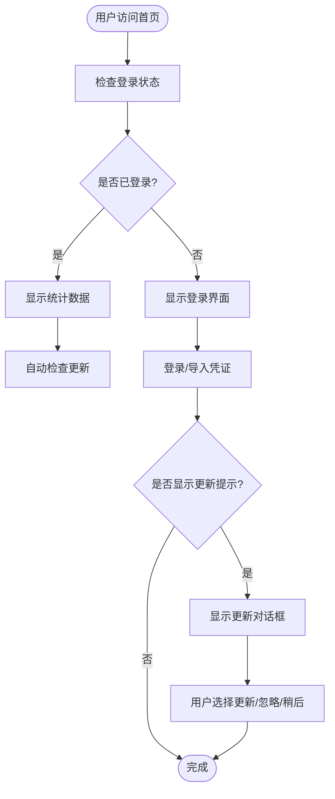

**图表来源**
- [HomePage.tsx:46-122](file://frontend/src/pages/HomePage.tsx#L46-L122)

**章节来源**
- [HomePage.tsx:33-772](file://frontend/src/pages/HomePage.tsx#L33-L772)

### 爬取页面 (ScrapePage)
爬取页面负责配置爬取参数和执行爬取任务，是应用的核心功能页面。

#### 组件结构
页面采用分层设计：
- **配置表单层**: 爬取参数配置
- **状态监控层**: 实时显示爬取进度
- **结果展示层**: 账号状态和文章统计

#### 爬取流程
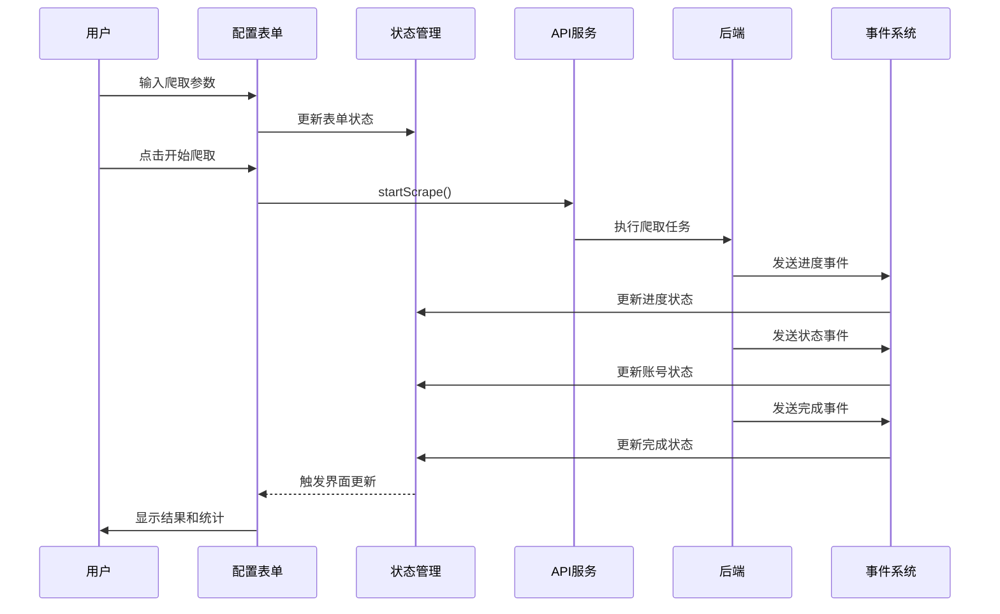

**图表来源**
- [ScrapePage.tsx:274-375](file://frontend/src/pages/ScrapePage.tsx#L274-L375)

#### 关键功能特性
- **并发控制**: 支持多账号并发爬取
- **智能重试**: 遇到频率限制时自动重试
- **进度跟踪**: 实时显示爬取进度和状态
- **错误处理**: 完善的错误捕获和用户提示

**章节来源**
- [ScrapePage.tsx:42-888](file://frontend/src/pages/ScrapePage.tsx#L42-L888)

### 结果页面 (ResultsPage)
结果页面用于展示和管理爬取到的文章数据。

#### 组件结构
页面采用标签页设计：
- **文章列表标签**: 显示爬取的文章列表
- **网盘链接标签**: 提取和管理文章中的网盘链接

#### 数据处理流程
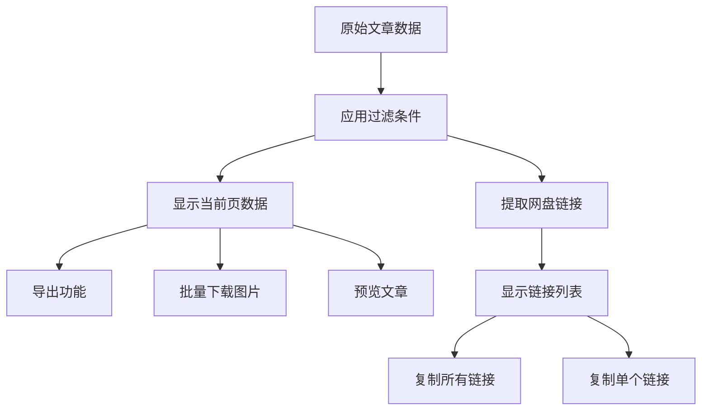

**图表来源**
- [ResultsPage.tsx:139-141](file://frontend/src/pages/ResultsPage.tsx#L139-L141)

#### 关键功能
- **多格式导出**: 支持 CSV、JSON、Excel、Markdown 格式
- **批量操作**: 支持批量选择和批量下载
- **图片管理**: 提取文章内图片链接并支持批量下载
- **数据导入**: 支持从本地数据文件导入

**章节来源**
- [ResultsPage.tsx:113-1280](file://frontend/src/pages/ResultsPage.tsx#L113-L1280)

### 分析页面 (AnalyticsPage)
分析页面提供数据分析和可视化功能。

#### 组件结构
页面包含两个主要图表：
- **时间分布图**: 显示各公众号的文章发布趋势
- **词云图**: 展示热门关键词及其出现频率

#### 图表组件设计
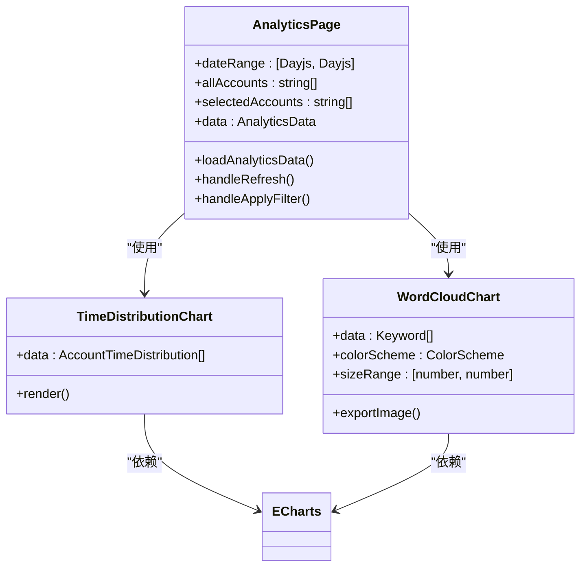

**图表来源**
- [AnalyticsPage.tsx:22-304](file://frontend/src/pages/AnalyticsPage.tsx#L22-L304)
- [TimeDistributionChart.tsx:13-207](file://frontend/src/components/charts/TimeDistributionChart.tsx#L13-L207)
- [WordCloudChart.tsx:25-132](file://frontend/src/components/charts/WordCloudChart.tsx#L25-L132)

#### 分析功能
- **时间范围筛选**: 支持自定义日期范围分析
- **公众号筛选**: 支持按公众号维度分析
- **缓存机制**: 内置数据分析缓存
- **导出功能**: 支持词云图片导出

**章节来源**
- [AnalyticsPage.tsx:22-304](file://frontend/src/pages/AnalyticsPage.tsx#L22-L304)

### 定时任务页面 (SchedulePage)
定时任务页面管理自动化爬取任务。

#### 组件结构
页面采用卡片式设计：
- **任务卡片**: 显示单个定时任务的状态和操作
- **任务配置对话框**: 创建和编辑定时任务
- **执行日志对话框**: 查看任务执行历史

#### 任务管理流程
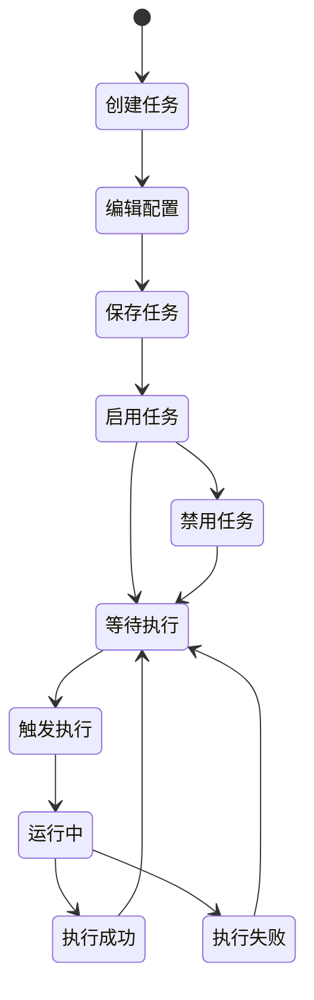

**图表来源**
- [SchedulePage.tsx:226-571](file://frontend/src/pages/SchedulePage.tsx#L226-L571)

#### 关键特性
- **多种执行频率**: 支持每天、每周、间隔执行
- **任务状态监控**: 实时显示任务执行状态
- **手动触发**: 支持立即执行定时任务
- **日志记录**: 完整的任务执行日志

**章节来源**
- [SchedulePage.tsx:226-571](file://frontend/src/pages/SchedulePage.tsx#L226-L571)

### 设置页面 (SettingsPage)
设置页面提供应用配置和系统设置功能。

#### 组件结构
页面分为两个主要区域：
- **爬取配置**: 控制爬取行为的参数设置
- **系统设置**: 应用系统层面的配置选项

#### 配置管理
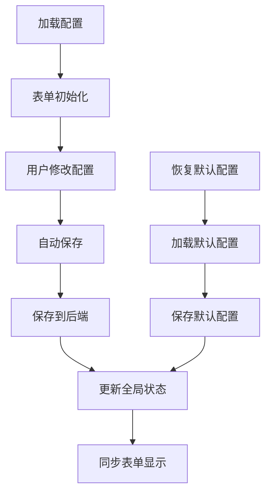

**图表来源**
- [SettingsPage.tsx:54-263](file://frontend/src/pages/SettingsPage.tsx#L54-L263)

#### 系统设置功能
- **关闭到托盘**: 控制窗口关闭行为
- **开机自启动**: 管理应用自启动设置
- **静默启动**: 控制启动时的显示行为
- **配置同步**: 实时同步系统配置变化

**章节来源**
- [SettingsPage.tsx:39-556](file://frontend/src/pages/SettingsPage.tsx#L39-L556)

## 依赖关系分析

### 组件依赖图
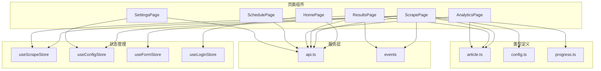

**图表来源**
- [scrapeStore.ts:19-65](file://frontend/src/stores/scrapeStore.ts#L19-L65)
- [api.ts:49-161](file://frontend/src/services/api.ts#L49-L161)
- [article.ts:1-29](file://frontend/src/types/article.ts#L1-L29)
- [config.ts:1-25](file://frontend/src/types/config.ts#L1-L25)
- [progress.ts:1-20](file://frontend/src/types/progress.ts#L1-L20)

### 数据流分析
应用采用单向数据流设计，确保状态管理的可预测性：

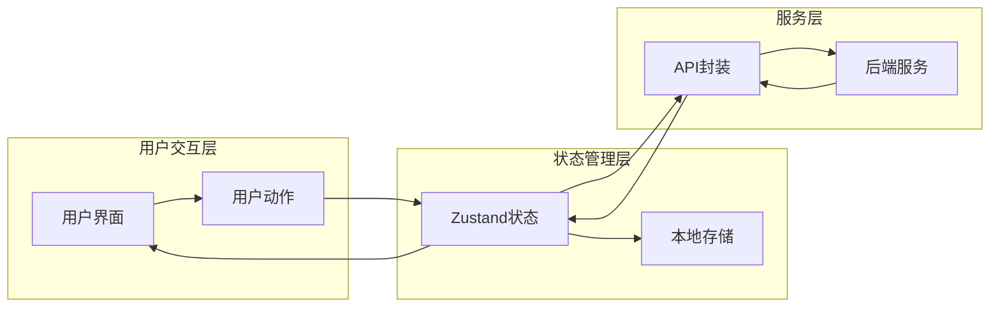

**图表来源**
- [api.ts:104-161](file://frontend/src/services/api.ts#L104-L161)

**章节来源**
- [scrapeStore.ts:19-65](file://frontend/src/stores/scrapeStore.ts#L19-L65)
- [api.ts:49-161](file://frontend/src/services/api.ts#L49-L161)

## 性能考虑
应用在多个方面进行了性能优化：

### 响应式设计
- **自适应布局**: 页面根据屏幕尺寸自动调整布局
- **动态分页**: 结果页面根据可用高度动态计算每页显示数量
- **懒加载**: 图表组件在需要时才初始化

### 性能优化策略
- **状态局部化**: 每个页面维护自己的状态，避免全局状态污染
- **事件节流**: 配置自动保存采用防抖机制
- **内存管理**: 及时清理事件监听器和定时器

### 数据缓存
- **分析数据缓存**: 分析页面内置数据缓存机制
- **配置缓存**: 设置页面配置变更采用延迟保存
- **登录状态缓存**: 首页自动检查登录状态

## 故障排除指南

### 常见问题及解决方案

#### 登录相关问题
- **问题**: 登录失败或浏览器关闭
- **解决方案**: 检查网络连接，重新尝试登录；确认浏览器未被意外关闭

#### 爬取任务异常
- **问题**: 爬取过程中断或频率限制
- **解决方案**: 检查网络连接和服务器状态；适当增加请求间隔；查看任务日志

#### 数据导出失败
- **问题**: 导出文件格式不兼容
- **解决方案**: 确认目标应用程序支持相应文件格式；检查文件权限

#### 性能问题
- **问题**: 页面加载缓慢或响应迟钝
- **解决方案**: 清理应用缓存；重启应用；检查系统资源使用情况

**章节来源**
- [HomePage.tsx:230-253](file://frontend/src/pages/HomePage.tsx#L230-L253)
- [ScrapePage.tsx:377-396](file://frontend/src/pages/ScrapePage.tsx#L377-L396)
- [ResultsPage.tsx:179-186](file://frontend/src/pages/ResultsPage.tsx#L179-L186)

## 结论
WeMediaSpider 的页面组件设计体现了现代前端开发的最佳实践，具有以下特点：

1. **模块化架构**: 每个页面组件职责明确，便于维护和扩展
2. **状态管理**: 采用 Zustand 实现轻量级状态管理，避免过度复杂化
3. **用户体验**: 注重用户交互体验，提供丰富的反馈和提示
4. **性能优化**: 在数据处理和界面渲染方面进行了多项优化
5. **可扩展性**: 组件设计支持功能扩展和定制化需求

该架构为后续功能扩展奠定了良好的基础，同时保持了代码的可读性和可维护性。

## 附录

### 使用示例
应用提供了完整的使用示例，包括基本操作流程和高级功能使用方法。

### 自定义扩展
开发者可以根据需要对现有组件进行扩展，包括：
- 添加新的页面组件
- 扩展状态管理功能
- 集成新的第三方库
- 自定义主题和样式

### API 参考
详细的 API 接口文档和使用示例，便于开发者集成和扩展功能。