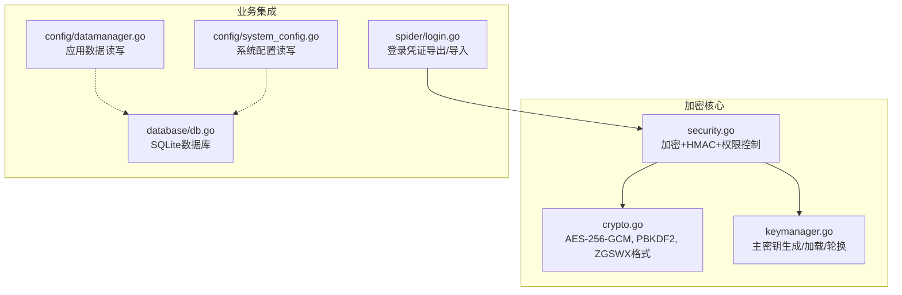
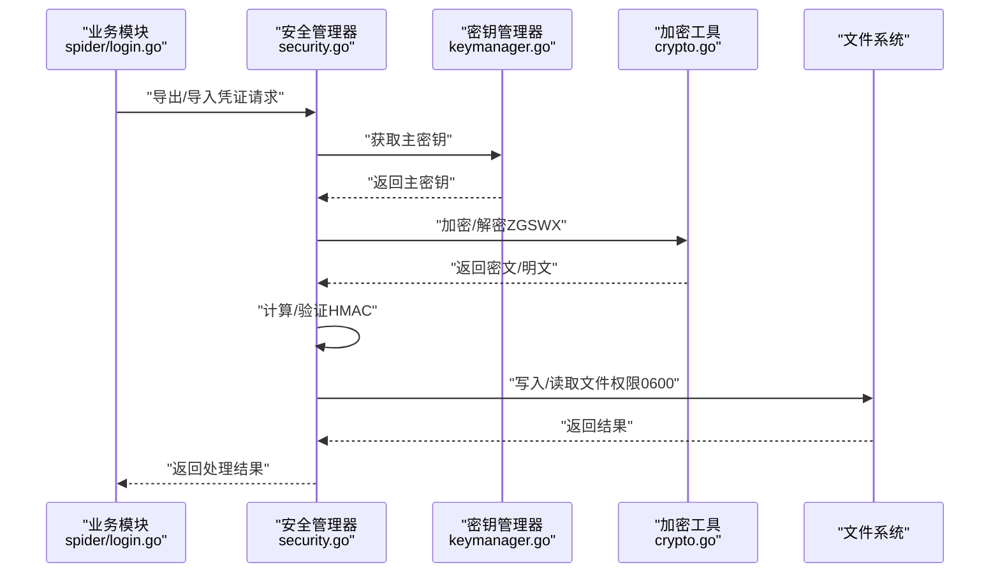
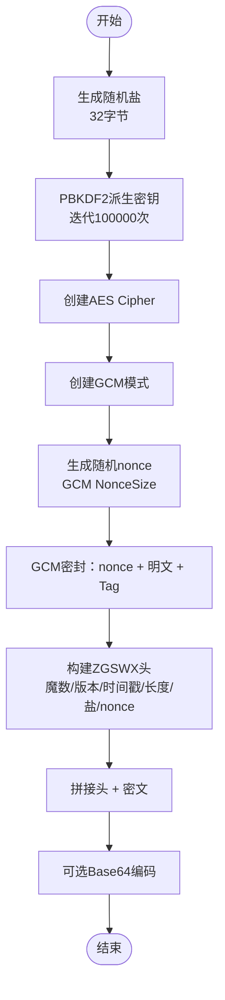
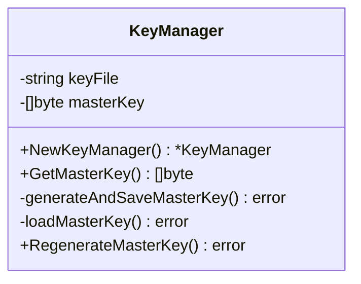
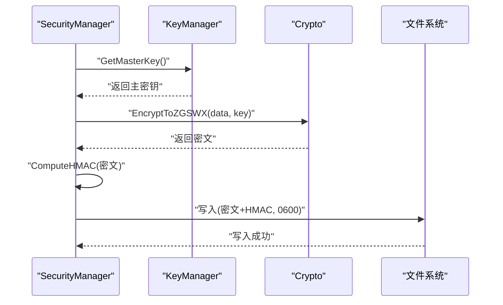
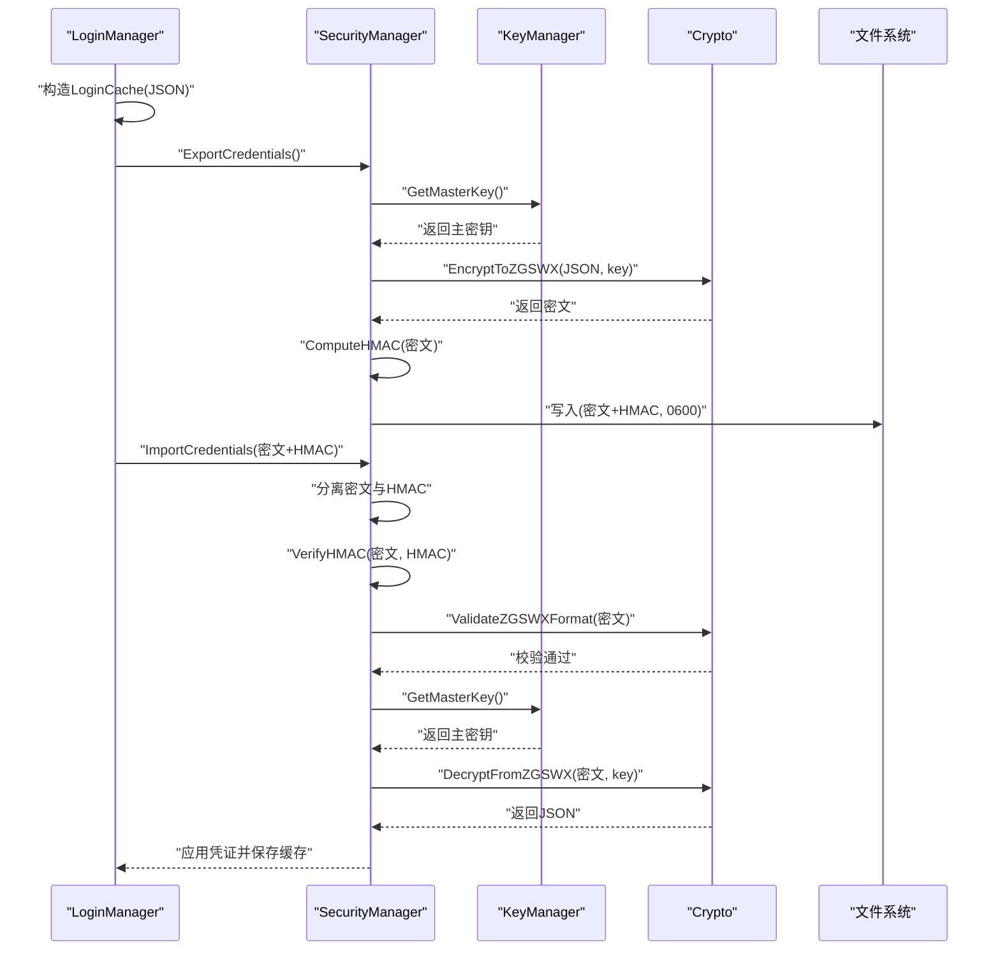
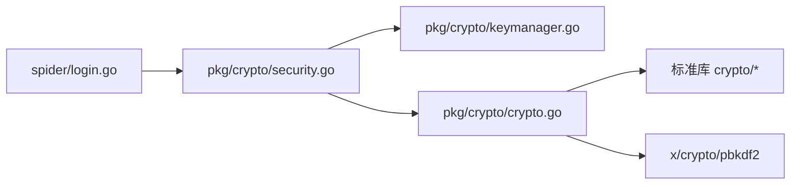

# 加密机制

<cite>
**本文引用的文件**
- [crypto.go](file://backend/pkg/crypto/crypto.go)
- [keymanager.go](file://backend/pkg/crypto/keymanager.go)
- [security.go](file://backend/pkg/crypto/security.go)
- [login.go](file://backend/internal/spider/login.go)
- [datamanager.go](file://backend/internal/config/datamanager.go)
- [system_config.go](file://backend/internal/config/system_config.go)
- [db.go](file://backend/internal/database/db.go)
- [crypto_test.go](file://backend/pkg/crypto/crypto_test.go)
</cite>

## 目录
1. [简介](#简介)
2. [项目结构与职责划分](#项目结构与职责划分)
3. [核心组件](#核心组件)
4. [架构总览](#架构总览)
5. [详细组件分析](#详细组件分析)
6. [依赖关系分析](#依赖关系分析)
7. [性能与内存安全](#性能与内存安全)
8. [故障排查指南](#故障排查指南)
9. [结论](#结论)
10. [附录：使用场景与最佳实践](#附录使用场景与最佳实践)

## 简介
本文件系统性阐述 WeMediaSpider 的加密机制设计与实现，重点覆盖：
- AES-256-GCM 对称加密的实现原理与使用方式（密钥生成、初始化向量处理、认证标签验证）
- 密钥管理器的设计架构（密钥存储、轮换与销毁）
- 安全随机数生成与密钥派生（PBKDF2）
- 与安全组件的集成（HMAC 完整性校验、文件权限控制）
- 性能优化策略与内存安全注意事项
- 具体使用场景与加密模式选择建议

## 项目结构与职责划分
WeMediaSpider 的加密相关能力集中在 backend/pkg/crypto 包，并通过 SecurityManager 与业务模块（如登录凭证管理）集成。关键职责划分如下：
- crypto 包：提供对称加密、文件头格式、PBKDF2 派生、Base64 编解码等基础能力
- keymanager 包：负责主密钥的生成、持久化、加载与轮换
- security 包：封装安全写入/读取流程（加密 + HMAC + 权限控制），并与 KeyManager 协作
- spider/login：登录凭证的导出/导入流程，使用 .zgswx 格式与 HMAC 校验
- config/datamanager：应用数据与系统配置的读写（非敏感数据）
- database：SQLite 数据库存储（非敏感数据）

图表来源
- [crypto.go:1-314](file://backend/pkg/crypto/crypto.go#L1-L314)
- [keymanager.go:1-146](file://backend/pkg/crypto/keymanager.go#L1-L146)
- [security.go:1-160](file://backend/pkg/crypto/security.go#L1-L160)
- [login.go:1-616](file://backend/internal/spider/login.go#L1-L616)
- [datamanager.go:1-175](file://backend/internal/config/datamanager.go#L1-L175)
- [system_config.go:1-108](file://backend/internal/config/system_config.go#L1-L108)
- [db.go:1-115](file://backend/internal/database/db.go#L1-L115)

章节来源
- [crypto.go:1-314](file://backend/pkg/crypto/crypto.go#L1-L314)
- [keymanager.go:1-146](file://backend/pkg/crypto/keymanager.go#L1-L146)
- [security.go:1-160](file://backend/pkg/crypto/security.go#L1-L160)
- [login.go:1-616](file://backend/internal/spider/login.go#L1-L616)
- [datamanager.go:1-175](file://backend/internal/config/datamanager.go#L1-L175)
- [system_config.go:1-108](file://backend/internal/config/system_config.go#L1-L108)
- [db.go:1-115](file://backend/internal/database/db.go#L1-L115)

## 核心组件
- AES-256-GCM 对称加密：提供机密性与完整性保护，使用随机盐与随机 nonce，认证标签随密文携带
- PBKDF2 密钥派生：从口令或主密钥派生固定长度密钥，迭代次数提升抗暴力破解能力
- ZGSWX 文件格式：自定义二进制头 + 密文，便于跨模块复用与版本管理
- 主密钥管理器：生成、存储、加载、轮换主密钥，确保密钥材料不直接持久化
- 安全管理器：统一的安全写入/读取流程，结合 HMAC 与文件权限控制
- 登录凭证管理：基于 .zgswx 格式的凭证导出/导入，内置完整性校验与过期控制

章节来源
- [crypto.go:34-121](file://backend/pkg/crypto/crypto.go#L34-L121)
- [crypto.go:134-195](file://backend/pkg/crypto/crypto.go#L134-L195)
- [crypto.go:197-260](file://backend/pkg/crypto/crypto.go#L197-L260)
- [keymanager.go:25-100](file://backend/pkg/crypto/keymanager.go#L25-L100)
- [keymanager.go:102-134](file://backend/pkg/crypto/keymanager.go#L102-L134)
- [keymanager.go:136-145](file://backend/pkg/crypto/keymanager.go#L136-L145)
- [security.go:18-85](file://backend/pkg/crypto/security.go#L18-L85)
- [security.go:87-154](file://backend/pkg/crypto/security.go#L87-L154)
- [login.go:504-545](file://backend/internal/spider/login.go#L504-L545)
- [login.go:547-615](file://backend/internal/spider/login.go#L547-L615)

## 架构总览
下图展示加密机制在系统中的整体交互：业务模块通过 SecurityManager 调用加密与完整性校验，KeyManager 负责主密钥生命周期管理，crypto 提供具体加解密与格式化能力。

图表来源
- [login.go:504-545](file://backend/internal/spider/login.go#L504-L545)
- [login.go:547-615](file://backend/internal/spider/login.go#L547-L615)
- [security.go:87-154](file://backend/pkg/crypto/security.go#L87-L154)
- [keymanager.go:57-63](file://backend/pkg/crypto/keymanager.go#L57-L63)
- [crypto.go:134-195](file://backend/pkg/crypto/crypto.go#L134-L195)
- [crypto.go:197-260](file://backend/pkg/crypto/crypto.go#L197-L260)

## 详细组件分析

### AES-256-GCM 对称加密与 ZGSWX 文件格式
- 密钥生成与派生
  - 口令加密：使用 PBKDF2 从口令与随机盐派生 32 字节密钥，迭代次数为 100000
  - 主密钥加密：使用主密钥与随机盐再次派生加密密钥，保证不同会话的密钥变化
- 初始化向量与认证标签
  - 随机 nonce（GCM NonceSize）由随机源生成，随密文一起存储
  - 认证标签（Tag）由 GCM 自动生成并随密文拼接，解密时自动验证
- ZGSWX 文件头
  - 固定头结构包含魔数、版本、时间戳、数据长度、盐、nonce
  - 大端序序列化，便于跨平台一致性
- Base64 编码（口令加密路径）
  - 将“盐 + GCM 密文”拼接后进行 Base64 编码，便于文本传输与存储

图表来源
- [crypto.go:34-71](file://backend/pkg/crypto/crypto.go#L34-L71)
- [crypto.go:134-195](file://backend/pkg/crypto/crypto.go#L134-L195)
- [crypto.go:197-260](file://backend/pkg/crypto/crypto.go#L197-L260)

章节来源
- [crypto.go:20-32](file://backend/pkg/crypto/crypto.go#L20-L32)
- [crypto.go:34-71](file://backend/pkg/crypto/crypto.go#L34-L71)
- [crypto.go:123-132](file://backend/pkg/crypto/crypto.go#L123-L132)
- [crypto.go:134-195](file://backend/pkg/crypto/crypto.go#L134-L195)
- [crypto.go:197-260](file://backend/pkg/crypto/crypto.go#L197-L260)
- [crypto_test.go:83-106](file://backend/pkg/crypto/crypto_test.go#L83-L106)

### 密钥管理器（KeyManager）
- 设计目标
  - 生成强随机主密钥（32 字节）
  - 不将派生后的密钥直接写入磁盘，仅保存“盐 + 种子”
  - 支持密钥轮换（RegenerateMasterKey），使旧凭证失效
- 生成流程
  - 随机种子（32 字节）+ 用户主目录路径 + 应用标识（字符串）作为输入
  - 使用 PBKDF2（100000 次迭代，SHA-256）派生最终主密钥
  - 将盐与种子写入 ~/.wemediaspider/master.key（权限 0600）
- 加载流程
  - 读取文件，分离盐与种子
  - 重新组合输入并派生主密钥，与内存中的主密钥一致
- 轮换与销毁
  - RegenerateMasterKey 删除旧文件并生成新密钥，旧凭证文件将无法解密

图表来源
- [keymanager.go:19-23](file://backend/pkg/crypto/keymanager.go#L19-L23)
- [keymanager.go:25-55](file://backend/pkg/crypto/keymanager.go#L25-L55)
- [keymanager.go:65-100](file://backend/pkg/crypto/keymanager.go#L65-L100)
- [keymanager.go:102-134](file://backend/pkg/crypto/keymanager.go#L102-L134)
- [keymanager.go:136-145](file://backend/pkg/crypto/keymanager.go#L136-L145)

章节来源
- [keymanager.go:13-17](file://backend/pkg/crypto/keymanager.go#L13-L17)
- [keymanager.go:25-55](file://backend/pkg/crypto/keymanager.go#L25-L55)
- [keymanager.go:65-100](file://backend/pkg/crypto/keymanager.go#L65-L100)
- [keymanager.go:102-134](file://backend/pkg/crypto/keymanager.go#L102-L134)
- [keymanager.go:136-145](file://backend/pkg/crypto/keymanager.go#L136-L145)

### 安全管理器（SecurityManager）
- 统一安全写入流程
  - 读取主密钥 -> 加密为 .zgswx -> 计算 HMAC -> 附加到密文 -> 写入文件（权限 0600）
- 统一安全读取流程
  - 读取文件 -> 分离密文与 HMAC -> 验证 HMAC -> 解密 -> 返回明文
- 文件权限控制
  - 在初始化时对敏感文件（master.key、login_cache.json、wemedia.db、cache.db）设置 0600 权限

图表来源
- [security.go:87-115](file://backend/pkg/crypto/security.go#L87-L115)
- [security.go:117-154](file://backend/pkg/crypto/security.go#L117-L154)
- [keymanager.go:57-63](file://backend/pkg/crypto/keymanager.go#L57-L63)
- [crypto.go:134-195](file://backend/pkg/crypto/crypto.go#L134-L195)

章节来源
- [security.go:12-16](file://backend/pkg/crypto/security.go#L12-L16)
- [security.go:18-36](file://backend/pkg/crypto/security.go#L18-L36)
- [security.go:38-63](file://backend/pkg/crypto/security.go#L38-L63)
- [security.go:65-85](file://backend/pkg/crypto/security.go#L65-L85)
- [security.go:87-154](file://backend/pkg/crypto/security.go#L87-L154)

### 登录凭证管理（LoginManager）
- 导出流程
  - 序列化 Token/Cookies/时间戳 -> 加密为 .zgswx -> 计算 HMAC -> 附加到密文 -> 返回
- 导入流程
  - 分离密文与 HMAC -> 验证 HMAC（兼容旧格式）-> 校验 .zgswx 格式 -> 解密 -> 反序列化 -> 过期校验 -> 应用凭证
- 缓存与过期
  - 默认过期时间为 96 小时；导入后保存到本地缓存文件

图表来源
- [login.go:504-545](file://backend/internal/spider/login.go#L504-L545)
- [login.go:547-615](file://backend/internal/spider/login.go#L547-L615)
- [security.go:87-154](file://backend/pkg/crypto/security.go#L87-L154)
- [keymanager.go:57-63](file://backend/pkg/crypto/keymanager.go#L57-L63)
- [crypto.go:134-195](file://backend/pkg/crypto/crypto.go#L134-L195)
- [crypto.go:197-260](file://backend/pkg/crypto/crypto.go#L197-L260)

章节来源
- [login.go:23-56](file://backend/internal/spider/login.go#L23-L56)
- [login.go:504-545](file://backend/internal/spider/login.go#L504-L545)
- [login.go:547-615](file://backend/internal/spider/login.go#L547-L615)

### 安全随机数与密钥派生
- 随机源
  - 使用 crypto/rand 生成盐、nonce、种子等
- PBKDF2 参数
  - 迭代次数：100000
  - 哈希函数：SHA-256
  - 输出长度：32 字节（AES-256）
- 额外熵源
  - 用户主目录路径与应用标识字符串参与派生，增强抗预测性

章节来源
- [crypto.go:37-43](file://backend/pkg/crypto/crypto.go#L37-L43)
- [crypto.go:57-61](file://backend/pkg/crypto/crypto.go#L57-L61)
- [crypto.go:140-147](file://backend/pkg/crypto/crypto.go#L140-L147)
- [crypto.go:161-165](file://backend/pkg/crypto/crypto.go#L161-L165)
- [keymanager.go:67-87](file://backend/pkg/crypto/keymanager.go#L67-L87)
- [keymanager.go:120-128](file://backend/pkg/crypto/keymanager.go#L120-L128)

### HMAC 完整性校验与文件权限
- HMAC 计算与验证
  - 使用 SHA-256 对加密数据进行 HMAC，输出十六进制字符串
  - 读取时先分离密文与 HMAC，再进行比对
- 文件权限
  - 安全写入/读取时强制设置 0600 权限，限制其他用户访问
  - 初始化时对敏感文件批量设置权限

章节来源
- [security.go:65-85](file://backend/pkg/crypto/security.go#L65-L85)
- [security.go:87-115](file://backend/pkg/crypto/security.go#L87-L115)
- [security.go:117-154](file://backend/pkg/crypto/security.go#L117-L154)
- [security.go:38-63](file://backend/pkg/crypto/security.go#L38-L63)

## 依赖关系分析
- 组件耦合
  - LoginManager 依赖 SecurityManager，间接依赖 KeyManager 与 Crypto
  - SecurityManager 依赖 KeyManager 与 Crypto
  - Crypto 依赖标准库 crypto/* 与 x/crypto/pbkdf2
- 外部依赖
  - golang.org/x/crypto/pbkdf2
  - 标准库 crypto/aes、cipher、rand、sha256、base64、encoding/binary、os、io
- 潜在循环依赖
  - 当前结构清晰，无循环依赖迹象

图表来源
- [login.go:1-21](file://backend/internal/spider/login.go#L1-L21)
- [security.go:1-16](file://backend/pkg/crypto/security.go#L1-L16)
- [keymanager.go:1-11](file://backend/pkg/crypto/keymanager.go#L1-L11)
- [crypto.go:3-18](file://backend/pkg/crypto/crypto.go#L3-L18)

章节来源
- [login.go:1-21](file://backend/internal/spider/login.go#L1-L21)
- [security.go:1-16](file://backend/pkg/crypto/security.go#L1-L16)
- [keymanager.go:1-11](file://backend/pkg/crypto/keymanager.go#L1-L11)
- [crypto.go:3-18](file://backend/pkg/crypto/crypto.go#L3-L18)

## 性能与内存安全
- 性能优化策略
  - PBKDF2 迭代次数较高（100000），在生成主密钥时一次性完成；日常加解密使用 GCM，无需重复派生
  - 使用 GCM 的 Seal/Open 直接在内存中完成，减少中间缓冲
  - HMAC 采用一次性计算，避免重复哈希
- 内存安全考虑
  - 主密钥仅驻留内存，不直接写入磁盘；密钥文件仅保存“盐 + 种子”
  - 解密失败时返回错误，避免泄露内部状态
  - 文件权限严格设置为 0600，防止其他用户读取
- 可扩展性
  - ZGSWX 头部预留字段可用于未来版本升级与元数据扩展

章节来源
- [keymanager.go:92-99](file://backend/pkg/crypto/keymanager.go#L92-L99)
- [security.go:109-112](file://backend/pkg/crypto/security.go#L109-L112)
- [crypto.go:20-32](file://backend/pkg/crypto/crypto.go#L20-L32)

## 故障排查指南
- 常见错误与定位
  - “无效的凭证文件/格式”：检查 .zgswx 魔数、版本与长度
  - “HMAC 验证失败”：确认密钥未轮换且文件未被篡改
  - “解密失败：口令错误或数据损坏”：确认口令正确且 Base64 数据完整
  - “文件权限不足”：确认文件权限已设置为 0600
- 排查步骤
  - 验证 ZGSWX 格式：使用 ValidateZGSWXFormat
  - 重新计算 HMAC 并比对
  - 检查密钥文件是否存在与大小是否正确
  - 确认主密钥未被轮换

章节来源
- [crypto.go:262-282](file://backend/pkg/crypto/crypto.go#L262-L282)
- [security.go:117-154](file://backend/pkg/crypto/security.go#L117-L154)
- [crypto_test.go:57-67](file://backend/pkg/crypto/crypto_test.go#L57-L67)
- [crypto_test.go:125-131](file://backend/pkg/crypto/crypto_test.go#L125-L131)

## 结论
WeMediaSpider 的加密机制以 AES-256-GCM 为核心，结合 PBKDF2 密钥派生、随机盐与 nonce、认证标签以及 HMAC 完整性校验，形成了完整的机密性与完整性保障体系。KeyManager 负责主密钥生命周期管理，SecurityManager 统一了安全写入/读取流程，LoginManager 则在业务层面实现了凭证的导出/导入与过期控制。该方案兼顾安全性与易用性，适合桌面应用的本地敏感数据保护需求。

## 附录：使用场景与最佳实践
- 何时使用口令加密（Encrypt/Decrypt）
  - 适用于需要用户输入口令即可加解密的场景（例如临时数据传输）
  - 注意每次加密产生不同的密文（随机盐/nonce）
- 何时使用主密钥加密（EncryptToZGSWX/DecryptFromZGSWX）
  - 适用于长期存储与跨模块共享的敏感数据（如登录凭证）
  - 与 HMAC 结合使用，确保数据完整性
- 何时使用安全写入/读取（SecureWriteFile/SecureReadFile）
  - 适用于需要持久化的敏感文件（如凭证文件、配置文件）
  - 自动设置权限 0600 并附加 HMAC
- 密钥轮换
  - 使用 RegenerateMasterKey 触发轮换，旧凭证文件将失效
  - 轮换后需重新导出新凭证并更新相关配置

章节来源
- [crypto.go:34-121](file://backend/pkg/crypto/crypto.go#L34-L121)
- [crypto.go:134-195](file://backend/pkg/crypto/crypto.go#L134-L195)
- [crypto.go:197-260](file://backend/pkg/crypto/crypto.go#L197-L260)
- [security.go:87-154](file://backend/pkg/crypto/security.go#L87-L154)
- [keymanager.go:136-145](file://backend/pkg/crypto/keymanager.go#L136-L145)
- [login.go:504-545](file://backend/internal/spider/login.go#L504-L545)
- [login.go:547-615](file://backend/internal/spider/login.go#L547-L615)