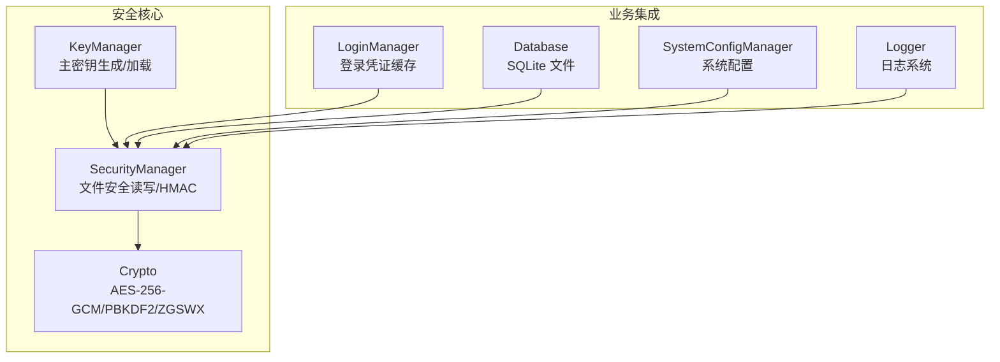
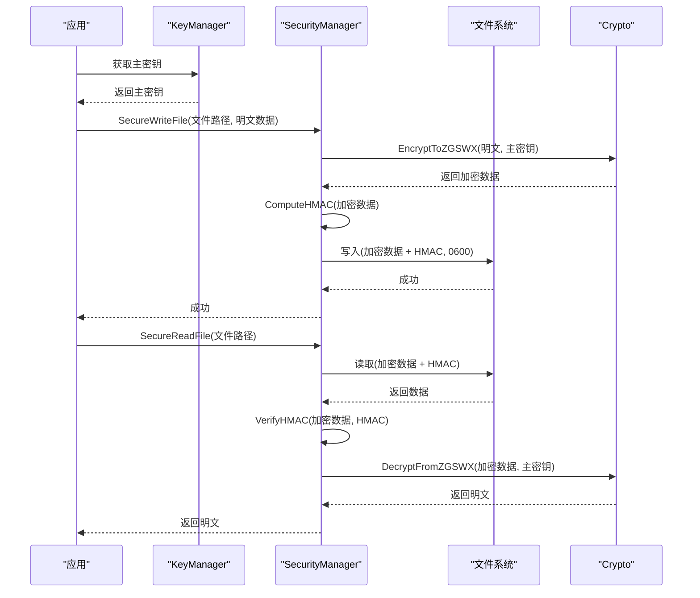
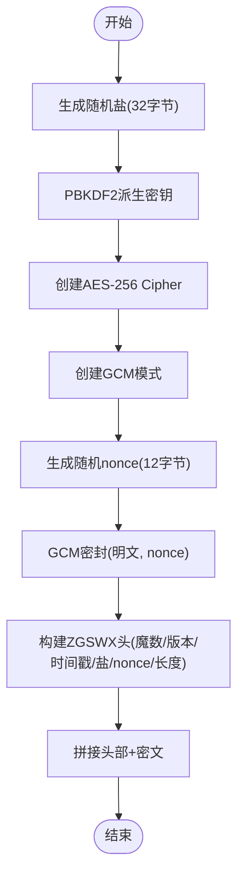
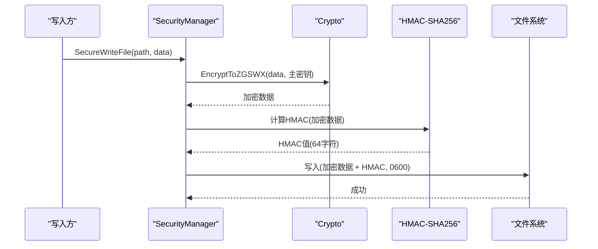
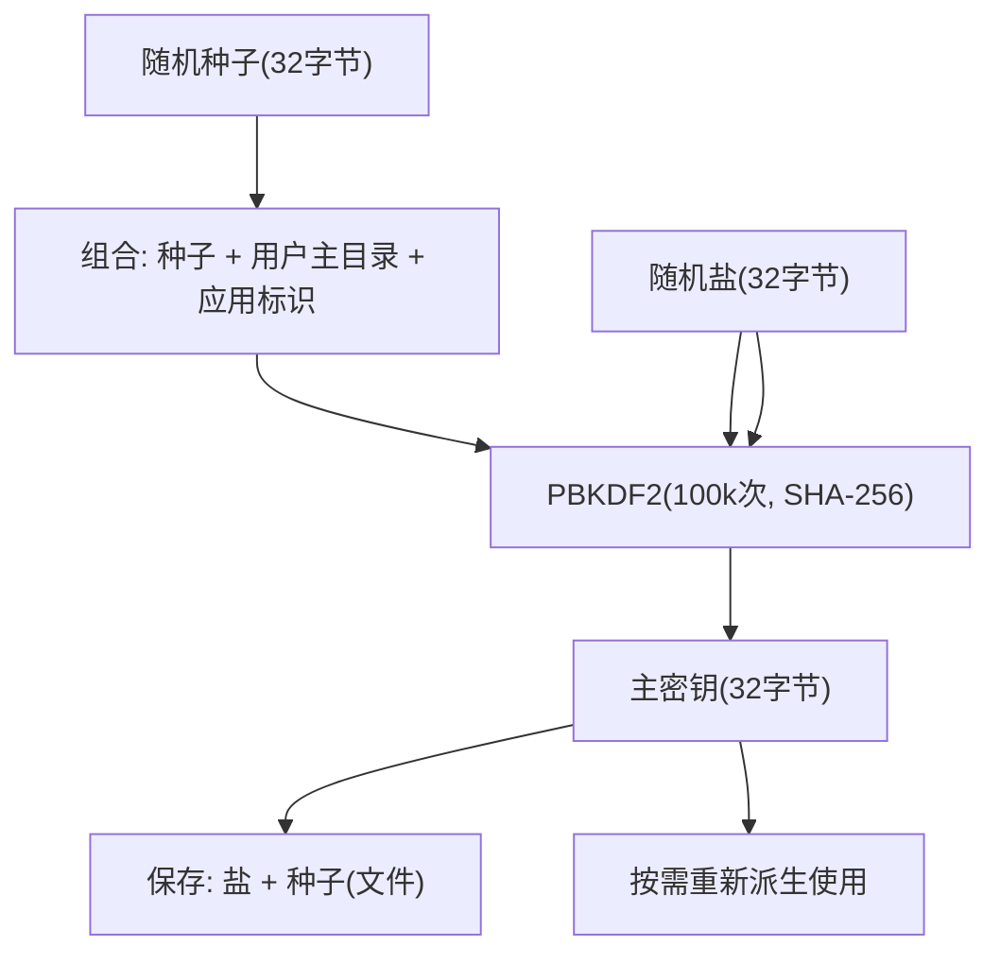
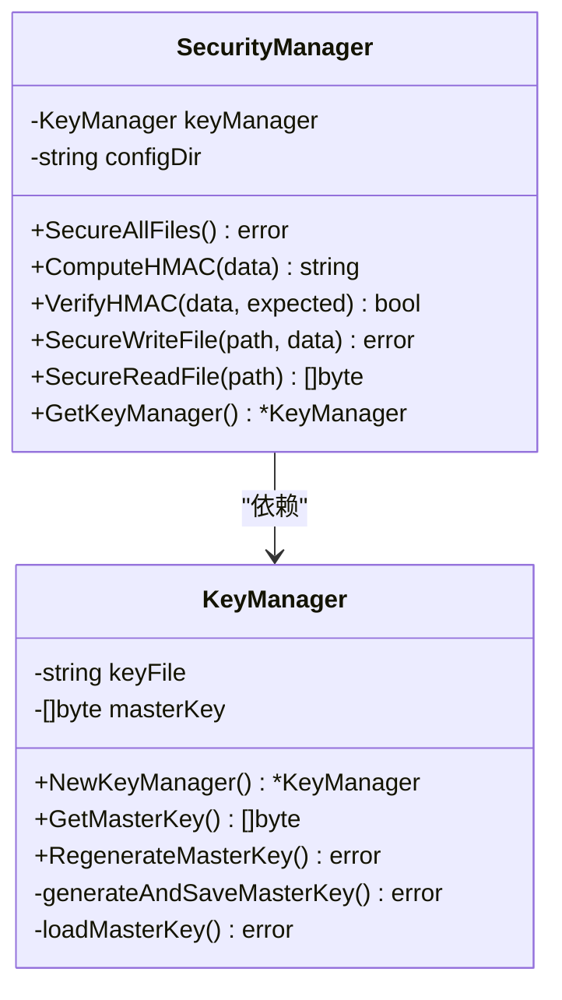
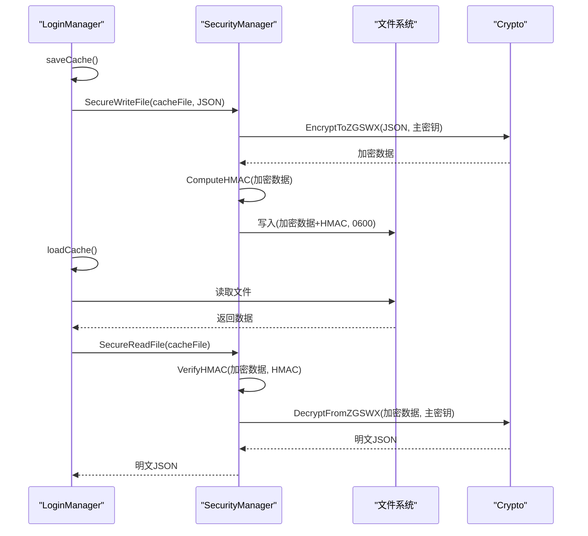
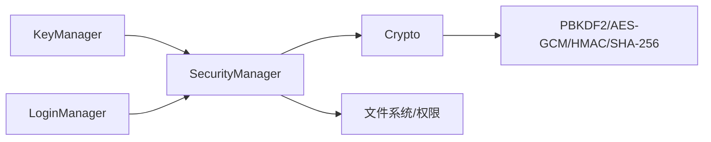

# 安全与加密

<cite>
**本文引用的文件**
- [backend/pkg/crypto/crypto.go](file://backend/pkg/crypto/crypto.go)
- [backend/pkg/crypto/keymanager.go](file://backend/pkg/crypto/keymanager.go)
- [backend/pkg/crypto/security.go](file://backend/pkg/crypto/security.go)
- [backend/pkg/crypto/crypto_test.go](file://backend/pkg/crypto/crypto_test.go)
- [SECURITY.md](file://SECURITY.md)
- [backend/internal/spider/login.go](file://backend/internal/spider/login.go)
- [backend/pkg/logger/logger.go](file://backend/pkg/logger/logger.go)
- [backend/pkg/errors/errors.go](file://backend/pkg/errors/errors.go)
- [backend/internal/database/db.go](file://backend/internal/database/db.go)
- [backend/internal/config/system_config.go](file://backend/internal/config/system_config.go)
</cite>

## 目录
1. [简介](#简介)
2. [项目结构](#项目结构)
3. [核心组件](#核心组件)
4. [架构总览](#架构总览)
5. [详细组件分析](#详细组件分析)
6. [依赖关系分析](#依赖关系分析)
7. [性能考量](#性能考量)
8. [故障排查指南](#故障排查指南)
9. [结论](#结论)
10. [附录](#附录)

## 简介
本文件系统性阐述 WeMediaSpider 的安全与加密机制，覆盖以下关键点：
- AES-256-GCM 加密算法的实现与完整性校验
- HMAC-SHA256 的使用场景与实现方式
- PBKDF2 密钥派生函数的应用与安全性考量
- 密钥管理的安全策略与最佳实践
- 输入验证、错误处理与日志安全
- 安全威胁分析与防护措施
- 数据传输与存储的安全保护机制
- 安全配置指南与风险评估方法

## 项目结构
WeMediaSpider 的安全与加密能力主要集中在后端包 crypto 中，并与登录流程、数据库、配置与日志模块协同工作，形成“密钥管理 + 存储加密 + 完整性校验 + 文件权限 + 日志审计”的整体安全体系。

图表来源
- [backend/pkg/crypto/keymanager.go:19-55](file://backend/pkg/crypto/keymanager.go#L19-L55)
- [backend/pkg/crypto/security.go:12-36](file://backend/pkg/crypto/security.go#L12-L36)
- [backend/pkg/crypto/crypto.go:34-121](file://backend/pkg/crypto/crypto.go#L34-L121)
- [backend/internal/spider/login.go:284-315](file://backend/internal/spider/login.go#L284-L315)
- [backend/internal/database/db.go:18-69](file://backend/internal/database/db.go#L18-L69)
- [backend/internal/config/system_config.go:20-40](file://backend/internal/config/system_config.go#L20-L40)
- [backend/pkg/logger/logger.go:12-85](file://backend/pkg/logger/logger.go#L12-L85)

章节来源
- [backend/pkg/crypto/crypto.go:1-314](file://backend/pkg/crypto/crypto.go#L1-L314)
- [backend/pkg/crypto/keymanager.go:1-146](file://backend/pkg/crypto/keymanager.go#L1-L146)
- [backend/pkg/crypto/security.go:1-160](file://backend/pkg/crypto/security.go#L1-L160)
- [backend/internal/spider/login.go:284-396](file://backend/internal/spider/login.go#L284-L396)
- [backend/internal/database/db.go:18-115](file://backend/internal/database/db.go#L18-L115)
- [backend/internal/config/system_config.go:1-108](file://backend/internal/config/system_config.go#L1-L108)
- [backend/pkg/logger/logger.go:1-109](file://backend/pkg/logger/logger.go#L1-L109)

## 核心组件
- 密钥管理器（KeyManager）：负责主密钥的生成、持久化（仅存储盐+种子）、加载与重新派生，避免直接存储派生后的密钥。
- 安全管理器（SecurityManager）：封装文件权限设置、HMAC 计算/验证、加密文件的统一读写接口，保障完整性与机密性。
- 加密工具（Crypto）：提供基于 PBKDF2 的密钥派生、AES-256-GCM 加密/解密、ZGSWX 文件格式的封装与校验。
- 登录管理器（LoginManager）：使用安全管理器对登录缓存进行加密存储与完整性校验，并支持凭证的导出/导入。
- 数据库与配置：数据库文件采用 0600 权限与 WAL 模式；系统配置明文存储但位于受限目录。
- 日志系统：集中化日志记录，支持文件滚动与内存缓冲，便于安全审计。

章节来源
- [backend/pkg/crypto/keymanager.go:19-146](file://backend/pkg/crypto/keymanager.go#L19-L146)
- [backend/pkg/crypto/security.go:12-160](file://backend/pkg/crypto/security.go#L12-L160)
- [backend/pkg/crypto/crypto.go:34-314](file://backend/pkg/crypto/crypto.go#L34-L314)
- [backend/internal/spider/login.go:284-581](file://backend/internal/spider/login.go#L284-L581)
- [backend/internal/database/db.go:18-115](file://backend/internal/database/db.go#L18-L115)
- [backend/internal/config/system_config.go:13-108](file://backend/internal/config/system_config.go#L13-L108)
- [backend/pkg/logger/logger.go:12-109](file://backend/pkg/logger/logger.go#L12-L109)

## 架构总览
WeMediaSpider 的安全架构围绕“主密钥 + PBKDF2 + AES-256-GCM + HMAC + 文件权限”构建，形成如下闭环：
- 启动阶段：初始化密钥管理器与安全管理器，自动修复敏感文件权限。
- 运行阶段：对登录缓存、数据库等敏感数据进行加密存储与完整性校验；对凭证导出/导入进行统一安全处理。
- 审计阶段：日志系统记录关键安全事件，便于追踪与审计。

图表来源
- [backend/pkg/crypto/security.go:87-154](file://backend/pkg/crypto/security.go#L87-L154)
- [backend/pkg/crypto/crypto.go:134-260](file://backend/pkg/crypto/crypto.go#L134-L260)
- [backend/pkg/crypto/keymanager.go:57-134](file://backend/pkg/crypto/keymanager.go#L57-L134)

章节来源
- [backend/pkg/crypto/security.go:12-160](file://backend/pkg/crypto/security.go#L12-L160)
- [backend/pkg/crypto/crypto.go:34-314](file://backend/pkg/crypto/crypto.go#L34-L314)
- [backend/pkg/crypto/keymanager.go:19-146](file://backend/pkg/crypto/keymanager.go#L19-L146)

## 详细组件分析

### AES-256-GCM 加密与完整性校验
- 密钥派生：使用 PBKDF2 对密码或主密钥进行派生，参数包括固定盐长、迭代次数与哈希算法，确保抗暴力破解能力。
- 加密过程：AES-256-GCM 模式提供机密性与完整性，随机生成盐与 nonce，分别嵌入输出或文件头中。
- 完整性校验：GCM 的认证标签（tag）随密文一起存储，解密时自动验证，防止篡改。
- 文件格式：ZGSWX 自定义格式包含魔数、版本、时间戳、盐、nonce、数据长度与密文，便于跨版本兼容与校验。

图表来源
- [backend/pkg/crypto/crypto.go:134-195](file://backend/pkg/crypto/crypto.go#L134-L195)

章节来源
- [backend/pkg/crypto/crypto.go:20-32](file://backend/pkg/crypto/crypto.go#L20-L32)
- [backend/pkg/crypto/crypto.go:34-121](file://backend/pkg/crypto/crypto.go#L34-L121)
- [backend/pkg/crypto/crypto.go:134-260](file://backend/pkg/crypto/crypto.go#L134-L260)

### HMAC-SHA256 的使用与实现
- 使用场景：对加密文件追加 64 字符十六进制 HMAC，确保文件未被篡改。
- 实现方式：以主密钥为 HMAC 密钥，计算整个加密数据的 SHA-256-HMAC，读取时先验证再解密。
- 安全收益：即使攻击者能读取文件，也无法伪造有效 HMAC；解密失败即刻暴露篡改迹象。

图表来源
- [backend/pkg/crypto/security.go:87-115](file://backend/pkg/crypto/security.go#L87-L115)

章节来源
- [backend/pkg/crypto/security.go:65-85](file://backend/pkg/crypto/security.go#L65-L85)
- [backend/pkg/crypto/security.go:87-154](file://backend/pkg/crypto/security.go#L87-L154)

### PBKDF2 密钥派生与安全性
- 参数设计：固定 32 字节密钥长度、32 字节盐长、100,000 次迭代，SHA-256 哈希，兼顾安全性与可用性。
- 主密钥存储：仅保存“盐 + 种子”，不保存派生后的主密钥，每次使用时重新派生，降低泄露面。
- 额外熵源：结合用户主目录路径与应用标识，提升抗彩虹表能力。

图表来源
- [backend/pkg/crypto/keymanager.go:66-100](file://backend/pkg/crypto/keymanager.go#L66-L100)
- [backend/pkg/crypto/keymanager.go:102-134](file://backend/pkg/crypto/keymanager.go#L102-L134)

章节来源
- [backend/pkg/crypto/keymanager.go:13-17](file://backend/pkg/crypto/keymanager.go#L13-L17)
- [backend/pkg/crypto/keymanager.go:66-134](file://backend/pkg/crypto/keymanager.go#L66-L134)

### 密钥管理策略与最佳实践
- 生成与存储：仅存储盐与种子，不存储派生后的主密钥；文件权限严格限制为 0600。
- 重新生成：提供密钥轮换接口，使旧凭证失效，适用于怀疑泄露场景。
- 向后兼容：自动检测并升级旧格式（明文/无HMAC/含HMAC），保证平滑过渡。

图表来源
- [backend/pkg/crypto/keymanager.go:19-146](file://backend/pkg/crypto/keymanager.go#L19-L146)
- [backend/pkg/crypto/security.go:12-160](file://backend/pkg/crypto/security.go#L12-L160)

章节来源
- [backend/pkg/crypto/keymanager.go:19-146](file://backend/pkg/crypto/keymanager.go#L19-L146)
- [backend/pkg/crypto/security.go:12-160](file://backend/pkg/crypto/security.go#L12-L160)

### 登录凭证的加密存储与导入导出
- 加密保存：登录缓存序列化后经安全管理器加密并写入，自动设置权限与完整性校验。
- 升级兼容：若检测到旧格式（明文或无HMAC），自动转换并重新保存为新格式。
- 导入导出：凭证文件包含加密数据与 HMAC，导入时先验证再解密，确保来源可信。

图表来源
- [backend/internal/spider/login.go:284-315](file://backend/internal/spider/login.go#L284-L315)
- [backend/internal/spider/login.go:317-396](file://backend/internal/spider/login.go#L317-L396)
- [backend/pkg/crypto/security.go:117-154](file://backend/pkg/crypto/security.go#L117-L154)
- [backend/pkg/crypto/crypto.go:197-260](file://backend/pkg/crypto/crypto.go#L197-L260)

章节来源
- [backend/internal/spider/login.go:284-581](file://backend/internal/spider/login.go#L284-L581)
- [backend/pkg/crypto/security.go:87-154](file://backend/pkg/crypto/security.go#L87-L154)
- [backend/pkg/crypto/crypto.go:197-260](file://backend/pkg/crypto/crypto.go#L197-L260)

### 数据库与配置的安全保护
- 数据库：SQLite 文件采用 0600 权限，启用 WAL 模式与外键约束，平衡性能与一致性。
- 配置：系统配置明文存储，位于受限目录，避免敏感信息泄露。
- 日志：集中化日志系统，支持文件滚动与内存缓冲，便于审计与追踪。

章节来源
- [backend/internal/database/db.go:18-115](file://backend/internal/database/db.go#L18-L115)
- [backend/internal/config/system_config.go:13-108](file://backend/internal/config/system_config.go#L13-L108)
- [backend/pkg/logger/logger.go:12-109](file://backend/pkg/logger/logger.go#L12-L109)

## 依赖关系分析
- 组件耦合：SecurityManager 依赖 KeyManager；Crypto 提供底层加密/解密与格式校验；LoginManager 通过 SecurityManager 完成凭证安全处理。
- 外部依赖：PBKDF2、AES-GCM、HMAC、SHA-256、随机数生成器、文件系统权限控制。
- 循环依赖：未发现循环依赖，职责清晰。

图表来源
- [backend/pkg/crypto/keymanager.go:19-146](file://backend/pkg/crypto/keymanager.go#L19-L146)
- [backend/pkg/crypto/security.go:12-160](file://backend/pkg/crypto/security.go#L12-L160)
- [backend/pkg/crypto/crypto.go:34-314](file://backend/pkg/crypto/crypto.go#L34-L314)

章节来源
- [backend/pkg/crypto/keymanager.go:19-146](file://backend/pkg/crypto/keymanager.go#L19-L146)
- [backend/pkg/crypto/security.go:12-160](file://backend/pkg/crypto/security.go#L12-L160)
- [backend/pkg/crypto/crypto.go:34-314](file://backend/pkg/crypto/crypto.go#L34-L314)

## 性能考量
- PBKDF2 迭代次数：100,000 次在安全性与性能间取得平衡，建议根据硬件能力适度调整。
- GCM 模式：硬件加速可用时性能优异，适合频繁读写的凭证文件。
- 文件权限与 HMAC：一次性开销，显著提升安全性，建议保留。
- 日志：内存缓冲与文件滚动减少磁盘写入频率，避免阻塞。

## 故障排查指南
- 解密失败：检查密码/主密钥是否正确、文件是否被篡改（HMAC 校验失败）、数据长度是否合法。
- 权限问题：确认敏感文件权限为 0600，必要时使用安全管理器自动修复。
- 升级失败：关注日志中的格式升级提示，确认旧文件是否被正确转换并删除。
- 错误类型：使用统一的错误包装类型，便于区分与定位问题。

章节来源
- [backend/pkg/crypto/security.go:117-154](file://backend/pkg/crypto/security.go#L117-L154)
- [backend/pkg/crypto/crypto.go:262-282](file://backend/pkg/crypto/crypto.go#L262-L282)
- [backend/pkg/errors/errors.go:5-41](file://backend/pkg/errors/errors.go#L5-L41)
- [backend/pkg/logger/logger.go:12-109](file://backend/pkg/logger/logger.go#L12-L109)

## 结论
WeMediaSpider 的安全与加密机制通过“主密钥 + PBKDF2 + AES-256-GCM + HMAC + 文件权限 + 日志审计”的组合拳，实现了对登录凭证、数据库与缓存文件的全面保护。配合向后兼容与密钥轮换能力，系统在安全性与可用性之间取得了良好平衡。建议持续监控 HMAC 验证失败事件与文件权限状态，定期进行安全审计与风险评估。

## 附录

### 安全威胁分析与防护措施
- 已防护：文件窃取（加密）、文件篡改（HMAC）、权限泄露（0600）、密钥泄露（不存储派生密钥）。
- 未防护：内存转储、调试器附加、Root/Admin 权限、物理访问。建议通过最小权限原则、运行时内存保护与物理安全加固缓解。

章节来源
- [SECURITY.md:171-186](file://SECURITY.md#L171-L186)

### 安全配置指南
- 配置文件位置：用户主目录下的隐藏目录，包含主密钥、登录缓存、数据库与日志。
- 权限设置：敏感文件权限严格限制为 0600；系统配置明文存储但位于受限目录。
- 启动检查：应用启动时自动修复权限并记录日志。

章节来源
- [SECURITY.md:187-206](file://SECURITY.md#L187-L206)
- [backend/pkg/crypto/security.go:38-63](file://backend/pkg/crypto/security.go#L38-L63)
- [backend/internal/config/system_config.go:25-40](file://backend/internal/config/system_config.go#L25-L40)

### 风险评估方法
- 定期审计：检查日志中的 HMAC 验证失败、权限修改与格式升级事件。
- 渗透测试：模拟文件篡改、权限变更与密钥轮换场景，验证系统响应。
- 合规性：对照 OWASP、NIST、PCI DSS、GDPR 等标准进行自我评估。

章节来源
- [SECURITY.md:208-245](file://SECURITY.md#L208-L245)