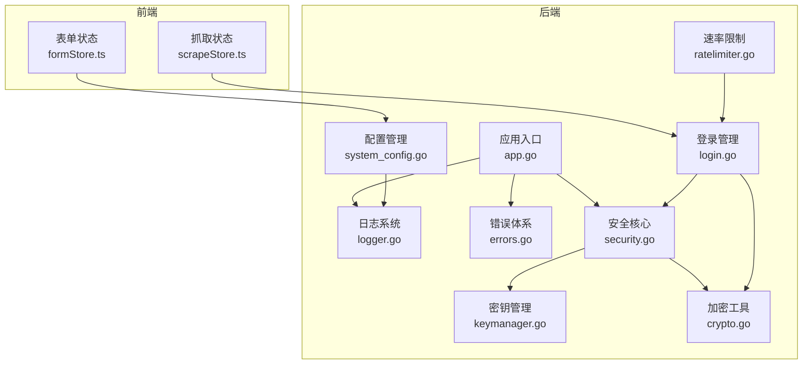
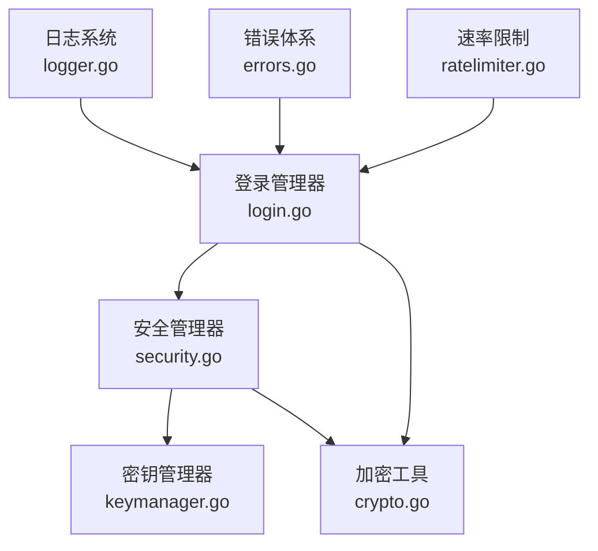
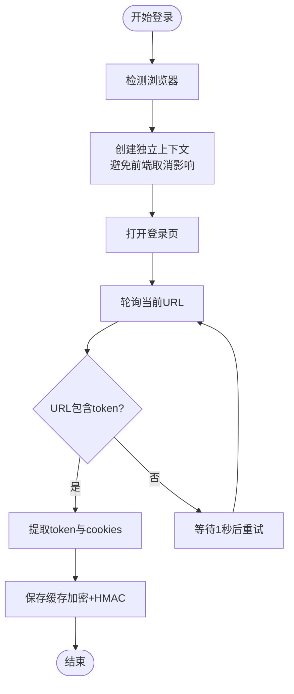
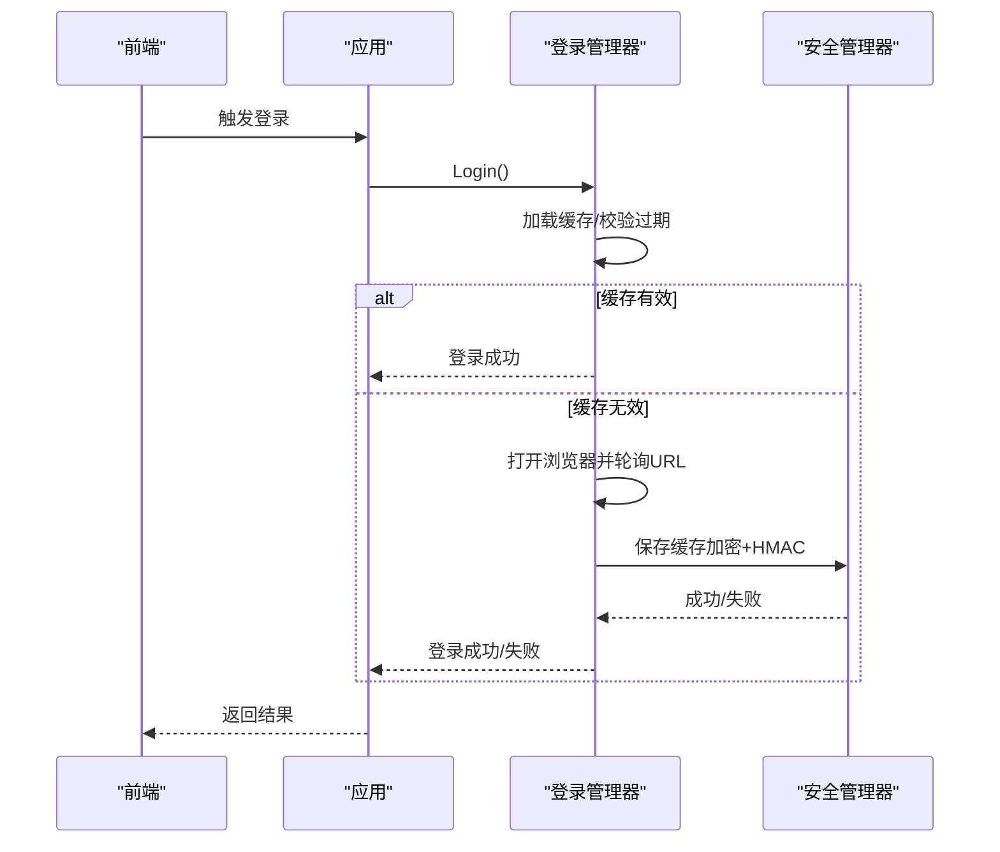
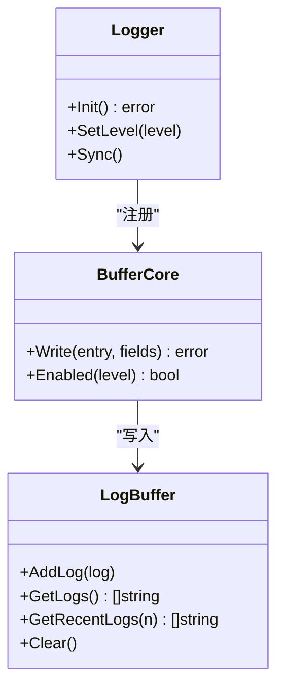
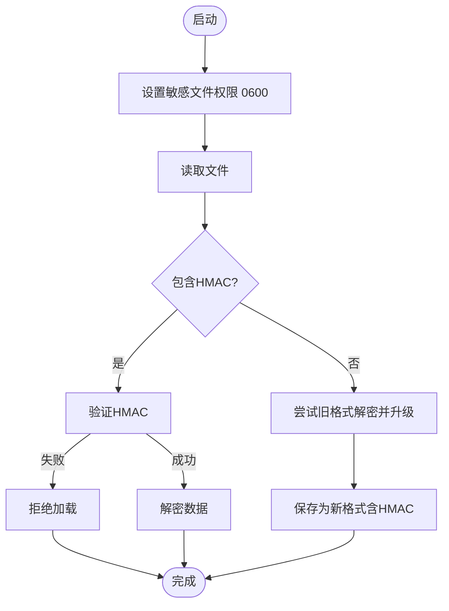
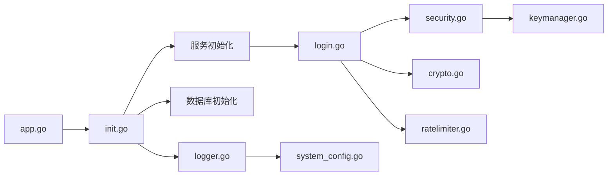

# 安全实践

<cite>
**本文引用的文件**
- [SECURITY.md](file://SECURITY.md)
- [logger.go](file://backend/pkg/logger/logger.go)
- [buffer.go](file://backend/pkg/logger/buffer.go)
- [errors.go](file://backend/pkg/errors/errors.go)
- [security.go](file://backend/pkg/crypto/security.go)
- [keymanager.go](file://backend/pkg/crypto/keymanager.go)
- [crypto.go](file://backend/pkg/crypto/crypto.go)
- [login.go](file://backend/internal/spider/login.go)
- [app.go](file://backend/app/app.go)
- [init.go](file://backend/app/init.go)
- [ratelimiter.go](file://backend/pkg/utils/ratelimiter.go)
- [system_config.go](file://backend/internal/config/system_config.go)
- [formStore.ts](file://frontend/src/stores/formStore.ts)
- [scrapeStore.ts](file://frontend/src/stores/scrapeStore.ts)
</cite>

## 目录
1. [引言](#引言)
2. [项目结构](#项目结构)
3. [核心组件](#核心组件)
4. [架构总览](#架构总览)
5. [详细组件分析](#详细组件分析)
6. [依赖关系分析](#依赖关系分析)
7. [性能考量](#性能考量)
8. [故障排查指南](#故障排查指南)
9. [结论](#结论)
10. [附录](#附录)

## 引言
本文件面向 WeMediaSpider 的安全实践，围绕输入验证、错误处理、日志系统、缓冲区与内存安全、安全编码规范、安全审计与合规、以及安全事件响应等方面，结合代码库中的实现进行系统化梳理与指导。目标是帮助开发者与运维人员建立统一的安全基线，降低敏感数据泄露与攻击面风险。

## 项目结构
WeMediaSpider 的安全相关能力主要分布在以下层次：
- 后端安全核心：加密与完整性校验、密钥管理、登录凭证安全存储与导入导出
- 日志系统：多路输出、内存缓冲、日志轮转、运行时级别控制
- 错误体系：结构化错误封装、错误传播与屏蔽
- 输入与配置：前端表单状态与后端配置的敏感字段处理
- 运行时防护：速率限制、上下文隔离、超时控制

**图表来源**
- [app.go:52-83](file://backend/app/app.go#L52-L83)
- [logger.go:18-84](file://backend/pkg/logger/logger.go#L18-L84)
- [errors.go:27-41](file://backend/pkg/errors/errors.go#L27-L41)
- [security.go:12-36](file://backend/pkg/crypto/security.go#L12-L36)
- [keymanager.go:19-55](file://backend/pkg/crypto/keymanager.go#L19-L55)
- [crypto.go:20-32](file://backend/pkg/crypto/crypto.go#L20-L32)
- [login.go:23-56](file://backend/internal/spider/login.go#L23-L56)
- [system_config.go:20-40](file://backend/internal/config/system_config.go#L20-L40)
- [ratelimiter.go:12-39](file://backend/pkg/utils/ratelimiter.go#L12-L39)
- [formStore.ts:50-112](file://frontend/src/stores/formStore.ts#L50-L112)
- [scrapeStore.ts:19-64](file://frontend/src/stores/scrapeStore.ts#L19-L64)

**章节来源**
- [app.go:52-83](file://backend/app/app.go#L52-L83)
- [logger.go:18-84](file://backend/pkg/logger/logger.go#L18-L84)
- [security.go:12-36](file://backend/pkg/crypto/security.go#L12-L36)
- [login.go:23-56](file://backend/internal/spider/login.go#L23-L56)
- [system_config.go:20-40](file://backend/internal/config/system_config.go#L20-L40)
- [ratelimiter.go:12-39](file://backend/pkg/utils/ratelimiter.go#L12-L39)
- [formStore.ts:50-112](file://frontend/src/stores/formStore.ts#L50-L112)
- [scrapeStore.ts:19-64](file://frontend/src/stores/scrapeStore.ts#L19-L64)

## 核心组件
- 安全管理器与密钥管理：负责敏感文件权限设置、HMAC 完整性校验、加密/解密与密钥派生
- 登录管理器：封装登录状态、凭证缓存、导入导出、过期控制
- 日志系统：多核输出（控制台/内存缓冲/文件）、运行时级别切换、日志轮转
- 错误体系：结构化错误封装，支持错误穿透与屏蔽
- 速率限制：串行化请求、随机抖动、失败自适应退避
- 配置与前端状态：系统配置明文存储、前端表单状态本地持久化与敏感字段排除

**章节来源**
- [security.go:38-63](file://backend/pkg/crypto/security.go#L38-L63)
- [keymanager.go:57-63](file://backend/pkg/crypto/keymanager.go#L57-L63)
- [login.go:284-315](file://backend/internal/spider/login.go#L284-L315)
- [logger.go:18-84](file://backend/pkg/logger/logger.go#L18-L84)
- [errors.go:27-41](file://backend/pkg/errors/errors.go#L27-L41)
- [ratelimiter.go:41-65](file://backend/pkg/utils/ratelimiter.go#L41-L65)
- [system_config.go:82-107](file://backend/internal/config/system_config.go#L82-L107)
- [formStore.ts:94-110](file://frontend/src/stores/formStore.ts#L94-L110)

## 架构总览
WeMediaSpider 的安全架构以“文件加密 + HMAC 完整性 + 密钥派生 + 权限控制”为核心，配合日志系统与错误体系形成闭环。前端通过表单状态与抓取状态管理输入与中间结果，后端通过速率限制与上下文隔离降低滥用风险。

**图表来源**
- [security.go:12-36](file://backend/pkg/crypto/security.go#L12-L36)
- [keymanager.go:19-55](file://backend/pkg/crypto/keymanager.go#L19-L55)
- [crypto.go:134-195](file://backend/pkg/crypto/crypto.go#L134-L195)
- [login.go:23-56](file://backend/internal/spider/login.go#L23-L56)
- [logger.go:18-84](file://backend/pkg/logger/logger.go#L18-L84)
- [errors.go:27-41](file://backend/pkg/errors/errors.go#L27-L41)
- [ratelimiter.go:12-39](file://backend/pkg/utils/ratelimiter.go#L12-L39)

## 详细组件分析

### 输入验证与参数过滤
- 登录状态提取与 URL 解析：登录流程中对 URL 中 token 参数进行简单解析，采用字符串定位与截断，避免复杂正则带来的性能与安全风险；同时对浏览器上下文错误进行区分处理，防止因浏览器关闭导致的误判。
- 表单状态与敏感字段：前端表单状态本地持久化时明确排除敏感字段（如公众号列表），仅持久化非敏感配置项，降低本地持久化泄露面。
- 配置文件：系统配置为明文 JSON，不包含敏感信息，写入权限为 0644，避免无意中暴露敏感数据。

**图表来源**
- [login.go:58-215](file://backend/internal/spider/login.go#L58-L215)

**章节来源**
- [login.go:217-251](file://backend/internal/spider/login.go#L217-L251)
- [login.go:253-282](file://backend/internal/spider/login.go#L253-L282)
- [formStore.ts:94-110](file://frontend/src/stores/formStore.ts#L94-L110)
- [system_config.go:82-107](file://backend/internal/config/system_config.go#L82-L107)

### 类型检查与长度限制
- 登录凭证导入：对导入数据进行长度校验（至少包含 HMAC 长度），避免短小异常数据导致后续解析失败。
- 缓冲区大小：日志内存缓冲区大小可配置，默认容量为 1000 条，避免无限增长造成内存压力。
- 速率限制区间：最小/最大请求间隔参数进行边界校验，确保首次请求无需等待，且最大值不低于最小值。

**章节来源**
- [login.go:547-556](file://backend/internal/spider/login.go#L547-L556)
- [buffer.go:18-23](file://backend/pkg/logger/buffer.go#L18-L23)
- [ratelimiter.go:26-39](file://backend/pkg/utils/ratelimiter.go#L26-L39)

### 错误处理与异常传播
- 结构化错误：使用结构化错误封装，支持 errors.Is/As 穿透，便于上层统一处理与分类。
- 错误消息控制：错误消息不直接暴露内部细节，避免敏感信息泄露；同时通过日志记录详细错误上下文。
- 异常传播防护：登录流程中对浏览器上下文错误进行区分，避免将浏览器关闭等用户行为误判为系统错误。

**图表来源**
- [login.go:58-215](file://backend/internal/spider/login.go#L58-L215)
- [security.go:87-115](file://backend/pkg/crypto/security.go#L87-L115)

**章节来源**
- [errors.go:27-41](file://backend/pkg/errors/errors.go#L27-L41)
- [login.go:130-192](file://backend/internal/spider/login.go#L130-L192)

### 日志系统的安全配置
- 多路输出：控制台输出、内存缓冲、文件输出三路并行，确保在文件不可用时仍可输出到控制台与内存缓冲。
- 日志轮转：基于 lumberjack 的日志轮转，单文件最大 10MB，保留 5 个备份，保留期 30 天，启用压缩与本地时间。
- 运行时级别：支持动态调整日志级别（debug/info/warn/error），便于在生产环境降噪与在调试阶段增强可观测性。
- 敏感数据过滤：日志内容为结构化字段，未见直接输出敏感字段；内存缓冲区为纯文本日志条目，建议在前端查看时避免泄露。

**图表来源**
- [logger.go:18-84](file://backend/pkg/logger/logger.go#L18-L84)
- [buffer.go:61-97](file://backend/pkg/logger/buffer.go#L61-L97)

**章节来源**
- [logger.go:18-84](file://backend/pkg/logger/logger.go#L18-L84)
- [buffer.go:18-57](file://backend/pkg/logger/buffer.go#L18-L57)

### 缓冲区管理与内存安全
- 内存缓冲：采用环形缓冲区，上限可配置，避免无限增长；并发安全通过读写锁保护。
- 日志刷新：程序退出前调用 Sync，确保缓冲区内容落盘。
- 速率限制：串行化请求，避免并发竞争导致的资源争用与异常放大。

**章节来源**
- [buffer.go:18-57](file://backend/pkg/logger/buffer.go#L18-L57)
- [logger.go:103-108](file://backend/pkg/logger/logger.go#L103-L108)
- [ratelimiter.go:41-65](file://backend/pkg/utils/ratelimiter.go#L41-L65)

### 安全编码规范与常见漏洞防范
- 敏感数据加密存储：登录缓存、数据库文件等使用 AES-256-GCM 加密，并在文件末尾附加 HMAC，防止篡改。
- 密钥管理：主密钥不直接存储，使用 PBKDF2 派生；密钥文件权限严格限制为 0600。
- 文件权限控制：应用启动时自动修复敏感文件权限。
- 向后兼容：支持从明文、旧加密格式自动升级至新格式，升级过程记录日志。
- 完整性校验：所有敏感文件读取均进行 HMAC 验证，失败即拒绝加载。
- 密钥轮换：提供密钥重新生成接口，使旧凭证失效，需重新登录。

**图表来源**
- [security.go:38-63](file://backend/pkg/crypto/security.go#L38-L63)
- [security.go:117-154](file://backend/pkg/crypto/security.go#L117-L154)
- [login.go:317-414](file://backend/internal/spider/login.go#L317-L414)

**章节来源**
- [SECURITY.md:81-170](file://SECURITY.md#L81-L170)
- [security.go:38-63](file://backend/pkg/crypto/security.go#L38-L63)
- [login.go:317-414](file://backend/internal/spider/login.go#L317-L414)

### 安全审计与合规
- 审计范围：密钥生成/加载、文件加密/解密、HMAC 验证、格式升级、权限变更。
- 建议措施：定期检查日志、监控 HMAC 验证失败事件、检查文件权限、验证主密钥文件完整性。
- 合规性：符合 OWASP、NIST、PCI DSS、GDPR 等标准要求。

**章节来源**
- [SECURITY.md:208-236](file://SECURITY.md#L208-L236)

### 安全事件响应与应急处理
- 发现安全问题：通过安全文档提供的渠道上报，避免公开披露。
- 应急处置：触发密钥轮换，使旧凭证失效，要求用户重新登录；检查并修复权限与完整性校验异常。

**章节来源**
- [SECURITY.md:252-260](file://SECURITY.md#L252-L260)
- [keymanager.go:136-145](file://backend/pkg/crypto/keymanager.go#L136-L145)

## 依赖关系分析
- 应用入口初始化日志系统，随后初始化数据库、服务与托盘管理器，确保日志可用性贯穿整个生命周期。
- 登录管理器依赖安全管理器与加密工具，负责凭证的加密存储、导入导出与过期控制。
- 日志系统与错误体系为各模块提供统一的可观测性与错误处理能力。
- 速率限制器与登录流程结合，降低 API 调用频率与被封禁风险。

**图表来源**
- [app.go:52-83](file://backend/app/app.go#L52-L83)
- [init.go:43-134](file://backend/app/init.go#L43-L134)
- [login.go:23-56](file://backend/internal/spider/login.go#L23-L56)
- [security.go:18-36](file://backend/pkg/crypto/security.go#L18-L36)
- [keymanager.go:25-55](file://backend/pkg/crypto/keymanager.go#L25-L55)
- [crypto.go:134-195](file://backend/pkg/crypto/crypto.go#L134-L195)
- [ratelimiter.go:22-39](file://backend/pkg/utils/ratelimiter.go#L22-L39)
- [system_config.go:25-40](file://backend/internal/config/system_config.go#L25-L40)

**章节来源**
- [app.go:52-83](file://backend/app/app.go#L52-L83)
- [init.go:43-134](file://backend/app/init.go#L43-L134)

## 性能考量
- 加密与完整性校验：AES-256-GCM 与 HMAC-SHA256 为 CPU 密集型操作，建议在批量处理场景中合并写入、减少重复加密。
- 日志输出：文件轮转与内存缓冲并行，避免阻塞主线程；在高吞吐场景下适当提高缓冲上限与轮转阈值。
- 速率限制：通过串行化与随机抖动平衡请求频率，避免突发流量导致目标服务限流或封禁。

## 故障排查指南
- 登录失败：检查浏览器是否可用、URL 轮询是否超时、缓存文件权限与完整性；查看日志中浏览器上下文错误。
- 缓存读取失败：确认 HMAC 验证是否通过，必要时进行格式升级；检查密钥文件是否存在且权限为 0600。
- 日志不可写：确认用户目录可写、日志目录创建成功；若失败，系统会降级为仅控制台输出。
- 错误传播：使用 errors.Is/As 检查具体错误类型，结合日志定位根因。

**章节来源**
- [login.go:130-192](file://backend/internal/spider/login.go#L130-L192)
- [login.go:317-414](file://backend/internal/spider/login.go#L317-L414)
- [logger.go:57-84](file://backend/pkg/logger/logger.go#L57-L84)
- [errors.go:27-41](file://backend/pkg/errors/errors.go#L27-L41)

## 结论
WeMediaSpider 在安全方面建立了完善的加密存储、完整性校验、密钥管理与权限控制体系，并通过日志系统与错误体系提供可观测性与可控的错误传播。结合速率限制与上下文隔离，整体具备较强的抗滥用与抗篡改能力。建议在生产环境中持续关注日志审计、密钥轮换与权限合规，确保长期安全稳定运行。

## 附录
- 安全威胁模型：已防护的威胁包括文件窃取、篡改、权限泄露与密钥泄露；未防护的威胁包括内存转储、调试器附加与物理访问。
- 配置文件位置：Windows/Linux/macOS 下位于用户主目录下的隐藏目录，包含主密钥、登录缓存、数据库与系统配置等。

**章节来源**
- [SECURITY.md:171-206](file://SECURITY.md#L171-L206)