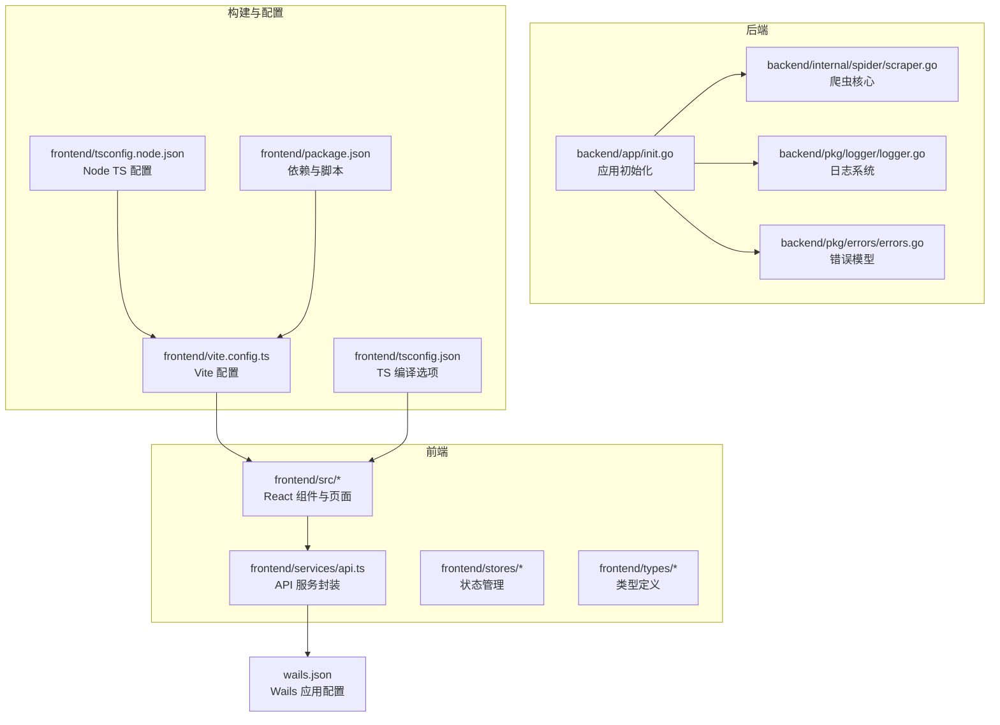
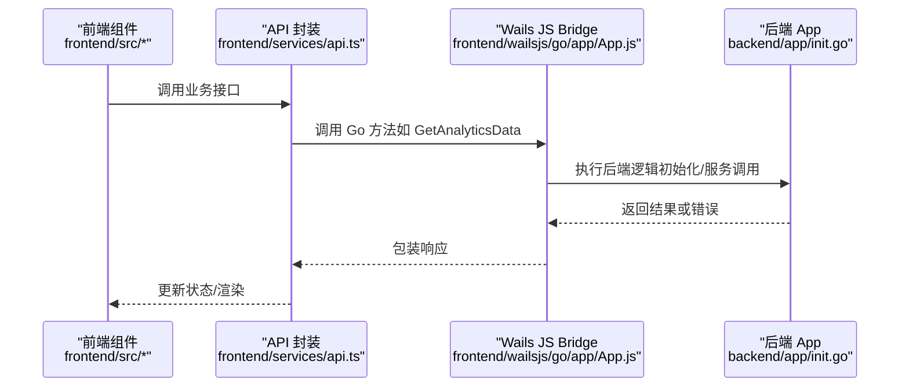
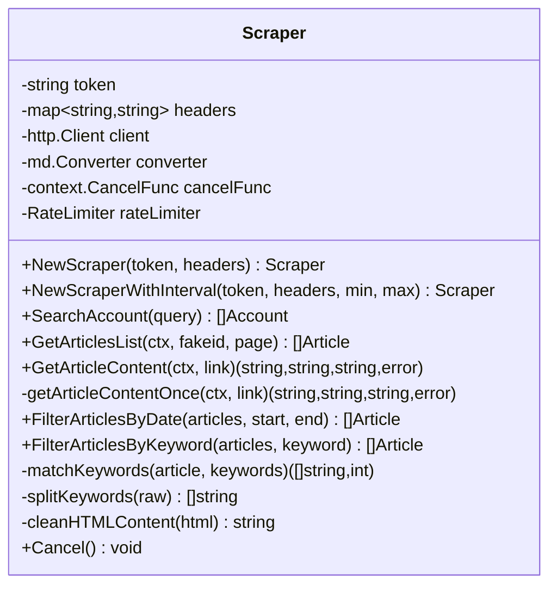
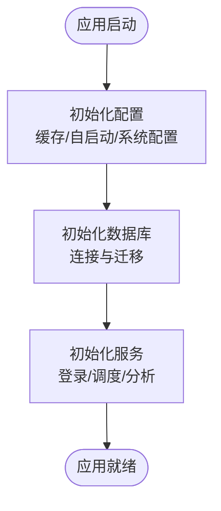
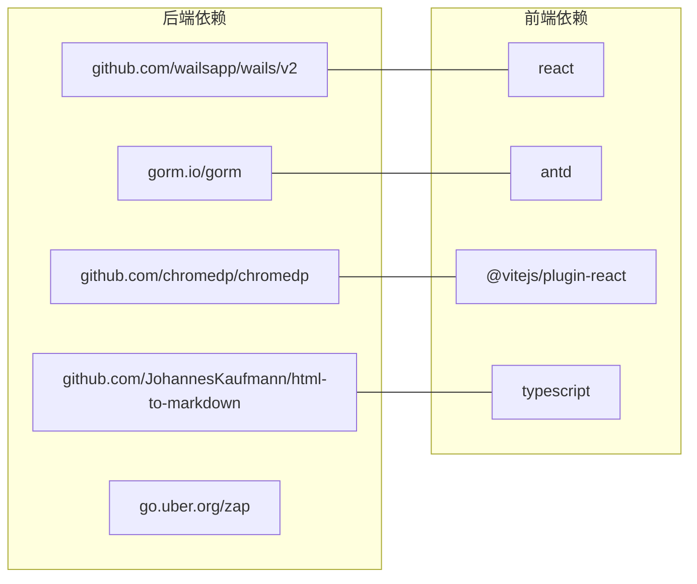

# 代码质量与规范

<cite>
**本文引用的文件**
- [README.md](file://README.md)
- [go.mod](file://go.mod)
- [frontend/package.json](file://frontend/package.json)
- [frontend/tsconfig.json](file://frontend/tsconfig.json)
- [frontend/tsconfig.node.json](file://frontend/tsconfig.node.json)
- [frontend/vite.config.ts](file://frontend/vite.config.ts)
- [backend/app/init.go](file://backend/app/init.go)
- [backend/internal/spider/scraper.go](file://backend/internal/spider/scraper.go)
- [backend/pkg/logger/logger.go](file://backend/pkg/logger/logger.go)
- [backend/pkg/errors/errors.go](file://backend/pkg/errors/errors.go)
- [frontend/wailsjs/go/app/App.js](file://frontend/wailsjs/go/app/App.js)
</cite>

## 目录
1. [引言](#引言)
2. [项目结构](#项目结构)
3. [核心组件](#核心组件)
4. [架构总览](#架构总览)
5. [详细组件分析](#详细组件分析)
6. [依赖分析](#依赖分析)
7. [性能考虑](#性能考虑)
8. [故障排查指南](#故障排查指南)
9. [结论](#结论)
10. [附录](#附录)

## 引言
本指南面向 WeMediaSpider 项目的开发者，旨在建立统一的代码质量与开发规范，覆盖 Go 后端与 TypeScript 前端两部分。内容包括代码风格、注释与文档标准、静态分析工具配置、代码审查流程与合并要求、重构策略与时机、以及代码质量度量与持续改进方法。目标是提升可维护性、可读性与稳定性，降低技术债。

## 项目结构
WeMediaSpider 采用前后端分离架构：后端基于 Go + Wails v2，前端基于 React + TypeScript + Vite。整体目录组织清晰，便于分层治理与独立演进。

图示来源
- [backend/app/init.go:1-135](file://backend/app/init.go#L1-L135)
- [backend/internal/spider/scraper.go:1-541](file://backend/internal/spider/scraper.go#L1-L541)
- [backend/pkg/logger/logger.go:1-109](file://backend/pkg/logger/logger.go#L1-L109)
- [backend/pkg/errors/errors.go:1-41](file://backend/pkg/errors/errors.go#L1-L41)
- [frontend/vite.config.ts:1-8](file://frontend/vite.config.ts#L1-L8)
- [frontend/tsconfig.json:1-32](file://frontend/tsconfig.json#L1-L32)
- [frontend/tsconfig.node.json:1-11](file://frontend/tsconfig.node.json#L1-L11)
- [frontend/package.json:1-30](file://frontend/package.json#L1-L30)

章节来源
- [README.md:86-103](file://README.md#L86-L103)
- [go.mod:1-85](file://go.mod#L1-L85)
- [frontend/package.json:1-30](file://frontend/package.json#L1-L30)

## 核心组件
- 应用初始化与依赖注入：负责缓存、自启动、系统配置、数据库、服务等模块的装配与生命周期管理。
- 爬虫核心：实现公众号搜索、文章列表获取、文章内容提取与清洗、关键词过滤、时间过滤、重试与限流等能力。
- 日志系统：控制台、内存缓冲与文件三路输出，支持动态调整日志级别与优雅关闭。
- 错误模型：统一的错误类型与包装，便于上层识别与处理。
- 前端工程化：Vite + React + TypeScript，配合 Wails JS Bridge 调用后端能力。

章节来源
- [backend/app/init.go:44-135](file://backend/app/init.go#L44-L135)
- [backend/internal/spider/scraper.go:25-541](file://backend/internal/spider/scraper.go#L25-L541)
- [backend/pkg/logger/logger.go:18-109](file://backend/pkg/logger/logger.go#L18-L109)
- [backend/pkg/errors/errors.go:27-41](file://backend/pkg/errors/errors.go#L27-L41)

## 架构总览
下图展示从前端到后端的关键交互路径，体现 Wails JS Bridge 的调用关系与数据流向。

图示来源
- [frontend/wailsjs/go/app/App.js:90-140](file://frontend/wailsjs/go/app/App.js#L90-L140)
- [backend/app/init.go:44-135](file://backend/app/init.go#L44-L135)

## 详细组件分析

### 爬虫组件（Scraper）类图

图示来源
- [backend/internal/spider/scraper.go:25-541](file://backend/internal/spider/scraper.go#L25-L541)

章节来源
- [backend/internal/spider/scraper.go:25-541](file://backend/internal/spider/scraper.go#L25-L541)

### 应用初始化流程

图示来源
- [backend/app/init.go:44-135](file://backend/app/init.go#L44-L135)

章节来源
- [backend/app/init.go:44-135](file://backend/app/init.go#L44-L135)

### 错误处理与日志
- 错误模型：定义了常用错误常量，并提供可包装的应用错误类型，支持 errors.Is/As 语义。
- 日志系统：同时输出到控制台、内存缓冲与文件，支持运行时动态调整日志级别，退出时同步缓冲。

章节来源
- [backend/pkg/errors/errors.go:27-41](file://backend/pkg/errors/errors.go#L27-L41)
- [backend/pkg/logger/logger.go:18-109](file://backend/pkg/logger/logger.go#L18-L109)

## 依赖分析
- 后端依赖：Wails v2、SQLite + GORM、ChromeDP、Markdown 转换、定时任务、日志与加密等。
- 前端依赖：React、Ant Design、ECharts、Zustand、Day.js、Vite 插件等。
- 构建与类型：Vite、TypeScript、React 插件、严格编译选项。

图示来源
- [go.mod:5-22](file://go.mod#L5-L22)
- [frontend/package.json:11-28](file://frontend/package.json#L11-L28)

章节来源
- [go.mod:1-85](file://go.mod#L1-L85)
- [frontend/package.json:1-30](file://frontend/package.json#L1-L30)

## 性能考虑
- 请求限流与退避：爬虫对第三方 API 实施速率限制与指数退避，避免触发风控与资源争用。
- 内容提取健壮性：多选择器回退、图片链接清洗、Markdown 转换与去噪，提升成功率与一致性。
- 日志分级：生产环境默认 Info 级别，必要时动态提升至 Debug，兼顾可观测性与开销。
- 数据库迁移：启动阶段自动迁移，确保模式一致性与兼容性。

章节来源
- [backend/internal/spider/scraper.go:35-69](file://backend/internal/spider/scraper.go#L35-L69)
- [backend/internal/spider/scraper.go:263-293](file://backend/internal/spider/scraper.go#L263-L293)
- [backend/pkg/logger/logger.go:87-101](file://backend/pkg/logger/logger.go#L87-L101)
- [backend/app/init.go:98-100](file://backend/app/init.go#L98-L100)

## 故障排查指南
- 日志定位：通过日志级别与上下文字段快速定位问题；必要时临时提升日志级别以捕获细节。
- 错误传播：使用统一错误类型与包装，便于前端与后端一致处理与提示。
- 爬取异常：关注重试次数、退避策略与内容选择器回退链路，结合响应体预览辅助诊断。
- Wails 调用：确认 JS Bridge 方法签名与参数顺序，避免调用失败。

章节来源
- [backend/pkg/logger/logger.go:18-109](file://backend/pkg/logger/logger.go#L18-L109)
- [backend/pkg/errors/errors.go:27-41](file://backend/pkg/errors/errors.go#L27-L41)
- [backend/internal/spider/scraper.go:295-442](file://backend/internal/spider/scraper.go#L295-L442)
- [frontend/wailsjs/go/app/App.js:90-140](file://frontend/wailsjs/go/app/App.js#L90-L140)

## 结论
本指南为 WeMediaSpider 提供了从风格、审查、静态分析到重构与度量的完整规范框架。建议在团队内推广并纳入 CI 流水线，持续优化代码质量与交付效率。

## 附录

### 代码风格与注释标准

- Go 后端
  - 命名规范：包名小写、结构体与方法首字母大写、常量与变量遵循驼峰或小写下划线组合；避免缩写，保持可读性。
  - 注释规范：包注释、导出类型/方法注释、复杂函数注释；解释意图而非实现细节；错误处理注释明确失败原因与恢复策略。
  - 结构与层次：按领域拆分 internal 子包，repository/service/controller 分层清晰；避免循环依赖。
  - 错误处理：优先返回错误，必要时包装并携带上下文；避免忽略错误。
  - 并发与资源：并发安全的数据结构与锁策略；及时关闭资源（HTTP 响应体、文件句柄）。
  - 日志：使用结构化日志，包含上下文字段；区分级别与用途。

- TypeScript 前端
  - 类型优先：为所有函数参数与返回值提供明确类型；使用联合类型与工具类型增强约束。
  - 组件设计：单一职责、可复用；Props 明确、默认值合理；事件回调类型安全。
  - 状态管理：Zustand 等方案中，状态结构清晰、更新路径可追踪。
  - 构建与配置：严格 tsconfig，启用 noImplicitAny、strict 等；Vite 插件按需开启。

- 注释与文档
  - 函数注释：说明输入、输出、副作用、错误条件与性能特征。
  - 模块注释：概述模块职责、关键类型与对外接口。
  - API 文档：结合前端调用与后端实现，形成前后端一致的契约文档。

章节来源
- [backend/internal/spider/scraper.go:25-541](file://backend/internal/spider/scraper.go#L25-L541)
- [backend/pkg/logger/logger.go:18-109](file://backend/pkg/logger/logger.go#L18-L109)
- [frontend/tsconfig.json:14-21](file://frontend/tsconfig.json#L14-L21)
- [frontend/vite.config.ts:1-8](file://frontend/vite.config.ts#L1-L8)

### 静态分析工具配置与使用

- Go
  - 推荐工具：golangci-lint（启用基本规则集）、go vet、静态检查。
  - 配置要点：排除生成文件、忽略特定路径；结合 IDE 与 CI 使用。
  - 建议规则：禁用无意义的 TODO 注释；强制错误处理；禁止导入环。

- TypeScript
  - 推荐工具：ESLint（配合 @typescript-eslint）、Prettier（格式化）。
  - 配置要点：继承推荐配置（如 airbnb-base 或 standard），定制规则；与 tsconfig 保持一致。
  - 建议规则：禁止 any；禁止未使用的变量/函数；强制类型安全。

- 前端构建
  - Vite：按需插件、严格模式、产物最小化。
  - TypeScript：严格模式、noEmit（由 Vite/TSC 负责）。

章节来源
- [go.mod:1-85](file://go.mod#L1-L85)
- [frontend/package.json:1-30](file://frontend/package.json#L1-L30)
- [frontend/tsconfig.json:14-21](file://frontend/tsconfig.json#L14-L21)
- [frontend/tsconfig.node.json:2-7](file://frontend/tsconfig.node.json#L2-L7)
- [frontend/vite.config.ts:1-8](file://frontend/vite.config.ts#L1-L8)

### 代码审查流程与合并要求

- Pull Request 审查清单
  - 功能正确性：单元测试/集成测试覆盖主要分支；边界条件与异常路径验证。
  - 代码质量：符合风格与注释标准；无长函数、无重复代码；依赖清晰。
  - 安全性：输入校验、敏感信息脱敏、日志中不泄露密钥或令牌。
  - 性能：避免阻塞操作、合理使用缓存与并发；基准测试或性能回归检查。
  - 文档：变更点补充注释与 API 文档；README 更新（如有影响）。
  - CI 通过：静态分析、测试、构建全部通过。

- 合并要求
  - 至少一名维护者批准。
  - 无未解决评论。
  - CI 与测试全部通过。
  - 代码冲突已解决。

章节来源
- [backend/internal/spider/scraper.go:263-293](file://backend/internal/spider/scraper.go#L263-L293)
- [backend/pkg/errors/errors.go:27-41](file://backend/pkg/errors/errors.go#L27-L41)

### 代码重构与重构时机

- 重构时机
  - 频繁出现相同模式（重复代码）。
  - 函数/模块职责不清、过度耦合。
  - 性能瓶颈明显且可定位。
  - 新需求与旧实现难以兼容。
  - 团队成员理解成本过高。

- 重构策略
  - 小步快跑：每次只改一处，保证测试通过。
  - 保留行为不变：通过测试保障功能一致性。
  - 渐进式替换：先加适配层，再逐步替换旧实现。
  - 文档与注释同步更新。

章节来源
- [backend/internal/spider/scraper.go:444-461](file://backend/internal/spider/scraper.go#L444-L461)
- [backend/app/init.go:44-135](file://backend/app/init.go#L44-L135)

### 代码质量度量指标与持续改进

- 度量指标
  - 代码覆盖率：单元测试与集成测试覆盖率目标（例如 >80%）。
  - 复杂度：圈复杂度阈值（如 >10 的函数需拆分）。
  - 规范检查：golangci-lint/ESLint 规则通过率。
  - 错误率：运行时错误与告警趋势。
  - 构建时间：Vite 构建时间与产物体积。

- 持续改进
  - 将静态分析与测试纳入 CI；失败即阻断。
  - 定期回顾与评审，沉淀最佳实践。
  - 对高风险模块进行专项重构与文档化。

章节来源
- [backend/pkg/logger/logger.go:87-109](file://backend/pkg/logger/logger.go#L87-L109)
- [frontend/tsconfig.json:14-21](file://frontend/tsconfig.json#L14-L21)