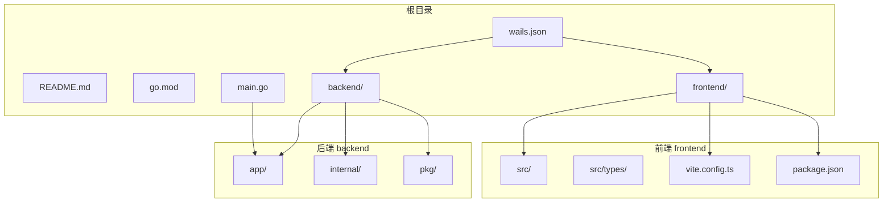
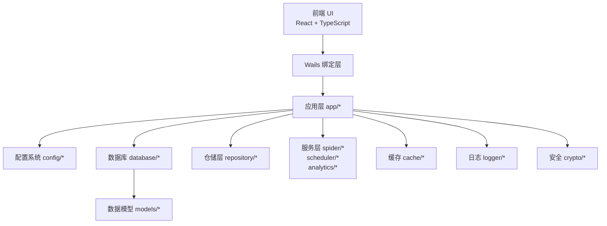
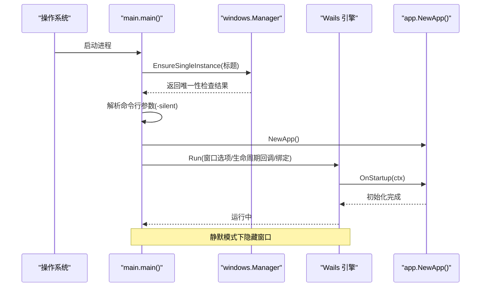
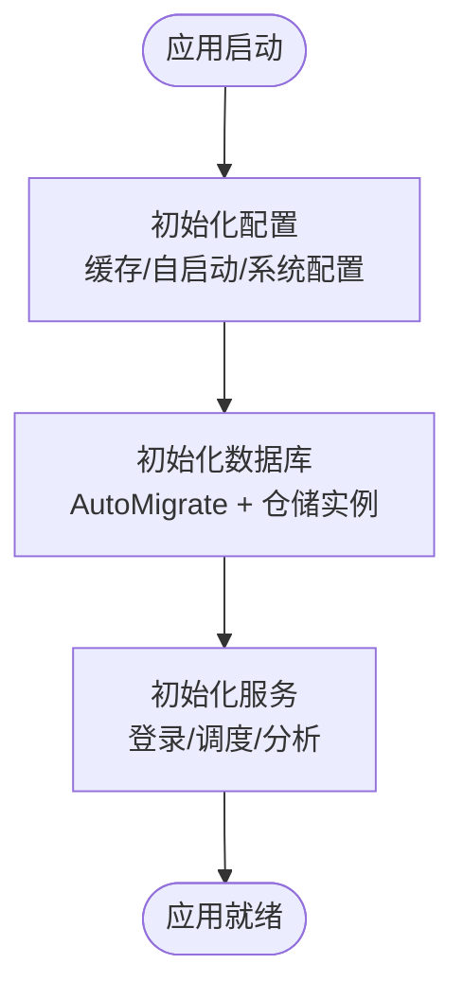
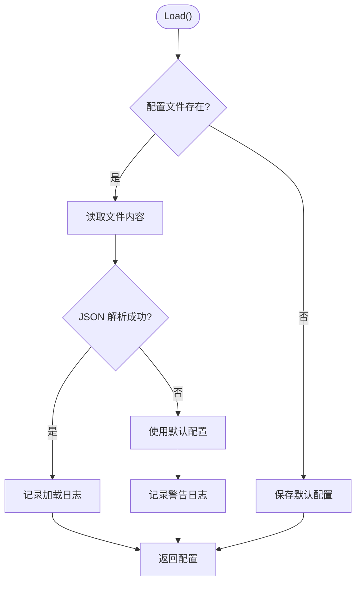
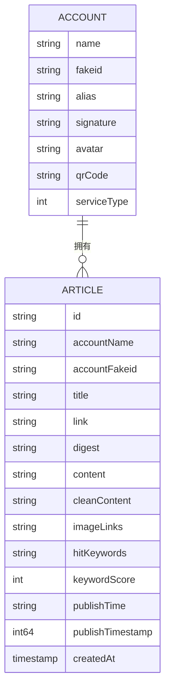
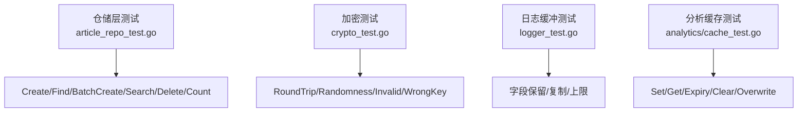
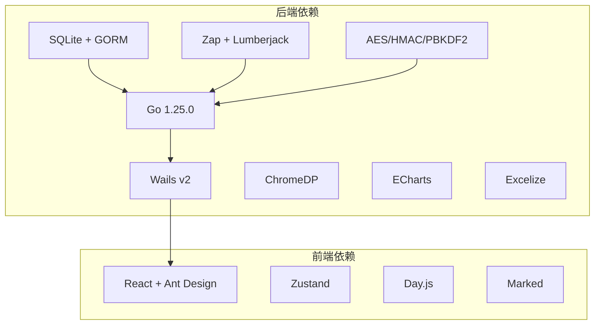

# 开发指南

<cite>
**本文引用的文件**
- [README.md](file://README.md)
- [go.mod](file://go.mod)
- [main.go](file://main.go)
- [wails.json](file://wails.json)
- [frontend/package.json](file://frontend/package.json)
- [backend/app/init.go](file://backend/app/init.go)
- [backend/internal/config/system_config.go](file://backend/internal/config/system_config.go)
- [backend/internal/models/account.go](file://backend/internal/models/account.go)
- [backend/internal/models/article.go](file://backend/internal/models/article.go)
- [backend/internal/repository/article_repo_test.go](file://backend/internal/repository/article_repo_test.go)
- [backend/pkg/crypto/crypto_test.go](file://backend/pkg/crypto/crypto_test.go)
- [backend/pkg/logger/logger_test.go](file://backend/pkg/logger/logger_test.go)
- [backend/internal/analytics/cache_test.go](file://backend/internal/analytics/cache_test.go)
- [frontend/src/types/index.ts](file://frontend/src/types/index.ts)
- [frontend/vite.config.ts](file://frontend/vite.config.ts)
</cite>

## 目录
1. [简介](#简介)
2. [项目结构](#项目结构)
3. [核心组件](#核心组件)
4. [架构总览](#架构总览)
5. [详细组件分析](#详细组件分析)
6. [依赖分析](#依赖分析)
7. [性能考虑](#性能考虑)
8. [故障排查指南](#故障排查指南)
9. [结论](#结论)
10. [附录](#附录)

## 简介
本指南面向 WeMediaSpider 的开发者与贡献者，提供从环境搭建、开发与构建模式、代码结构与规范、测试策略、调试与性能分析、代码审查与质量保障，到版本管理与发布的完整开发手册。项目采用 Go + Wails v2 作为后端，React + TypeScript 作为前端，结合 SQLite + GORM 实现数据持久化，并内置安全加密与智能缓存机制。

## 项目结构
项目采用前后端分离的模块化组织方式：
- 后端 backend：Go 应用，包含应用入口、业务模块、内部包与公共包
- 前端 frontend：React + TypeScript 应用，通过 Wails 与后端交互
- 根目录配置：Wails 配置、Go 模块声明、版本信息等

图示来源
- [README.md:86-103](file://README.md#L86-L103)
- [wails.json:1-29](file://wails.json#L1-L29)
- [frontend/package.json:1-30](file://frontend/package.json#L1-L30)
- [go.mod:1-85](file://go.mod#L1-L85)

章节来源
- [README.md:86-103](file://README.md#L86-L103)
- [wails.json:1-29](file://wails.json#L1-L29)
- [frontend/package.json:1-30](file://frontend/package.json#L1-L30)
- [go.mod:1-85](file://go.mod#L1-L85)

## 核心组件
- 应用入口与窗口管理：负责单实例控制、窗口尺寸计算、静默启动、生命周期回调绑定
- 应用初始化：按顺序初始化缓存、自启动、系统配置、数据库、仓储层与服务层
- 系统配置：提供系统配置的加载与保存，确保用户偏好持久化
- 数据模型：定义账号、文章、分析等核心数据结构
- 测试体系：覆盖仓储层、加密、日志缓冲、分析缓存等关键模块

章节来源
- [main.go:23-91](file://main.go#L23-L91)
- [backend/app/init.go:43-135](file://backend/app/init.go#L43-L135)
- [backend/internal/config/system_config.go:13-108](file://backend/internal/config/system_config.go#L13-L108)
- [backend/internal/models/account.go:1-19](file://backend/internal/models/account.go#L1-L19)
- [backend/internal/models/article.go:1-36](file://backend/internal/models/article.go#L1-L36)

## 架构总览
WeMediaSpider 采用桌面应用架构，前端通过 Wails 与后端进行双向绑定调用。后端以模块化方式组织，包含数据库、仓储层、爬虫服务、调度器、分析器与缓存等子系统；前端提供页面与组件，统一通过服务层暴露接口给前端使用。

图示来源
- [main.go:52-84](file://main.go#L52-L84)
- [backend/app/init.go:44-134](file://backend/app/init.go#L44-L134)

## 详细组件分析

### 应用入口与窗口管理
- 单实例控制：防止重复启动
- 命令行参数：支持静默启动（隐藏窗口）
- 窗口尺寸：根据屏幕分辨率动态计算
- 生命周期：启动时初始化应用，关闭前阻断策略由应用层决定
- 绑定：将应用实例绑定到 Wails，供前端直接调用

图示来源
- [main.go:33-84](file://main.go#L33-L84)

章节来源
- [main.go:23-91](file://main.go#L23-L91)

### 应用初始化流程
- 初始化配置：缓存管理器、自启动管理器、系统配置管理器
- 初始化数据库：自动迁移、创建仓储实例
- 初始化服务：登录管理器、任务调度器、计划任务管理器、分析器

图示来源
- [backend/app/init.go:44-134](file://backend/app/init.go#L44-L134)

章节来源
- [backend/app/init.go:43-135](file://backend/app/init.go#L43-L135)

### 系统配置管理
- 路径：用户主目录下的隐藏目录，配置文件名为固定名称
- 行为：若文件不存在则写入默认值；读取失败或解析失败回退默认值
- 字段：关闭到托盘、记住选择、忽略更新日期

图示来源
- [backend/internal/config/system_config.go:42-80](file://backend/internal/config/system_config.go#L42-L80)

章节来源
- [backend/internal/config/system_config.go:13-108](file://backend/internal/config/system_config.go#L13-L108)

### 数据模型
- 账号模型：包含名称、fakeid、别名、签名、头像、二维码、服务类型等字段
- 文章模型：包含标识、公众号信息、标题、链接、摘要、正文（Markdown）、纯净正文、图片链接、命中关键词、关键词分数、发布时间与时间戳、创建时间等
- 过滤条件：支持按公众号名称、关键词、起止日期过滤

图示来源
- [backend/internal/models/account.go:3-18](file://backend/internal/models/account.go#L3-L18)
- [backend/internal/models/article.go:5-35](file://backend/internal/models/article.go#L5-L35)

章节来源
- [backend/internal/models/account.go:1-19](file://backend/internal/models/account.go#L1-L19)
- [backend/internal/models/article.go:1-36](file://backend/internal/models/article.go#L1-L36)

### 测试策略与最佳实践
- 单元测试：针对关键模块编写单元测试，覆盖正常路径、边界条件与异常路径
- 集成测试：通过内存数据库验证仓储层的增删改查与批量操作
- 测试工具：使用 Go 内置 testing 包与 GORM 内存数据库
- 日志缓冲测试：验证缓冲区大小限制与字段保留
- 加密测试：验证加解密往返、随机性、错误密码与非法输入处理
- 分析缓存测试：验证缓存设置、过期、清理与覆盖行为

图示来源
- [backend/internal/repository/article_repo_test.go:29-151](file://backend/internal/repository/article_repo_test.go#L29-L151)
- [backend/pkg/crypto/crypto_test.go:8-132](file://backend/pkg/crypto/crypto_test.go#L8-L132)
- [backend/pkg/logger/logger_test.go:11-54](file://backend/pkg/logger/logger_test.go#L11-L54)
- [backend/internal/analytics/cache_test.go:10-89](file://backend/internal/analytics/cache_test.go#L10-L89)

章节来源
- [backend/internal/repository/article_repo_test.go:1-151](file://backend/internal/repository/article_repo_test.go#L1-L151)
- [backend/pkg/crypto/crypto_test.go:1-132](file://backend/pkg/crypto/crypto_test.go#L1-L132)
- [backend/pkg/logger/logger_test.go:1-54](file://backend/pkg/logger/logger_test.go#L1-L54)
- [backend/internal/analytics/cache_test.go:1-89](file://backend/internal/analytics/cache_test.go#L1-L89)

### 前端类型与构建
- 类型导出：统一从 index.ts 导出各模块类型，便于前端引用
- 构建配置：Vite + React 插件，开发与生产构建脚本在 package.json 中定义
- 依赖：React、Ant Design、ECharts、Day.js、Marked 等

章节来源
- [frontend/src/types/index.ts:1-7](file://frontend/src/types/index.ts#L1-L7)
- [frontend/vite.config.ts:1-8](file://frontend/vite.config.ts#L1-L8)
- [frontend/package.json:1-30](file://frontend/package.json#L1-L30)

## 依赖分析
- 后端依赖：Wails v2、SQLite + GORM、ChromeDP、ECharts、Excelize、Zap、Lumberjack、PBKDF2、AES/HMAC 等
- 前端依赖：React、Ant Design、Zustand、Day.js、Marked、ECharts 等
- 版本与平台：Go 1.25.0，Node.js 16+，Wails CLI

图示来源
- [go.mod:5-22](file://go.mod#L5-L22)
- [frontend/package.json:11-28](file://frontend/package.json#L11-L28)
- [README.md:49-54](file://README.md#L49-L54)

章节来源
- [go.mod:1-85](file://go.mod#L1-L85)
- [frontend/package.json:1-30](file://frontend/package.json#L1-L30)
- [README.md:49-54](file://README.md#L49-L54)

## 性能考虑
- 智能缓存：避免重复请求，降低网络与数据库压力
- 批量操作：仓储层支持批量创建与冲突更新，减少多次写入开销
- 日志缓冲：前端日志面板通过缓冲减少频繁渲染
- 数据库索引与查询优化：合理使用过滤条件与分页，避免全表扫描
- 并发与限流：爬虫层实现异步抓取与速率限制，避免触发目标站点反爬

章节来源
- [backend/app/init.go:44-82](file://backend/app/init.go#L44-L82)
- [backend/internal/repository/article_repo_test.go:54-81](file://backend/internal/repository/article_repo_test.go#L54-L81)
- [backend/pkg/logger/logger_test.go:45-53](file://backend/pkg/logger/logger_test.go#L45-L53)

## 故障排查指南
- 启动问题
  - 单实例冲突：确认是否已有实例运行
  - 静默启动：检查 -silent 参数与托盘行为
- 数据库问题
  - 自动迁移失败：检查权限与路径，必要时手动迁移
  - 数据损坏：备份 ~/.wemediaspider 目录
- 日志定位
  - 使用日志缓冲与文件日志，结合错误码与上下文字段快速定位
- 加密问题
  - 密钥错误或格式非法：检查密钥长度与格式校验
- 前端构建
  - 依赖安装失败：确保 Node.js 16+，使用 npm ci 或重新安装
  - 开发热更新：确认 Vite 开发服务器地址与代理配置

章节来源
- [main.go:33-84](file://main.go#L33-L84)
- [backend/app/init.go:84-110](file://backend/app/init.go#L84-L110)
- [backend/pkg/logger/logger_test.go:11-32](file://backend/pkg/logger/logger_test.go#L11-L32)
- [backend/pkg/crypto/crypto_test.go:46-67](file://backend/pkg/crypto/crypto_test.go#L46-L67)
- [frontend/package.json:6-10](file://frontend/package.json#L6-L10)
- [frontend/vite.config.ts:5-7](file://frontend/vite.config.ts#L5-L7)

## 结论
本开发指南提供了 WeMediaSpider 的完整开发与维护路径。遵循模块化设计、完善的测试体系与日志安全机制，可在保证稳定性的同时提升开发效率。建议在提交代码前完成本地测试与静态检查，并通过 CI 流程进行自动化验证。

## 附录

### 开发环境搭建
- 环境要求
  - Go 1.25.0+
  - Node.js 16+
  - Wails CLI
- 依赖安装
  - 后端：go mod tidy
  - 前端：npm install
- 配置设置
  - Wails 配置：wails.json 中定义产品信息、安装模式与 NSIS 设置
  - 系统配置：系统配置文件位于用户主目录的隐藏目录中

章节来源
- [README.md:49-54](file://README.md#L49-L54)
- [go.mod:1-85](file://go.mod#L1-L85)
- [frontend/package.json:1-30](file://frontend/package.json#L1-L30)
- [wails.json:1-29](file://wails.json#L1-L29)
- [backend/internal/config/system_config.go:25-40](file://backend/internal/config/system_config.go#L25-L40)

### 开发模式与构建模式
- 开发模式
  - 使用 wails dev 启动，前端热更新，后端通过 Wails 绑定层与前端通信
- 构建模式
  - 使用 wails build 生成可执行文件，打包前端资源与后端二进制

章节来源
- [README.md:55-70](file://README.md#L55-L70)
- [wails.json:5-8](file://wails.json#L5-L8)

### 代码结构与开发规范
- 文件组织
  - 后端：按功能域划分 internal/* 与 pkg/*
  - 前端：按页面与组件划分 src/pages 与 src/components
- 命名约定
  - 结构体与字段使用驼峰命名，JSON 标签保持一致
  - 包名小写，避免复数形式
- 注释标准
  - 公共类型与方法提供简洁说明，复杂逻辑补充流程说明
- 类型导出
  - 前端统一从 index.ts 导出类型，便于集中管理

章节来源
- [backend/internal/models/account.go:3-18](file://backend/internal/models/account.go#L3-L18)
- [backend/internal/models/article.go:5-35](file://backend/internal/models/article.go#L5-L35)
- [frontend/src/types/index.ts:1-7](file://frontend/src/types/index.ts#L1-L7)

### 测试策略与最佳实践
- 单元测试
  - 使用内存数据库进行隔离测试，覆盖增删改查与批量操作
  - 对加密、日志缓冲、分析缓存分别编写针对性测试
- 集成测试
  - 通过仓储层与数据库交互验证一致性
- 测试工具
  - Go testing 包、GORM 内存驱动、Silent 日志级别

章节来源
- [backend/internal/repository/article_repo_test.go:14-27](file://backend/internal/repository/article_repo_test.go#L14-L27)
- [backend/pkg/crypto/crypto_test.go:8-27](file://backend/pkg/crypto/crypto_test.go#L8-L27)
- [backend/pkg/logger/logger_test.go:11-32](file://backend/pkg/logger/logger_test.go#L11-L32)
- [backend/internal/analytics/cache_test.go:10-28](file://backend/internal/analytics/cache_test.go#L10-L28)

### 调试技巧与性能分析
- 调试
  - 使用 Zap 输出结构化日志，结合缓冲区与文件日志定位问题
  - 前端日志面板实时查看运行状态
- 性能
  - 利用智能缓存与批量操作减少 IO
  - 合理设置查询过滤与分页，避免大结果集

章节来源
- [backend/pkg/logger/logger_test.go:11-53](file://backend/pkg/logger/logger_test.go#L11-L53)
- [backend/app/init.go:44-82](file://backend/app/init.go#L44-L82)

### 代码审查流程与质量保证
- 提交流程
  - 在本地完成单元测试与构建验证
  - 提交 PR，至少一名维护者审查
- 质量标准
  - 代码风格统一，注释清晰
  - 新增功能配套单元测试
  - 性能与安全性评估（如加密、速率限制）

章节来源
- [backend/internal/repository/article_repo_test.go:29-151](file://backend/internal/repository/article_repo_test.go#L29-L151)
- [backend/pkg/crypto/crypto_test.go:8-132](file://backend/pkg/crypto/crypto_test.go#L8-L132)
- [backend/pkg/logger/logger_test.go:11-54](file://backend/pkg/logger/logger_test.go#L11-L54)

### 贡献指南与社区参与
- 反馈渠道
  - Issues：报告缺陷与需求
  - Releases：获取稳定版本
  - Changelog：跟踪变更历史
- 社区协作
  - 遵循仓库许可协议，尊重他人贡献

章节来源
- [README.md:113-118](file://README.md#L113-L118)

### 版本管理与发布流程
- 版本信息
  - 产品版本在 wails.json 中定义
- 发布准备
  - 本地构建验证，确保前后端资源正确打包
  - 迁移工具用于数据库结构变更（如 v2.0.0 架构重构）
- 升级指引
  - 建议全新安装并运行迁移工具，备份数据目录

章节来源
- [wails.json:16](file://wails.json#L16)
- [README.md:33-45](file://README.md#L33-L45)