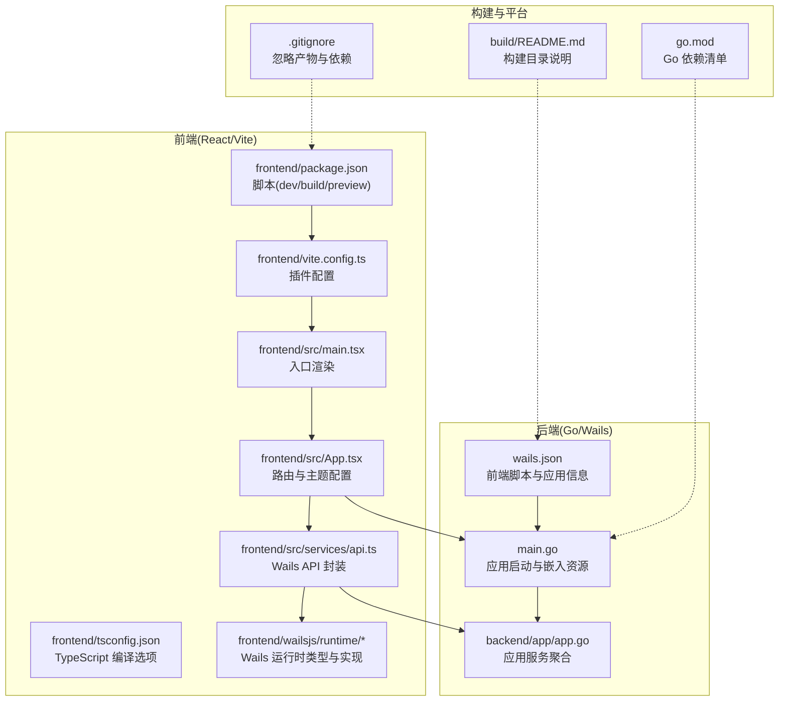
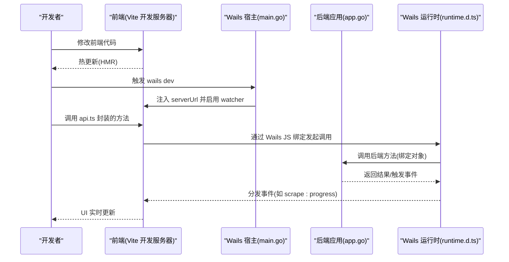
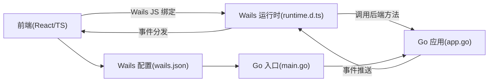

# 开发流程

<cite>
**本文引用的文件**
- [wails.json](file://wails.json)
- [main.go](file://main.go)
- [backend/app/app.go](file://backend/app/app.go)
- [frontend/package.json](file://frontend/package.json)
- [frontend/vite.config.ts](file://frontend/vite.config.ts)
- [frontend/tsconfig.json](file://frontend/tsconfig.json)
- [frontend/src/main.tsx](file://frontend/src/main.tsx)
- [frontend/src/App.tsx](file://frontend/src/App.tsx)
- [frontend/src/services/api.ts](file://frontend/src/services/api.ts)
- [frontend/wailsjs/runtime/runtime.d.ts](file://frontend/wailsjs/runtime/runtime.d.ts)
- [go.mod](file://go.mod)
- [README.md](file://README.md)
- [build/README.md](file://build/README.md)
- [.gitignore](file://.gitignore)
</cite>

## 目录
1. [简介](#简介)
2. [项目结构](#项目结构)
3. [核心组件](#核心组件)
4. [架构总览](#架构总览)
5. [详细组件分析](#详细组件分析)
6. [依赖分析](#依赖分析)
7. [性能考虑](#性能考虑)
8. [故障排查指南](#故障排查指南)
9. [结论](#结论)
10. [附录](#附录)

## 简介
本指南面向 WeMediaSpider 的开发者，系统讲解开发模式与热重载机制、前后端分离开发流程、代码修改后的编译与打包流程、开发规范与最佳实践、版本控制与分支管理策略，以及调试技巧与性能优化建议。目标是帮助团队在 Wails + Go + React 技术栈上高效协作，稳定交付高质量桌面应用。

## 项目结构
WeMediaSpider 采用前后端分离架构：前端为 React + TypeScript + Vite，后端为 Go + Wails v2，通过 Wails 的 JS 绑定桥接前后端调用。Wails 配置文件统一定义了前端安装、开发与构建脚本，以及应用元信息与平台特定设置。

图示来源
- [wails.json:1-29](file://wails.json#L1-L29)
- [main.go:1-91](file://main.go#L1-L91)
- [backend/app/app.go:1-85](file://backend/app/app.go#L1-L85)
- [frontend/package.json:1-30](file://frontend/package.json#L1-L30)
- [frontend/vite.config.ts:1-8](file://frontend/vite.config.ts#L1-L8)
- [frontend/tsconfig.json:1-32](file://frontend/tsconfig.json#L1-L32)
- [frontend/src/main.tsx:1-25](file://frontend/src/main.tsx#L1-L25)
- [frontend/src/App.tsx:1-88](file://frontend/src/App.tsx#L1-L88)
- [frontend/src/services/api.ts:1-161](file://frontend/src/services/api.ts#L1-L161)
- [frontend/wailsjs/runtime/runtime.d.ts:1-101](file://frontend/wailsjs/runtime/runtime.d.ts#L1-L101)
- [build/README.md:1-35](file://build/README.md#L1-L35)
- [.gitignore:1-3](file://.gitignore#L1-L3)
- [go.mod:1-85](file://go.mod#L1-L85)

章节来源
- [wails.json:1-29](file://wails.json#L1-L29)
- [README.md:86-103](file://README.md#L86-L103)

## 核心组件
- Wails 应用入口与资源嵌入：应用在启动时解析命令行参数、确保单实例、绑定后端服务，并通过嵌入式静态资源提供前端页面。
- 应用服务聚合：后端 app 包聚合登录、爬虫、缓存、数据库、调度、托盘等子系统，作为 Wails 绑定对象暴露给前端。
- 前端入口与路由：React 应用在 main.tsx 中挂载根节点，App.tsx 配置 Ant Design 主题与路由，api.ts 提供对后端 API 的封装与事件监听。

章节来源
- [main.go:23-90](file://main.go#L23-L90)
- [backend/app/app.go:25-83](file://backend/app/app.go#L25-L83)
- [frontend/src/main.tsx:18-25](file://frontend/src/main.tsx#L18-L25)
- [frontend/src/App.tsx:15-85](file://frontend/src/App.tsx#L15-L85)
- [frontend/src/services/api.ts:49-101](file://frontend/src/services/api.ts#L49-L101)

## 架构总览
Wails 在桌面端宿主中嵌入 Web 渲染引擎，前端通过 Wails 生成的 JS 绑定调用后端 Go 方法，同时后端可通过运行时事件向前端推送状态更新。开发模式下，前端由 Vite 提供开发服务器，Wails 自动注入 serverUrl 并启用 watcher；生产模式下，前端构建产物被打包进 Go 二进制。

图示来源
- [wails.json:5-8](file://wails.json#L5-L8)
- [frontend/src/services/api.ts:33-101](file://frontend/src/services/api.ts#L33-L101)
- [frontend/wailsjs/runtime/runtime.d.ts:35-57](file://frontend/wailsjs/runtime/runtime.d.ts#L35-L57)
- [main.go:52-84](file://main.go#L52-L84)
- [backend/app/app.go:52-83](file://backend/app/app.go#L52-L83)

## 详细组件分析

### 开发模式与热重载机制
- 启动开发模式：使用 wails dev 命令，Wails 会根据配置自动安装前端依赖、启动前端开发服务器，并将前端构建产物作为嵌入资源运行。
- 热重载机制：前端开发服务器由 Vite 提供，修改 TS/TSX 文件后自动刷新；Wails 配置中指定了前端开发脚本与 serverUrl，确保浏览器与宿主协同工作。
- 前端脚本：frontend/package.json 定义了 dev/build/preview 三个脚本，分别对应开发、构建与预览。
- Vite 插件：frontend/vite.config.ts 使用 React 插件，满足 TSX 开发需求。
- TypeScript 编译：frontend/tsconfig.json 设置严格模式与模块解析策略，保证类型安全与构建一致性。

章节来源
- [README.md:55-64](file://README.md#L55-L64)
- [wails.json:5-8](file://wails.json#L5-L8)
- [frontend/package.json:6-10](file://frontend/package.json#L6-L10)
- [frontend/vite.config.ts:5-7](file://frontend/vite.config.ts#L5-L7)
- [frontend/tsconfig.json:14-22](file://frontend/tsconfig.json#L14-L22)

### 前后端分离开发工作流
- 前端开发服务器：Vite 在本地启动开发服务器，提供快速热更新体验；Wails 通过配置将 serverUrl 设为 auto，自动注入开发服务器地址。
- 后端服务：Go 程序启动后，通过 Wails 绑定将 app 实例暴露给前端；前端通过 api.ts 封装的函数调用后端能力。
- 事件通信：后端可通过 Wails 运行时事件向前端推送进度、状态与错误信息；前端通过 events.onXxx 订阅并处理。
- 资源嵌入：开发模式下，Wails 将前端 dist 目录作为嵌入资源提供；生产模式下，dist 产物会被打包进最终二进制。

章节来源
- [wails.json:7-8](file://wails.json#L7-L8)
- [frontend/src/services/api.ts:104-160](file://frontend/src/services/api.ts#L104-L160)
- [frontend/wailsjs/runtime/runtime.d.ts:35-57](file://frontend/wailsjs/runtime/runtime.d.ts#L35-L57)
- [main.go:20-21](file://main.go#L20-L21)

### 代码修改后的编译与打包流程
- 开发构建：wails dev 会自动安装前端依赖并启动开发服务器；若需预览效果，可使用 npm run preview。
- 生产构建：wails build 会执行前端构建脚本，生成 dist 并将其嵌入到 Go 二进制中；构建产物输出路径与平台特定文件位于 build 目录。
- 平台配置：build/README.md 说明了 Windows 与 macOS 的清单、图标与安装器文件位置；可根据需要自定义这些文件。
- 忽略规则：.gitignore 指定忽略 build/bin、node_modules 与前端 dist 目录，避免将构建产物提交到版本库。

章节来源
- [README.md:66-70](file://README.md#L66-L70)
- [wails.json:5-7](file://wails.json#L5-L7)
- [build/README.md:1-35](file://build/README.md#L1-L35)
- [.gitignore:1-3](file://.gitignore#L1-L3)

### 开发规范与最佳实践
- 命名约定
  - Go 包与结构体：采用清晰语义的名词组合，如 app、repository、spider 等；字段与方法遵循大小写约定。
  - 前端组件：使用帕斯卡命名法，如 HomePage、ScrapePage；服务封装使用小驼峰，如 api.ts。
- 代码风格
  - Go：遵循 gofmt/golint 推荐风格；结构体字段按功能分组，避免过深嵌套。
  - TypeScript/React：开启严格模式，使用明确的类型声明；组件拆分保持单一职责。
- 注释标准
  - Go：为公共接口、复杂算法与关键业务流程添加注释；使用 godoc 风格。
  - 前端：为 API 封装与关键交互逻辑添加注释，说明事件名称与数据结构。
- 事件与错误处理
  - 前端订阅事件时应成对注册与注销，避免内存泄漏；对错误事件进行统一提示与日志记录。
- 依赖管理
  - Go 依赖通过 go.mod 管理；前端依赖通过 package.json 管理；避免版本冲突与重复依赖。

章节来源
- [backend/app/app.go:25-50](file://backend/app/app.go#L25-L50)
- [frontend/src/services/api.ts:49-101](file://frontend/src/services/api.ts#L49-L101)
- [frontend/tsconfig.json:14-22](file://frontend/tsconfig.json#L14-L22)
- [go.mod:1-85](file://go.mod#L1-L85)

### 版本控制与分支管理策略
- 分支模型：采用 Git Flow 或简化版分支策略，master/main 用于发布，develop 用于集成，hotfix/release 用于紧急修复与版本发布。
- 提交规范：使用清晰的提交信息，描述变更目的与影响范围；涉及破坏性变更或重大功能需在变更日志中标注。
- 发布标签：每次发布打上语义化版本标签，配合构建脚本与安装器生成。
- 平台差异：Windows 与 macOS 的安装器与清单文件位于 build 目录，发布前确认版本信息一致。

章节来源
- [build/README.md:23-35](file://build/README.md#L23-L35)
- [wails.json:16-18](file://wails.json#L16-L18)

### 调试技巧与性能优化建议
- 调试技巧
  - 前端调试：利用 Vite 的热重载与浏览器开发者工具定位样式与交互问题；关注 antd 的控制台警告并按需过滤。
  - 后端调试：在 main.go 中设置断点，检查应用启动流程与绑定对象；通过日志模块输出关键路径信息。
  - 事件调试：在前端使用 events.onXxx 订阅事件，观察 scrape:progress、scrape:status 等事件的数据流转。
- 性能优化
  - 前端：减少不必要的 re-render，合理拆分组件；对高频事件使用防抖/节流；按需加载第三方库。
  - 后端：对爬虫与图片下载操作进行并发控制与超时设置；使用缓存降低重复请求；数据库查询添加索引与分页。
  - 资源嵌入：生产构建后，确保前端 dist 产物被正确嵌入，避免额外的文件读取开销。

章节来源
- [frontend/src/main.tsx:6-16](file://frontend/src/main.tsx#L6-L16)
- [frontend/src/services/api.ts:104-160](file://frontend/src/services/api.ts#L104-L160)
- [main.go:23-31](file://main.go#L23-L31)

## 依赖分析
Wails 作为桥接层，将前端与后端紧密耦合；前端通过 Wails 生成的 JS 绑定调用后端方法；后端通过运行时事件向前端推送状态。Go 依赖通过 go.mod 管理，前端依赖通过 package.json 管理。

图示来源
- [frontend/src/services/api.ts:33-101](file://frontend/src/services/api.ts#L33-L101)
- [frontend/wailsjs/runtime/runtime.d.ts:35-57](file://frontend/wailsjs/runtime/runtime.d.ts#L35-L57)
- [backend/app/app.go:52-83](file://backend/app/app.go#L52-L83)
- [main.go:52-84](file://main.go#L52-L84)
- [wails.json:5-8](file://wails.json#L5-L8)

章节来源
- [go.mod:1-85](file://go.mod#L1-L85)
- [frontend/package.json:11-28](file://frontend/package.json#L11-L28)

## 性能考虑
- 前端性能
  - 合理使用 React 状态与副作用，避免不必要的重渲染；对高频滚动与输入事件进行节流/防抖。
  - 图表与富文本组件按需引入，减少首屏体积。
- 后端性能
  - 爬虫与图片下载并发受控，避免触发目标站点限流；数据库查询使用索引与分页，减少锁竞争。
  - 缓存命中率优先，过期清理策略定期执行。
- 构建与打包
  - 生产构建开启压缩与 Tree Shaking；确保 dist 产物最小化；平台安装器与清单文件按需定制。

## 故障排查指南
- 开发模式无法热重载
  - 检查 wails.json 中的 frontend:dev:watcher 与 frontend:dev:serverUrl 是否正确；确认前端开发服务器端口未被占用。
- 前端无法连接后端
  - 确认 api.ts 中的绑定函数与事件名称与后端一致；检查 Wails 运行时事件注册与注销是否成对出现。
- 构建失败
  - 查看 build/README.md 中平台特定文件是否缺失；确认 go.mod 与 package.json 依赖完整且版本兼容。
- 日志与异常
  - 在 main.go 中捕获全局 panic 并输出错误信息；在前端过滤无关控制台警告，聚焦关键错误提示。

章节来源
- [wails.json:5-8](file://wails.json#L5-L8)
- [frontend/src/services/api.ts:104-160](file://frontend/src/services/api.ts#L104-L160)
- [frontend/src/main.tsx:6-16](file://frontend/src/main.tsx#L6-L16)
- [build/README.md:1-35](file://build/README.md#L1-L35)
- [main.go:23-31](file://main.go#L23-L31)

## 结论
通过 Wails + Go + React 的技术栈，WeMediaSpider 实现了高效的前后端分离开发与稳定的桌面应用交付。遵循本文档的开发流程、规范与最佳实践，结合合理的版本控制与调试优化策略，团队可以持续迭代并提升开发效率与产品质量。

## 附录
- 快速参考
  - 开发模式：wails dev
  - 生产构建：wails build
  - 前端脚本：npm run dev / build / preview
  - 忽略规则：build/bin、node_modules、frontend/dist
- 平台说明：Windows 与 macOS 的安装器、清单与图标位于 build 目录，可按需定制。

章节来源
- [README.md:55-70](file://README.md#L55-L70)
- [.gitignore:1-3](file://.gitignore#L1-L3)
- [build/README.md:23-35](file://build/README.md#L23-L35)