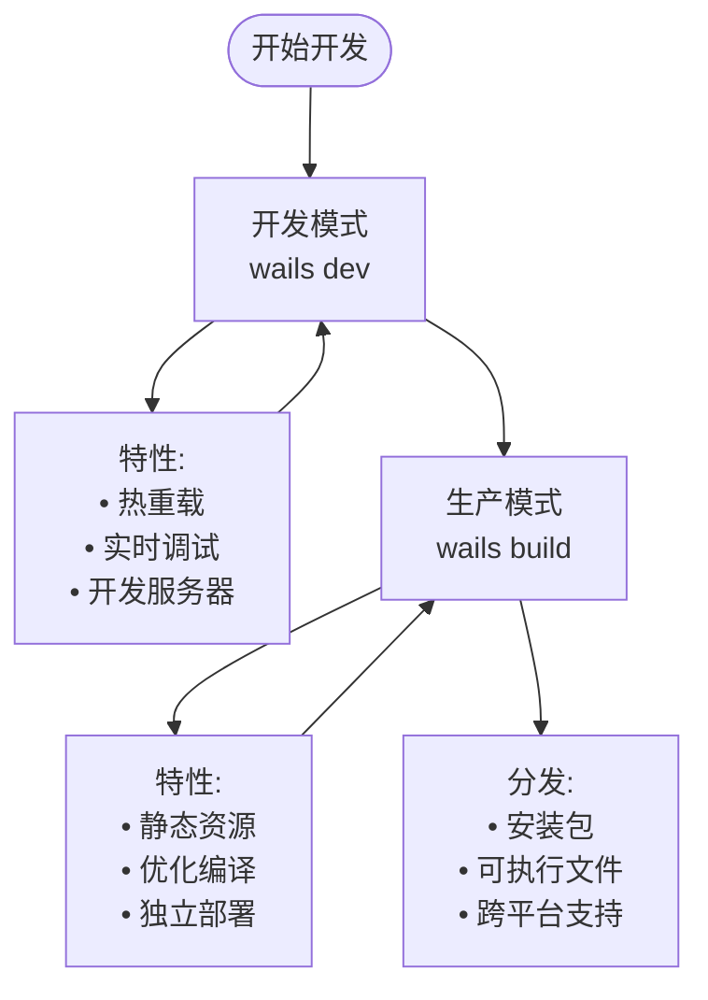
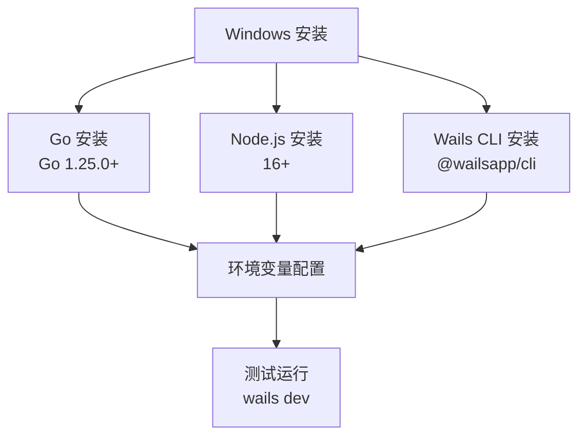
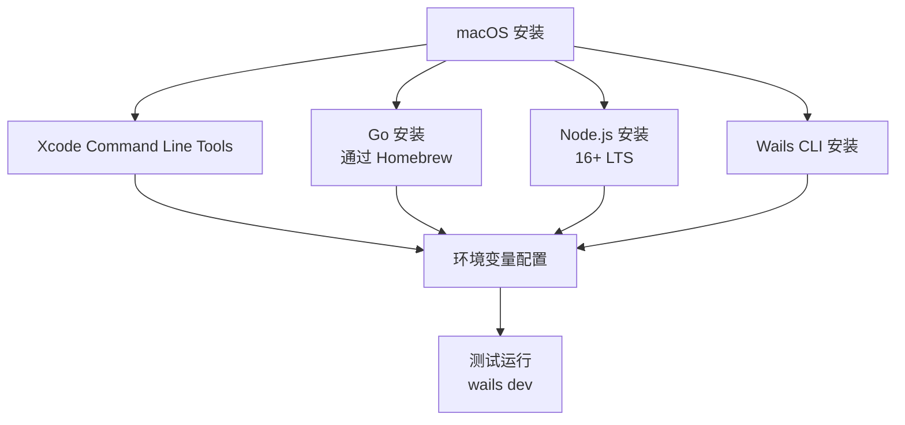
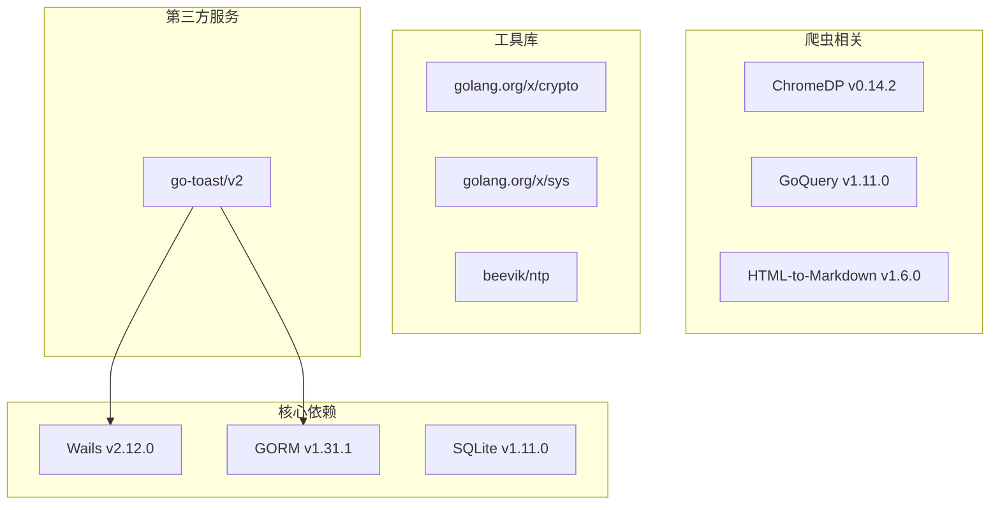

# 开发环境搭建

<cite>
**本文档引用的文件**
- [README.md](file://README.md)
- [go.mod](file://go.mod)
- [frontend/package.json](file://frontend/package.json)
- [wails.json](file://wails.json)
- [main.go](file://main.go)
- [frontend/vite.config.ts](file://frontend/vite.config.ts)
- [backend/app/init.go](file://backend/app/init.go)
- [build/README.md](file://build/README.md)
- [.gitignore](file://.gitignore)
</cite>

## 目录
1. [简介](#简介)
2. [系统要求与前置条件](#系统要求与前置条件)
3. [开发环境搭建流程](#开发环境搭建流程)
4. [开发模式与生产模式详解](#开发模式与生产模式详解)
5. [跨平台安装指南](#跨平台安装指南)
6. [依赖管理与配置](#依赖管理与配置)
7. [常见问题排查](#常见问题排查)
8. [性能优化建议](#性能优化建议)
9. [故障排除指南](#故障排除指南)
10. [总结](#总结)

## 简介

WeMediaSpider 是一个基于 Go 和 Wails v2 的微信公众号文章智能爬虫工具。该项目采用前后端分离架构，后端使用 Go 语言开发，前端使用 React + TypeScript + Ant Design + Vite 构建，支持批量爬取、多格式导出、数据库存储、定时任务等功能。

## 系统要求与前置条件

### 核心技术栈要求

根据项目配置，WeMediaSpider 对开发环境有以下要求：

#### Go 语言环境
- **最低版本**: Go 1.18+
- **当前版本**: Go 1.25.0
- **版本检查**: `go version`

#### Node.js 环境
- **最低版本**: Node.js 16+
- **版本检查**: `node --version`

#### Wails CLI 工具
- **版本**: Wails v2.x
- **安装方式**: `npm install -g @wailsapp/cli`
- **版本检查**: `wails --version`

#### 操作系统兼容性
- **Windows**: 支持 Windows 7/8/10/11
- **macOS**: 支持 macOS 10.15 及以上版本
- **Linux**: 支持 Ubuntu 18.04+、CentOS 7+、Debian 10+

**章节来源**
- [README.md:49-53](file://README.md#L49-L53)
- [go.mod:3](file://go.mod#L3)
- [frontend/package.json:1-30](file://frontend/package.json#L1-L30)

## 开发环境搭建流程

### 第一步：环境准备

1. **验证 Go 环境**
   ```bash
   go version
   ```

2. **验证 Node.js 环境**
   ```bash
   node --version
   npm --version
   ```

3. **安装 Wails CLI**
   ```bash
   npm install -g @wailsapp/cli
   wails --version
   ```

### 第二步：项目克隆与初始化

1. **克隆项目**
   ```bash
   git clone https://github.com/vag-Zhao/WeMediaSpider-Go.git
   cd WeMediaSpider-Go
   ```

2. **安装后端依赖**
   ```bash
   go mod tidy
   ```

3. **安装前端依赖**
   ```bash
   cd frontend
   npm install
   ```

### 第三步：开发环境验证

1. **启动开发模式**
   ```bash
   cd ..
   wails dev
   ```

2. **验证开发服务器**
   - 访问 `http://localhost:34115`
   - 确认前端页面正常加载
   - 检查控制台是否有错误信息

**章节来源**
- [README.md:55-64](file://README.md#L55-L64)
- [go.mod:1-85](file://go.mod#L1-L85)
- [frontend/package.json:1-30](file://frontend/package.json#L1-L30)

## 开发模式与生产模式详解

### 开发模式 (Development Mode)

开发模式适用于日常开发和调试，具有以下特点：

#### 特征
- **热重载**: 前端代码修改后自动刷新
- **调试支持**: 提供完整的调试工具链
- **开发服务器**: 内置 Vite 开发服务器
- **实时编译**: Go 代码变更时自动重新编译

#### 启动方式
```bash
wails dev
```

#### 开发模式配置
- **前端监听**: `npm run dev`
- **后端监听**: Go 代码变更自动重启
- **端口**: 默认 34115
- **资源路径**: 使用嵌入式资源

### 生产模式 (Production Mode)

生产模式用于构建最终的应用程序包：

#### 特征
- **静态资源**: 前端构建产物打包到二进制文件
- **优化编译**: 生成优化的可执行文件
- **独立部署**: 无需依赖 Node.js 环境
- **安装包**: 生成 MSI、DMG 或 AppImage 文件

#### 构建方式
```bash
wails build
```

#### 构建输出
- **Windows**: `.exe` 文件
- **macOS**: `.app` 包
- **Linux**: 可执行文件或 AppImage

### 模式切换指南



**图表来源**
- [README.md:55-70](file://README.md#L55-L70)
- [wails.json:5-8](file://wails.json#L5-L8)

**章节来源**
- [README.md:55-70](file://README.md#L55-L70)
- [wails.json:5-8](file://wails.json#L5-L8)

## 跨平台安装指南

### Windows 平台

#### 系统要求
- Windows 7/8/10/11 (64位)
- .NET Framework 4.7.2 或更高版本
- WebView2 Runtime (自动安装)

#### 安装步骤

1. **安装 Go**
   - 下载 Go 1.25.0+ 安装包
   - 运行安装程序并完成配置

2. **安装 Node.js**
   - 下载 Node.js 16+ LTS 版本
   - 运行安装程序

3. **安装 Wails CLI**
   ```cmd
   npm install -g @wailsapp/cli@latest
   ```

4. **验证安装**
   ```cmd
   go version
   node --version
   wails --version
   ```

#### Windows 特定配置



**图表来源**
- [wails.json:20-27](file://wails.json#L20-L27)

### macOS 平台

#### 系统要求
- macOS 10.15 或更高版本
- Xcode Command Line Tools
- Go 1.18+

#### 安装步骤

1. **安装 Xcode Command Line Tools**
   ```bash
   xcode-select --install
   ```

2. **安装 Go**
   ```bash
   brew install go
   ```

3. **安装 Node.js**
   ```bash
   brew install node@16
   ```

4. **安装 Wails CLI**
   ```bash
   npm install -g @wailsapp/cli
   ```

#### macOS 特定配置



**图表来源**
- [build/README.md:11-22](file://build/README.md#L11-L22)

### Linux 平台

#### 系统要求
- Ubuntu 18.04+ / CentOS 7+ / Debian 10+
- GCC 编译器
- Go 1.18+

#### Ubuntu/Debian 安装步骤

1. **更新系统**
   ```bash
   sudo apt update
   sudo apt upgrade -y
   ```

2. **安装依赖**
   ```bash
   sudo apt install -y build-essential curl wget unzip
   ```

3. **安装 Go**
   ```bash
   wget https://go.dev/dl/go1.25.0.linux-amd64.tar.gz
   sudo tar -xzf go1.25.0.linux-amd64.tar.gz -C /usr/local/
   echo 'export PATH=$PATH:/usr/local/go/bin' >> ~/.bashrc
   source ~/.bashrc
   ```

4. **安装 Node.js**
   ```bash
   curl -fsSL https://deb.nodesource.com/setup_16.x | sudo -E bash -
   sudo apt-get install -y nodejs
   ```

5. **安装 Wails CLI**
   ```bash
   npm install -g @wailsapp/cli
   ```

#### CentOS/RHEL 安装步骤

1. **启用 EPEL 仓库**
   ```bash
   sudo yum install epel-release -y
   sudo yum update -y
   ```

2. **安装依赖**
   ```bash
   sudo yum groupinstall "Development Tools" -y
   sudo yum install -y curl wget unzip
   ```

3. **安装 Go**
   ```bash
   wget https://go.dev/dl/go1.25.0.linux-amd64.tar.gz
   sudo tar -xzf go1.25.0.linux-amd64.tar.gz -C /usr/local/
   echo 'export PATH=$PATH:/usr/local/go/bin' >> ~/.bashrc
   source ~/.bashrc
   ```

4. **安装 Node.js**
   ```bash
   curl -fsSL https://rpm.nodesource.com/setup_16.x | sudo bash -
   sudo yum install -y nodejs
   ```

5. **安装 Wails CLI**
   ```bash
   npm install -g @wailsapp/cli
   ```

**章节来源**
- [README.md:49-53](file://README.md#L49-L53)
- [wails.json:20-27](file://wails.json#L20-L27)

## 依赖管理与配置

### Go 依赖管理

项目使用 Go Modules 进行依赖管理：

#### 主要依赖包



**图表来源**
- [go.mod:5-22](file://go.mod#L5-L22)

#### 依赖安装
```bash
# 清理并重新安装依赖
go clean -cache
go mod tidy
```

### 前端依赖管理

#### 主要前端依赖

| 依赖包 | 版本 | 用途 |
|--------|------|------|
| react | ^18.2.0 | 用户界面框架 |
| react-dom | ^18.2.0 | DOM 操作 |
| antd | ^5.12.0 | UI 组件库 |
| zustand | ^4.4.7 | 状态管理 |
| dayjs | ^1.11.10 | 日期处理 |
| echarts | ^5.5.0 | 图表可视化 |
| marked | ^9.1.6 | Markdown 渲染 |

#### 依赖安装
```bash
cd frontend
npm install
```

### 构建配置

#### Wails 配置
```json
{
  "name": "WeMediaSpider",
  "outputfilename": "WeMediaSpider",
  "frontend:install": "npm install",
  "frontend:build": "npm run build",
  "frontend:dev:watcher": "npm run dev",
  "frontend:dev:serverUrl": "auto"
}
```

#### Vite 配置
```javascript
import { defineConfig } from 'vite'
import react from '@vitejs/plugin-react'

export default defineConfig({
  plugins: [react()]
})
```

**章节来源**
- [go.mod:1-85](file://go.mod#L1-L85)
- [frontend/package.json:1-30](file://frontend/package.json#L1-L30)
- [wails.json:1-29](file://wails.json#L1-L29)
- [frontend/vite.config.ts:1-8](file://frontend/vite.config.ts#L1-L8)

## 常见问题排查

### 环境变量问题

#### 问题症状
- `wails dev` 启动失败
- Go 命令找不到
- Node.js 环境异常

#### 解决方案
1. **检查 Go 环境**
   ```bash
   echo $GOPATH
   echo $GOROOT
   echo $PATH
   ```

2. **检查 Node.js 环境**
   ```bash
   which node
   which npm
   npm config list
   ```

3. **修复环境变量**
   ```bash
   # Windows
   set PATH=%PATH%;%GOPATH%\bin;%GOROOT%\bin
   
   # macOS/Linux
   export PATH=$PATH:$GOPATH/bin:$GOROOT/bin
   ```

### 权限问题

#### Windows 权限问题
```cmd
# 以管理员身份运行 PowerShell
Set-ExecutionPolicy -ExecutionPolicy RemoteSigned -Scope CurrentUser
```

#### macOS 权限问题
```bash
# 授权 Wails CLI
sudo chown -R $(whoami) /usr/local/lib/node_modules/@wailsapp/cli
```

#### Linux 权限问题
```bash
# 授权 npm 全局安装
sudo chown -R $(whoami) ~/.npm
```

### 端口冲突问题

#### 问题症状
- 开发服务器无法启动
- 端口被占用

#### 解决方案
```bash
# 检查端口占用
netstat -an | grep 34115

# 修改 Wails 配置中的端口
# 在 wails.json 中修改 frontend:dev:serverUrl
```

### 依赖安装问题

#### Go 依赖问题
```bash
# 清理缓存并重新安装
go clean -cache -modcache
go env -w GOPROXY=https://goproxy.cn,direct
go mod tidy
```

#### Node.js 依赖问题
```bash
# 清理缓存
npm cache clean --force
rm -rf node_modules package-lock.json

# 重新安装
cd frontend
npm install
```

### 跨平台兼容性问题

#### Windows 特定问题
```cmd
# 安装 WebView2 Runtime
# 从 Microsoft 官网下载并安装
```

#### macOS 特定问题
```bash
# 安装 Xcode Command Line Tools
xcode-select --install

# 授权开发工具
sudo xcode-select --reset
```

#### Linux 特定问题
```bash
# Ubuntu/Debian
sudo apt install libgtk-3-dev libwebkit2gtk-4.0-dev

# CentOS/RHEL
sudo yum install gtk3-devel webkit2gtk3-devel
```

**章节来源**
- [README.md:49-53](file://README.md#L49-L53)
- [wails.json:20-27](file://wails.json#L20-L27)

## 性能优化建议

### 开发环境优化

#### Go 编译优化
```bash
# 使用并行编译
go build -p 4

# 启用 CGO 优化
CGO_ENABLED=1 go build
```

#### 前端构建优化
```bash
# 启用压缩
npm run build -- --mode production

# 分析包大小
npm run build -- --mode production --analyze
```

### 内存管理

#### Go 程序内存优化
- 合理使用 defer 语句
- 避免内存泄漏
- 及时释放大对象

#### 前端内存优化
- 使用 React.memo 优化组件渲染
- 合理使用 useEffect 清理函数
- 避免不必要的状态更新

### 磁盘空间管理

#### 清理构建缓存
```bash
# 清理 Go 缓存
go clean -cache -modcache

# 清理 npm 缓存
npm cache clean --force

# 清理构建目录
rm -rf frontend/dist
rm -rf build/bin
```

## 故障排除指南

### 启动失败诊断

#### 步骤 1: 检查基本依赖
```bash
# 验证 Go 版本
go version

# 验证 Node.js 版本
node --version
npm --version

# 验证 Wails 版本
wails --version
```

#### 步骤 2: 检查网络连接
```bash
# 测试网络连接
ping github.com

# 配置代理（如需要）
export HTTP_PROXY=http://proxy.example.com:8080
export HTTPS_PROXY=http://proxy.example.com:8080
```

#### 步骤 3: 检查防火墙设置
```bash
# Windows 防火墙
netsh advfirewall show allprofiles

# macOS 防火墙
sudo /usr/libexec/ApplicationFirewall/socketfilterfw --getglobalstate
```

### 构建失败诊断

#### Go 构建问题
```bash
# 查看详细错误信息
go build -v

# 检查 CGO 设置
go env CGO_ENABLED

# 清理构建缓存
go clean -cache
```

#### 前端构建问题
```bash
# 检查 TypeScript 错误
cd frontend
npm run build

# 检查 Vite 配置
cat vite.config.ts
```

### 日志分析

#### 后端日志
```go
// 在 main.go 中查看错误处理
if err != nil {
    println("Error:", err.Error())
    os.Exit(1)
}
```

#### 前端日志
```javascript
// 在浏览器开发者工具中查看
console.log('Debug information')
```

### 回滚策略

#### 版本回退
```bash
# 查看可用版本
git tag

# 回退到稳定版本
git checkout v1.0.0
```

#### 数据备份
```bash
# 备份用户数据
cp -r ~/.wemediaspider ~/.wemediaspider.backup

# 备份配置文件
cp -r backend/internal/config ~/.config/wemediaspider.backup
```

### 社区支持

#### 获取帮助
- **GitHub Issues**: https://github.com/vag-Zhao/WeMediaSpider-Go/issues
- **官方文档**: https://wails.io/docs
- **社区论坛**: 相关技术社区

**章节来源**
- [README.md:113-117](file://README.md#L113-L117)
- [main.go:23-31](file://main.go#L23-L31)

## 总结

WeMediaSpider 的开发环境搭建相对简单，主要依赖于 Go 1.18+、Node.js 16+ 和 Wails CLI 的正确安装。通过遵循本文档提供的步骤，您可以在 Windows、macOS 和 Linux 平台上成功搭建开发环境。

### 关键要点

1. **环境要求**: 确保满足 Go 1.18+、Node.js 16+、Wails CLI 的版本要求
2. **依赖管理**: 使用 Go Modules 和 npm 管理依赖
3. **开发模式**: 使用 `wails dev` 进行开发，`wails build` 进行生产构建
4. **跨平台支持**: 项目支持 Windows、macOS 和 Linux 三大平台
5. **故障排除**: 建立完善的故障排除流程和回滚策略

### 最佳实践

- 定期更新依赖包
- 使用版本控制系统管理代码
- 建立自动化构建流程
- 制定详细的部署文档
- 准备应急响应计划

通过遵循这些指导原则，您将能够高效地开发和维护 WeMediaSpider 项目，并为用户提供稳定可靠的应用程序。