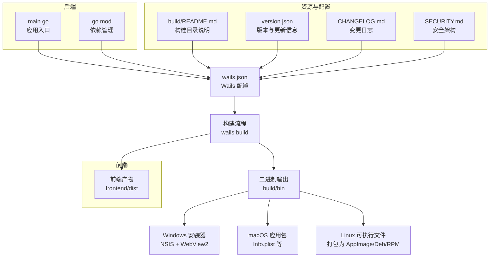
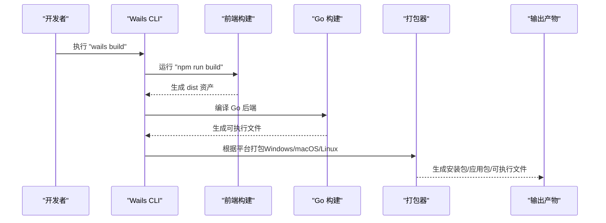
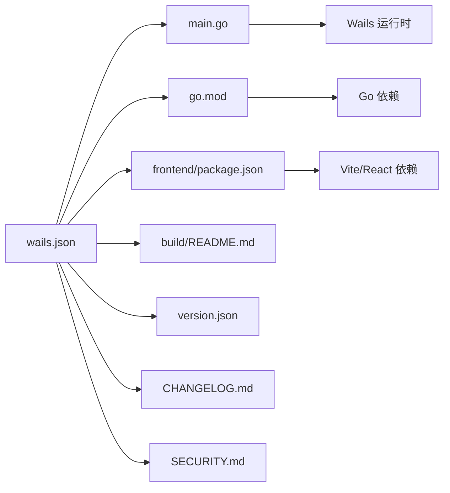

# 构建与部署

<cite>
**本文引用的文件**
- [wails.json](file://wails.json)
- [version.json](file://version.json)
- [go.mod](file://go.mod)
- [main.go](file://main.go)
- [README.md](file://README.md)
- [CHANGELOG.md](file://CHANGELOG.md)
- [SECURITY.md](file://SECURITY.md)
- [build/README.md](file://build/README.md)
- [frontend/package.json](file://frontend/package.json)
- [frontend/vite.config.ts](file://frontend/vite.config.ts)
</cite>

## 目录
1. [简介](#简介)
2. [项目结构](#项目结构)
3. [核心组件](#核心组件)
4. [架构总览](#架构总览)
5. [详细组件分析](#详细组件分析)
6. [依赖关系分析](#依赖关系分析)
7. [性能考量](#性能考量)
8. [故障排查指南](#故障排查指南)
9. [结论](#结论)
10. [附录](#附录)

## 简介
本指南面向 WeMediaSpider 的构建与部署，涵盖以下内容：
- 构建流程与 Wails CLI 使用
- 平台差异与注意事项（Windows、macOS、Linux）
- 打包配置（应用图标、安装器、签名）
- 版本管理与发布流程（语义化版本、变更日志）
- 自动化部署与 CI/CD 配置思路
- 生产环境部署最佳实践与安全考虑

## 项目结构
WeMediaSpider 采用 Wails v2 框架，前后端分离：Go 后端 + React 前端，通过 Wails 桥接通信。构建与打包由 Wails 配置驱动，构建产物位于 build 目录。

**图表来源**
- [wails.json:1-29](file://wails.json#L1-L29)
- [main.go:1-91](file://main.go#L1-L91)
- [go.mod:1-85](file://go.mod#L1-L85)
- [build/README.md:1-35](file://build/README.md#L1-L35)
- [version.json:1-6](file://version.json#L1-L6)
- [CHANGELOG.md:1-334](file://CHANGELOG.md#L1-L334)
- [SECURITY.md:1-260](file://SECURITY.md#L1-L260)

**章节来源**
- [wails.json:1-29](file://wails.json#L1-L29)
- [main.go:1-91](file://main.go#L1-L91)
- [go.mod:1-85](file://go.mod#L1-L85)
- [build/README.md:1-35](file://build/README.md#L1-L35)
- [version.json:1-6](file://version.json#L1-L6)
- [CHANGELOG.md:1-334](file://CHANGELOG.md#L1-L334)
- [SECURITY.md:1-260](file://SECURITY.md#L1-L260)

## 核心组件
- Wails 配置（wails.json）
  - 应用名称、输出文件名、前端构建脚本、作者信息、产品元数据
  - Windows 打包配置：图标、NSIS 安装模式、安装目录、WebView2 运行库安装
- 版本与更新（version.json）
  - 当前版本、更新检查地址、发布说明
- 前端构建（frontend/package.json、frontend/vite.config.ts）
  - 前端脚本、依赖与 Vite 配置
- 应用入口（main.go）
  - 单实例、命令行参数解析、窗口尺寸计算、Wails 应用初始化与绑定
- 构建目录（build/README.md）
  - 平台特定资源说明（Info.plist、icon.ico、安装器模板等）

**章节来源**
- [wails.json:1-29](file://wails.json#L1-L29)
- [version.json:1-6](file://version.json#L1-L6)
- [frontend/package.json:1-30](file://frontend/package.json#L1-L30)
- [frontend/vite.config.ts:1-8](file://frontend/vite.config.ts#L1-L8)
- [main.go:23-91](file://main.go#L23-L91)
- [build/README.md:1-35](file://build/README.md#L1-L35)

## 架构总览
Wails 应用的构建与打包流程如下：

**图表来源**
- [wails.json:5-8](file://wails.json#L5-L8)
- [frontend/package.json:6-10](file://frontend/package.json#L6-L10)
- [wails.json:20-27](file://wails.json#L20-L27)

## 详细组件分析

### 构建流程与命令
- 开发模式
  - 使用 Wails CLI 启动开发服务器，热更新监听前端变化
- 构建命令
  - 使用 Wails CLI 执行构建，自动执行前端构建脚本并将前端产物嵌入二进制
- 输出位置
  - 二进制输出目录为 build/bin；平台特定资源位于 build/darwin、build/windows

**章节来源**
- [README.md:62-70](file://README.md#L62-L70)
- [wails.json:5-8](file://wails.json#L5-L8)
- [build/README.md:7-16](file://build/README.md#L7-L16)

### 平台差异与注意事项

#### Windows
- 打包配置
  - 应用图标：build/windows/icon.ico
  - 安装器：NSIS，安装模式为 perMachine，默认安装目录为 Program Files
  - WebView2 运行库：构建时可启用自动安装
- 注意事项
  - 需要管理员权限进行 perMachine 安装
  - 若目标机器未安装 WebView2，需确保运行库安装流程可用
  - 安装器模板与资源位于 build/windows/installer

**章节来源**
- [wails.json:20-27](file://wails.json#L20-L27)
- [build/README.md:23-35](file://build/README.md#L23-L35)

#### macOS
- 打包配置
  - Info.plist 用于应用元数据与权限声明
  - 开发与生产使用不同的 plist 文件（Info.plist 与 Info.dev.plist）
- 注意事项
  - 需要遵循 Apple 的应用签名与公证流程（见“签名设置”）
  - 首次运行可能需要在“系统偏好设置 > 隐私与安全性”中允许应用运行

**章节来源**
- [build/README.md:11-22](file://build/README.md#L11-L22)

#### Linux
- 打包配置
  - 可将应用打包为 AppImage、Deb 或 RPM
  - 应用图标与桌面文件可自定义
- 注意事项
  - 不同发行版的依赖与运行时差异较大，建议在目标发行版上测试
  - 若使用 WebView2（Windows）或类似技术，需确认 Linux 上的运行时支持

**章节来源**
- [build/README.md:8-16](file://build/README.md#L8-L16)

### 打包配置详解

#### 应用图标
- Windows：使用 build/windows/icon.ico 作为应用图标
- macOS：使用 Info.plist 中的图标定义
- Linux：使用桌面文件与图标规范

**章节来源**
- [wails.json:20-21](file://wails.json#L20-L21)
- [build/README.md:29-31](file://build/README.md#L29-L31)

#### 安装器配置
- Windows NSIS
  - 安装模式：perMachine
  - 安装目录：Program Files
  - WebView2 运行库：可选自动安装
- macOS
  - Info.plist 与 Info.dev.plist 用于区分开发与生产环境
- Linux
  - 可生成 AppImage/Deb/RPM，具体取决于打包策略

**章节来源**
- [wails.json:22-26](file://wails.json#L22-L26)
- [build/README.md:19-22](file://build/README.md#L19-L22)
- [build/README.md:23-35](file://build/README.md#L23-L35)

#### 签名设置
- Windows
  - 建议为可执行文件与安装器配置代码签名证书，以提升可信度与规避安全警告
- macOS
  - 需要 Apple Developer 证书与公证流程，确保应用可通过 Gatekeeper 校验
- Linux
  - 通常不需要签名，但可为软件仓库或分发渠道配置 GPG 签名

**章节来源**
- [wails.json:20-27](file://wails.json#L20-L27)

### 版本管理与发布流程

#### 版本号规则
- 采用语义化版本（SemVer），遵循主版本.次版本.修订号
- 重大架构变更或破坏性更新应提升主版本号

**章节来源**
- [CHANGELOG.md:5-6](file://CHANGELOG.md#L5-L6)

#### 变更日志维护
- 使用 Keep a Changelog 格式，记录新增、修复、架构变更与依赖更新
- 每个版本条目包含日期、变更分类与技术细节

**章节来源**
- [CHANGELOG.md:1-334](file://CHANGELOG.md#L1-L334)

#### 发布流程
- 更新 version.json 中的版本号与发布说明
- 在 GitHub Releases 创建对应版本标签与发布说明
- 生成各平台构建产物并上传至 Release

**章节来源**
- [version.json:1-6](file://version.json#L1-L6)
- [README.md:27-32](file://README.md#L27-L32)

### 自动化部署与 CI/CD 配置

#### CI/CD 流程建议
- 触发条件
  - 推送标签（SemVer 格式）或合并到主分支
- 步骤
  - 安装 Go 与 Node.js 环境
  - 安装 Wails CLI
  - 运行前端构建与 Go 构建
  - 平台特定打包（Windows NSIS、macOS DMG、Linux AppImage/Deb/RPM）
  - 上传构建产物至发布渠道
- 安全
  - 使用受保护的 secrets 存储签名证书与发布凭据
  - 对产物进行哈希校验与数字签名

**章节来源**
- [go.mod:3](file://go.mod#L3)
- [frontend/package.json:1-30](file://frontend/package.json#L1-L30)
- [wails.json:5-8](file://wails.json#L5-L8)

### 生产环境部署最佳实践与安全考虑

#### 安全最佳实践
- 文件权限与加密
  - 敏感文件使用 0600 权限，凭证与数据库文件采用加密存储与 HMAC 完整性校验
- 密钥管理
  - 主密钥通过 PBKDF2 派生，不直接存储
- 向后兼容
  - 自动升级旧格式文件，记录升级日志

**章节来源**
- [SECURITY.md:58-80](file://SECURITY.md#L58-L80)
- [SECURITY.md:137-170](file://SECURITY.md#L137-L170)

#### 部署建议
- Windows
  - 使用 NSIS 安装器进行 perMachine 安装，确保 WebView2 运行库可用
- macOS
  - 提供 DMG 包，并完成签名与公证
- Linux
  - 提供 AppImage/Deb/RPM，确保依赖满足

**章节来源**
- [wails.json:22-26](file://wails.json#L22-L26)
- [build/README.md:23-35](file://build/README.md#L23-L35)

## 依赖关系分析

**图表来源**
- [wails.json:1-29](file://wails.json#L1-L29)
- [main.go:1-18](file://main.go#L1-L18)
- [go.mod:1-22](file://go.mod#L1-L22)
- [frontend/package.json:11-28](file://frontend/package.json#L11-L28)
- [build/README.md:1-35](file://build/README.md#L1-L35)
- [version.json:1-6](file://version.json#L1-L6)
- [CHANGELOG.md:1-6](file://CHANGELOG.md#L1-L6)
- [SECURITY.md:1-5](file://SECURITY.md#L1-L5)

**章节来源**
- [wails.json:1-29](file://wails.json#L1-L29)
- [main.go:1-18](file://main.go#L1-L18)
- [go.mod:1-22](file://go.mod#L1-L22)
- [frontend/package.json:11-28](file://frontend/package.json#L11-L28)
- [build/README.md:1-35](file://build/README.md#L1-L35)
- [version.json:1-6](file://version.json#L1-L6)
- [CHANGELOG.md:1-6](file://CHANGELOG.md#L1-L6)
- [SECURITY.md:1-5](file://SECURITY.md#L1-L5)

## 性能考量
- 前端构建
  - 使用 Vite 进行快速构建与热更新，生产构建时注意代码分割与静态资源优化
- 应用启动
  - 嵌入式前端资源减少运行时 IO，提升启动速度
- 平台打包
  - Windows 安装器启用 WebView2 运行库安装可减少用户手动安装步骤

**章节来源**
- [frontend/vite.config.ts:1-8](file://frontend/vite.config.ts#L1-L8)
- [wails.json:5-8](file://wails.json#L5-L8)
- [wails.json:25](file://wails.json#L25)

## 故障排查指南
- 构建失败
  - 检查前端依赖安装与构建脚本是否正确
  - 确认 Wails CLI 与 Go 版本满足项目要求
- Windows 安装问题
  - 确认 NSIS 安装模式与 WebView2 运行库安装选项
  - 如需 perMachine 安装，确保具备管理员权限
- macOS 运行问题
  - 确认应用已签名与公证，必要时在“隐私与安全性”中允许运行
- 版本更新检查
  - 确认 version.json 中的 updateUrl 与 releaseNotes 正确配置

**章节来源**
- [README.md:62-70](file://README.md#L62-L70)
- [wails.json:20-27](file://wails.json#L20-L27)
- [version.json:1-6](file://version.json#L1-L6)

## 结论
WeMediaSpider 的构建与部署围绕 Wails 配置展开，通过统一的构建命令与平台特定的打包配置实现跨平台分发。结合语义化版本与变更日志，可形成稳定的发布节奏；配合安全架构与签名流程，可在生产环境中提供可靠的应用交付与运行保障。

## 附录

### 常用命令与配置要点
- 构建命令：wails build
- 前端构建脚本：npm run build
- 应用图标：build/windows/icon.ico
- Windows 安装器：NSIS，perMachine 安装
- WebView2 运行库：可选自动安装
- 版本与更新：version.json
- 变更日志：CHANGELOG.md
- 安全架构：SECURITY.md

**章节来源**
- [README.md:62-70](file://README.md#L62-L70)
- [wails.json:5-8](file://wails.json#L5-L8)
- [wails.json:20-27](file://wails.json#L20-L27)
- [version.json:1-6](file://version.json#L1-L6)
- [CHANGELOG.md:1-6](file://CHANGELOG.md#L1-L6)
- [SECURITY.md:1-5](file://SECURITY.md#L1-L5)