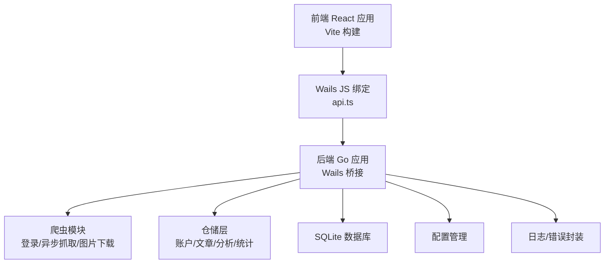
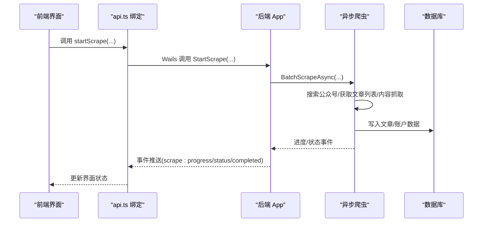
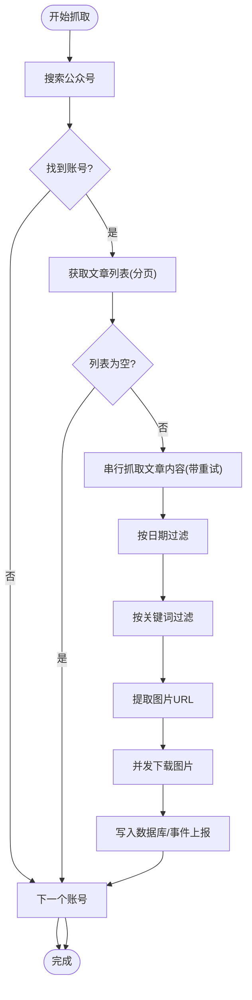
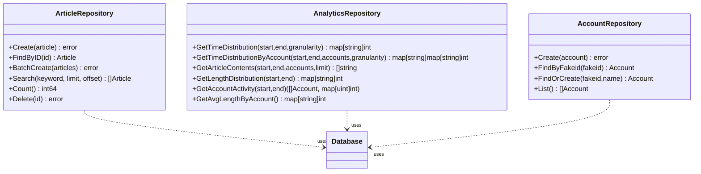
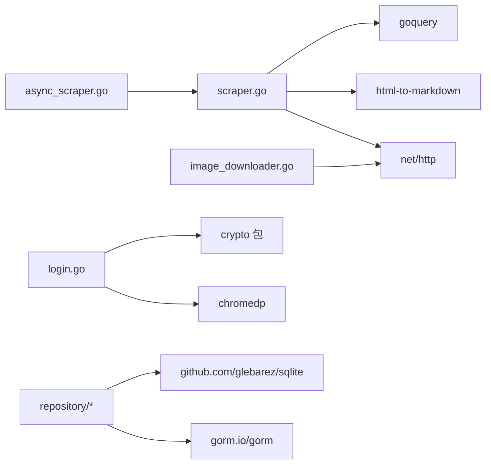

# 测试策略

<cite>
**本文引用的文件**
- [go.mod](file://go.mod)
- [backend/app/app.go](file://backend/app/app.go)
- [backend/internal/spider/scraper.go](file://backend/internal/spider/scraper.go)
- [backend/internal/spider/async_scraper.go](file://backend/internal/spider/async_scraper.go)
- [backend/internal/spider/login.go](file://backend/internal/spider/login.go)
- [backend/internal/spider/image_downloader.go](file://backend/internal/spider/image_downloader.go)
- [backend/internal/repository/account_repo.go](file://backend/internal/repository/account_repo.go)
- [backend/internal/repository/analytics_repo.go](file://backend/internal/repository/analytics_repo.go)
- [backend/internal/repository/article_repo_test.go](file://backend/internal/repository/article_repo_test.go)
- [backend/internal/analytics/cache_test.go](file://backend/internal/analytics/cache_test.go)
- [backend/pkg/crypto/crypto_test.go](file://backend/pkg/crypto/crypto_test.go)
- [backend/pkg/errors/errors_test.go](file://backend/pkg/errors/errors_test.go)
- [backend/pkg/logger/logger_test.go](file://backend/pkg/logger/logger_test.go)
- [backend/internal/database/db.go](file://backend/internal/database/db.go)
- [backend/internal/config/manager.go](file://backend/internal/config/manager.go)
- [frontend/src/services/api.ts](file://frontend/src/services/api.ts)
- [frontend/package.json](file://frontend/package.json)
</cite>

## 目录
1. [引言](#引言)
2. [项目结构](#项目结构)
3. [核心组件](#核心组件)
4. [架构总览](#架构总览)
5. [详细组件分析](#详细组件分析)
6. [依赖关系分析](#依赖关系分析)
7. [性能考量](#性能考量)
8. [故障排查指南](#故障排查指南)
9. [结论](#结论)
10. [附录](#附录)

## 引言
本测试策略面向 WeMediaSpider 项目，覆盖后端 Go 与前端 TypeScript 的单元测试、集成测试设计与实施，重点围绕爬虫功能、数据库操作与 API 接口。目标包括：
- 明确单元测试编写方法与覆盖率要求
- 设计集成测试以验证端到端流程
- 选择并配置测试工具（Go test、Jest 等）
- 规范测试数据准备与模拟对象创建
- 制定持续集成与自动化测试方案
- 总结测试最佳实践与常见问题解决方案

## 项目结构
WeMediaSpider 采用前后端分离架构：
- 后端基于 Go，使用 Wails 作为桥接层，提供桌面应用能力
- 前端基于 React/Vite，通过 Wails JS 绑定调用后端能力
- 数据库采用 SQLite（GORM + sqlite 驱动），位于应用数据目录
- 关键模块包括：爬虫（登录、异步抓取、图片下载）、仓储层、分析与缓存、配置管理、日志与错误封装等

图示来源
- [frontend/src/services/api.ts:1-161](file://frontend/src/services/api.ts#L1-L161)
- [backend/app/app.go:1-85](file://backend/app/app.go#L1-L85)
- [backend/internal/database/db.go:1-115](file://backend/internal/database/db.go#L1-L115)

章节来源
- [go.mod:1-85](file://go.mod#L1-L85)
- [backend/app/app.go:1-85](file://backend/app/app.go#L1-L85)
- [frontend/package.json:1-30](file://frontend/package.json#L1-L30)

## 核心组件
- 爬虫子系统：负责登录、公众号搜索、文章列表与内容抓取、内容清洗与关键词匹配、图片提取与下载
- 仓储层：封装数据库访问，提供账户、文章、分析、统计等仓储接口
- 配置管理：持久化应用配置，提供默认值与加载/保存能力
- 日志与错误：统一日志缓冲与错误包装，便于测试与排错
- 前端 API 绑定：通过 Wails 生成的 JS 绑定对接后端能力

章节来源
- [backend/internal/spider/scraper.go:1-541](file://backend/internal/spider/scraper.go#L1-L541)
- [backend/internal/spider/async_scraper.go:1-281](file://backend/internal/spider/async_scraper.go#L1-L281)
- [backend/internal/spider/login.go:1-616](file://backend/internal/spider/login.go#L1-L616)
- [backend/internal/spider/image_downloader.go:1-314](file://backend/internal/spider/image_downloader.go#L1-L314)
- [backend/internal/repository/account_repo.go:1-63](file://backend/internal/repository/account_repo.go#L1-L63)
- [backend/internal/repository/analytics_repo.go:1-284](file://backend/internal/repository/analytics_repo.go#L1-L284)
- [backend/internal/config/manager.go:1-69](file://backend/internal/config/manager.go#L1-L69)
- [backend/pkg/logger/logger_test.go:1-54](file://backend/pkg/logger/logger_test.go#L1-L54)
- [backend/pkg/errors/errors_test.go:1-30](file://backend/pkg/errors/errors_test.go#L1-L30)

## 架构总览
下图展示测试关注的关键交互：前端通过 api.ts 调用后端 Wails 方法，后端内部协调爬虫、仓储与数据库，最终返回事件与结果。

图示来源
- [frontend/src/services/api.ts:1-161](file://frontend/src/services/api.ts#L1-L161)
- [backend/internal/spider/async_scraper.go:31-273](file://backend/internal/spider/async_scraper.go#L31-L273)
- [backend/internal/database/db.go:82-109](file://backend/internal/database/db.go#L82-L109)

## 详细组件分析

### 爬虫功能测试
- 测试目标
  - 登录流程：浏览器驱动、URL 轮询、缓存与过期、导出/导入凭证
  - 异步抓取：串行化请求、速率限制、取消机制、进度与状态事件
  - 文章内容抓取：多选择器适配、图片处理、Markdown 转换、重试机制
  - 图片下载：URL 提取、并发下载、目录组织、取消与进度
- 测试策略
  - 单元测试：对选择器匹配、内容清洗、URL 解析、速率限制器等纯函数逻辑进行断言
  - 集成测试：使用内存数据库与模拟 HTTP 响应，验证抓取流程与事件推送
  - 端到端测试：结合 Wails 桥接，验证前端 UI 与后端事件的联动
- 关键断言点
  - 抓取返回的文章数量、标题/摘要/正文非空性
  - 日期与关键词过滤结果
  - 速率限制触发与退避行为
  - 取消上下文传播与中断
  - 图片 URL 去重与命名规则

图示来源
- [backend/internal/spider/async_scraper.go:31-273](file://backend/internal/spider/async_scraper.go#L31-L273)
- [backend/internal/spider/scraper.go:263-442](file://backend/internal/spider/scraper.go#L263-L442)
- [backend/internal/spider/image_downloader.go:65-236](file://backend/internal/spider/image_downloader.go#L65-L236)

章节来源
- [backend/internal/spider/login.go:58-215](file://backend/internal/spider/login.go#L58-L215)
- [backend/internal/spider/scraper.go:71-261](file://backend/internal/spider/scraper.go#L71-L261)
- [backend/internal/spider/async_scraper.go:31-273](file://backend/internal/spider/async_scraper.go#L31-L273)
- [backend/internal/spider/image_downloader.go:65-236](file://backend/internal/spider/image_downloader.go#L65-L236)

### 数据库与仓储测试
- 测试目标
  - 文章仓储：创建、批量插入（冲突更新）、查询、删除、搜索、计数
  - 分析仓储：时间分布、按账号分组统计、文章内容提取、长度分布、活跃度
  - 账户仓储：创建、查找、查找或创建、列出
- 测试策略
  - 使用内存数据库（sqlite 内存）隔离测试，避免跨测试污染
  - 在测试前执行自动迁移，确保表结构一致
  - 针对边界场景（空输入、冲突、空结果集）进行断言
- 关键断言点
  - 批量 Upsert 后的标题更新
  - 搜索关键词命中与排序
  - 时间分布聚合与分组统计
  - 平均长度与活跃度映射

图示来源
- [backend/internal/repository/article_repo_test.go:14-27](file://backend/internal/repository/article_repo_test.go#L14-L27)
- [backend/internal/repository/analytics_repo.go:13-32](file://backend/internal/repository/analytics_repo.go#L13-L32)
- [backend/internal/repository/account_repo.go:11-17](file://backend/internal/repository/account_repo.go#L11-L17)
- [backend/internal/database/db.go:82-109](file://backend/internal/database/db.go#L82-L109)

章节来源
- [backend/internal/repository/article_repo_test.go:1-151](file://backend/internal/repository/article_repo_test.go#L1-L151)
- [backend/internal/repository/analytics_repo.go:1-284](file://backend/internal/repository/analytics_repo.go#L1-L284)
- [backend/internal/repository/account_repo.go:1-63](file://backend/internal/repository/account_repo.go#L1-L63)
- [backend/internal/database/db.go:1-115](file://backend/internal/database/db.go#L1-L115)

### 配置与日志/错误测试
- 配置管理：默认值、加载/保存、文件权限与回退
- 日志缓冲：字段保留、复制语义、容量上限
- 错误封装：错误透传、Unwrap 行为、消息一致性

章节来源
- [backend/internal/config/manager.go:27-68](file://backend/internal/config/manager.go#L27-L68)
- [backend/pkg/logger/logger_test.go:1-54](file://backend/pkg/logger/logger_test.go#L1-L54)
- [backend/pkg/errors/errors_test.go:1-30](file://backend/pkg/errors/errors_test.go#L1-L30)

### 前端 API 绑定测试
- 测试目标：确认 Wails 生成的 JS 绑定方法存在且签名一致，事件监听与取消注册有效
- 测试策略：在测试环境中引入 api.ts，断言方法存在与事件订阅回调能正常触发
- 注意事项：由于前端为 Vite/React 环境，建议使用 Jest + jsdom 或 Playwright 进行端到端测试

章节来源
- [frontend/src/services/api.ts:1-161](file://frontend/src/services/api.ts#L1-L161)
- [frontend/package.json:1-30](file://frontend/package.json#L1-L30)

## 依赖关系分析
- 后端依赖
  - 爬虫依赖 HTTP 客户端、Markdown 转换、goquery、速率限制器
  - 仓储依赖 GORM + sqlite
  - 登录依赖 chromedp + 加密工具
- 前端依赖
  - React 生态、Ant Design、图表库、状态管理与路由

图示来源
- [backend/internal/spider/scraper.go:1-23](file://backend/internal/spider/scraper.go#L1-L23)
- [backend/internal/spider/async_scraper.go:1-13](file://backend/internal/spider/async_scraper.go#L1-L13)
- [backend/internal/spider/image_downloader.go:1-18](file://backend/internal/spider/image_downloader.go#L1-L18)
- [backend/internal/spider/login.go:1-21](file://backend/internal/spider/login.go#L1-L21)
- [backend/internal/repository/analytics_repo.go:1-11](file://backend/internal/repository/analytics_repo.go#L1-L11)
- [backend/internal/database/db.go:12-16](file://backend/internal/database/db.go#L12-L16)

章节来源
- [go.mod:5-22](file://go.mod#L5-L22)

## 性能考量
- 爬取速率限制：通过速率限制器保证请求间隔，避免触发频率控制
- 数据库写入：批量插入与 Upsert，减少事务次数；WAL 模式提升并发写入性能
- 图片下载：并发工作池与目录分组，降低磁盘争用
- 日志与错误：缓冲日志避免频繁 I/O，错误包装减少重复错误字符串

## 故障排查指南
- 登录失败
  - 检查浏览器路径与 chromedp 配置
  - 校验缓存文件权限与完整性（HMAC 校验）
- 抓取中断
  - 确认上下文取消信号传播
  - 检查速率限制器触发与退避策略
- 数据库异常
  - 确保迁移顺序与表结构一致
  - 检查 WAL/foreign_keys/synchronous 配置
- 前端事件未到达
  - 校验事件订阅与取消注册
  - 确认 Wails 桥接绑定方法存在

章节来源
- [backend/internal/spider/login.go:284-414](file://backend/internal/spider/login.go#L284-L414)
- [backend/internal/spider/async_scraper.go:31-273](file://backend/internal/spider/async_scraper.go#L31-L273)
- [backend/internal/database/db.go:54-61](file://backend/internal/database/db.go#L54-L61)
- [frontend/src/services/api.ts:103-160](file://frontend/src/services/api.ts#L103-L160)

## 结论
本测试策略以“单元测试打基础、集成测试强流程、端到端测试保体验”为核心，结合内存数据库与模拟对象，覆盖爬虫、仓储、配置、日志与前端绑定等关键路径。建议在 CI 中执行单元测试与集成测试，并在具备浏览器环境的流水线中补充 E2E 测试，以保障稳定性与可维护性。

## 附录

### 单元测试编写方法与覆盖率要求
- Go 单元测试
  - 使用 go test，针对纯函数与业务逻辑编写测试
  - 覆盖率要求：核心包（spider、repository、config、logger、errors）不低于 80%
  - 使用内存数据库与模拟 HTTP 响应，避免外部依赖
- 前端单元测试
  - 使用 Jest + jsdom 或 Playwright，断言绑定方法与事件订阅
  - 覆盖率要求：关键服务（api.ts）不低于 70%

章节来源
- [backend/internal/repository/article_repo_test.go:1-151](file://backend/internal/repository/article_repo_test.go#L1-L151)
- [backend/internal/analytics/cache_test.go:1-89](file://backend/internal/analytics/cache_test.go#L1-L89)
- [backend/pkg/crypto/crypto_test.go:1-132](file://backend/pkg/crypto/crypto_test.go#L1-L132)
- [backend/pkg/errors/errors_test.go:1-30](file://backend/pkg/errors/errors_test.go#L1-L30)
- [backend/pkg/logger/logger_test.go:1-54](file://backend/pkg/logger/logger_test.go#L1-L54)
- [frontend/src/services/api.ts:1-161](file://frontend/src/services/api.ts#L1-L161)

### 集成测试设计与实施
- 爬虫集成测试
  - 使用内存数据库与模拟 HTTP 响应，验证搜索、列表、内容抓取与过滤链路
  - 断言事件通道（进度/状态/完成）的正确性
- 数据库集成测试
  - 在测试前执行 AutoMigrate，断言 Upsert、搜索、统计聚合结果
- API 集成测试
  - 通过 Wails 桥接调用后端方法，断言返回值与事件推送

章节来源
- [backend/internal/spider/async_scraper.go:31-273](file://backend/internal/spider/async_scraper.go#L31-L273)
- [backend/internal/repository/analytics_repo.go:43-151](file://backend/internal/repository/analytics_repo.go#L43-L151)
- [backend/internal/database/db.go:82-109](file://backend/internal/database/db.go#L82-L109)

### 测试工具选择与配置
- Go 测试
  - go test + go tool cover
  - 建议在 Makefile 或脚本中统一执行并生成覆盖率报告
- 前端测试
  - Jest + jsdom（或 Playwright）
  - Vite 已内置测试支持，可在 package.json 中定义测试脚本

章节来源
- [frontend/package.json:6-10](file://frontend/package.json#L6-L10)

### 测试数据准备与模拟对象
- 测试数据库
  - 使用内存数据库（file::memory:），在测试前 AutoMigrate
- 模拟对象
  - HTTP 客户端：使用 httptest 或自定义 RoundTripper
  - 速率限制器：注入可控的等待与记录行为
  - 登录缓存：提供固定 token/cookies 与时间戳

章节来源
- [backend/internal/repository/article_repo_test.go:14-27](file://backend/internal/repository/article_repo_test.go#L14-L27)
- [backend/internal/spider/scraper.go:55-69](file://backend/internal/spider/scraper.go#L55-L69)
- [backend/internal/spider/login.go:284-315](file://backend/internal/spider/login.go#L284-L315)

### 持续集成与自动化测试
- CI 阶段建议
  - 安装 Go 与 Node.js 环境
  - 运行 go test -coverprofile=coverage.out
  - 运行前端测试（Jest/Playwright）
  - 上传覆盖率报告至覆盖率平台
- 平台建议
  - GitHub Actions/Azure Pipelines/Jenkins
  - 前端 E2E 可在具备浏览器的 Runner 上运行

[本节为通用实践建议，无需特定文件引用]