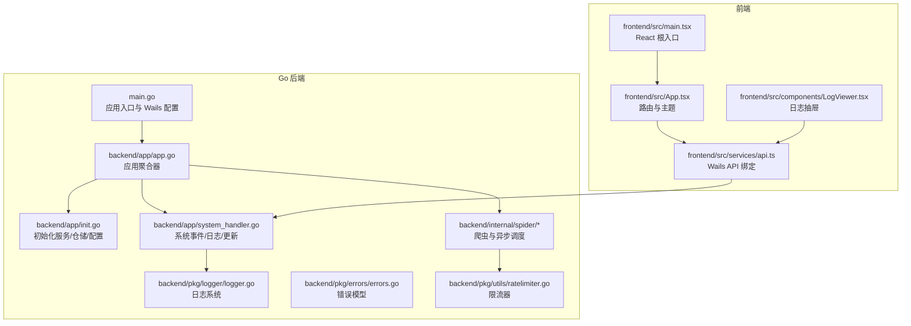
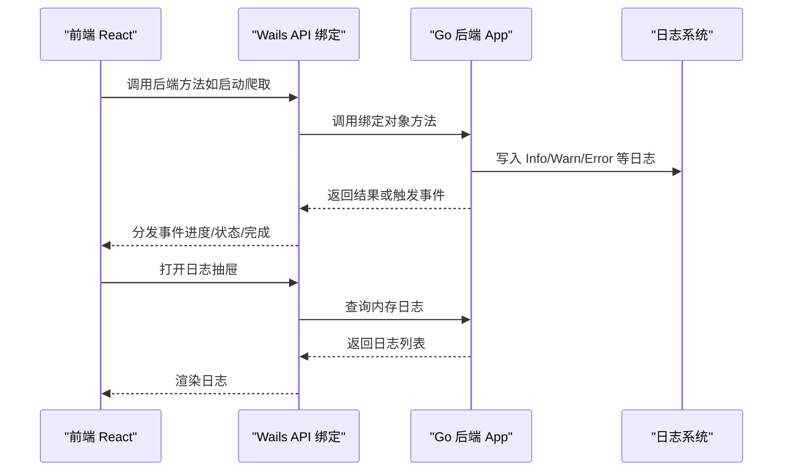
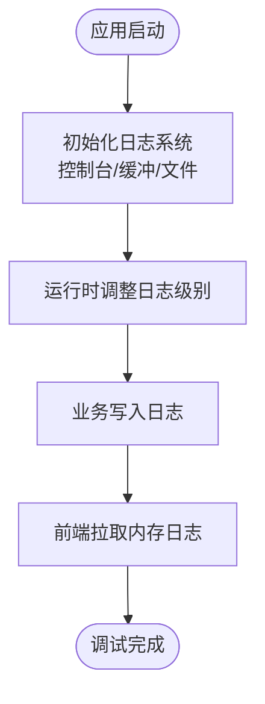
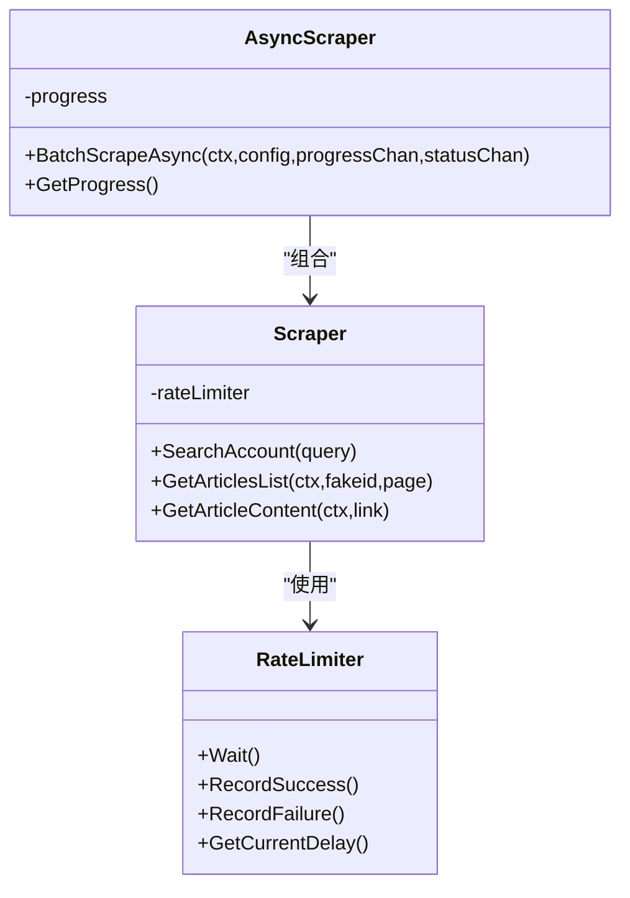
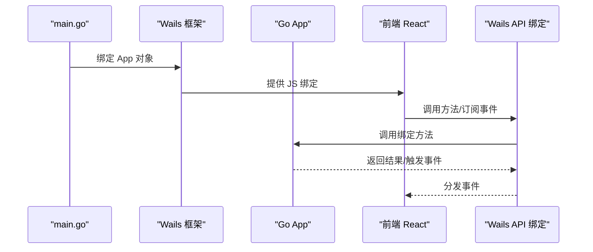
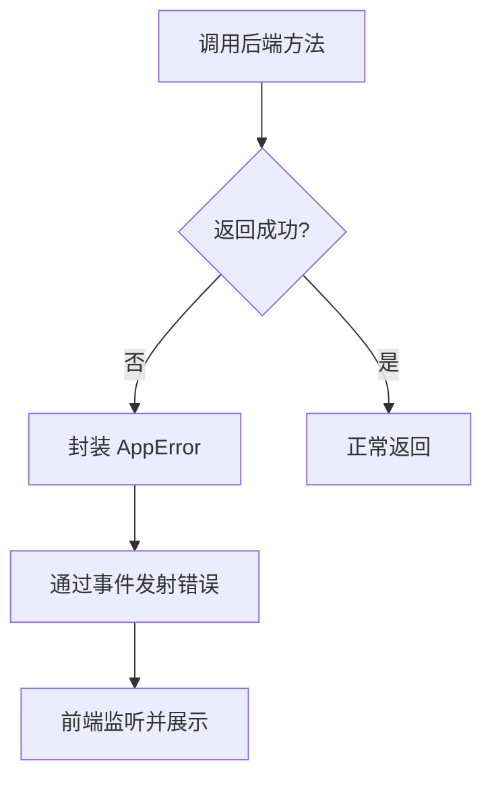
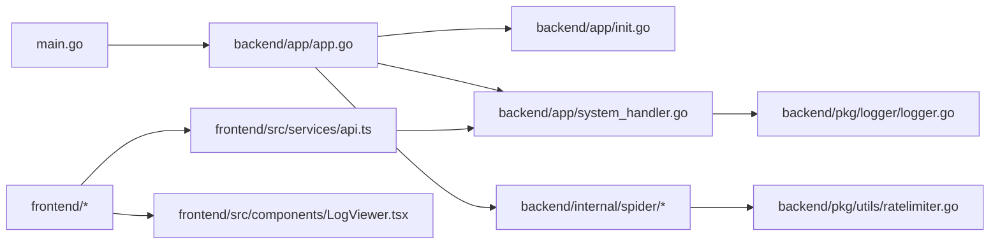

# 调试与性能分析

<cite>
**本文引用的文件**
- [main.go](file://main.go)
- [wails.json](file://wails.json)
- [backend/app/app.go](file://backend/app/app.go)
- [backend/app/init.go](file://backend/app/init.go)
- [backend/app/system_handler.go](file://backend/app/system_handler.go)
- [backend/internal/spider/scraper.go](file://backend/internal/spider/scraper.go)
- [backend/internal/spider/async_scraper.go](file://backend/internal/spider/async_scraper.go)
- [backend/pkg/logger/logger.go](file://backend/pkg/logger/logger.go)
- [backend/pkg/errors/errors.go](file://backend/pkg/errors/errors.go)
- [backend/pkg/utils/ratelimiter.go](file://backend/pkg/utils/ratelimiter.go)
- [frontend/src/main.tsx](file://frontend/src/main.tsx)
- [frontend/src/App.tsx](file://frontend/src/App.tsx)
- [frontend/src/services/api.ts](file://frontend/src/services/api.ts)
- [frontend/src/components/LogViewer.tsx](file://frontend/src/components/LogViewer.tsx)
</cite>

## 目录
1. [简介](#简介)
2. [项目结构](#项目结构)
3. [核心组件](#核心组件)
4. [架构总览](#架构总览)
5. [详细组件分析](#详细组件分析)
6. [依赖关系分析](#依赖关系分析)
7. [性能考量](#性能考量)
8. [故障排查指南](#故障排查指南)
9. [结论](#结论)
10. [附录](#附录)

## 简介
本指南面向 WeMediaSpider 的开发者与运维人员，聚焦于开发与生产环境下的调试与性能分析。内容涵盖：
- 开发阶段的断点调试、日志分析与错误追踪方法
- 前后端协同调试（Wails 框架下的 JS/Go 交互）
- 性能分析工具使用（Go pprof、Chrome DevTools）
- 内存泄漏检测与性能瓶颈定位
- 常见问题诊断流程与解决方案
- 生产环境问题排查最佳实践

## 项目结构
WeMediaSpider 采用 Wails v2 架构，后端为 Go 应用，前端为 React/Vite。应用入口在 Go 层初始化 Wails 并绑定业务对象，前端通过 Wails JS 绑定调用后端能力。

**图表来源**
- [main.go:23-90](file://main.go#L23-L90)
- [backend/app/app.go:25-83](file://backend/app/app.go#L25-L83)
- [backend/app/init.go:43-134](file://backend/app/init.go#L43-L134)
- [backend/app/system_handler.go:22-105](file://backend/app/system_handler.go#L22-L105)
- [backend/internal/spider/scraper.go:25-69](file://backend/internal/spider/scraper.go#L25-L69)
- [backend/pkg/logger/logger.go:18-108](file://backend/pkg/logger/logger.go#L18-L108)
- [frontend/src/main.tsx:18-24](file://frontend/src/main.tsx#L18-L24)
- [frontend/src/App.tsx:15-85](file://frontend/src/App.tsx#L15-L85)
- [frontend/src/services/api.ts:48-101](file://frontend/src/services/api.ts#L48-L101)
- [frontend/src/components/LogViewer.tsx:11-82](file://frontend/src/components/LogViewer.tsx#L11-L82)

**章节来源**
- [main.go:23-90](file://main.go#L23-L90)
- [wails.json:1-29](file://wails.json#L1-L29)

## 核心组件
- 应用入口与 Wails 配置：负责单实例、窗口尺寸、资源嵌入、生命周期回调与绑定对象。
- 应用聚合器：集中管理登录、爬虫、缓存、数据库、调度、托盘、分析等子系统。
- 日志系统：控制台、内存缓冲、文件输出三路核心，支持运行时动态调整级别。
- 爬虫与异步调度：基于 RateLimiter 的串行化请求，支持取消、进度与状态事件。
- 错误模型：统一 AppError，便于前端识别与展示。
- 前端 API 绑定与日志抽屉：通过 Wails JS 绑定调用后端，前端实时查看日志。

**章节来源**
- [backend/app/app.go:25-83](file://backend/app/app.go#L25-L83)
- [backend/pkg/logger/logger.go:18-108](file://backend/pkg/logger/logger.go#L18-L108)
- [backend/internal/spider/async_scraper.go:31-273](file://backend/internal/spider/async_scraper.go#L31-L273)
- [backend/pkg/errors/errors.go:27-40](file://backend/pkg/errors/errors.go#L27-L40)
- [frontend/src/services/api.ts:48-101](file://frontend/src/services/api.ts#L48-L101)
- [frontend/src/components/LogViewer.tsx:11-82](file://frontend/src/components/LogViewer.tsx#L11-L82)

## 架构总览
Wails 在 Go 层创建窗口与绑定对象，在前端通过 JS 调用后端方法并接收事件。系统通过内存日志缓冲与文件日志双通道输出，便于开发与生产环境的快速定位。

**图表来源**
- [frontend/src/services/api.ts:104-160](file://frontend/src/services/api.ts#L104-L160)
- [backend/app/system_handler.go:576-600](file://backend/app/system_handler.go#L576-L600)
- [frontend/src/components/LogViewer.tsx:16-46](file://frontend/src/components/LogViewer.tsx#L16-L46)

## 详细组件分析

### 日志系统与调试
- 初始化策略：控制台、内存缓冲、文件输出三路核心，失败时降级为仅 stdout。
- 动态级别：支持运行时调整日志级别，便于在不同阶段放大/缩小信息量。
- 日志查看：前端通过内存缓冲接口拉取日志，配合自动滚动与清空功能。

**图表来源**
- [backend/pkg/logger/logger.go:18-108](file://backend/pkg/logger/logger.go#L18-L108)
- [backend/app/system_handler.go:576-600](file://backend/app/system_handler.go#L576-L600)
- [frontend/src/components/LogViewer.tsx:16-46](file://frontend/src/components/LogViewer.tsx#L16-L46)

**章节来源**
- [backend/pkg/logger/logger.go:18-108](file://backend/pkg/logger/logger.go#L18-L108)
- [backend/app/system_handler.go:576-600](file://backend/app/system_handler.go#L576-L600)
- [frontend/src/components/LogViewer.tsx:11-82](file://frontend/src/components/LogViewer.tsx#L11-L82)

### 爬虫与异步调度（断点调试与取消）
- 串行化请求：所有网络请求通过 RateLimiter 串行等待，便于断点观察与限速控制。
- 取消机制：支持上下文取消，及时中断长时间请求。
- 进度与状态：通过通道向前端推送进度与状态事件，便于前端可视化与用户反馈。
- 失败自适应：失败计数影响等待间隔，避免频繁重试导致封禁。

**图表来源**
- [backend/internal/spider/scraper.go:25-69](file://backend/internal/spider/scraper.go#L25-L69)
- [backend/internal/spider/async_scraper.go:15-29](file://backend/internal/spider/async_scraper.go#L15-L29)
- [backend/pkg/utils/ratelimiter.go:12-132](file://backend/pkg/utils/ratelimiter.go#L12-L132)

**章节来源**
- [backend/internal/spider/async_scraper.go:31-273](file://backend/internal/spider/async_scraper.go#L31-L273)
- [backend/internal/spider/scraper.go:71-261](file://backend/internal/spider/scraper.go#L71-L261)
- [backend/pkg/utils/ratelimiter.go:41-98](file://backend/pkg/utils/ratelimiter.go#L41-L98)

### 前后端协同调试（Wails）
- 绑定对象：Go 层在 Wails 配置中绑定应用对象，前端通过 WailsJS 调用。
- 事件通信：后端通过事件发射器向前端推送进度、状态、完成等事件。
- 前端入口：React 根入口与路由配置，Ant Design 主题与国际化。
- 日志抽屉：前端抽屉组件通过 API 拉取日志并支持清空与自动滚动。

**图表来源**
- [main.go:75-77](file://main.go#L75-L77)
- [frontend/src/services/api.ts:48-101](file://frontend/src/services/api.ts#L48-L101)
- [frontend/src/App.tsx:15-85](file://frontend/src/App.tsx#L15-L85)

**章节来源**
- [main.go:75-77](file://main.go#L75-L77)
- [frontend/src/services/api.ts:104-160](file://frontend/src/services/api.ts#L104-L160)
- [frontend/src/App.tsx:15-85](file://frontend/src/App.tsx#L15-L85)

### 错误模型与追踪
- 统一错误类型：AppError 支持 Code/Message/Cause，便于前端识别与展示。
- 常见错误：登录、爬取、导出、配置等分类错误，便于快速定位模块。
- 前端事件：错误事件通过 Wails 事件系统分发，前端监听并提示用户。

**图表来源**
- [backend/pkg/errors/errors.go:27-40](file://backend/pkg/errors/errors.go#L27-L40)
- [frontend/src/services/api.ts:129-135](file://frontend/src/services/api.ts#L129-L135)

**章节来源**
- [backend/pkg/errors/errors.go:5-25](file://backend/pkg/errors/errors.go#L5-L25)
- [backend/pkg/errors/errors.go:27-40](file://backend/pkg/errors/errors.go#L27-L40)
- [frontend/src/services/api.ts:129-135](file://frontend/src/services/api.ts#L129-L135)

## 依赖关系分析
- 入口依赖：main.go 依赖 Wails 配置与窗口管理，绑定 App 对象。
- 应用聚合：App 聚合日志、配置、数据库、爬虫、调度、托盘等子系统。
- 爬虫链路：AsyncScraper 组合 Scraper，后者依赖 RateLimiter 与工具集。
- 前端依赖：API 绑定与事件监听，日志抽屉依赖后端日志接口。

**图表来源**
- [main.go:23-90](file://main.go#L23-L90)
- [backend/app/app.go:25-83](file://backend/app/app.go#L25-L83)
- [backend/app/init.go:43-134](file://backend/app/init.go#L43-L134)
- [backend/internal/spider/async_scraper.go:15-29](file://backend/internal/spider/async_scraper.go#L15-L29)
- [backend/pkg/utils/ratelimiter.go:12-132](file://backend/pkg/utils/ratelimiter.go#L12-L132)
- [backend/pkg/logger/logger.go:18-108](file://backend/pkg/logger/logger.go#L18-L108)
- [frontend/src/services/api.ts:48-101](file://frontend/src/services/api.ts#L48-L101)
- [frontend/src/components/LogViewer.tsx:11-82](file://frontend/src/components/LogViewer.tsx#L11-L82)

**章节来源**
- [main.go:23-90](file://main.go#L23-L90)
- [backend/app/app.go:25-83](file://backend/app/app.go#L25-L83)
- [backend/internal/spider/async_scraper.go:15-29](file://backend/internal/spider/async_scraper.go#L15-L29)

## 性能考量
- 串行化与限流：所有网络请求通过 RateLimiter 串行化，避免并发过高触发风控；失败时自适应延长等待。
- 日志成本控制：内存缓冲与文件输出分离，避免高频日志对性能的影响；生产环境建议提升日志级别。
- 前端渲染优化：日志抽屉定时轮询，建议在不可见时停止轮询以减少开销。
- 爬取流程：串行获取文章列表与内容，避免过度并发；支持取消，防止长时间阻塞。

**章节来源**
- [backend/pkg/utils/ratelimiter.go:41-98](file://backend/pkg/utils/ratelimiter.go#L41-L98)
- [backend/pkg/logger/logger.go:18-108](file://backend/pkg/logger/logger.go#L18-L108)
- [frontend/src/components/LogViewer.tsx:40-46](file://frontend/src/components/LogViewer.tsx#L40-L46)
- [backend/internal/spider/async_scraper.go:31-273](file://backend/internal/spider/async_scraper.go#L31-L273)

## 故障排查指南
- 启动与单实例
  - 症状：应用无法启动或重复启动
  - 排查：检查单实例检测逻辑与窗口标题；确认 Wails 配置与资源嵌入
  - 参考
    - [main.go:33-40](file://main.go#L33-L40)
    - [wails.json:1-29](file://wails.json#L1-L29)

- 爬取失败与风控
  - 症状：频繁“频率限制”或返回空
  - 排查：检查 RateLimiter 的等待间隔与失败计数；查看日志中“频率限制”提示；适当增大间隔
  - 参考
    - [backend/internal/spider/async_scraper.go:110-122](file://backend/internal/spider/async_scraper.go#L110-L122)
    - [backend/pkg/utils/ratelimiter.go:67-98](file://backend/pkg/utils/ratelimiter.go#L67-L98)

- 登录与认证
  - 症状：登录失败或 Token 过期
  - 排查：查看登录相关错误类型与日志；确认 Token 生命周期与刷新策略
  - 参考
    - [backend/pkg/errors/errors.go:5-16](file://backend/pkg/errors/errors.go#L5-L16)

- 日志与调试
  - 症状：日志缺失或前端无法显示
  - 排查：确认日志初始化与文件路径；检查内存缓冲是否可用；前端轮询是否开启
  - 参考
    - [backend/pkg/logger/logger.go:18-108](file://backend/pkg/logger/logger.go#L18-L108)
    - [backend/app/system_handler.go:576-600](file://backend/app/system_handler.go#L576-L600)
    - [frontend/src/components/LogViewer.tsx:16-46](file://frontend/src/components/LogViewer.tsx#L16-L46)

- 前后端事件
  - 症状：前端收不到进度/状态/完成事件
  - 排查：确认事件名一致；检查后端事件发射；确认前端订阅
  - 参考
    - [frontend/src/services/api.ts:104-160](file://frontend/src/services/api.ts#L104-L160)
    - [backend/app/system_handler.go:75-85](file://backend/app/system_handler.go#L75-L85)

- 生产环境最佳实践
  - 使用较低日志级别（如 info）以减少 IO
  - 通过命令行参数控制静默启动与托盘行为
  - 定期清理日志文件与缓存
  - 使用事件驱动的进度上报，避免前端轮询造成额外负载

**章节来源**
- [main.go:33-40](file://main.go#L33-L40)
- [backend/internal/spider/async_scraper.go:110-122](file://backend/internal/spider/async_scraper.go#L110-L122)
- [backend/pkg/utils/ratelimiter.go:67-98](file://backend/pkg/utils/ratelimiter.go#L67-L98)
- [backend/pkg/errors/errors.go:5-16](file://backend/pkg/errors/errors.go#L5-L16)
- [backend/pkg/logger/logger.go:18-108](file://backend/pkg/logger/logger.go#L18-L108)
- [backend/app/system_handler.go:576-600](file://backend/app/system_handler.go#L576-L600)
- [frontend/src/components/LogViewer.tsx:16-46](file://frontend/src/components/LogViewer.tsx#L16-L46)
- [frontend/src/services/api.ts:104-160](file://frontend/src/services/api.ts#L104-L160)
- [backend/app/system_handler.go:75-85](file://backend/app/system_handler.go#L75-L85)

## 结论
通过统一的日志系统、串行化的爬取与限流、清晰的前后端事件通信，WeMediaSpider 在开发与生产环境中具备良好的可观测性与可控性。结合本文提供的调试与性能分析方法，可高效定位问题并持续优化系统表现。

## 附录
- 调试工具建议
  - Go pprof：在开发阶段对 CPU/内存进行采样，定位热点函数与分配点
  - Chrome DevTools：分析前端渲染与网络请求，监控事件轮询频率
  - Wails 开发服务器：热更新与断点调试，提升前后端联调效率