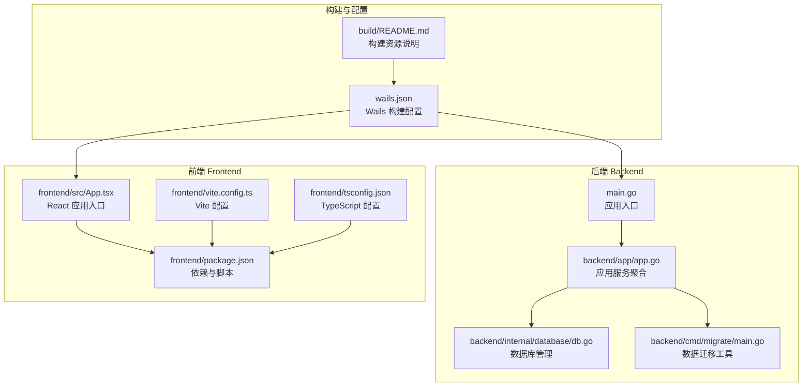
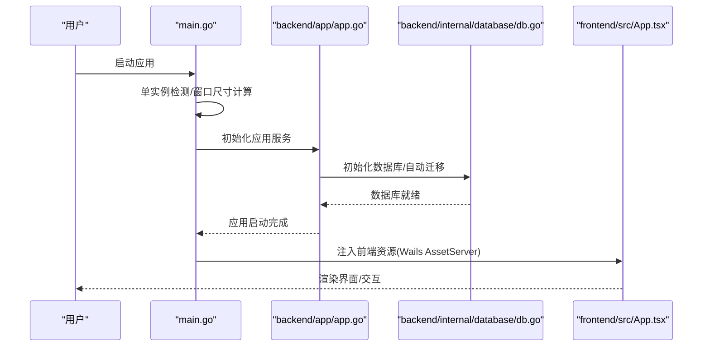
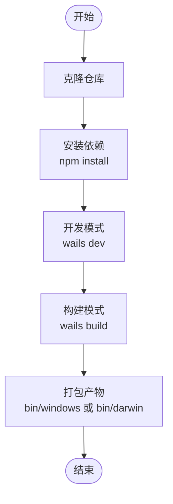
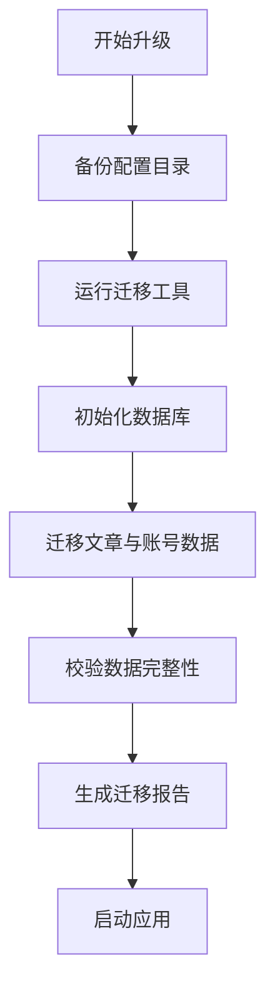
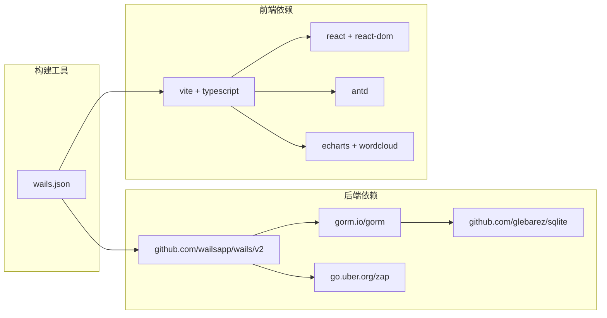

# 快速开始

<cite>
**本文引用的文件**
- [README.md](file://README.md)
- [main.go](file://main.go)
- [go.mod](file://go.mod)
- [frontend/package.json](file://frontend/package.json)
- [wails.json](file://wails.json)
- [backend/cmd/migrate/main.go](file://backend/cmd/migrate/main.go)
- [backend/app/app.go](file://backend/app/app.go)
- [backend/internal/database/db.go](file://backend/internal/database/db.go)
- [frontend/vite.config.ts](file://frontend/vite.config.ts)
- [frontend/tsconfig.json](file://frontend/tsconfig.json)
- [build/README.md](file://build/README.md)
- [SECURITY.md](file://SECURITY.md)
</cite>

## 目录
1. [简介](#简介)
2. [项目结构](#项目结构)
3. [核心组件](#核心组件)
4. [架构总览](#架构总览)
5. [详细组件分析](#详细组件分析)
6. [依赖关系分析](#依赖关系分析)
7. [性能考虑](#性能考虑)
8. [故障排除指南](#故障排除指南)
9. [结论](#结论)
10. [附录](#附录)

## 简介
WeMediaSpider 是一款基于 Go 与 Wails v2 的桌面端微信公众号文章智能爬虫工具，支持批量爬取、定时任务、数据分析、多格式导出、图片下载、数据库存储与专业级安全架构。项目提供两种使用方式：直接下载使用与从源码开发。对于 v2.0.0 架构重构后的用户，强烈建议全新安装以获得最佳体验。

## 项目结构
项目采用前后端分离的双栈架构，后端使用 Go + Wails v2 + SQLite + GORM，前端使用 React + TypeScript + Ant Design + Vite。整体结构清晰，便于开发与维护。

**图示来源**
- [main.go:1-91](file://main.go#L1-L91)
- [backend/app/app.go:1-85](file://backend/app/app.go#L1-L85)
- [backend/internal/database/db.go:1-115](file://backend/internal/database/db.go#L1-L115)
- [backend/cmd/migrate/main.go:1-332](file://backend/cmd/migrate/main.go#L1-L332)
- [frontend/src/App.tsx](file://frontend/src/App.tsx)
- [frontend/vite.config.ts:1-8](file://frontend/vite.config.ts#L1-L8)
- [frontend/tsconfig.json:1-32](file://frontend/tsconfig.json#L1-L32)
- [frontend/package.json:1-30](file://frontend/package.json#L1-L30)
- [wails.json:1-29](file://wails.json#L1-L29)
- [build/README.md:1-35](file://build/README.md#L1-L35)

**章节来源**
- [README.md:86-103](file://README.md#L86-L103)
- [wails.json:1-29](file://wails.json#L1-L29)
- [build/README.md:1-35](file://build/README.md#L1-L35)

## 核心组件
- 应用入口与窗口管理：应用入口负责初始化应用、单实例检测、窗口尺寸计算与 Wails 生命周期绑定；同时集成托盘与最小化到托盘等行为。
- 应用服务聚合：应用结构体聚合登录管理、爬虫、缓存、数据库、任务调度、托盘与自启动等功能模块。
- 数据库管理：基于 SQLite + GORM，启用 WAL 模式、连接池与外键约束，提供自动迁移能力。
- 数据迁移工具：针对 v2.0.0 架构重构，提供从旧版 JSON 数据到新数据库的迁移流程，包含备份、迁移、校验与报告生成。

**章节来源**
- [main.go:23-90](file://main.go#L23-L90)
- [backend/app/app.go:25-83](file://backend/app/app.go#L25-L83)
- [backend/internal/database/db.go:18-115](file://backend/internal/database/db.go#L18-L115)
- [backend/cmd/migrate/main.go:37-124](file://backend/cmd/migrate/main.go#L37-L124)

## 架构总览
WeMediaSpider 采用桌面应用架构，后端通过 Wails 将 Go 服务暴露给前端 React 应用。应用启动时初始化数据库、服务与托盘，并在开发模式下通过 Wails Dev Server 提供热更新，在构建模式下打包为独立可执行文件。

**图示来源**
- [main.go:23-90](file://main.go#L23-L90)
- [backend/app/app.go:52-83](file://backend/app/app.go#L52-L83)
- [backend/internal/database/db.go:24-109](file://backend/internal/database/db.go#L24-L109)

## 详细组件分析

### 安装与使用
- 下载使用（推荐）
  - 访问 Releases 页面，下载对应平台的安装包或便携版，解压后运行即可。
  - 重要提示：v2.0.0 架构重构，建议全新安装。
- 从旧版本升级
  - 建议先备份数据目录，然后运行迁移工具将旧版 JSON 数据迁移到新数据库，最后启动应用。

**章节来源**
- [README.md:25-46](file://README.md#L25-L46)

### 开发环境与最低要求
- Go 1.18+：项目使用 Go 1.25.0，建议本地保持一致或更高版本。
- Node.js 16+：前端使用 Vite + React + TypeScript，需满足 Node.js 16+。
- Wails CLI：用于开发模式与构建，需全局安装并配置。

**章节来源**
- [README.md:49-54](file://README.md#L49-L54)
- [go.mod:1-3](file://go.mod#L1-L3)
- [frontend/package.json:1-30](file://frontend/package.json#L1-L30)
- [wails.json:5-8](file://wails.json#L5-L8)

### 开发模式与构建模式
- 开发模式
  - 克隆仓库后，使用 Wails CLI 启动开发服务器，前端通过 Vite 热更新，后端通过 Wails Dev Server 注入资源。
- 构建模式
  - 使用 Wails CLI 打包应用，按平台生成可执行文件与安装包，Windows 安装器包含 WebView2 运行库安装选项。

**图示来源**
- [README.md:55-70](file://README.md#L55-L70)
- [wails.json:5-8](file://wails.json#L5-L8)
- [frontend/package.json:6-10](file://frontend/package.json#L6-L10)

**章节来源**
- [README.md:55-70](file://README.md#L55-L70)
- [wails.json:5-8](file://wails.json#L5-L8)
- [frontend/package.json:6-10](file://frontend/package.json#L6-L10)

### 数据备份与升级
- 数据备份
  - 在升级前，建议复制用户配置目录至备份位置，避免数据丢失。
- 升级流程
  - 运行迁移工具，自动备份旧版 JSON 文件，初始化数据库并执行自动迁移，最后生成迁移报告。
- 全新安装建议
  - v2.0.0 架构重构，强烈建议全新安装以避免兼容性问题。

**图示来源**
- [README.md:33-46](file://README.md#L33-L46)
- [backend/cmd/migrate/main.go:69-124](file://backend/cmd/migrate/main.go#L69-L124)

**章节来源**
- [README.md:33-46](file://README.md#L33-L46)
- [backend/cmd/migrate/main.go:37-124](file://backend/cmd/migrate/main.go#L37-L124)

### 安全与配置
- 安全架构
  - 敏感文件采用 AES-256-GCM 加密与 HMAC-SHA256 完整性校验，主密钥通过 PBKDF2 派生，文件权限严格限制为 0600。
- 配置位置
  - 所有配置与数据位于用户主目录下的隐藏目录中，包含主密钥、登录缓存、数据库与日志等文件。

**章节来源**
- [SECURITY.md:1-260](file://SECURITY.md#L1-L260)
- [backend/internal/database/db.go:25-68](file://backend/internal/database/db.go#L25-L68)

## 依赖关系分析
后端依赖 Wails v2、GORM、SQLite 等核心库；前端依赖 React、Ant Design、ECharts 等生态库；构建阶段由 Wails 统一协调。

**图示来源**
- [go.mod:5-22](file://go.mod#L5-L22)
- [frontend/package.json:11-28](file://frontend/package.json#L11-L28)
- [wails.json:1-29](file://wails.json#L1-L29)

**章节来源**
- [go.mod:1-85](file://go.mod#L1-L85)
- [frontend/package.json:1-30](file://frontend/package.json#L1-L30)
- [wails.json:1-29](file://wails.json#L1-L29)

## 性能考虑
- 数据库优化
  - 启用 WAL 模式、设置连接池上限与生命周期、开启外键约束与同步模式平衡，提升并发与一致性。
- 前端构建
  - Vite 提供快速冷启动与热更新；TypeScript 严格类型检查降低运行时错误风险。
- 应用启动
  - 单实例检测与窗口尺寸动态计算减少资源浪费；静默启动可隐藏到托盘。

**章节来源**
- [backend/internal/database/db.go:54-61](file://backend/internal/database/db.go#L54-L61)
- [frontend/vite.config.ts:1-8](file://frontend/vite.config.ts#L1-L8)
- [frontend/tsconfig.json:14-21](file://frontend/tsconfig.json#L14-L21)
- [main.go:35-39](file://main.go#L35-L39)

## 故障排除指南
- 开发模式无法启动
  - 确认 Node.js 16+ 与 Wails CLI 已正确安装；检查前端依赖安装与端口占用情况。
- 构建失败
  - 检查平台依赖（如 Windows WebView2 运行库）与签名证书；参考构建资源说明调整图标与清单文件。
- 数据迁移异常
  - 确认旧版数据目录存在且可读；查看迁移日志与报告定位具体错误；必要时回滚备份并重试。
- 安全相关问题
  - 若 HMAC 校验失败，检查文件完整性与权限；确认主密钥文件存在且权限为 0600；必要时重新生成主密钥并重新登录。

**章节来源**
- [README.md:55-70](file://README.md#L55-L70)
- [build/README.md:19-35](file://build/README.md#L19-L35)
- [backend/cmd/migrate/main.go:69-124](file://backend/cmd/migrate/main.go#L69-L124)
- [SECURITY.md:157-169](file://SECURITY.md#L157-L169)

## 结论
通过本快速开始指南，您可以在最短时间内完成 WeMediaSpider 的安装与运行。建议优先使用下载版快速体验，若需深度定制或贡献代码，请按开发模式进行本地搭建。对于 v2.0.0 用户，务必遵循全新安装与数据迁移的最佳实践，确保数据安全与功能稳定。

## 附录
- 数据库位置：用户主目录下的隐藏目录中，包含主数据库与缓存数据库。
- 常用命令参考
  - 开发模式：wails dev
  - 构建模式：wails build
  - 迁移工具：go run backend/cmd/migrate/main.go

**章节来源**
- [README.md:78-78](file://README.md#L78-L78)
- [README.md:55-70](file://README.md#L55-L70)
- [backend/cmd/migrate/main.go:37-66](file://backend/cmd/migrate/main.go#L37-L66)