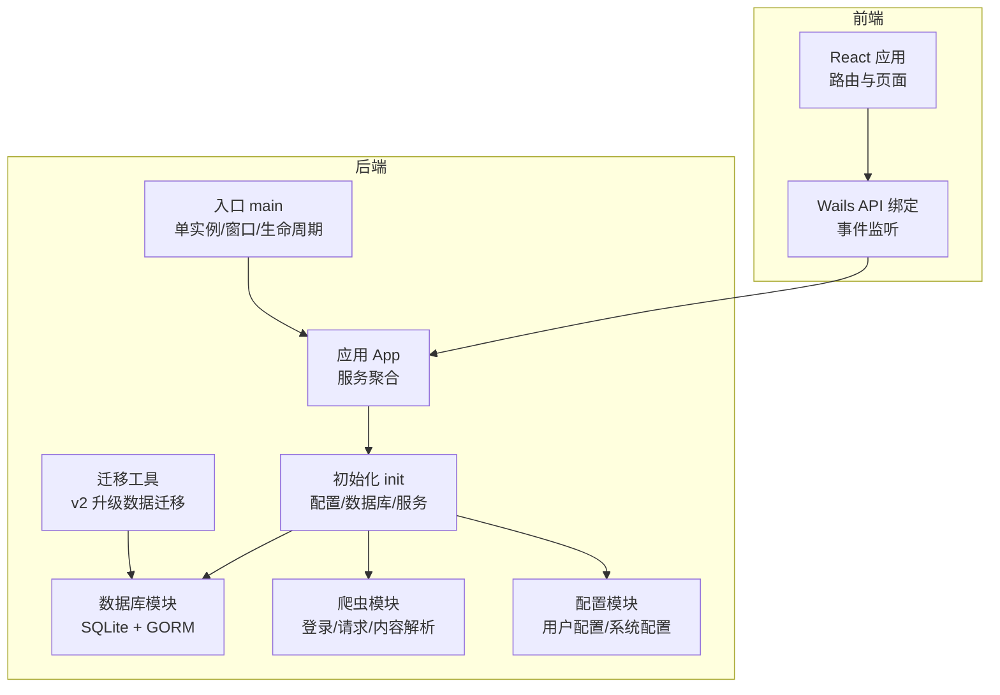
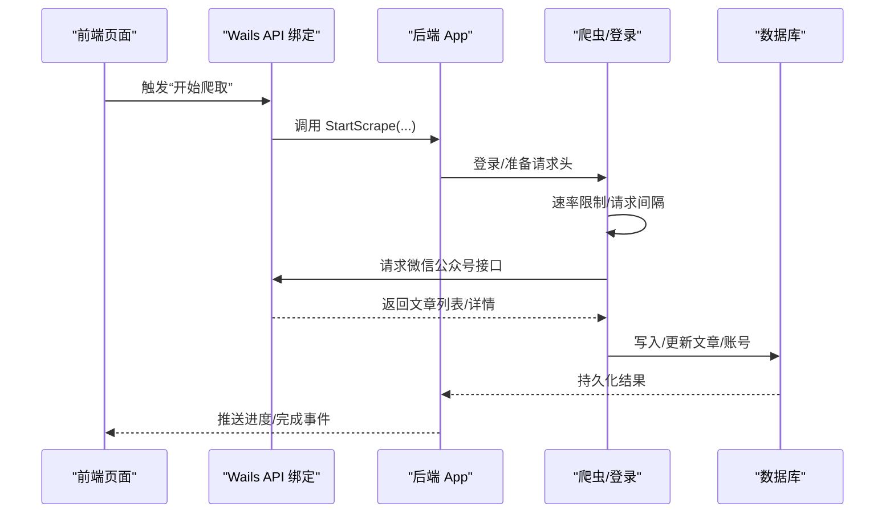
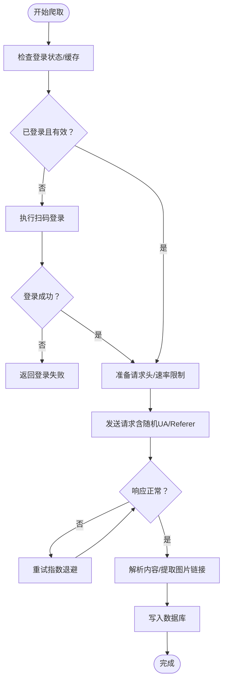
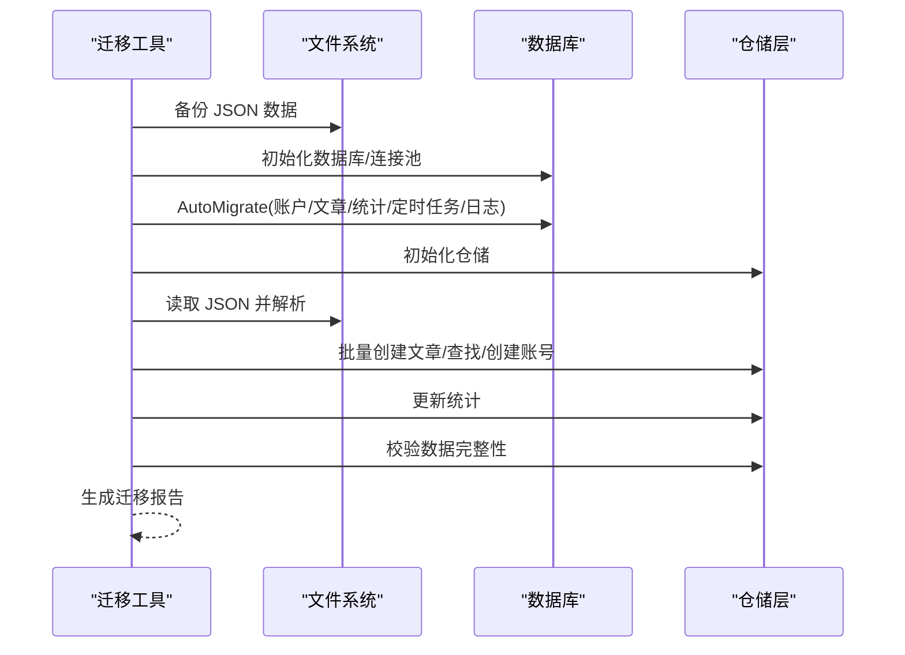
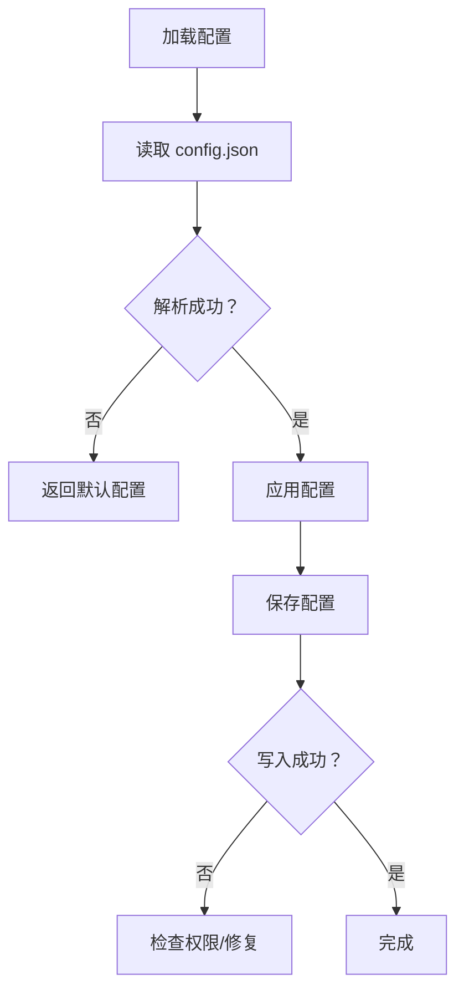
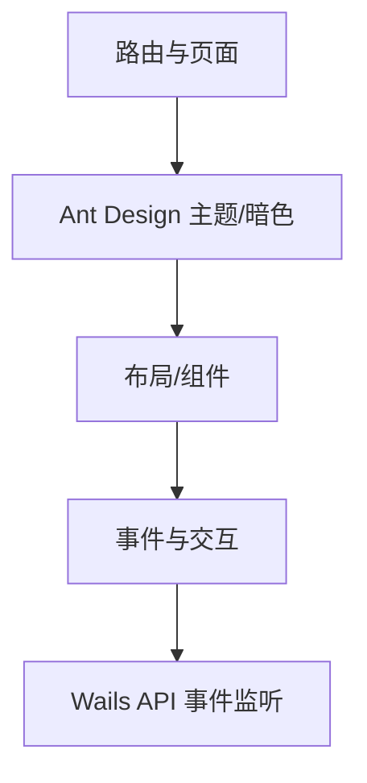
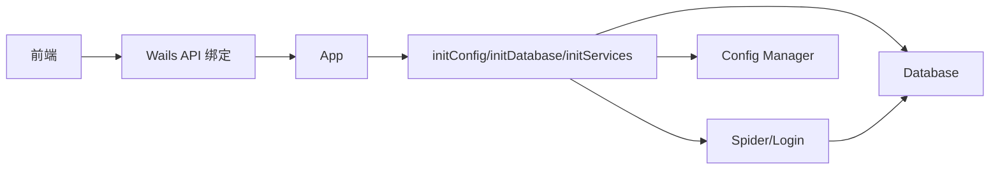

# 常见问题排查

<cite>
**本文引用的文件**
- [README.md](file://README.md)
- [main.go](file://main.go)
- [backend/app/init.go](file://backend/app/init.go)
- [backend/app/app.go](file://backend/app/app.go)
- [backend/internal/database/db.go](file://backend/internal/database/db.go)
- [backend/cmd/migrate/main.go](file://backend/cmd/migrate/main.go)
- [backend/internal/spider/scraper.go](file://backend/internal/spider/scraper.go)
- [backend/internal/spider/login.go](file://backend/internal/spider/login.go)
- [backend/internal/config/manager.go](file://backend/internal/config/manager.go)
- [backend/internal/models/config.go](file://backend/internal/models/config.go)
- [backend/internal/database/models/account.go](file://backend/internal/database/models/account.go)
- [backend/internal/database/models/article.go](file://backend/internal/database/models/article.go)
- [backend/pkg/errors/errors.go](file://backend/pkg/errors/errors.go)
- [backend/pkg/logger/logger.go](file://backend/pkg/logger/logger.go)
- [frontend/src/App.tsx](file://frontend/src/App.tsx)
- [frontend/src/services/api.ts](file://frontend/src/services/api.ts)
- [wails.json](file://wails.json)
</cite>

## 目录
1. [简介](#简介)
2. [项目结构](#项目结构)
3. [核心组件](#核心组件)
4. [架构总览](#架构总览)
5. [详细组件分析与故障排查](#详细组件分析与故障排查)
6. [依赖关系分析](#依赖关系分析)
7. [性能问题识别与优化](#性能问题识别与优化)
8. [故障排查指南](#故障排查指南)
9. [结论](#结论)
10. [附录：问题自检清单与快速修复步骤](#附录问题自检清单与快速修复步骤)

## 简介
本指南面向 WeMediaSpider 用户与运维人员，聚焦“爬取失败”“数据库问题”“配置与权限问题”“性能问题”“界面问题”等常见场景，提供系统化的诊断思路、定位方法与修复步骤，并配套可视化图示帮助快速定位根因。

## 项目结构
WeMediaSpider 采用前后端分离架构：前端基于 React + TypeScript，后端基于 Go + Wails v2，通过 Wails JS 绑定实现桌面端集成。数据库采用 SQLite + GORM，支持自动迁移与 WAL 模式优化。

**图示来源**
- [main.go:23-91](file://main.go#L23-L91)
- [backend/app/app.go:25-85](file://backend/app/app.go#L25-L85)
- [backend/app/init.go:43-135](file://backend/app/init.go#L43-L135)
- [backend/internal/database/db.go:18-115](file://backend/internal/database/db.go#L18-L115)
- [backend/internal/spider/scraper.go:25-541](file://backend/internal/spider/scraper.go#L25-L541)
- [backend/internal/config/manager.go:11-69](file://backend/internal/config/manager.go#L11-L69)
- [backend/cmd/migrate/main.go:37-124](file://backend/cmd/migrate/main.go#L37-L124)

**章节来源**
- [README.md:86-103](file://README.md#L86-L103)
- [wails.json:1-29](file://wails.json#L1-L29)

## 核心组件
- 应用入口与生命周期：负责单实例、窗口尺寸、启动/关闭回调、绑定后端能力。
- 初始化流程：加载系统配置、建立数据库连接并自动迁移、初始化服务（登录、调度、分析）。
- 数据库模块：SQLite + GORM，启用 WAL、外键、缓存大小、连接池与同步策略。
- 爬虫模块：封装登录、账号搜索、文章列表获取、内容解析与图片处理，内置速率限制与重试。
- 配置模块：用户配置与系统配置的读写与默认值。
- 迁移工具：v2 升级专用，备份 JSON、初始化数据库、迁移数据、校验与生成报告。

**章节来源**
- [backend/app/app.go:25-85](file://backend/app/app.go#L25-L85)
- [backend/app/init.go:43-135](file://backend/app/init.go#L43-L135)
- [backend/internal/database/db.go:18-115](file://backend/internal/database/db.go#L18-L115)
- [backend/internal/spider/scraper.go:25-541](file://backend/internal/spider/scraper.go#L25-L541)
- [backend/internal/config/manager.go:11-69](file://backend/internal/config/manager.go#L11-L69)
- [backend/cmd/migrate/main.go:37-124](file://backend/cmd/migrate/main.go#L37-L124)

## 架构总览
后端通过 Wails 将 Go 服务暴露给前端，前端通过 API 绑定调用后端能力，后端内部按职责分层：应用层聚合服务，服务层负责业务编排，数据层负责持久化与迁移。

**图示来源**
- [frontend/src/services/api.ts:48-101](file://frontend/src/services/api.ts#L48-L101)
- [backend/internal/spider/scraper.go:72-261](file://backend/internal/spider/scraper.go#L72-L261)
- [backend/internal/database/db.go:81-109](file://backend/internal/database/db.go#L81-L109)

## 详细组件分析与故障排查

### 爬取失败排查
常见原因与对策：
- 网络连接问题
  - 现象：请求超时、响应为空、状态码异常。
  - 排查要点：检查代理/防火墙、DNS 解析、目标站点可达性；查看日志中请求头与响应体长度。
  - 参考实现：请求超时、随机 UA、速率限制与重试。
- 反爬虫机制
  - 现象：返回空内容、提示需要验证码或登录态失效。
  - 排查要点：确认登录缓存有效、Cookie 正确、User-Agent 随机化；必要时降低并发与请求间隔。
  - 参考实现：UA 随机化、速率限制器、重试与失败记录。
- 验证码/登录态问题
  - 现象：URL 不含 token、登录超时或被浏览器关闭。
  - 排查要点：重新扫码登录、检查浏览器安装、确认登录缓存未过期。
  - 参考实现：登录轮询、超时控制、缓存读写与过期判断。

**图示来源**
- [backend/internal/spider/login.go:58-215](file://backend/internal/spider/login.go#L58-L215)
- [backend/internal/spider/scraper.go:263-442](file://backend/internal/spider/scraper.go#L263-L442)

**章节来源**
- [backend/internal/spider/scraper.go:72-261](file://backend/internal/spider/scraper.go#L72-L261)
- [backend/internal/spider/login.go:58-215](file://backend/internal/spider/login.go#L58-L215)

### 数据库连接失败与迁移错误
- 数据库连接失败
  - 现象：初始化失败、AutoMigrate 报错、连接池配置异常。
  - 排查要点：确认用户目录可写、数据库文件存在且可访问、WAL/外键/缓存参数生效。
  - 参考实现：路径拼接、连接池配置、PRAGMA 设置。
- 数据迁移错误
  - 现象：迁移失败、统计记录初始化失败、数据完整性校验失败。
  - 排查要点：检查 JSON 备份目录、仓储初始化、批量插入与统计更新。
  - 参考实现：迁移步骤（备份→初始化→迁移→校验→报告）。

**图示来源**
- [backend/cmd/migrate/main.go:68-124](file://backend/cmd/migrate/main.go#L68-L124)
- [backend/internal/database/db.go:81-109](file://backend/internal/database/db.go#L81-L109)

**章节来源**
- [backend/internal/database/db.go:18-115](file://backend/internal/database/db.go#L18-L115)
- [backend/cmd/migrate/main.go:68-332](file://backend/cmd/migrate/main.go#L68-L332)

### 配置文件损坏与权限问题
- 配置文件损坏
  - 现象：解析失败、返回默认配置。
  - 排查要点：检查 config.json 格式、权限、是否存在；必要时删除以恢复默认。
  - 参考实现：加载失败返回默认配置、保存时使用缩进格式。
- 权限问题
  - 现象：无法创建目录、写入失败、日志文件输出降级。
  - 排查要点：检查用户目录权限、日志目录创建、文件写入权限。
  - 参考实现：日志初始化降级策略、目录创建失败时仅控制台输出。

**图示来源**
- [backend/internal/config/manager.go:27-51](file://backend/internal/config/manager.go#L27-L51)
- [backend/pkg/logger/logger.go:18-85](file://backend/pkg/logger/logger.go#L18-L85)

**章节来源**
- [backend/internal/config/manager.go:11-69](file://backend/internal/config/manager.go#L11-L69)
- [backend/pkg/logger/logger.go:18-109](file://backend/pkg/logger/logger.go#L18-L109)

### 性能问题识别与优化
- 内存占用过高
  - 现象：爬取过程中内存持续增长。
  - 排查要点：检查文章内容与图片链接收集、Markdown 转换、去重与排序；适当降低并发与请求间隔。
- CPU 使用率异常
  - 现象：高频重试、解析耗时、选择器遍历。
  - 排查要点：减少重试次数、优化选择器链路、启用更严格的速率限制。
- 磁盘空间不足
  - 现象：导出/日志/缓存写入失败。
  - 排查要点：清理日志与缓存、调整日志轮转参数、检查输出目录空间。

**章节来源**
- [backend/internal/spider/scraper.go:263-442](file://backend/internal/spider/scraper.go#L263-L442)
- [backend/pkg/logger/logger.go:72-81](file://backend/pkg/logger/logger.go#L72-L81)

### 用户界面问题排查
- 页面加载失败
  - 现象：路由不生效、组件未渲染。
  - 排查要点：检查路由定义、Ant Design 主题与暗色模式、全局样式。
- 组件渲染异常
  - 现象：输入框焦点未全选、按钮高度/字体不一致。
  - 排查要点：检查主题配置、组件样式覆盖、事件绑定。

**图示来源**
- [frontend/src/App.tsx:15-88](file://frontend/src/App.tsx#L15-L88)
- [frontend/src/services/api.ts:103-161](file://frontend/src/services/api.ts#L103-L161)

**章节来源**
- [frontend/src/App.tsx:15-88](file://frontend/src/App.tsx#L15-L88)
- [frontend/src/services/api.ts:48-101](file://frontend/src/services/api.ts#L48-L101)

## 依赖关系分析
- 应用层依赖初始化层，初始化层负责配置、数据库与服务装配。
- 爬虫模块依赖登录模块与速率限制器，同时与数据库进行读写。
- 前端通过 Wails API 绑定调用后端能力，后端通过事件推送进度与状态。

**图示来源**
- [backend/app/app.go:25-85](file://backend/app/app.go#L25-L85)
- [backend/app/init.go:43-135](file://backend/app/init.go#L43-L135)
- [frontend/src/services/api.ts:48-101](file://frontend/src/services/api.ts#L48-L101)

**章节来源**
- [backend/app/init.go:43-135](file://backend/app/init.go#L43-L135)
- [backend/app/app.go:25-85](file://backend/app/app.go#L25-L85)

## 性能问题识别与优化
- 日志级别与缓冲：通过运行时调整日志级别，减少 IO 压力；必要时降低日志轮转频率。
- 数据库参数：WAL 模式、外键、缓存大小与连接池已预设，确保磁盘与并发匹配。
- 爬取策略：合理设置请求间隔、最大并发与重试次数，避免触发反爬机制。

**章节来源**
- [backend/pkg/logger/logger.go:87-101](file://backend/pkg/logger/logger.go#L87-L101)
- [backend/internal/database/db.go:49-62](file://backend/internal/database/db.go#L49-L62)
- [backend/internal/spider/scraper.go:55-69](file://backend/internal/spider/scraper.go#L55-L69)

## 故障排查指南

### 爬取失败
- 检查登录状态与缓存
  - 若登录缓存过期或损坏，重新扫码登录；确认 Cookie 与 Token 有效。
- 网络与反爬
  - 降低并发与请求间隔，启用随机 UA；检查代理/防火墙；观察日志中响应状态与长度。
- 内容解析
  - 若内容选择器均失败，查看 HTML 片段；确认微信文章结构变化时的适配。

**章节来源**
- [backend/internal/spider/login.go:317-427](file://backend/internal/spider/login.go#L317-L427)
- [backend/internal/spider/scraper.go:295-442](file://backend/internal/spider/scraper.go#L295-L442)

### 数据库问题
- 连接失败
  - 确认用户目录可写、数据库文件存在；检查 PRAGMA 设置与连接池参数。
- 迁移失败
  - 按迁移工具步骤执行：备份 JSON、初始化数据库、迁移数据、校验与报告。

**章节来源**
- [backend/internal/database/db.go:18-115](file://backend/internal/database/db.go#L18-L115)
- [backend/cmd/migrate/main.go:68-124](file://backend/cmd/migrate/main.go#L68-L124)

### 配置与权限问题
- 配置文件损坏
  - 删除 config.json 以恢复默认；检查权限与格式。
- 权限问题
  - 检查用户目录与日志目录权限；若目录不可写，日志将降级为控制台输出。

**章节来源**
- [backend/internal/config/manager.go:27-51](file://backend/internal/config/manager.go#L27-L51)
- [backend/pkg/logger/logger.go:57-85](file://backend/pkg/logger/logger.go#L57-L85)

### 性能问题
- 内存/磁盘/CPU
  - 降低并发与请求间隔；减少重试；清理日志与缓存；检查输出目录空间。

**章节来源**
- [backend/internal/spider/scraper.go:263-293](file://backend/internal/spider/scraper.go#L263-L293)
- [backend/pkg/logger/logger.go:72-81](file://backend/pkg/logger/logger.go#L72-L81)

### 界面问题
- 页面加载/组件渲染
  - 检查路由、Ant Design 主题与样式覆盖；确认事件绑定与全局样式。

**章节来源**
- [frontend/src/App.tsx:15-88](file://frontend/src/App.tsx#L15-L88)

## 结论
通过日志、事件与分层架构的配合，WeMediaSpider 能够快速定位“爬取失败”“数据库问题”“配置与权限问题”“性能问题”“界面问题”。建议在生产环境启用详细日志与定期迁移，保持合理的并发与请求间隔，并定期清理缓存与日志以维持稳定运行。

## 附录：问题自检清单与快速修复步骤

- 启动与单实例
  - 是否已在同一用户会话中运行实例？
  - 启动后窗口是否被最小化至托盘？可通过系统托盘操作恢复。
- 登录与缓存
  - 登录缓存是否过期或损坏？尝试清除缓存并重新扫码登录。
  - 浏览器是否安装且可被检测到？确保 Chrome 或 Edge 可用。
- 网络与反爬
  - 请求是否超时？尝试降低并发与请求间隔。
  - 是否出现验证码或登录态失效？重新登录并检查 Cookie。
- 数据库
  - 数据库文件是否存在且可写？检查用户目录权限。
  - 是否需要执行 v2 升级迁移？使用迁移工具备份并迁移数据。
- 配置
  - config.json 是否损坏？删除以恢复默认配置。
  - 输出目录是否存在且可写？调整输出目录。
- 性能
  - 内存/磁盘/CPU 是否异常？降低并发与请求间隔，清理缓存与日志。
- 界面
  - 页面是否加载成功？检查路由与 Ant Design 主题。
  - 组件渲染是否异常？检查样式覆盖与事件绑定。

**章节来源**
- [backend/internal/spider/login.go:422-432](file://backend/internal/spider/login.go#L422-L432)
- [backend/cmd/migrate/main.go:37-124](file://backend/cmd/migrate/main.go#L37-L124)
- [backend/internal/config/manager.go:27-51](file://backend/internal/config/manager.go#L27-L51)
- [backend/pkg/logger/logger.go:57-85](file://backend/pkg/logger/logger.go#L57-L85)
- [frontend/src/App.tsx:15-88](file://frontend/src/App.tsx#L15-L88)