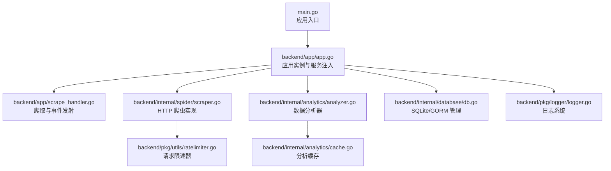
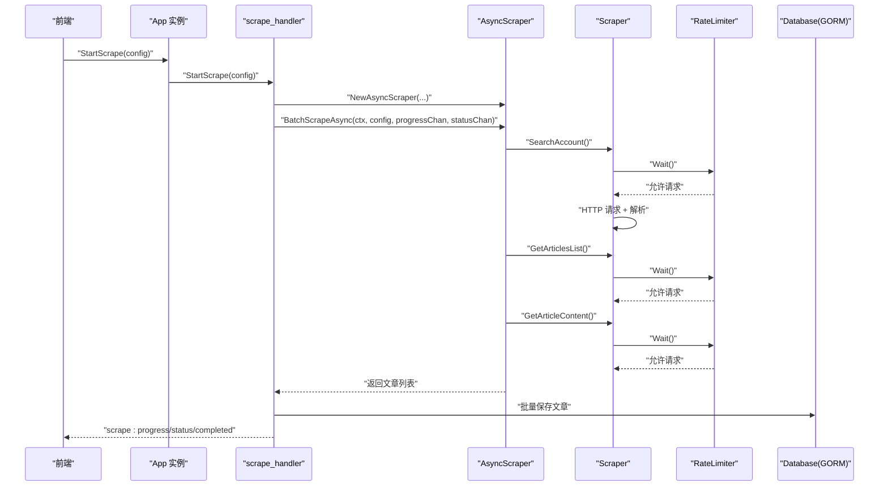
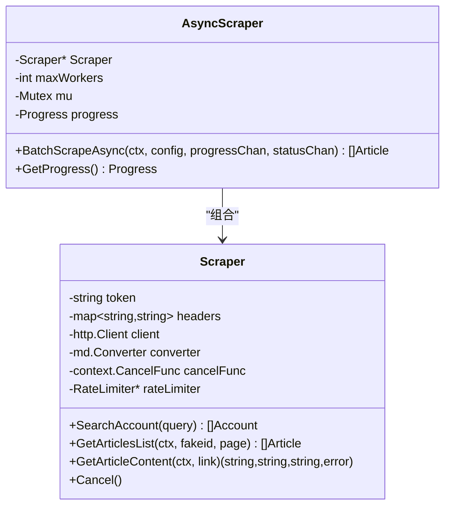
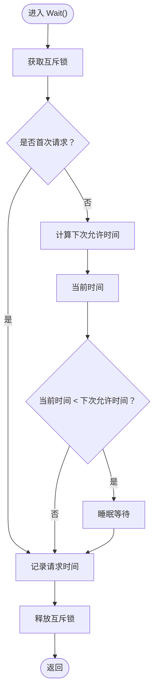
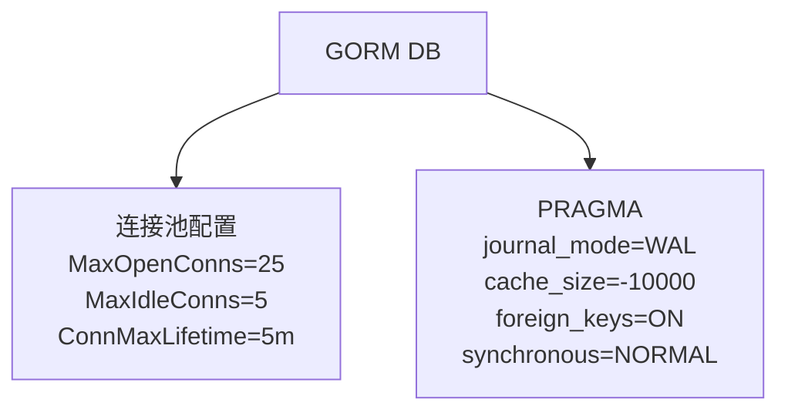
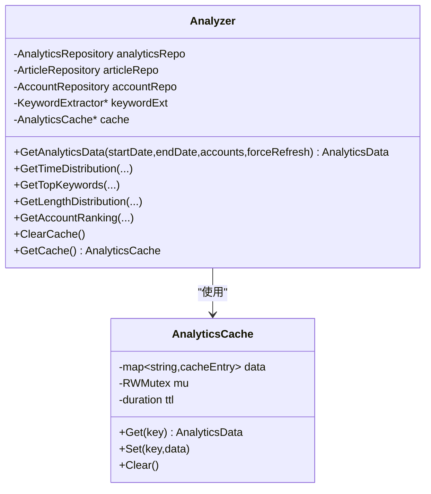
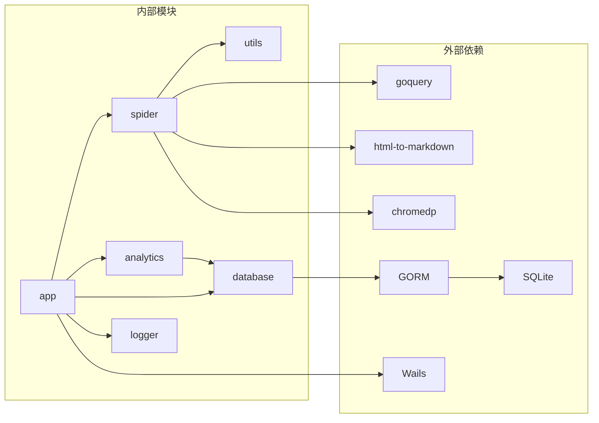

# 性能分析

<cite>
**本文引用的文件**
- [main.go](file://main.go)
- [backend/app/app.go](file://backend/app/app.go)
- [backend/app/scrape_handler.go](file://backend/app/scrape_handler.go)
- [backend/internal/spider/async_scraper.go](file://backend/internal/spider/async_scraper.go)
- [backend/internal/spider/scraper.go](file://backend/internal/spider/scraper.go)
- [backend/pkg/utils/ratelimiter.go](file://backend/pkg/utils/ratelimiter.go)
- [backend/internal/analytics/analyzer.go](file://backend/internal/analytics/analyzer.go)
- [backend/internal/analytics/cache.go](file://backend/internal/analytics/cache.go)
- [backend/internal/database/db.go](file://backend/internal/database/db.go)
- [backend/pkg/logger/logger.go](file://backend/pkg/logger/logger.go)
- [go.mod](file://go.mod)
- [README.md](file://README.md)
</cite>

## 目录
1. [简介](#简介)
2. [项目结构](#项目结构)
3. [核心组件](#核心组件)
4. [架构总览](#架构总览)
5. [详细组件分析](#详细组件分析)
6. [依赖关系分析](#依赖关系分析)
7. [性能考量](#性能考量)
8. [故障排查指南](#故障排查指南)
9. [结论](#结论)
10. [附录](#附录)

## 简介
本指南面向 WeMediaSpider 后端（Go）部分，聚焦于性能分析与调优。内容涵盖：
- 性能分析工具使用（Go pprof 基础、内存/ CPU 分析）
- 关键性能指标监控（爬取速度、内存使用、数据库查询性能、缓存命中率）
- 性能瓶颈识别与优化（并发爬取、数据库查询、缓存策略）
- 异步爬取性能分析（任务调度效率、资源利用率）
- 性能调优建议（配置参数、算法优化、系统资源）
- 性能基准测试方法与工具

## 项目结构
WeMediaSpider 后端采用分层架构：应用入口负责初始化与绑定，业务层封装爬虫、分析、缓存、数据库等模块，前端通过 Wails 与后端通信。

图示来源
- [main.go:23-90](file://main.go#L23-L90)
- [backend/app/app.go:52-83](file://backend/app/app.go#L52-L83)
- [backend/app/scrape_handler.go:126-244](file://backend/app/scrape_handler.go#L126-L244)
- [backend/internal/spider/scraper.go:50-69](file://backend/internal/spider/scraper.go#L50-L69)
- [backend/pkg/utils/ratelimiter.go:22-39](file://backend/pkg/utils/ratelimiter.go#L22-L39)
- [backend/internal/analytics/analyzer.go:26-39](file://backend/internal/analytics/analyzer.go#L26-L39)
- [backend/internal/analytics/cache.go:24-34](file://backend/internal/analytics/cache.go#L24-L34)
- [backend/internal/database/db.go:24-69](file://backend/internal/database/db.go#L24-L69)
- [backend/pkg/logger/logger.go:18-85](file://backend/pkg/logger/logger.go#L18-L85)

章节来源
- [main.go:23-90](file://main.go#L23-L90)
- [backend/app/app.go:52-83](file://backend/app/app.go#L52-L83)
- [README.md:86-103](file://README.md#L86-L103)

## 核心组件
- 应用入口与生命周期：负责单实例检测、窗口管理、Wails 生命周期回调、应用初始化与关闭。
- 爬虫与异步调度：提供串行化请求与进度/状态事件发射，支持取消与上下文传播。
- 请求限速器：基于互斥锁串行化等待，内置自适应失败倍增与随机抖动。
- 数据库与连接池：SQLite + GORM，启用 WAL、外键、同步模式与连接池参数。
- 分析器与缓存：聚合时间分布、关键词、长度分布、活跃度排行，并带 TTL 缓存。
- 日志系统：控制台、内存缓冲与文件输出，支持运行时级别切换。

章节来源
- [backend/app/app.go:25-50](file://backend/app/app.go#L25-L50)
- [backend/app/scrape_handler.go:126-244](file://backend/app/scrape_handler.go#L126-L244)
- [backend/internal/spider/async_scraper.go:15-281](file://backend/internal/spider/async_scraper.go#L15-L281)
- [backend/internal/spider/scraper.go:25-541](file://backend/internal/spider/scraper.go#L25-L541)
- [backend/pkg/utils/ratelimiter.go:12-133](file://backend/pkg/utils/ratelimiter.go#L12-L133)
- [backend/internal/database/db.go:18-115](file://backend/internal/database/db.go#L18-L115)
- [backend/internal/analytics/analyzer.go:17-281](file://backend/internal/analytics/analyzer.go#L17-L281)
- [backend/internal/analytics/cache.go:11-94](file://backend/internal/analytics/cache.go#L11-L94)
- [backend/pkg/logger/logger.go:12-109](file://backend/pkg/logger/logger.go#L12-L109)

## 架构总览
WeMediaSpider 后端以“应用层 -> 爬虫层 -> 限速层 -> 数据层”的链路组织，事件通过通道在后台协程中转发至前端。

图示来源
- [backend/app/scrape_handler.go:126-244](file://backend/app/scrape_handler.go#L126-L244)
- [backend/internal/spider/async_scraper.go:31-273](file://backend/internal/spider/async_scraper.go#L31-L273)
- [backend/internal/spider/scraper.go:71-293](file://backend/internal/spider/scraper.go#L71-L293)
- [backend/pkg/utils/ratelimiter.go:41-65](file://backend/pkg/utils/ratelimiter.go#L41-L65)
- [backend/internal/database/db.go:82-109](file://backend/internal/database/db.go#L82-L109)

## 详细组件分析

### 爬虫与异步调度
- 异步爬虫通过串行化接口（SearchAccount、GetArticlesList、GetArticleContent）避免并发竞争，同时在每一步调用前等待限速器。
- 支持取消：上下文传播到各步骤，便于中断长耗时任务。
- 进度与状态：通过通道向 UI 实时反馈，便于前端展示与用户交互。

图示来源
- [backend/internal/spider/async_scraper.go:15-281](file://backend/internal/spider/async_scraper.go#L15-L281)
- [backend/internal/spider/scraper.go:25-541](file://backend/internal/spider/scraper.go#L25-L541)

章节来源
- [backend/internal/spider/async_scraper.go:31-273](file://backend/internal/spider/async_scraper.go#L31-L273)
- [backend/internal/spider/scraper.go:71-293](file://backend/internal/spider/scraper.go#L71-L293)

### 请求限速器（RateLimiter）
- 串行化等待：互斥锁保证 Wait() 严格串行，两次请求之间强制 [minInterval, maxInterval] 随机间隔。
- 自适应失败倍增：连续失败会按倍数增加等待时间，上限控制。
- 成功/失败记录：用于自适应调整与日志观察。

图示来源
- [backend/pkg/utils/ratelimiter.go:41-65](file://backend/pkg/utils/ratelimiter.go#L41-L65)
- [backend/pkg/utils/ratelimiter.go:67-82](file://backend/pkg/utils/ratelimiter.go#L67-L82)
- [backend/pkg/utils/ratelimiter.go:84-98](file://backend/pkg/utils/ratelimiter.go#L84-L98)

章节来源
- [backend/pkg/utils/ratelimiter.go:12-133](file://backend/pkg/utils/ratelimiter.go#L12-L133)

### 数据库与连接池
- SQLite + GORM：启用 WAL、外键、同步模式 NORMAL，连接池参数（最大打开连接、空闲连接、生命周期）。
- AutoMigrate：初始化表结构与基础统计记录。

图示来源
- [backend/internal/database/db.go:24-69](file://backend/internal/database/db.go#L24-L69)
- [backend/internal/database/db.go:82-109](file://backend/internal/database/db.go#L82-L109)

章节来源
- [backend/internal/database/db.go:18-115](file://backend/internal/database/db.go#L18-L115)

### 分析器与缓存
- 分析器聚合：时间分布、关键词、长度分布、活跃度排行。
- 缓存：基于 TTL 的内存缓存，定期清理过期条目。

图示来源
- [backend/internal/analytics/analyzer.go:17-281](file://backend/internal/analytics/analyzer.go#L17-L281)
- [backend/internal/analytics/cache.go:11-94](file://backend/internal/analytics/cache.go#L11-L94)

章节来源
- [backend/internal/analytics/analyzer.go:46-106](file://backend/internal/analytics/analyzer.go#L46-L106)
- [backend/internal/analytics/cache.go:36-70](file://backend/internal/analytics/cache.go#L36-L70)

### 日志系统
- 多路输出：控制台、内存缓冲、文件（滚动日志）。
- 运行时级别：支持 debug/info/warn/error 动态切换。

章节来源
- [backend/pkg/logger/logger.go:18-109](file://backend/pkg/logger/logger.go#L18-L109)

## 依赖关系分析
- 外部依赖：Wails、GORM、SQLite、goquery、html-to-markdown、chromedp 等。
- 内部模块：app、spider、analytics、database、repository、cache、utils、logger。

图示来源
- [go.mod:5-22](file://go.mod#L5-L22)
- [backend/app/app.go:3-20](file://backend/app/app.go#L3-L20)

章节来源
- [go.mod:1-85](file://go.mod#L1-L85)
- [backend/app/app.go:3-20](file://backend/app/app.go#L3-L20)

## 性能考量

### 性能分析工具使用（Go pprof）
- 启用 pprof：在应用启动时注册 pprof HTTP 服务器（例如监听 6060 端口）。
- CPU 分析：使用 go tool pprof 命令分析 CPU profile，定位热点函数与调用栈。
- 内存分析：采集 heap profile，对比 Allocs/Inuse，识别内存增长点。
- 火焰图：结合火焰图工具可视化 CPU/内存热点。
- 注意事项：生产环境谨慎开启 pprof，避免对性能造成额外影响。

### 关键性能指标监控
- 爬取速度：单位时间内处理的公众号/文章数量，可通过进度通道与日志统计。
- 内存使用：RSS/堆分配、GC 次数与暂停时间，关注长时间运行稳定性。
- 数据库查询性能：慢查询日志、事务耗时、索引命中情况。
- 缓存命中率：分析器缓存命中与 TTL 行为，评估缓存效果。

### 性能瓶颈识别与优化
- 并发爬取优化：当前实现为串行化请求，若需提升吞吐，可在不违反频率限制的前提下引入有限并发（如每域名/每 IP 串行，不同域名并行）。
- 数据库查询优化：确保常用查询建立合适索引；批量写入使用 GORM 的批量操作；合理拆分大事务。
- 缓存策略调整：分析器缓存 TTL 可根据数据变化频率调整；对高频但低变数据可延长 TTL。
- 异步爬取性能：检查通道容量与事件发射协程，避免阻塞；确认 RateLimiter 是否成为瓶颈。

### 异步爬取性能分析
- 任务调度效率：统计每个公众号/每页文章的耗时分布，识别慢点。
- 资源利用率：CPU、内存、网络 I/O、磁盘 I/O 的峰值与平均值。
- 取消与超时：验证上下文传播与取消信号是否及时生效。

### 性能调优建议
- 配置参数调整：请求间隔范围、批量大小、通道容量、数据库连接池参数。
- 算法优化：内容解析与 Markdown 转换的代价较高，可考虑缓存中间结果或减少重复解析。
- 系统资源分配：适当提高连接池上限、启用 WAL 与合适的缓存大小；监控 GC 行为并调整 GOGC 或运行时参数。

### 性能基准测试
- 基准测试方法：使用 Go testing 的基准测试框架，针对关键函数（如 GetArticleContent、分析器聚合）编写基准用例。
- 工具使用：go test -bench=. -benchmem，收集 CPU/内存指标；结合 pprof 生成火焰图。
- 场景设计：覆盖不同规模数据集（小/中/大规模）、不同网络条件与并发场景。

## 故障排查指南
- 频率限制与错误处理：当遇到频率限制时，爬虫会清空已获取数据并停止，需检查限速器参数与目标站点策略。
- 日志级别：在问题定位阶段可临时提升日志级别，观察详细流程与错误堆栈。
- 数据库异常：检查连接池状态、慢查询与死锁迹象；必要时调整 WAL 与同步模式。

章节来源
- [backend/internal/spider/async_scraper.go:110-122](file://backend/internal/spider/async_scraper.go#L110-L122)
- [backend/pkg/logger/logger.go:87-101](file://backend/pkg/logger/logger.go#L87-L101)
- [backend/internal/database/db.go:49-61](file://backend/internal/database/db.go#L49-L61)

## 结论
WeMediaSpider 后端通过串行化限速器与分析缓存有效平衡了稳定性与性能。为进一步提升吞吐与资源利用率，可在遵守目标站点规则的前提下适度引入有限并发、优化数据库访问与缓存策略，并配合 pprof 与基准测试持续监控与调优。

## 附录
- 相关实现参考路径：
  - [应用入口与生命周期:23-90](file://main.go#L23-L90)
  - [应用实例与服务注入:52-83](file://backend/app/app.go#L52-L83)
  - [爬取流程与事件发射:126-244](file://backend/app/scrape_handler.go#L126-L244)
  - [异步爬虫主流程:31-273](file://backend/internal/spider/async_scraper.go#L31-L273)
  - [HTTP 爬虫与限速器:71-293](file://backend/internal/spider/scraper.go#L71-L293)
  - [限速器实现:41-98](file://backend/pkg/utils/ratelimiter.go#L41-L98)
  - [数据库初始化与连接池:24-69](file://backend/internal/database/db.go#L24-L69)
  - [分析器与缓存:46-106](file://backend/internal/analytics/analyzer.go#L46-L106)
  - [日志系统:18-109](file://backend/pkg/logger/logger.go#L18-L109)