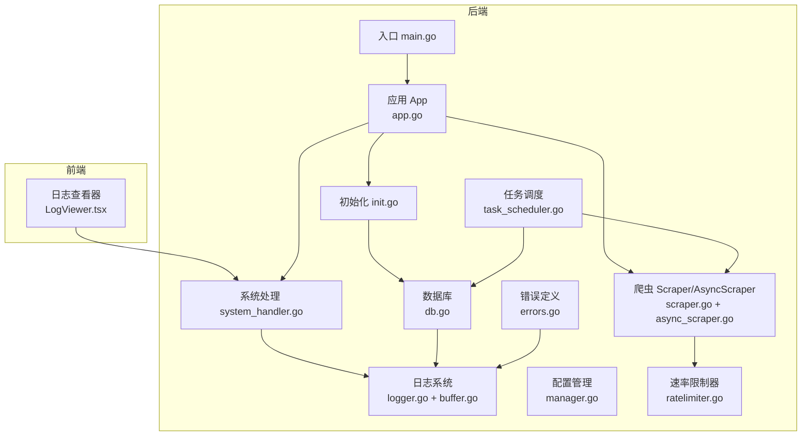
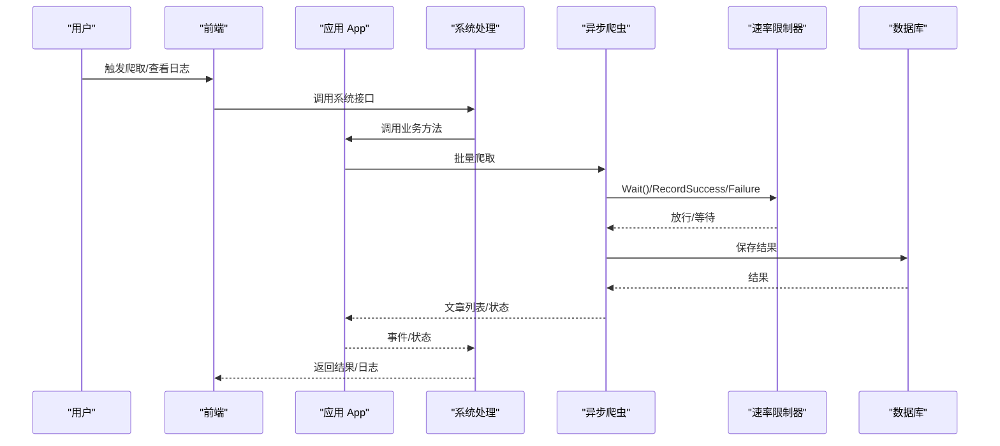
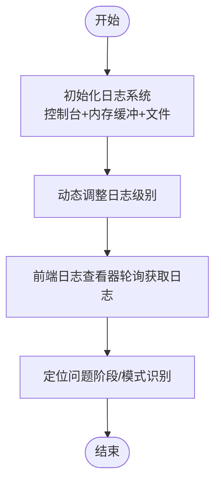
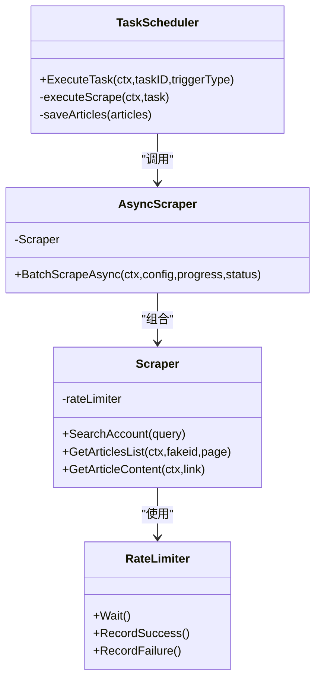
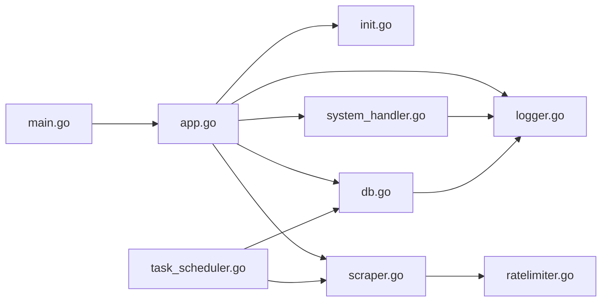

# 故障排除与调试

<cite>
**本文引用的文件**
- [main.go](file://main.go)
- [app.go](file://backend/app/app.go)
- [init.go](file://backend/app/init.go)
- [system_handler.go](file://backend/app/system_handler.go)
- [logger.go](file://backend/pkg/logger/logger.go)
- [buffer.go](file://backend/pkg/logger/buffer.go)
- [errors.go](file://backend/pkg/errors/errors.go)
- [scraper.go](file://backend/internal/spider/scraper.go)
- [async_scraper.go](file://backend/internal/spider/async_scraper.go)
- [ratelimiter.go](file://backend/pkg/utils/ratelimiter.go)
- [db.go](file://backend/internal/database/db.go)
- [manager.go](file://backend/internal/config/manager.go)
- [task_scheduler.go](file://backend/internal/scheduler/task_scheduler.go)
- [LogViewer.tsx](file://frontend/src/components/LogViewer.tsx)
</cite>

## 目录
1. [简介](#简介)
2. [项目结构](#项目结构)
3. [核心组件](#核心组件)
4. [架构总览](#架构总览)
5. [详细组件分析](#详细组件分析)
6. [依赖关系分析](#依赖关系分析)
7. [性能考虑](#性能考虑)
8. [故障排除指南](#故障排除指南)
9. [结论](#结论)
10. [附录](#附录)

## 简介
本指南面向 WeMediaSpider 的使用者与维护者，提供系统化的故障排除与调试方法，覆盖爬取失败、数据库问题、性能瓶颈、日志分析、错误处理与异常恢复、系统监控与健康检查，以及用户反馈收集与问题重现流程。文档结合代码实现，给出可操作的定位步骤与优化建议。

## 项目结构
WeMediaSpider 采用前后端分离架构：Go 后端负责业务逻辑、数据库、爬虫与调度；Wails 框架桥接前端 React 与后端 Go；日志系统统一输出到控制台、内存缓冲与文件；前端提供日志查看器与交互界面。

**图表来源**
- [main.go:23-90](file://main.go#L23-L90)
- [app.go:25-83](file://backend/app/app.go#L25-L83)
- [init.go:43-134](file://backend/app/init.go#L43-L134)
- [system_handler.go:22-105](file://backend/app/system_handler.go#L22-L105)
- [logger.go:18-108](file://backend/pkg/logger/logger.go#L18-L108)
- [buffer.go:18-96](file://backend/pkg/logger/buffer.go#L18-L96)
- [scraper.go:50-69](file://backend/internal/spider/scraper.go#L50-L69)
- [async_scraper.go:23-29](file://backend/internal/spider/async_scraper.go#L23-L29)
- [db.go:24-69](file://backend/internal/database/db.go#L24-L69)
- [manager.go:27-51](file://backend/internal/config/manager.go#L27-L51)
- [task_scheduler.go:31-45](file://backend/internal/scheduler/task_scheduler.go#L31-L45)
- [errors.go:27-41](file://backend/pkg/errors/errors.go#L27-L41)
- [ratelimiter.go:22-39](file://backend/pkg/utils/ratelimiter.go#L22-L39)

**章节来源**
- [main.go:23-90](file://main.go#L23-L90)
- [app.go:25-83](file://backend/app/app.go#L25-L83)
- [init.go:43-134](file://backend/app/init.go#L43-L134)

## 核心组件
- 应用生命周期与初始化：入口负责单实例、窗口与 Wails 绑定；应用初始化日志、数据库、服务与托盘；系统处理负责启动、关闭、托盘、更新检查与日志查询。
- 爬虫与异步调度：爬虫封装 HTTP 请求、内容提取与重试；异步爬虫通过速率限制器串行化请求；任务调度器驱动定时任务并持久化结果。
- 日志系统：控制台、内存缓冲与文件三路输出，支持运行时动态调整日志级别。
- 错误模型：标准错误与应用错误包装，便于错误分类与透传。

**章节来源**
- [system_handler.go:22-105](file://backend/app/system_handler.go#L22-L105)
- [scraper.go:50-69](file://backend/internal/spider/scraper.go#L50-L69)
- [async_scraper.go:23-29](file://backend/internal/spider/async_scraper.go#L23-L29)
- [logger.go:18-108](file://backend/pkg/logger/logger.go#L18-L108)
- [errors.go:27-41](file://backend/pkg/errors/errors.go#L27-L41)

## 架构总览

**图表来源**
- [system_handler.go:75-85](file://backend/app/system_handler.go#L75-L85)
- [async_scraper.go:33-273](file://backend/internal/spider/async_scraper.go#L33-L273)
- [ratelimiter.go:44-65](file://backend/pkg/utils/ratelimiter.go#L44-L65)
- [db.go:82-109](file://backend/internal/database/db.go#L82-L109)

## 详细组件分析

### 日志系统与前端日志查看器
- 日志系统支持控制台、内存缓冲与文件输出，运行时可通过接口动态调整日志级别。
- 前端日志查看器通过 Wails 调用后端接口获取日志并轮询刷新，支持自动滚动、清空与手动刷新。
- 建议：在排查问题时临时提升日志级别至更详细级别，结合前端日志查看器观察实时日志流。

**图表来源**
- [logger.go:18-108](file://backend/pkg/logger/logger.go#L18-L108)
- [buffer.go:18-96](file://backend/pkg/logger/buffer.go#L18-L96)
- [system_handler.go:576-600](file://backend/app/system_handler.go#L576-L600)
- [LogViewer.tsx:16-46](file://frontend/src/components/LogViewer.tsx#L16-L46)

**章节来源**
- [logger.go:18-108](file://backend/pkg/logger/logger.go#L18-L108)
- [buffer.go:18-96](file://backend/pkg/logger/buffer.go#L18-L96)
- [system_handler.go:576-600](file://backend/app/system_handler.go#L576-L600)
- [LogViewer.tsx:16-46](file://frontend/src/components/LogViewer.tsx#L16-L46)

### 爬虫与异步调度
- 爬虫通过速率限制器串行化请求，避免触发目标站点的频率限制；支持多选择器提取文章内容，并对图片链接进行清洗与排序。
- 异步爬虫在串行基础上提供进度与状态事件，便于前端展示与用户感知。
- 任务调度器负责定时任务执行、上下文取消、执行日志记录与结果持久化。

**图表来源**
- [scraper.go:25-69](file://backend/internal/spider/scraper.go#L25-L69)
- [async_scraper.go:15-29](file://backend/internal/spider/async_scraper.go#L15-L29)
- [ratelimiter.go:12-39](file://backend/pkg/utils/ratelimiter.go#L12-L39)
- [task_scheduler.go:20-45](file://backend/internal/scheduler/task_scheduler.go#L20-L45)

**章节来源**
- [scraper.go:72-261](file://backend/internal/spider/scraper.go#L72-L261)
- [async_scraper.go:33-273](file://backend/internal/spider/async_scraper.go#L33-L273)
- [ratelimiter.go:44-98](file://backend/pkg/utils/ratelimiter.go#L44-L98)
- [task_scheduler.go:52-189](file://backend/internal/scheduler/task_scheduler.go#L52-L189)

### 数据库与配置
- 数据库采用 SQLite，开启 WAL、缓存与外键约束，合理设置连接池参数；自动迁移表结构并初始化统计记录。
- 配置管理器负责用户配置的加载、保存与默认值回退，确保应用在缺少配置时仍可运行。

**章节来源**
- [db.go:24-109](file://backend/internal/database/db.go#L24-L109)
- [manager.go:27-69](file://backend/internal/config/manager.go#L27-L69)

### 错误模型与异常恢复
- 提供标准错误与应用错误类型，支持错误透传与分类处理，便于前端与日志系统识别与展示。
- 爬取过程中对“频率限制”等特定错误进行特殊处理，必要时清空已获取数据并中止后续请求。

**章节来源**
- [errors.go:5-25](file://backend/pkg/errors/errors.go#L5-L25)
- [errors.go:27-41](file://backend/pkg/errors/errors.go#L27-L41)
- [async_scraper.go:110-122](file://backend/internal/spider/async_scraper.go#L110-L122)

## 依赖关系分析

**图表来源**
- [main.go:46-84](file://main.go#L46-L84)
- [app.go:52-83](file://backend/app/app.go#L52-L83)
- [init.go:84-134](file://backend/app/init.go#L84-L134)
- [system_handler.go:22-105](file://backend/app/system_handler.go#L22-L105)
- [scraper.go:50-69](file://backend/internal/spider/scraper.go#L50-L69)
- [db.go:24-69](file://backend/internal/database/db.go#L24-L69)
- [logger.go:18-84](file://backend/pkg/logger/logger.go#L18-L84)
- [ratelimiter.go:22-39](file://backend/pkg/utils/ratelimiter.go#L22-L39)
- [task_scheduler.go:31-45](file://backend/internal/scheduler/task_scheduler.go#L31-L45)

**章节来源**
- [main.go:46-84](file://main.go#L46-L84)
- [app.go:52-83](file://backend/app/app.go#L52-L83)
- [init.go:84-134](file://backend/app/init.go#L84-L134)

## 性能考虑
- 串行化与速率限制：爬取请求通过速率限制器串行化，避免触发目标站点的频率限制，但会带来整体吞吐下降。可根据目标站点策略适当放宽最小/最大间隔。
- 内存与磁盘：日志系统同时输出到内存缓冲与文件，注意日志文件轮转与大小限制；数据库 WAL 模式与缓存设置有助于提升写入性能。
- 前端轮询：日志查看器每秒轮询一次，建议在问题定位结束后恢复默认级别，减少前端轮询压力。

[本节为通用指导，无需列出具体文件来源]

## 故障排除指南

### 一、爬取失败
常见症状
- 无法搜索到公众号
- 获取文章列表为空或报错
- 获取文章内容失败或为空
- 遇到“频率限制”提示

诊断步骤
1. 检查登录状态与 Token 有效性（若登录失效需重新登录）。
2. 查看日志中的请求与响应状态码、错误消息与重试记录。
3. 观察速率限制器的失败计数与当前延迟，确认是否存在自适应退避导致的延迟。
4. 若出现“频率限制”，检查请求间隔配置，适当增大最小/最大间隔。

定位要点
- 搜索公众号与获取文章列表均通过速率限制器串行化，失败会记录并可能触发自适应退避。
- 文章内容提取采用多选择器策略，若均失败会输出 HTML 预览便于定位页面结构变化。

**章节来源**
- [async_scraper.go:67-126](file://backend/internal/spider/async_scraper.go#L67-L126)
- [scraper.go:172-203](file://backend/internal/spider/scraper.go#L172-L203)
- [scraper.go:295-442](file://backend/internal/spider/scraper.go#L295-L442)
- [ratelimiter.go:67-98](file://backend/pkg/utils/ratelimiter.go#L67-L98)

### 二、数据库问题
常见症状
- 启动时报数据库打开失败
- 迁移失败或表结构异常
- 写入失败或连接池耗尽

诊断步骤
1. 检查用户目录下的数据文件路径与权限。
2. 查看数据库连接池配置与 WAL 模式设置。
3. 确认自动迁移是否成功执行，必要时清理并重建数据库。

**章节来源**
- [db.go:24-69](file://backend/internal/database/db.go#L24-L69)
- [db.go:82-109](file://backend/internal/database/db.go#L82-L109)

### 三、性能瓶颈
常见症状
- 爬取速度过慢
- CPU 使用率偏高
- 网络请求频繁被限速

诊断步骤
1. 通过前端日志查看器观察请求间隔与失败计数，评估速率限制策略是否过于保守。
2. 在问题定位阶段临时提升日志级别，观察高频错误模式。
3. 对于大规模爬取，建议分批执行并适当提高最小/最大间隔，避免触发目标站点风控。

**章节来源**
- [ratelimiter.go:67-98](file://backend/pkg/utils/ratelimiter.go#L67-L98)
- [system_handler.go:576-600](file://backend/app/system_handler.go#L576-L600)

### 四、日志分析技巧
- 日志级别：支持运行时动态调整（debug/info/warn/error），建议在定位问题时使用更详细级别。
- 关键信息定位：关注请求 URL、状态码、响应体长度、选择器匹配结果与图片处理日志。
- 错误模式识别：统计“频率限制”、“解析失败”、“API 错误”等错误类型占比，判断是否需要调整策略。

**章节来源**
- [logger.go:87-101](file://backend/pkg/logger/logger.go#L87-L101)
- [buffer.go:18-96](file://backend/pkg/logger/buffer.go#L18-L96)
- [system_handler.go:576-600](file://backend/app/system_handler.go#L576-L600)

### 五、调试工具与技巧
- 断点调试：在关键函数入口与返回处添加日志，观察上下文取消信号与错误传播。
- 变量检查：重点检查 Token、请求头、响应体、选择器匹配结果与图片链接集合。
- 调用栈分析：结合前端事件与后端日志，定位到具体模块与函数，逐步缩小范围。

**章节来源**
- [async_scraper.go:33-273](file://backend/internal/spider/async_scraper.go#L33-L273)
- [scraper.go:295-442](file://backend/internal/spider/scraper.go#L295-L442)

### 六、错误处理与异常恢复
- 使用应用错误类型包装底层错误，便于前端识别与展示。
- 对“未登录”“Token 过期”“登录失败”等场景进行专门处理，引导用户重新登录。
- 对“爬取失败”“导出失败”等场景记录详细日志并返回可读错误信息。

**章节来源**
- [errors.go:5-25](file://backend/pkg/errors/errors.go#L5-L25)
- [errors.go:27-41](file://backend/pkg/errors/errors.go#L27-L41)

### 七、系统监控与健康检查
- 应用启动与关闭：检查启动日志与关闭日志，确认资源释放（托盘、分析器、缓存、数据库）。
- 更新检查：多源并发检查更新，记录各源成功率与超时情况。
- 任务执行：通过任务调度器记录执行日志、状态与错误信息，便于追踪失败原因。

**章节来源**
- [system_handler.go:22-105](file://backend/app/system_handler.go#L22-L105)
- [system_handler.go:279-363](file://backend/app/system_handler.go#L279-L363)
- [task_scheduler.go:52-127](file://backend/internal/scheduler/task_scheduler.go#L52-L127)

### 八、用户反馈收集与问题重现流程
- 收集信息：版本号、日志级别、请求间隔、目标公众号、错误截图或日志片段。
- 重现步骤：提供最小化配置与操作步骤，确保可重复。
- 验证修复：在新版本中验证问题是否解决，并记录变更点。

[本节为通用流程指导，无需列出具体文件来源]

## 结论
通过日志系统、速率限制器、任务调度与错误模型的协同，WeMediaSpider 在稳定性与可观测性方面具备良好基础。建议在日常使用中保持合理的日志级别与请求间隔，在问题定位时利用前端日志查看器与后端日志进行交叉验证，并遵循本文提供的诊断流程快速定位与解决问题。

## 附录

### A. 常见错误与处理建议
- 未登录/Token 过期：重新登录并刷新 Token。
- 未找到公众号：检查公众号名称拼写与是否公开。
- 没有找到文章：确认目标公众号存在历史文章且未被屏蔽。
- 爬取已取消：检查任务是否被手动取消或上下文提前结束。
- 导出失败/不支持的导出格式：更换导出格式或检查输出目录权限。

**章节来源**
- [errors.go:5-25](file://backend/pkg/errors/errors.go#L5-L25)

### B. 日志查看器前端交互
- 自动滚动：跟随最新日志滚动。
- 清空：清空内存缓冲中的日志条目。
- 刷新：手动拉取最新日志。

**章节来源**
- [LogViewer.tsx:16-46](file://frontend/src/components/LogViewer.tsx#L16-L46)