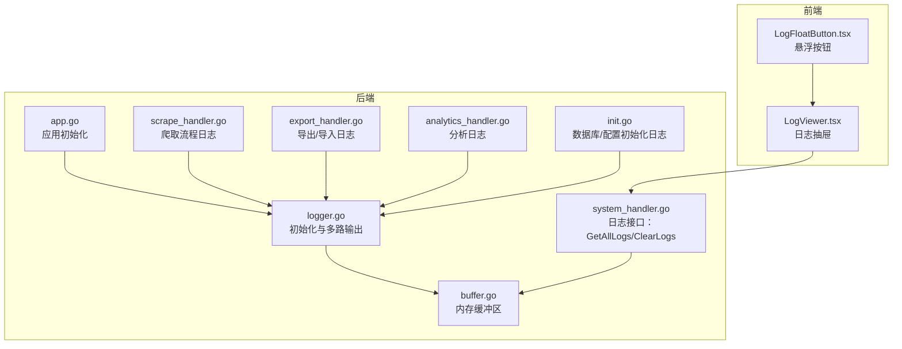
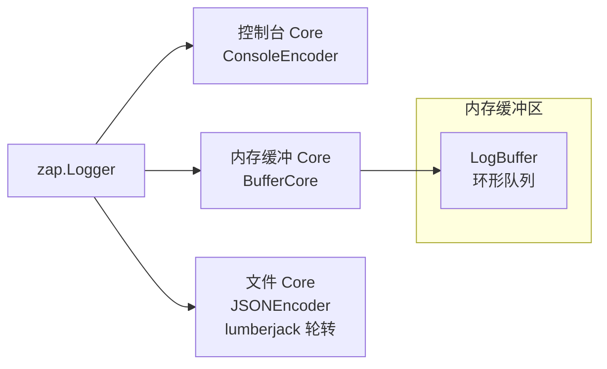
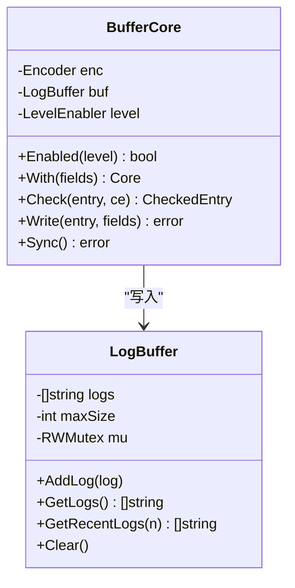
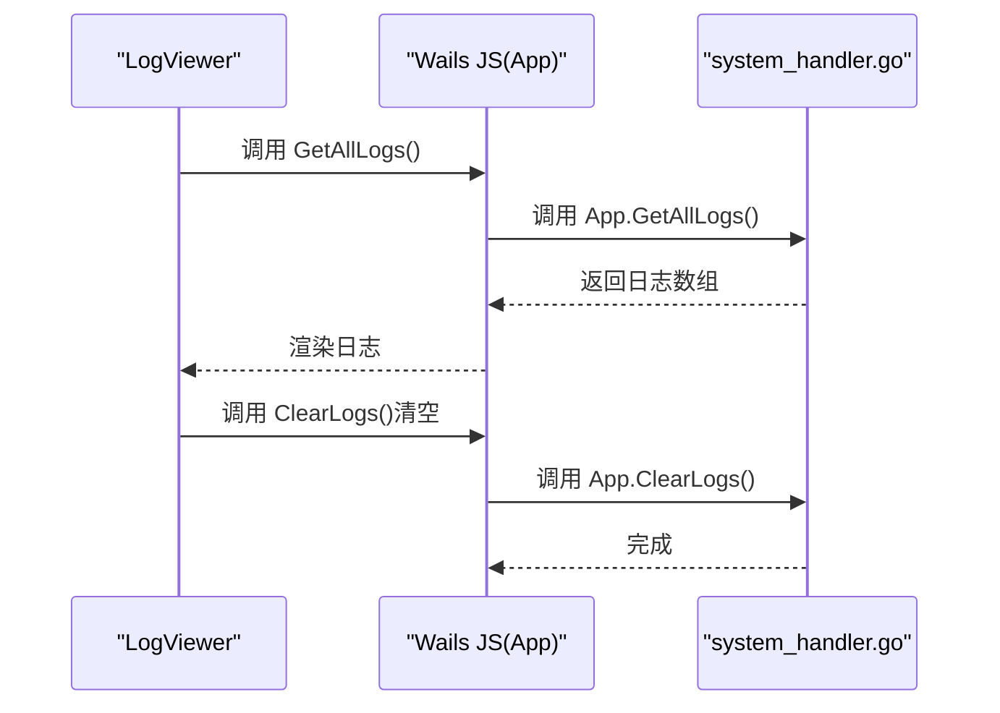
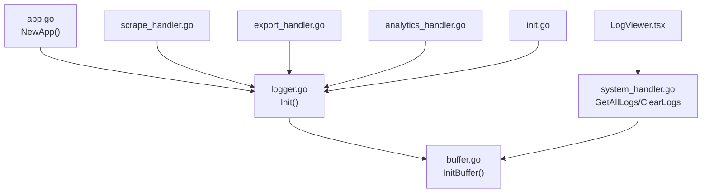

# 日志分析

<cite>
**本文引用的文件**
- [logger.go](file://backend/pkg/logger/logger.go)
- [buffer.go](file://backend/pkg/logger/buffer.go)
- [logger_test.go](file://backend/pkg/logger/logger_test.go)
- [app.go](file://backend/app/app.go)
- [system_handler.go](file://backend/app/system_handler.go)
- [LogViewer.tsx](file://frontend/src/components/LogViewer.tsx)
- [LogFloatButton.tsx](file://frontend/src/components/LogFloatButton.tsx)
- [scrape_handler.go](file://backend/app/scrape_handler.go)
- [export_handler.go](file://backend/app/export_handler.go)
- [analytics_handler.go](file://backend/app/analytics_handler.go)
- [init.go](file://backend/app/init.go)
</cite>

## 目录
1. [简介](#简介)
2. [项目结构](#项目结构)
3. [核心组件](#核心组件)
4. [架构总览](#架构总览)
5. [组件详解](#组件详解)
6. [依赖关系分析](#依赖关系分析)
7. [性能考量](#性能考量)
8. [故障排查指南](#故障排查指南)
9. [结论](#结论)
10. [附录](#附录)

## 简介
本指南面向 WeMediaSpider 的使用者与维护者，系统性讲解日志系统的架构、配置与使用方式，帮助快速定位问题、识别异常模式并监控系统健康状态。内容覆盖：
- 日志系统三路输出：控制台、文件（JSON）、内存缓冲区
- 日志级别与使用场景
- 日志文件位置与格式差异
- 内置日志查看器的使用
- 关键日志信息识别（错误堆栈、性能指标、数据库操作等）
- 日志分析最佳实践

## 项目结构
WeMediaSpider 的日志体系由后端 Go 包与前端 React 组件协同构成：
- 后端日志核心位于 backend/pkg/logger，负责初始化、编码、多路输出与内存缓冲
- 前端日志查看器位于 frontend/src/components，提供抽屉式实时日志面板
- 应用入口与各业务模块在关键节点输出结构化日志，便于分析

图表来源
- [logger.go:18-84](file://backend/pkg/logger/logger.go#L18-L84)
- [buffer.go:18-57](file://backend/pkg/logger/buffer.go#L18-L57)
- [app.go:54-82](file://backend/app/app.go#L54-L82)
- [system_handler.go:585-600](file://backend/app/system_handler.go#L585-L600)
- [LogViewer.tsx:11-82](file://frontend/src/components/LogViewer.tsx#L11-L82)
- [LogFloatButton.tsx:6-21](file://frontend/src/components/LogFloatButton.tsx#L6-L21)

章节来源
- [logger.go:18-84](file://backend/pkg/logger/logger.go#L18-L84)
- [buffer.go:18-57](file://backend/pkg/logger/buffer.go#L18-L57)
- [app.go:54-82](file://backend/app/app.go#L54-L82)
- [system_handler.go:585-600](file://backend/app/system_handler.go#L585-L600)
- [LogViewer.tsx:11-82](file://frontend/src/components/LogViewer.tsx#L11-L82)
- [LogFloatButton.tsx:6-21](file://frontend/src/components/LogFloatButton.tsx#L6-L21)

## 核心组件
- 日志初始化与多路输出：控制台（人类可读）、内存缓冲区（结构化字段保留）、文件（JSON，带时间戳与级别）
- 内存缓冲区：环形队列，支持获取全部/最近 N 条日志、清空
- 前端日志查看器：抽屉式界面，支持自动滚动、手动刷新、清空
- 应用接口：提供 GetAllLogs、ClearLogs，供前端拉取与清理

章节来源
- [logger.go:18-84](file://backend/pkg/logger/logger.go#L18-L84)
- [buffer.go:18-57](file://backend/pkg/logger/buffer.go#L18-L57)
- [system_handler.go:585-600](file://backend/app/system_handler.go#L585-L600)
- [LogViewer.tsx:11-82](file://frontend/src/components/LogViewer.tsx#L11-L82)

## 架构总览
日志系统采用“多核（Core）+ 路由”的设计：
- 控制台 Core：使用控制台编码器，输出人类可读格式
- 内存缓冲 Core：使用控制台编码器克隆，写入内存缓冲区，保留完整字段
- 文件 Core：使用 JSON 编码器，输出结构化日志，落盘轮转

图表来源
- [logger.go:45-83](file://backend/pkg/logger/logger.go#L45-L83)
- [buffer.go:61-96](file://backend/pkg/logger/buffer.go#L61-L96)

## 组件详解

### 日志初始化与输出策略
- 初始化阶段创建原子级别（默认 info），初始化内存缓冲区容量，随后按顺序构建控制台、内存缓冲、文件三路 Core，并通过 tee 聚合
- 文件输出基于 lumberjack，单文件最大 10MB，保留 5 个历史文件，压缩与本地时间轮转
- 若无法获取用户目录或创建日志目录，会降级为仅控制台与内存缓冲输出，并记录警告

章节来源
- [logger.go:18-84](file://backend/pkg/logger/logger.go#L18-L84)

### 编码器与字段保留
- 控制台编码器：字段键名（时间、级别、消息、堆栈）采用短键，时间格式为“年-月-日 时:分:秒”
- JSON 编码器：字段键名为 ts、level、msg、stacktrace，适合机器解析与检索
- 内存缓冲 Core 在写入前会克隆编码器并合并上下文字段，确保后续从缓冲区读取的日志包含完整字段

章节来源
- [logger.go:23-43](file://backend/pkg/logger/logger.go#L23-L43)
- [buffer.go:70-77](file://backend/pkg/logger/buffer.go#L70-L77)
- [logger_test.go:11-32](file://backend/pkg/logger/logger_test.go#L11-L32)

### 内存缓冲区（环形队列）
- 支持添加、获取全部、获取最近 N 条、清空
- 写入时自动裁剪至最大容量，保证内存占用可控
- 并发安全：读写分离锁

图表来源
- [buffer.go:9-57](file://backend/pkg/logger/buffer.go#L9-L57)
- [buffer.go:61-96](file://backend/pkg/logger/buffer.go#L61-L96)

章节来源
- [buffer.go:9-57](file://backend/pkg/logger/buffer.go#L9-L57)
- [buffer.go:61-96](file://backend/pkg/logger/buffer.go#L61-L96)
- [logger_test.go:45-53](file://backend/pkg/logger/logger_test.go#L45-L53)

### 前端日志查看器
- 通过 Wails JS API 拉取日志，每秒轮询刷新
- 支持自动滚动、手动清空、手动刷新
- 以抽屉形式展示，右侧滑出，宽度固定

图表来源
- [LogViewer.tsx:16-32](file://frontend/src/components/LogViewer.tsx#L16-L32)
- [system_handler.go:585-600](file://backend/app/system_handler.go#L585-L600)

章节来源
- [LogViewer.tsx:11-82](file://frontend/src/components/LogViewer.tsx#L11-L82)
- [LogFloatButton.tsx:6-21](file://frontend/src/components/LogFloatButton.tsx#L6-L21)
- [system_handler.go:585-600](file://backend/app/system_handler.go#L585-L600)

### 日志级别与使用场景
- debug：开发调试、详细流程追踪（例如网络请求细节、参数校验）
- info：常规运行状态、关键流程节点（例如启动、配置加载、导出/导入完成）
- warn：可恢复异常、潜在风险（例如外部服务不可用、缓存未命中）
- error：错误事件、需要人工干预（例如数据库写入失败、外部接口异常）

章节来源
- [logger.go:87-101](file://backend/pkg/logger/logger.go#L87-L101)
- [scrape_handler.go:188-243](file://backend/app/scrape_handler.go#L188-L243)
- [export_handler.go:34-50](file://backend/app/export_handler.go#L34-L50)
- [analytics_handler.go:32-45](file://backend/app/analytics_handler.go#L32-L45)
- [init.go:45-74](file://backend/app/init.go#L45-L74)

### 日志文件位置与格式
- 文件位置：用户主目录下的 .wemediaspider/logs/app.log（Windows/Linux/macOS）
- 文件格式：JSON，字段包含时间戳、级别、消息、堆栈等；适合集中收集与检索
- 控制台格式：人类可读，字段键名短小，便于快速审阅

章节来源
- [logger.go:58-81](file://backend/pkg/logger/logger.go#L58-L81)
- [logger.go:34-43](file://backend/pkg/logger/logger.go#L34-L43)
- [logger.go:23-32](file://backend/pkg/logger/logger.go#L23-L32)

### 关键日志信息识别
- 错误堆栈：JSON 中的 stacktrace 字段；控制台中 S 字段包含堆栈
- 性能指标：可通过时间戳与耗时字段（字符串形式）结合业务日志推断（例如导出/导入条数、耗时）
- 数据库操作：爬取完成后会记录保存条数与统计更新结果；导出/导入会记录数量与路径
- 配置与状态：应用启动、关闭、托盘设置、更新检查等都会输出结构化字段

章节来源
- [logger.go:34-43](file://backend/pkg/logger/logger.go#L34-L43)
- [logger.go:23-32](file://backend/pkg/logger/logger.go#L23-L32)
- [scrape_handler.go:188-243](file://backend/app/scrape_handler.go#L188-L243)
- [export_handler.go:34-50](file://backend/app/export_handler.go#L34-L50)
- [system_handler.go:22-105](file://backend/app/system_handler.go#L22-L105)

## 依赖关系分析
- 后端应用在启动时调用日志初始化，随后各模块在关键节点输出日志
- system_handler 提供前端访问日志的接口，依赖内存缓冲区
- 前端通过 Wails JS 调用后端接口，实现日志查看与清空

图表来源
- [app.go:54-82](file://backend/app/app.go#L54-L82)
- [logger.go:18-21](file://backend/pkg/logger/logger.go#L18-L21)
- [buffer.go:18-23](file://backend/pkg/logger/buffer.go#L18-L23)
- [scrape_handler.go:188-243](file://backend/app/scrape_handler.go#L188-L243)
- [export_handler.go:34-50](file://backend/app/export_handler.go#L34-L50)
- [analytics_handler.go:32-45](file://backend/app/analytics_handler.go#L32-L45)
- [init.go:45-74](file://backend/app/init.go#L45-L74)
- [system_handler.go:585-600](file://backend/app/system_handler.go#L585-L600)
- [LogViewer.tsx:16-32](file://frontend/src/components/LogViewer.tsx#L16-L32)

章节来源
- [app.go:54-82](file://backend/app/app.go#L54-L82)
- [logger.go:18-21](file://backend/pkg/logger/logger.go#L18-L21)
- [system_handler.go:585-600](file://backend/app/system_handler.go#L585-L600)
- [LogViewer.tsx:16-32](file://frontend/src/components/LogViewer.tsx#L16-L32)

## 性能考量
- 内存缓冲区容量可调，默认 1000 条，避免频繁分配与 GC 抖动
- 文件输出采用 lumberjack 轮转，控制单文件大小与保留数量，降低磁盘压力
- 控制台输出与内存缓冲输出为同步写入，建议在高并发场景下关注缓冲区增长速度
- 前端轮询间隔 1 秒，可根据日志密度适当调整

章节来源
- [logger.go:20-21](file://backend/pkg/logger/logger.go#L20-L21)
- [logger.go:72-81](file://backend/pkg/logger/logger.go#L72-L81)
- [LogViewer.tsx:40-46](file://frontend/src/components/LogViewer.tsx#L40-L46)

## 故障排查指南
- 无法创建日志目录或用户目录：系统会降级为仅控制台与内存缓冲输出，并记录警告
- JSON 文件未生成：检查用户目录权限与磁盘空间
- 日志缺失：确认内存缓冲区容量是否过小导致被裁剪；必要时增大容量或缩短轮询间隔
- 错误定位：优先查看 JSON 中的 stacktrace 字段；控制台中 S 字段包含堆栈
- 数据库异常：关注爬取/导出/导入流程中的错误日志，结合数据库模型与仓储层错误返回
- 性能问题：结合业务日志中的条数与耗时，定位慢点（如网络请求、数据库写入）

章节来源
- [logger.go:58-84](file://backend/pkg/logger/logger.go#L58-L84)
- [scrape_handler.go:188-243](file://backend/app/scrape_handler.go#L188-L243)
- [export_handler.go:34-50](file://backend/app/export_handler.go#L34-L50)
- [init.go:86-110](file://backend/app/init.go#L86-L110)

## 结论
WeMediaSpider 的日志系统通过“控制台 + 文件 + 内存缓冲”三路输出，兼顾人类可读与机器可检索；配合前端日志查看器，能够高效定位问题、识别异常模式并监控系统健康状态。建议在生产环境开启文件输出与内存缓冲，合理设置日志级别与轮转策略，并利用结构化字段进行自动化分析。

## 附录

### 日志级别对照表
- debug：调试与追踪
- info：运行状态与关键流程
- warn：可恢复异常与风险提示
- error：错误事件与需要干预

章节来源
- [logger.go:87-101](file://backend/pkg/logger/logger.go#L87-L101)

### 日志字段说明（控制台 vs JSON）
- 控制台：时间键 T、级别键 L、消息键 M、堆栈键 S
- JSON：时间键 ts、级别键 level、消息键 msg、堆栈键 stacktrace

章节来源
- [logger.go:23-43](file://backend/pkg/logger/logger.go#L23-L43)