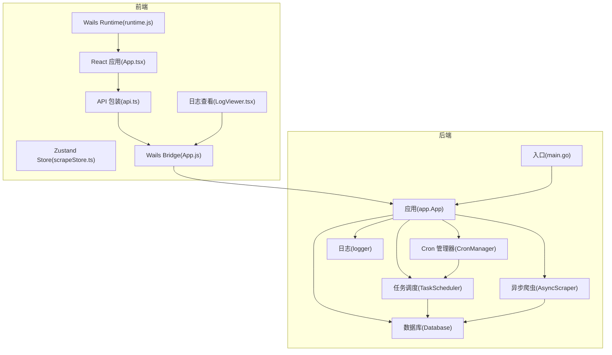
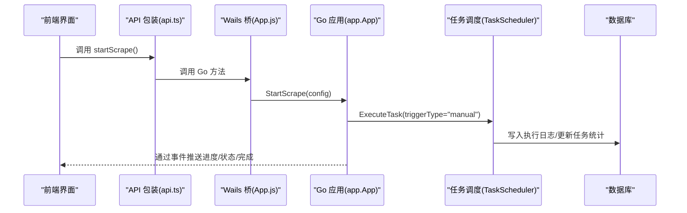
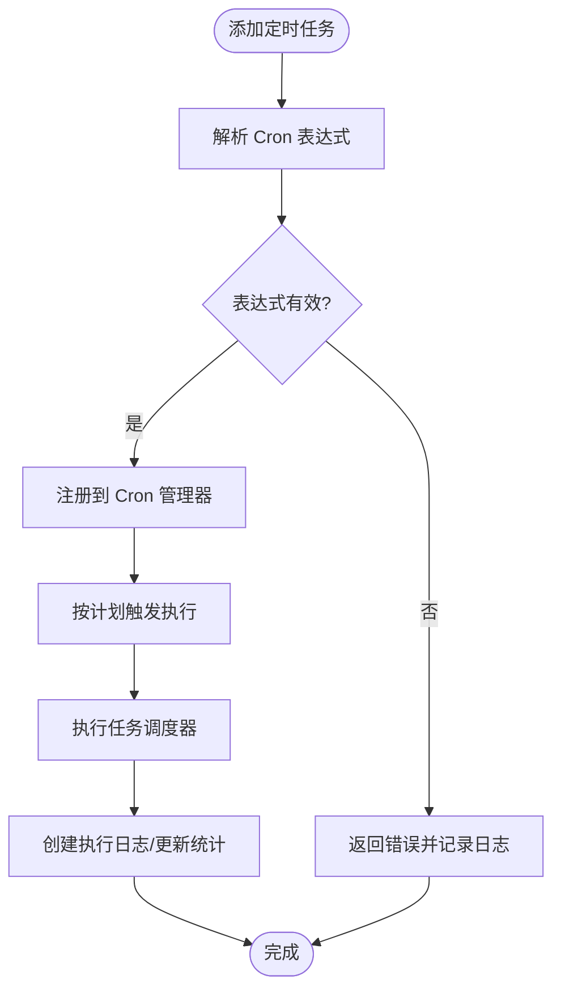
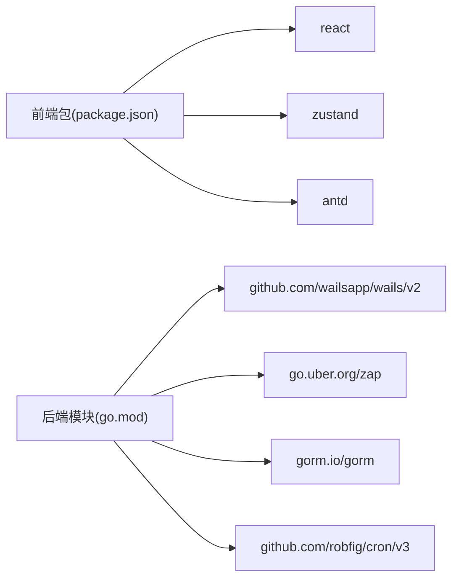

# 调试技巧

<cite>
**本文引用的文件**
- [main.go](file://main.go)
- [app.go](file://backend/app/app.go)
- [logger.go](file://backend/pkg/logger/logger.go)
- [task_scheduler.go](file://backend/internal/scheduler/task_scheduler.go)
- [cron_manager.go](file://backend/internal/scheduler/cron_manager.go)
- [db.go](file://backend/internal/database/db.go)
- [async_scraper.go](file://backend/internal/spider/async_scraper.go)
- [App.js](file://frontend/wailsjs/go/app/App.js)
- [api.ts](file://frontend/src/services/api.ts)
- [scrapeStore.ts](file://frontend/src/stores/scrapeStore.ts)
- [LogViewer.tsx](file://frontend/src/components/LogViewer.tsx)
- [LogFloatButton.tsx](file://frontend/src/components/LogFloatButton.tsx)
- [runtime.js](file://frontend/wailsjs/runtime/runtime.js)
- [App.tsx](file://frontend/src/App.tsx)
- [wails.json](file://wails.json)
- [go.mod](file://go.mod)
</cite>

## 目录
1. [简介](#简介)
2. [项目结构](#项目结构)
3. [核心组件](#核心组件)
4. [架构总览](#架构总览)
5. [详细组件调试指南](#详细组件调试指南)
6. [依赖关系分析](#依赖关系分析)
7. [性能与稳定性调试建议](#性能与稳定性调试建议)
8. [故障排查指南](#故障排查指南)
9. [结论](#结论)
10. [附录](#附录)

## 简介
本指南面向 WeMediaSpider 开发者，提供从开发环境到生产环境的系统性调试方法，覆盖以下主题：
- 开发环境调试：IDE 断点、变量检查、调用栈分析
- 前后端通信调试：Wails 绑定方法、事件传递、前端 API 包装层
- 状态管理调试：Zustand Store 的状态变更追踪
- 定时任务与调度器：Cron 表达式验证、任务执行监控
- 网络请求调试：Chrome DevTools 使用、API 调用监控
- 数据库操作调试：SQL 查询分析、事务处理
- 远程与生产调试：日志级别动态调整、日志查看器、生产问题定位

## 项目结构
WeMediaSpider 采用 Wails v2 架构，前端为 React + TypeScript，后端为 Go，通过 Wails 将 Go 方法暴露给前端 JS 调用，并通过事件系统进行双向通信。

图表来源
- [main.go:23-91](file://main.go#L23-L91)
- [app.go:25-85](file://backend/app/app.go#L25-L85)
- [task_scheduler.go:20-127](file://backend/internal/scheduler/task_scheduler.go#L20-L127)
- [cron_manager.go:17-119](file://backend/internal/scheduler/cron_manager.go#L17-L119)
- [db.go:18-115](file://backend/internal/database/db.go#L18-L115)
- [logger.go:12-109](file://backend/pkg/logger/logger.go#L12-L109)
- [async_scraper.go:15-200](file://backend/internal/spider/async_scraper.go#L15-L200)
- [App.js:1-268](file://frontend/wailsjs/go/app/App.js#L1-L268)
- [api.ts:1-161](file://frontend/src/services/api.ts#L1-L161)
- [scrapeStore.ts:1-65](file://frontend/src/stores/scrapeStore.ts#L1-L65)
- [LogViewer.tsx:1-51](file://frontend/src/components/LogViewer.tsx#L1-L51)
- [runtime.js:50-217](file://frontend/wailsjs/runtime/runtime.js#L50-L217)

章节来源
- [main.go:23-91](file://main.go#L23-L91)
- [wails.json:1-29](file://wails.json#L1-L29)

## 核心组件
- 应用入口与生命周期：负责初始化、单实例、窗口与资产服务、Wails 绑定注册、启动/关闭回调
- 应用对象：聚合业务模块（配置、缓存、数据库、爬虫、调度、托盘、自动启动等）
- 日志系统：多路输出（控制台、内存缓冲、文件），支持运行时动态调整级别
- 任务调度器：执行任务、记录执行日志、更新任务统计、支持取消
- Cron 管理器：解析表达式、注册/移除任务、查询下次运行时间
- 数据库：SQLite + GORM，WAL 模式、连接池、外键约束、自动迁移
- 前后端桥接：Wails 自动生成的 JS 桥接文件与前端 API 包装层
- 前端状态：Zustand Store 管理抓取进度、文章列表、账号状态
- 日志查看器：前端内置日志抽屉，周期拉取后端日志

章节来源
- [app.go:25-85](file://backend/app/app.go#L25-L85)
- [logger.go:12-109](file://backend/pkg/logger/logger.go#L12-L109)
- [task_scheduler.go:20-127](file://backend/internal/scheduler/task_scheduler.go#L20-L127)
- [cron_manager.go:17-119](file://backend/internal/scheduler/cron_manager.go#L17-L119)
- [db.go:18-115](file://backend/internal/database/db.go#L18-L115)
- [App.js:1-268](file://frontend/wailsjs/go/app/App.js#L1-L268)
- [api.ts:1-161](file://frontend/src/services/api.ts#L1-L161)
- [scrapeStore.ts:1-65](file://frontend/src/stores/scrapeStore.ts#L1-L65)
- [LogViewer.tsx:1-51](file://frontend/src/components/LogViewer.tsx#L1-L51)

## 架构总览
Wails 将 Go 实例绑定到前端，前端通过自动生成的 JS 桥接调用 Go 方法，并通过事件系统接收后端推送的状态与进度信息。日志系统贯穿前后端，前端提供日志查看器以实时观察后端日志。

图表来源
- [api.ts:48-101](file://frontend/src/services/api.ts#L48-L101)
- [App.js:245-247](file://frontend/wailsjs/go/app/App.js#L245-L247)
- [task_scheduler.go:52-127](file://backend/internal/scheduler/task_scheduler.go#L52-L127)

## 详细组件调试指南

### 开发环境调试（IDE 断点、变量检查、调用栈）
- Go 后端断点位置建议
  - 应用启动与绑定：入口函数中设置断点，检查单实例、窗口尺寸、资产服务器与绑定对象
  - 应用对象初始化：检查各子系统初始化顺序与错误
  - 任务执行流程：在任务调度器的执行入口、爬取执行、保存文章处设置断点
  - Cron 管理器：在添加/移除任务、解析表达式处断点
  - 数据库：在连接建立、迁移、事务前后断点
  - 爬虫：在搜索账号、获取文章列表、内容串行化处断点
- 前端断点位置建议
  - API 包装层：在每个导出方法处断点，确认参数与返回值
  - Zustand Store：在状态变更函数处断点，观察状态变化轨迹
  - 日志查看器：在拉取日志与清空日志处断点
- 变量检查与调用栈
  - 观察上下文、任务 ID、配置结构体、错误链
  - 在事件监听处检查事件名与负载结构
  - 在 Store 中检查 articles、progress、accountStatuses 等字段

章节来源
- [main.go:23-91](file://main.go#L23-L91)
- [app.go:52-85](file://backend/app/app.go#L52-L85)
- [task_scheduler.go:52-127](file://backend/internal/scheduler/task_scheduler.go#L52-L127)
- [cron_manager.go:54-93](file://backend/internal/scheduler/cron_manager.go#L54-L93)
- [db.go:24-69](file://backend/internal/database/db.go#L24-L69)
- [async_scraper.go:31-200](file://backend/internal/spider/async_scraper.go#L31-L200)
- [api.ts:48-101](file://frontend/src/services/api.ts#L48-L101)
- [scrapeStore.ts:19-64](file://frontend/src/stores/scrapeStore.ts#L19-L64)
- [LogViewer.tsx:16-46](file://frontend/src/components/LogViewer.tsx#L16-L46)

### 前后端通信调试（Wails 绑定、事件传递）
- 绑定方法调试
  - 检查前端 api.ts 是否正确导入并包装了 App.js 导出的方法
  - 在调用前打印参数结构，调用后检查返回值类型与错误
  - 若出现“方法未定义”，确认 main.go 中 Bind 列表包含 app.App 实例
- 事件传递调试
  - 在前端使用事件包装器订阅 scrape:progress、scrape:status、scrape:completed、scrape:error 等
  - 在后端触发事件前打印事件名与负载，确保命名一致
  - 使用日志查看器确认后端日志中事件触发记录
- 运行时能力
  - 使用 runtime.js 提供的窗口、剪贴板、环境等能力进行辅助调试

章节来源
- [App.js:1-268](file://frontend/wailsjs/go/app/App.js#L1-L268)
- [api.ts:103-160](file://frontend/src/services/api.ts#L103-L160)
- [runtime.js:50-217](file://frontend/wailsjs/runtime/runtime.js#L50-L217)
- [LogViewer.tsx:16-46](file://frontend/src/components/LogViewer.tsx#L16-L46)

### 状态管理调试（Zustand Store）
- Store 结构与变更
  - articles、progress、accountStatuses、isScrapingInProgress 字段用于承载抓取状态
  - 使用 set 函数与派生逻辑（如 addArticles、updateAccountStatus）观察状态变化
- 调试技巧
  - 在每个 setter 处设置断点，检查传入值与合并策略
  - 在页面组件中打印 store 状态，确认与 UI 同步
  - 使用浏览器 React DevTools 的 Redux 面板（若集成）观察状态树

章节来源
- [scrapeStore.ts:4-17](file://frontend/src/stores/scrapeStore.ts#L4-L17)
- [scrapeStore.ts:19-64](file://frontend/src/stores/scrapeStore.ts#L19-L64)

### 定时任务与调度器调试（Cron 表达式、执行监控）
- Cron 表达式验证
  - 使用 CronManager 的解析方法验证表达式合法性
  - 通过 GetNextRunTime 获取下次运行时间，结合当前时间判断
- 任务执行监控
  - 在任务调度器中检查任务是否存在、是否启用、是否重复运行
  - 观察执行日志创建、状态更新、错误记录与回调触发
- 常见问题定位
  - 表达式非法导致无法添加任务
  - 任务重复运行导致资源竞争
  - 登录状态异常导致任务失败

图表来源
- [cron_manager.go:54-93](file://backend/internal/scheduler/cron_manager.go#L54-L93)
- [task_scheduler.go:52-127](file://backend/internal/scheduler/task_scheduler.go#L52-L127)

章节来源
- [cron_manager.go:17-119](file://backend/internal/scheduler/cron_manager.go#L17-L119)
- [task_scheduler.go:20-127](file://backend/internal/scheduler/task_scheduler.go#L20-L127)

### 网络请求调试（Chrome DevTools、API 监控）
- 前端网络面板
  - 打开开发者工具，切换到 Network 面板，过滤 XHR/Fetch
  - 观察请求 URL、方法、请求头、响应状态码与响应体
- Wails 事件监控
  - 在 Console 面板监听事件名，确认事件推送频率与负载
- 后端日志
  - 使用日志查看器查看后端日志，定位错误堆栈与耗时

章节来源
- [api.ts:48-101](file://frontend/src/services/api.ts#L48-L101)
- [LogViewer.tsx:16-46](file://frontend/src/components/LogViewer.tsx#L16-L46)

### 数据库操作调试（SQL 分析、事务）
- 连接与迁移
  - 检查数据库路径、连接池配置、WAL 模式、外键约束
  - 在迁移阶段观察表结构创建与初始化记录
- 查询与写入
  - 在保存文章、更新任务统计等关键路径设置断点
  - 使用 SQLite 工具查看数据库文件，核对数据一致性
- 事务与并发
  - 注意批量插入与并发写入，避免死锁与竞态

章节来源
- [db.go:18-115](file://backend/internal/database/db.go#L18-L115)
- [task_scheduler.go:191-233](file://backend/internal/scheduler/task_scheduler.go#L191-L233)

### 远程与生产调试
- 动态日志级别
  - 使用日志系统的运行时级别调整接口，将日志级别提升至 debug 以获取更详细信息
- 日志查看器
  - 生产环境可通过前端日志抽屉查看后端日志，定期轮询刷新
- 事件与状态
  - 在关键节点增加事件推送，便于远程观测任务状态与错误

章节来源
- [logger.go:87-101](file://backend/pkg/logger/logger.go#L87-L101)
- [LogViewer.tsx:16-46](file://frontend/src/components/LogViewer.tsx#L16-L46)

## 依赖关系分析
- 前端依赖
  - React、Ant Design、Zustand、ECharts 等
  - Wails 生成的 bridge 与 runtime
- 后端依赖
  - Wails、Zap、GORM、SQLite、Cron 等
- 构建与打包
  - Wails 配置文件定义了前端安装、构建脚本与输出文件名

图表来源
- [package.json:11-29](file://frontend/package.json#L11-L29)
- [go.mod:5-22](file://go.mod#L5-L22)
- [wails.json:5-8](file://wails.json#L5-L8)

章节来源
- [package.json:11-29](file://frontend/package.json#L11-L29)
- [go.mod:5-22](file://go.mod#L5-L22)
- [wails.json:5-8](file://wails.json#L5-L8)

## 性能与稳定性调试建议
- 日志级别控制：在开发阶段使用 debug，在测试/生产使用 info/warn，避免过多 IO
- 事件频率控制：合理设置事件推送频率，避免 UI 卡顿
- 并发与取消：确保任务与爬取过程中的上下文取消传播
- 数据库写入批量化：批量插入减少事务次数
- Cron 精度：秒级解析满足需求，注意系统时间同步

## 故障排查指南
- 任务未执行
  - 检查 Cron 表达式是否有效、任务是否启用、是否重复运行
  - 查看执行日志与任务统计更新情况
- 登录状态异常
  - 检查登录状态获取与 Token/Headers 传递
- 爬取中断
  - 观察频率限制错误、上下文取消信号
- 数据库异常
  - 检查连接池配置、WAL 模式、外键约束、迁移是否成功
- 前端无日志
  - 确认日志查看器可见性、轮询间隔、后端日志输出路径

章节来源
- [cron_manager.go:108-118](file://backend/internal/scheduler/cron_manager.go#L108-L118)
- [task_scheduler.go:52-127](file://backend/internal/scheduler/task_scheduler.go#L52-L127)
- [async_scraper.go:108-126](file://backend/internal/spider/async_scraper.go#L108-L126)
- [db.go:24-69](file://backend/internal/database/db.go#L24-L69)
- [LogViewer.tsx:16-46](file://frontend/src/components/LogViewer.tsx#L16-L46)

## 结论
通过结合 Wails 桥接、Zustand 状态管理、Zap 日志系统与 Cron 调度器，WeMediaSpider 形成了完整的调试闭环。建议在开发、测试与生产各阶段分别采用不同日志级别与事件策略，配合前端日志查看器与浏览器 DevTools，快速定位问题并优化性能。

## 附录
- 常用调试命令与入口
  - 启动应用：入口文件 main.go
  - 查看日志：前端日志抽屉与后端日志文件
  - 调整日志级别：运行时接口
- 关键文件索引
  - 前端桥接：frontend/wailsjs/go/app/App.js
  - 前端 API 包装：frontend/src/services/api.ts
  - 前端 Store：frontend/src/stores/scrapeStore.ts
  - 前端日志查看器：frontend/src/components/LogViewer.tsx
  - 后端应用：backend/app/app.go
  - 后端调度：backend/internal/scheduler/task_scheduler.go
  - 后端 Cron：backend/internal/scheduler/cron_manager.go
  - 后端数据库：backend/internal/database/db.go
  - 后端日志：backend/pkg/logger/logger.go
  - 后端爬虫：backend/internal/spider/async_scraper.go