# TypeScript 类型定义

<cite>
**本文档引用的文件**
- [frontend/src/types/account.ts](file://frontend/src/types/account.ts)
- [frontend/src/types/article.ts](file://frontend/src/types/article.ts)
- [frontend/src/types/config.ts](file://frontend/src/types/config.ts)
- [frontend/src/types/image.ts](file://frontend/src/types/image.ts)
- [frontend/src/types/login.ts](file://frontend/src/types/login.ts)
- [frontend/src/types/progress.ts](file://frontend/src/types/progress.ts)
- [frontend/src/types/index.ts](file://frontend/src/types/index.ts)
- [frontend/src/stores/configStore.ts](file://frontend/src/stores/configStore.ts)
- [frontend/src/stores/loginStore.ts](file://frontend/src/stores/loginStore.ts)
- [frontend/src/stores/scrapeStore.ts](file://frontend/src/stores/scrapeStore.ts)
- [frontend/src/services/api.ts](file://frontend/src/services/api.ts)
- [frontend/src/pages/SettingsPage.tsx](file://frontend/src/pages/SettingsPage.tsx)
- [frontend/src/pages/ScrapePage.tsx](file://frontend/src/pages/ScrapePage.tsx)
- [frontend/src/components/LogViewer.tsx](file://frontend/src/components/LogViewer.tsx)
- [backend/internal/models/account.go](file://backend/internal/models/account.go)
- [backend/internal/models/article.go](file://backend/internal/models/article.go)
- [backend/internal/models/config.go](file://backend/internal/models/config.go)
- [backend/internal/models/login.go](file://backend/internal/models/login.go)
- [backend/internal/models/progress.go](file://backend/internal/models/progress.go)
</cite>

## 目录
1. [简介](#简介)
2. [项目结构](#项目结构)
3. [核心组件](#核心组件)
4. [架构概览](#架构概览)
5. [详细组件分析](#详细组件分析)
6. [依赖分析](#依赖分析)
7. [性能考虑](#性能考虑)
8. [故障排除指南](#故障排除指南)
9. [结论](#结论)
10. [附录](#附录)

## 简介

WeMediaSpider 是一个基于 Electron 和 Wails 构建的微信公众号文章爬取工具。本文档专注于前端 TypeScript 类型定义的设计与实现，涵盖数据传输对象、接口定义、枚举类型以及它们在应用中的使用方式。

该应用采用前后端分离的架构设计，前端负责用户界面交互和状态管理，后端提供数据处理和业务逻辑。TypeScript 类型定义确保了前后端数据传输的一致性和安全性。

## 项目结构

前端类型定义位于 `frontend/src/types/` 目录下，采用模块化组织方式：

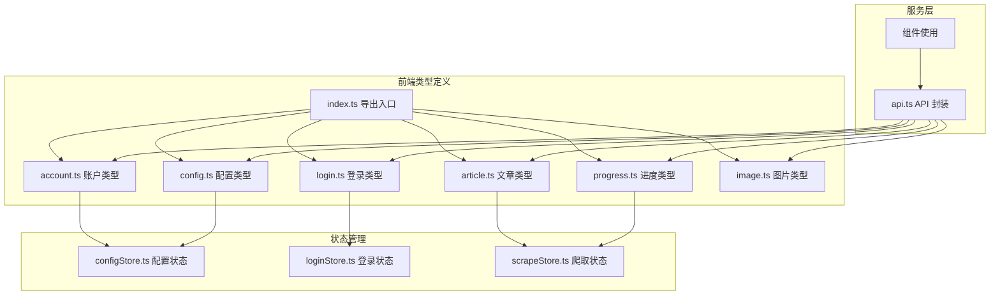

**图表来源**
- [frontend/src/types/index.ts:1-7](file://frontend/src/types/index.ts#L1-L7)
- [frontend/src/stores/configStore.ts:1-13](file://frontend/src/stores/configStore.ts#L1-L13)
- [frontend/src/stores/loginStore.ts:1-15](file://frontend/src/stores/loginStore.ts#L1-L15)
- [frontend/src/stores/scrapeStore.ts:1-65](file://frontend/src/stores/scrapeStore.ts#L1-L65)

**章节来源**
- [frontend/src/types/index.ts:1-7](file://frontend/src/types/index.ts#L1-L7)
- [frontend/src/types/account.ts:1-15](file://frontend/src/types/account.ts#L1-L15)
- [frontend/src/types/article.ts:1-29](file://frontend/src/types/article.ts#L1-L29)
- [frontend/src/types/config.ts:1-25](file://frontend/src/types/config.ts#L1-L25)
- [frontend/src/types/login.ts:1-10](file://frontend/src/types/login.ts#L1-L10)
- [frontend/src/types/progress.ts:1-20](file://frontend/src/types/progress.ts#L1-L20)
- [frontend/src/types/image.ts:1-8](file://frontend/src/types/image.ts#L1-L8)

## 核心组件

### 数据传输对象概述

应用的核心数据传输对象包括以下主要类型：

1. **Account（账户信息）** - 微信公众号的基本信息
2. **Article（文章数据）** - 文章的完整元数据和内容
3. **Config（配置信息）** - 应用的全局配置参数
4. **Login（登录状态）** - 用户认证和会话管理
5. **Progress（进度信息）** - 爬取过程的实时进度跟踪
6. **Image（图片信息）** - 文章图片的下载和管理

### 类型导出机制

通过统一的导出入口简化类型导入：

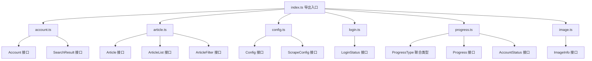

**图表来源**
- [frontend/src/types/index.ts:1-7](file://frontend/src/types/index.ts#L1-L7)

**章节来源**
- [frontend/src/types/index.ts:1-7](file://frontend/src/types/index.ts#L1-L7)

## 架构概览

前端类型系统与后端 Go 模型之间的映射关系：

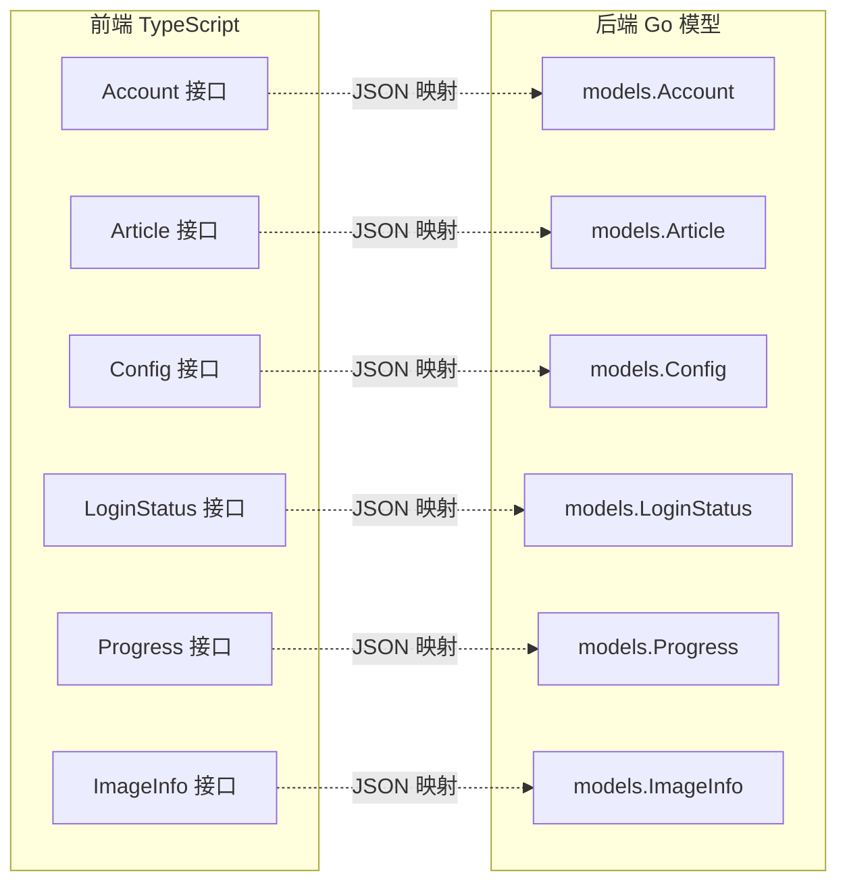

**图表来源**
- [frontend/src/types/account.ts:1-15](file://frontend/src/types/account.ts#L1-L15)
- [frontend/src/types/article.ts:1-29](file://frontend/src/types/article.ts#L1-L29)
- [frontend/src/types/config.ts:1-25](file://frontend/src/types/config.ts#L1-L25)
- [frontend/src/types/login.ts:1-10](file://frontend/src/types/login.ts#L1-L10)
- [frontend/src/types/progress.ts:1-20](file://frontend/src/types/progress.ts#L1-L20)
- [frontend/src/types/image.ts:1-8](file://frontend/src/types/image.ts#L1-L8)
- [backend/internal/models/account.go:1-19](file://backend/internal/models/account.go#L1-L19)
- [backend/internal/models/article.go:1-36](file://backend/internal/models/article.go#L1-L36)
- [backend/internal/models/config.go:1-29](file://backend/internal/models/config.go#L1-L29)
- [backend/internal/models/login.go:1-22](file://backend/internal/models/login.go#L1-L22)
- [backend/internal/models/progress.go:1-34](file://backend/internal/models/progress.go#L1-L34)

## 详细组件分析

### Account 类型系统

Account 类型系统负责管理微信公众号的相关信息：

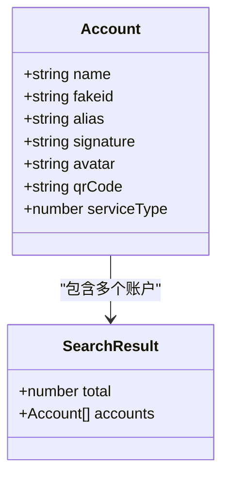

**图表来源**
- [frontend/src/types/account.ts:1-15](file://frontend/src/types/account.ts#L1-L15)

**使用场景**：
- 账户搜索和展示
- 登录状态管理
- 爬取目标配置

**章节来源**
- [frontend/src/types/account.ts:1-15](file://frontend/src/types/account.ts#L1-L15)

### Article 类型系统

Article 类型系统处理文章的完整生命周期数据：

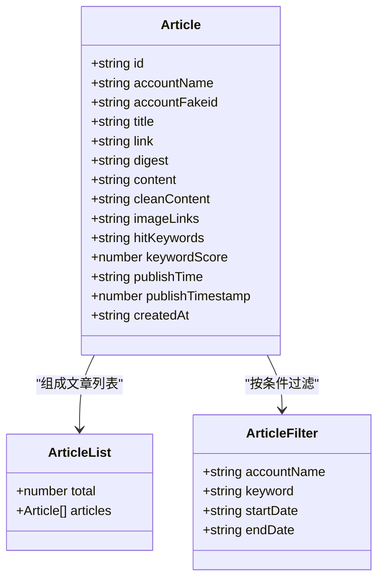

**图表来源**
- [frontend/src/types/article.ts:1-29](file://frontend/src/types/article.ts#L1-L29)

**数据特性**：
- 支持可选字段（cleanContent、imageLinks 等）
- 时间戳和格式化时间并存
- 关键词匹配和评分机制

**章节来源**
- [frontend/src/types/article.ts:1-29](file://frontend/src/types/article.ts#L1-L29)

### Config 类型系统

Config 类型系统管理应用的配置参数：

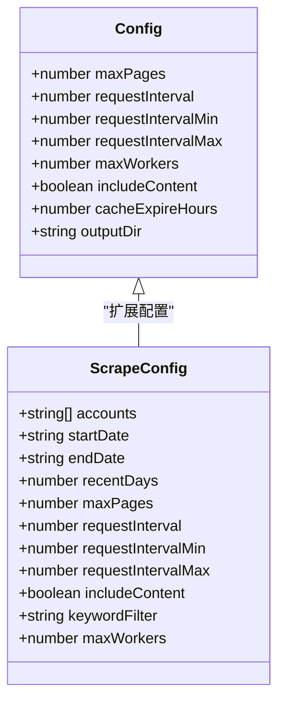

**图表来源**
- [frontend/src/types/config.ts:1-25](file://frontend/src/types/config.ts#L1-L25)

**配置策略**：
- 兼容性设计（requestInterval 作为旧字段）
- 数值范围验证
- 默认值处理

**章节来源**
- [frontend/src/types/config.ts:1-25](file://frontend/src/types/config.ts#L1-L25)

### Login 类型系统

Login 类型系统处理用户认证状态：

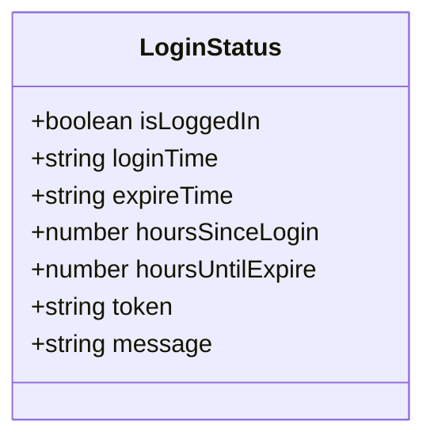

**图表来源**
- [frontend/src/types/login.ts:1-10](file://frontend/src/types/login.ts#L1-L10)

**状态管理**：
- 会话有效期监控
- 自动过期处理
- 错误状态标识

**章节来源**
- [frontend/src/types/login.ts:1-10](file://frontend/src/types/login.ts#L1-L10)

### Progress 类型系统

Progress 类型系统跟踪爬取进度：

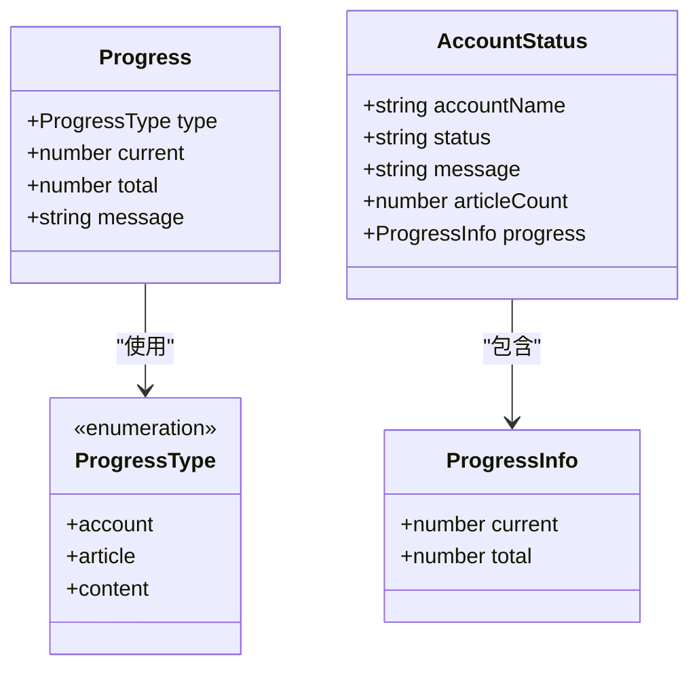

**图表来源**
- [frontend/src/types/progress.ts:1-20](file://frontend/src/types/progress.ts#L1-L20)

**进度跟踪**：
- 多层次进度类型
- 实时状态更新
- 账号级进度汇总

**章节来源**
- [frontend/src/types/progress.ts:1-20](file://frontend/src/types/progress.ts#L1-L20)

### Image 类型系统

Image 类型系统管理文章图片：

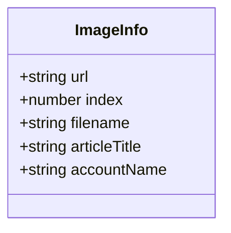

**图表来源**
- [frontend/src/types/image.ts:1-8](file://frontend/src/types/image.ts#L1-L8)

**图片管理**：
- 下载进度跟踪
- 文件命名规范
- 关联文章信息

**章节来源**
- [frontend/src/types/image.ts:1-8](file://frontend/src/types/image.ts#L1-L8)

## 依赖分析

类型定义之间的依赖关系和使用模式：

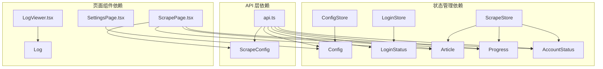

**图表来源**
- [frontend/src/stores/configStore.ts:1-13](file://frontend/src/stores/configStore.ts#L1-L13)
- [frontend/src/stores/loginStore.ts:1-15](file://frontend/src/stores/loginStore.ts#L1-L15)
- [frontend/src/stores/scrapeStore.ts:1-65](file://frontend/src/stores/scrapeStore.ts#L1-L65)
- [frontend/src/services/api.ts:1-161](file://frontend/src/services/api.ts#L1-L161)
- [frontend/src/pages/SettingsPage.tsx:1-556](file://frontend/src/pages/SettingsPage.tsx#L1-L556)
- [frontend/src/pages/ScrapePage.tsx:1-888](file://frontend/src/pages/ScrapePage.tsx#L1-L888)
- [frontend/src/components/LogViewer.tsx:1-83](file://frontend/src/components/LogViewer.tsx#L1-L83)

**章节来源**
- [frontend/src/stores/configStore.ts:1-13](file://frontend/src/stores/configStore.ts#L1-L13)
- [frontend/src/stores/loginStore.ts:1-15](file://frontend/src/stores/loginStore.ts#L1-L15)
- [frontend/src/stores/scrapeStore.ts:1-65](file://frontend/src/stores/scrapeStore.ts#L1-L65)
- [frontend/src/services/api.ts:1-161](file://frontend/src/services/api.ts#L1-L161)

## 性能考虑

### 类型优化策略

1. **可选字段设计**：合理使用可选字段减少内存占用
2. **联合类型**：使用联合类型替代复杂的条件判断
3. **接口继承**：通过接口继承实现代码复用
4. **泛型约束**：在需要时使用泛型提高类型安全

### 运行时性能

- 类型检查在编译时完成，运行时无额外开销
- 使用 zustand 状态管理减少不必要的重渲染
- API 调用采用异步处理避免阻塞主线程

## 故障排除指南

### 常见类型错误

1. **类型不匹配**：确保前后端数据结构一致
2. **可选字段访问**：使用类型守卫或默认值处理
3. **数组类型**：明确数组元素的类型定义
4. **时间格式**：统一使用 ISO 8601 格式

### 调试技巧

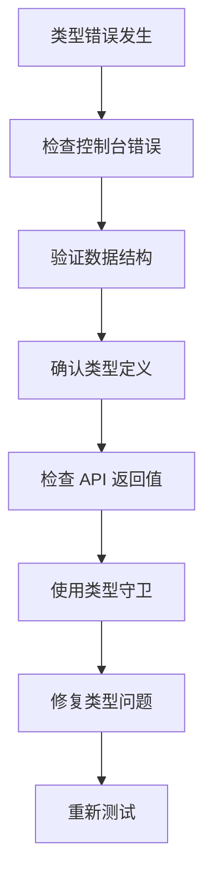

**章节来源**
- [frontend/src/services/api.ts:104-160](file://frontend/src/services/api.ts#L104-L160)

## 结论

WeMediaSpider 的 TypeScript 类型定义展现了良好的架构设计，通过清晰的接口定义、合理的类型分层和完善的类型导出机制，为整个应用提供了强类型的安全保障。类型系统与后端 Go 模型的良好映射确保了数据传输的一致性和可靠性。

## 附录

### 类型使用最佳实践

1. **接口设计原则**：保持接口简洁，职责单一
2. **类型安全**：充分利用 TypeScript 的类型系统
3. **错误处理**：为可能的错误情况设计相应的类型
4. **文档注释**：为复杂类型添加详细的类型注释

### 扩展指南

如需扩展类型系统，建议遵循以下步骤：

1. 在对应的类型文件中添加新的接口定义
2. 更新导出入口以暴露新类型
3. 在相关组件中引入并使用新类型
4. 更新状态管理和 API 层以支持新类型
5. 编写相应的类型测试用例