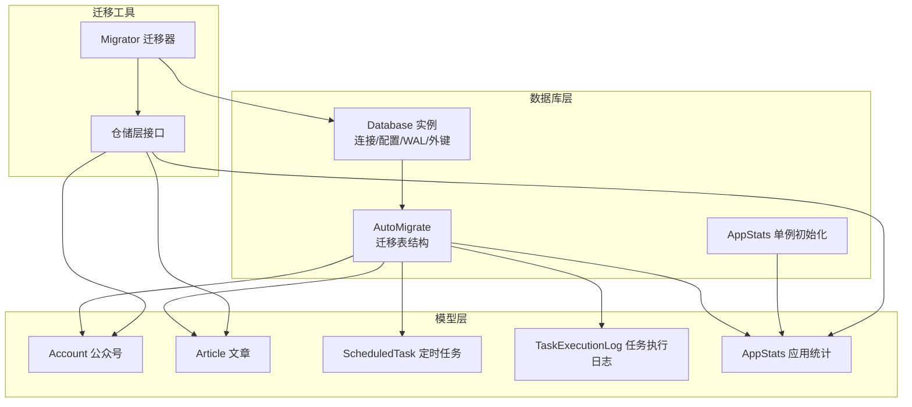
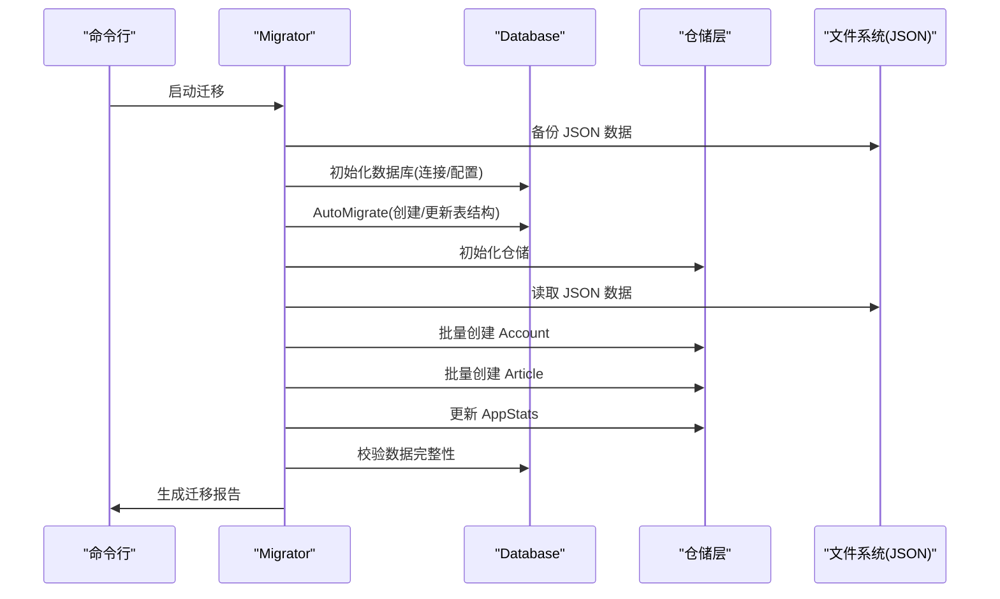
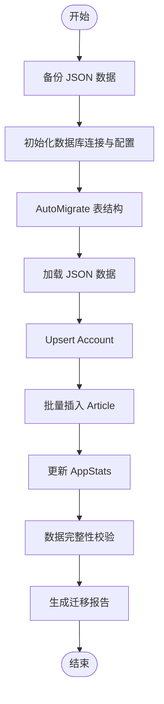
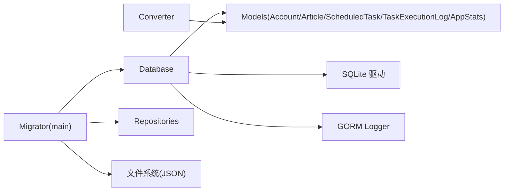

# 数据库设计

<cite>
**本文引用的文件**
- [backend/internal/database/db.go](file://backend/internal/database/db.go)
- [backend/internal/database/models/article.go](file://backend/internal/database/models/article.go)
- [backend/internal/database/models/account.go](file://backend/internal/database/models/account.go)
- [backend/internal/database/models/scheduled_task.go](file://backend/internal/database/models/scheduled_task.go)
- [backend/internal/database/models/task_execution_log.go](file://backend/internal/database/models/task_execution_log.go)
- [backend/internal/database/models/app_stats.go](file://backend/internal/database/models/app_stats.go)
- [backend/internal/database/converter.go](file://backend/internal/database/converter.go)
- [backend/cmd/migrate/main.go](file://backend/cmd/migrate/main.go)
</cite>

## 目录
1. [简介](#简介)
2. [项目结构](#项目结构)
3. [核心组件](#核心组件)
4. [架构总览](#架构总览)
5. [详细组件分析](#详细组件分析)
6. [依赖分析](#依赖分析)
7. [性能考虑](#性能考虑)
8. [故障排查指南](#故障排查指南)
9. [结论](#结论)
10. [附录](#附录)

## 简介
本文件系统化阐述 WeMediaSpider 的数据库设计与实现，覆盖实体关系、字段定义、索引策略、GORM 注解语义、主外键与约束、数据访问模式、查询优化、性能调优以及数据迁移与版本管理策略。目标读者既包括开发者也包括对技术细节感兴趣的非专业用户。

## 项目结构
数据库相关代码主要分布在以下模块：
- 数据库连接与迁移：backend/internal/database/db.go
- 数据模型定义：backend/internal/database/models/*.go
- 数据模型转换器：backend/internal/database/converter.go
- 数据迁移工具：backend/cmd/migrate/main.go



图表来源
- [backend/internal/database/db.go:82-109](file://backend/internal/database/db.go#L82-L109)
- [backend/internal/database/models/account.go:5-13](file://backend/internal/database/models/account.go#L5-L13)
- [backend/internal/database/models/article.go:5-25](file://backend/internal/database/models/article.go#L5-L25)
- [backend/internal/database/models/scheduled_task.go:5-22](file://backend/internal/database/models/scheduled_task.go#L5-L22)
- [backend/internal/database/models/task_execution_log.go:5-18](file://backend/internal/database/models/task_execution_log.go#L5-L18)
- [backend/internal/database/models/app_stats.go:5-18](file://backend/internal/database/models/app_stats.go#L5-L18)
- [backend/cmd/migrate/main.go:68-124](file://backend/cmd/migrate/main.go#L68-L124)

章节来源
- [backend/internal/database/db.go:18-69](file://backend/internal/database/db.go#L18-L69)
- [backend/internal/database/db.go:81-109](file://backend/internal/database/db.go#L81-L109)

## 核心组件
- Database：封装 GORM SQLite 连接、连接池、WAL、缓存、外键约束、同步模式等；提供 AutoMigrate 和单例 AppStats 初始化。
- 模型集合：Account、Article、ScheduledTask、TaskExecutionLog、AppStats。
- 转换器：ConvertToDBArticle/ConvertToAppArticle 等，负责业务模型与数据库模型之间的双向转换。
- 迁移器：Migrator，负责从旧版 JSON 数据迁移至新数据库结构，并生成迁移报告。

章节来源
- [backend/internal/database/db.go:18-69](file://backend/internal/database/db.go#L18-L69)
- [backend/internal/database/converter.go:11-50](file://backend/internal/database/converter.go#L11-L50)
- [backend/cmd/migrate/main.go:27-35](file://backend/cmd/migrate/main.go#L27-L35)

## 架构总览
WeMediaSpider 使用 SQLite 作为本地存储，通过 GORM ORM 映射模型到表结构。数据库初始化时启用 WAL 模式以提升并发写入性能，开启外键约束确保参照完整性，并设置连接池参数与缓存大小以平衡性能与资源占用。迁移流程由独立可执行程序完成，支持备份、迁移、校验与报告生成。



图表来源
- [backend/cmd/migrate/main.go:68-124](file://backend/cmd/migrate/main.go#L68-L124)
- [backend/internal/database/db.go:82-109](file://backend/internal/database/db.go#L82-L109)

## 详细组件分析

### 实体关系与约束
- Account 与 Article：一对多关系，Account.ID → Article.AccountID（外键），Article.AccountFakeid 与 Account.Fakeid 建立业务关联键。
- Article 与 AppStats：Article 不直接关联 AppStats，但 AppStats 为单例统计表，用于全局统计。
- ScheduledTask 与 TaskExecutionLog：一对多关系，ScheduledTask.ID → TaskExecutionLog.TaskID（外键）。
- AppStats：单条记录约束（check:id=1），确保仅有一条统计记录。

```mermaid
erDiagram
ACCOUNT {
uint id PK
string fakeid UK
string name IDX
datetime created_at
datetime updated_at
}
ARTICLE {
uint id PK
string article_id UK
uint account_id FK
string account_fakeid IDX
string account_name
text title
text link
text digest
text content
text clean_content
text image_links
text hit_keywords
int keyword_score
string publish_time
int64 publish_timestamp IDX
datetime created_at IDX
datetime updated_at
}
SCHEDULED_TASK {
uint id PK
string name IDX
text description
string cron_expression
bool enabled IDX
text scrape_config
datetime last_run_time IDX
datetime next_run_time IDX
string last_run_status
text last_run_error
int total_runs
int success_runs
int failed_runs
datetime created_at
datetime updated_at
}
TASK_EXECUTION_LOG {
uint id PK
uint task_id FK
string task_name IDX
datetime start_time IDX
datetime end_time
int64 duration
string status IDX
int articles_count
text error_message
string trigger_type
datetime created_at
}
APP_STATS {
uint id PK CK(id=1)
int total_articles
int total_accounts
int total_images
int total_exports
int today_articles
string last_scrape_date
string last_scrape_time
string last_update_time
datetime created_at
datetime updated_at
}
ACCOUNT ||--o{ ARTICLE : "拥有"
SCHEDULED_TASK ||--o{ TASK_EXECUTION_LOG : "触发"
```

图表来源
- [backend/internal/database/models/account.go:5-13](file://backend/internal/database/models/account.go#L5-L13)
- [backend/internal/database/models/article.go:5-25](file://backend/internal/database/models/article.go#L5-L25)
- [backend/internal/database/models/scheduled_task.go:5-22](file://backend/internal/database/models/scheduled_task.go#L5-L22)
- [backend/internal/database/models/task_execution_log.go:5-18](file://backend/internal/database/models/task_execution_log.go#L5-L18)
- [backend/internal/database/models/app_stats.go:5-18](file://backend/internal/database/models/app_stats.go#L5-L18)

章节来源
- [backend/internal/database/models/account.go:5-13](file://backend/internal/database/models/account.go#L5-L13)
- [backend/internal/database/models/article.go:5-25](file://backend/internal/database/models/article.go#L5-L25)
- [backend/internal/database/models/scheduled_task.go:5-22](file://backend/internal/database/models/scheduled_task.go#L5-L22)
- [backend/internal/database/models/task_execution_log.go:5-18](file://backend/internal/database/models/task_execution_log.go#L5-L18)
- [backend/internal/database/models/app_stats.go:5-18](file://backend/internal/database/models/app_stats.go#L5-L18)

### 字段定义与索引设计
- 主键与唯一性
  - 所有模型均显式声明主键（primaryKey）。
  - Account.Fakeid、Article.ArticleID 声明唯一索引（uniqueIndex），确保业务唯一性。
- 索引
  - Article.AccountID、Account.Name、Article.AccountFakeid、Article.PublishTimestamp、Article.CreatedAt、ScheduledTask.Enabled、ScheduledTask.NextRunTime、TaskExecutionLog.TaskID、TaskExecutionLog.StartTime、TaskExecutionLog.Status 等建立索引以优化查询。
- 类型与默认值
  - 文本字段多采用 text 类型；部分整型字段提供默认值（如 AppStats.*、TaskExecutionLog.Duration、TaskExecutionLog.ArticlesCount 等）。
- 约束
  - 外键约束在 SQLite 层启用（foreign_keys=ON）。
  - AppStats.id 使用 check 约束限制为常量值，实现“单例”语义。
- 时间与时区
  - 数据库层使用统一 NowFunc，结合 timeutil 提供一致的时间基准。

章节来源
- [backend/internal/database/db.go:29-61](file://backend/internal/database/db.go#L29-L61)
- [backend/internal/database/models/account.go:7-12](file://backend/internal/database/models/account.go#L7-L12)
- [backend/internal/database/models/article.go:7-24](file://backend/internal/database/models/article.go#L7-L24)
- [backend/internal/database/models/scheduled_task.go:7-21](file://backend/internal/database/models/scheduled_task.go#L7-L21)
- [backend/internal/database/models/task_execution_log.go:7-18](file://backend/internal/database/models/task_execution_log.go#L7-L18)
- [backend/internal/database/models/app_stats.go:7-17](file://backend/internal/database/models/app_stats.go#L7-L17)

### GORM 注解语义
- 标签（gorm）
  - primaryKey：声明主键。
  - uniqueIndex：唯一索引。
  - not null：非空约束。
  - index：普通索引。
  - type(text)：指定列类型。
  - size(N)：字符串长度限制。
  - default(V)：默认值。
  - check(expr)：检查约束。
  - foreignKey(FK)：外键映射。
- 关系映射
  - Account 与 Article：HasMany（反向通过 Article 的 AccountID）。
  - ScheduledTask 与 TaskExecutionLog：HasMany（反向通过 TaskExecutionLog 的 TaskID）。
- 表名
  - 每个模型实现 TableName 方法，显式指定表名，避免复数化或命名冲突。

章节来源
- [backend/internal/database/models/account.go:15-18](file://backend/internal/database/models/account.go#L15-L18)
- [backend/internal/database/models/article.go:24-30](file://backend/internal/database/models/article.go#L24-L30)
- [backend/internal/database/models/scheduled_task.go:25-27](file://backend/internal/database/models/scheduled_task.go#L25-L27)
- [backend/internal/database/models/task_execution_log.go:21-24](file://backend/internal/database/models/task_execution_log.go#L21-L24)
- [backend/internal/database/models/app_stats.go:20-23](file://backend/internal/database/models/app_stats.go#L20-L23)

### 数据访问模式与查询优化
- 访问模式
  - 仓储层通过 GORM 提供 CRUD 与聚合查询能力，迁移器在导入阶段使用批量插入以提升吞吐。
  - 查询常用过滤条件包括：按公众号 Fakeid 查找 Account，按 Article.AccountID 或 PublishTimestamp 过滤文章。
- 索引优化
  - 在高频过滤字段上建立索引（如 Account.Name、Article.AccountID、Article.PublishTimestamp、TaskExecutionLog.Status 等）。
  - 对时间范围查询（如今日文章统计）建议基于 PublishTimestamp 建立复合索引或分区策略（当前未实现，可作为扩展）。
- 批处理
  - 迁移阶段使用批量创建减少事务开销。
- 缓存与热点
  - AppStats 作为全局统计入口，适合在内存中缓存热点统计值，降低频繁查询成本。

章节来源
- [backend/internal/database/converter.go:11-50](file://backend/internal/database/converter.go#L11-L50)
- [backend/cmd/migrate/main.go:235-257](file://backend/cmd/migrate/main.go#L235-L257)

### 数据迁移机制与版本管理
- 迁移流程
  - 备份：将旧版 JSON 数据复制到 backup 目录。
  - 初始化：创建数据库连接，启用 WAL、外键、缓存与同步模式。
  - 迁移：AutoMigrate 创建/更新表结构；先创建 Account，再批量插入 Article；最后更新 AppStats。
  - 校验：统计记录数并随机抽样验证。
  - 报告：生成迁移报告文本文件。
- 版本管理
  - 当前版本通过 AutoMigrate 自动演进，新增表与索引由迁移器统一管理。
  - 建议未来引入迁移脚本版本号与迁移历史表，以便回滚与增量升级。



图表来源
- [backend/cmd/migrate/main.go:68-124](file://backend/cmd/migrate/main.go#L68-L124)
- [backend/cmd/migrate/main.go:174-257](file://backend/cmd/migrate/main.go#L174-L257)

章节来源
- [backend/cmd/migrate/main.go:68-124](file://backend/cmd/migrate/main.go#L68-L124)
- [backend/internal/database/db.go:82-109](file://backend/internal/database/db.go#L82-L109)

### 示例数据
- Account
  - 字段：ID、Fakeid（唯一）、Name、CreatedAt、UpdatedAt
- Article
  - 字段：ID、ArticleID（唯一）、AccountID、AccountFakeid、AccountName、Title、Link、Digest、Content、CleanContent、ImageLinks、HitKeywords、KeywordScore、PublishTime、PublishTimestamp、CreatedAt、UpdatedAt
- ScheduledTask
  - 字段：ID、Name、Description、CronExpression、Enabled、ScrapeConfig、LastRunTime、NextRunTime、LastRunStatus、LastRunError、TotalRuns、SuccessRuns、FailedRuns、CreatedAt、UpdatedAt
- TaskExecutionLog
  - 字段：ID、TaskID、TaskName、StartTime、EndTime、Duration、Status、ArticlesCount、ErrorMessage、TriggerType、CreatedAt
- AppStats
  - 字段：ID（固定为 1）、TotalArticles、TotalAccounts、TotalImages、TotalExports、TodayArticles、LastScrapeDate、LastScrapeTime、LastUpdateTime、CreatedAt、UpdatedAt

章节来源
- [backend/internal/database/models/account.go:5-13](file://backend/internal/database/models/account.go#L5-L13)
- [backend/internal/database/models/article.go:5-25](file://backend/internal/database/models/article.go#L5-L25)
- [backend/internal/database/models/scheduled_task.go:5-22](file://backend/internal/database/models/scheduled_task.go#L5-L22)
- [backend/internal/database/models/task_execution_log.go:5-18](file://backend/internal/database/models/task_execution_log.go#L5-L18)
- [backend/internal/database/models/app_stats.go:5-18](file://backend/internal/database/models/app_stats.go#L5-L18)

## 依赖分析
- 组件耦合
  - Database 与 models：通过 AutoMigrate 引用各模型类型。
  - converter：在迁移与业务层之间进行模型转换。
  - migrate/main：协调 Database、repository、converter 与文件系统。
- 外部依赖
  - sqlite 驱动、GORM 日志器、zap 日志库、timeutil 时间工具。



图表来源
- [backend/internal/database/db.go:82-109](file://backend/internal/database/db.go#L82-L109)
- [backend/internal/database/converter.go:11-50](file://backend/internal/database/converter.go#L11-L50)
- [backend/cmd/migrate/main.go:68-124](file://backend/cmd/migrate/main.go#L68-L124)

章节来源
- [backend/internal/database/db.go:82-109](file://backend/internal/database/db.go#L82-L109)
- [backend/internal/database/converter.go:11-50](file://backend/internal/database/converter.go#L11-L50)
- [backend/cmd/migrate/main.go:68-124](file://backend/cmd/migrate/main.go#L68-L124)

## 性能考虑
- 存储引擎与并发
  - WAL 模式提升并发写入吞吐，适合频繁写入场景。
  - 连接池：最大打开连接数、空闲连接数、连接生命周期合理配置。
- 索引策略
  - 为高频过滤字段建立索引；对时间范围查询建议复合索引或分区。
- 批处理与事务
  - 批量插入减少事务提交次数；必要时合并多个 DML 到单个事务。
- 缓存与热点
  - AppStats 可在应用层缓存；对热点查询结果进行短期缓存。
- I/O 与同步
  - synchronous=NORMAL 平衡性能与可靠性；根据部署环境可调整。
- 内存与缓存
  - cache_size 设置为负值以使用更多内存缓存页。

章节来源
- [backend/internal/database/db.go:49-61](file://backend/internal/database/db.go#L49-L61)

## 故障排查指南
- 连接失败
  - 检查数据库文件路径与权限；确认 dataDir 可写。
- 迁移失败
  - 查看 AutoMigrate 输出；确认表结构变更是否被允许（如添加非空列需提供默认值或允许 NULL）。
- 外键约束错误
  - 确认 foreign_keys 已启用；检查删除顺序（先删子表后删父表）。
- 性能问题
  - 分析慢查询；为热点查询字段补充索引；评估批量操作粒度。
- 数据不一致
  - 使用 ValidateData 步骤核对记录数与样本数据；必要时回滚并重新迁移。

章节来源
- [backend/internal/database/db.go:38-69](file://backend/internal/database/db.go#L38-L69)
- [backend/cmd/migrate/main.go:268-297](file://backend/cmd/migrate/main.go#L268-L297)

## 结论
WeMediaSpider 的数据库设计以 SQLite + GORM 为核心，通过明确的实体关系、合理的索引策略与严格的约束保障数据完整性；迁移器提供了完整的从旧格式到新结构的自动化流程。建议后续引入版本化迁移与更细粒度的查询优化策略，持续提升稳定性与性能。

## 附录
- 表清单与用途
  - accounts：存储公众号基本信息与唯一标识。
  - articles：存储文章元数据、内容与抓取统计。
  - scheduled_tasks：存储定时任务配置与运行状态。
  - task_execution_logs：存储每次任务执行的明细与结果。
  - app_stats：存储应用级统计信息（单例）。
- 命名规范
  - 表名与字段名采用小写下划线风格；模型名使用驼峰；GORM 标签清晰表达约束与索引意图。