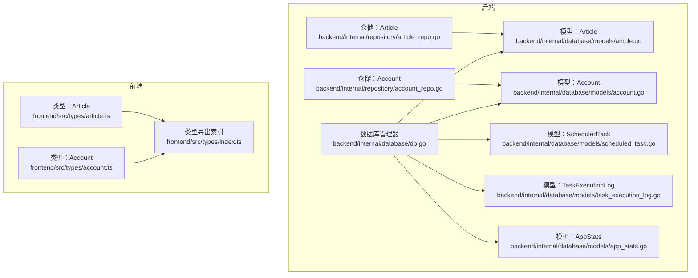
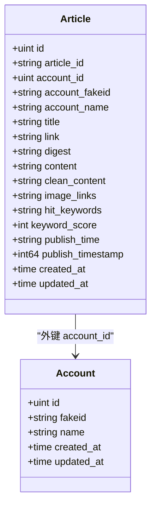
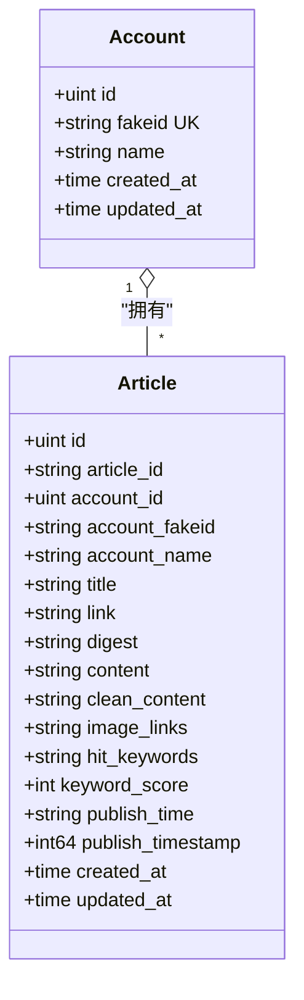
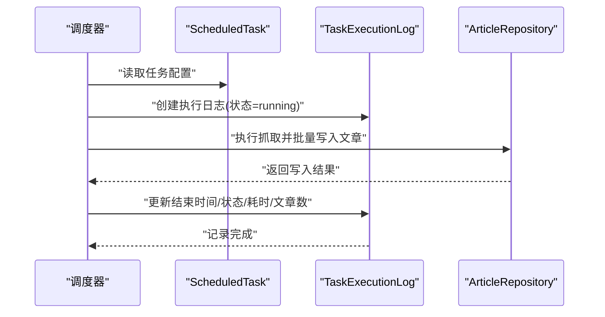

# 数据模型

<cite>
**本文引用的文件**
- [backend/internal/database/models/article.go](file://backend/internal/database/models/article.go)
- [backend/internal/database/models/account.go](file://backend/internal/database/models/account.go)
- [backend/internal/database/models/scheduled_task.go](file://backend/internal/database/models/scheduled_task.go)
- [backend/internal/database/models/task_execution_log.go](file://backend/internal/database/models/task_execution_log.go)
- [backend/internal/database/models/app_stats.go](file://backend/internal/database/models/app_stats.go)
- [backend/internal/database/db.go](file://backend/internal/database/db.go)
- [backend/internal/repository/article_repo.go](file://backend/internal/repository/article_repo.go)
- [backend/internal/repository/account_repo.go](file://backend/internal/repository/account_repo.go)
- [backend/internal/models/article.go](file://backend/internal/models/article.go)
- [backend/internal/models/account.go](file://backend/internal/models/account.go)
- [frontend/src/types/article.ts](file://frontend/src/types/article.ts)
- [frontend/src/types/account.ts](file://frontend/src/types/account.ts)
- [frontend/src/types/index.ts](file://frontend/src/types/index.ts)
</cite>

## 目录
1. [简介](#简介)
2. [项目结构](#项目结构)
3. [核心组件](#核心组件)
4. [架构总览](#架构总览)
5. [详细组件分析](#详细组件分析)
6. [依赖分析](#依赖分析)
7. [性能考虑](#性能考虑)
8. [故障排查指南](#故障排查指南)
9. [结论](#结论)
10. [附录](#附录)

## 简介
本文件系统性梳理 WeMediaSpider 的数据模型与相关实现，覆盖数据库设计（实体关系、字段与索引）、业务含义与约束、TypeScript 类型定义、数据访问模式、缓存与性能策略、数据生命周期与保留策略、以及迁移与版本管理实践。目标是帮助开发者与运维人员快速理解并正确使用数据层。

## 项目结构
数据模型主要分布在后端 Go 的 database/models 与 repository 层，以及前端 TypeScript 类型定义中。后端通过 GORM 使用 SQLite 作为本地存储，并在启动时进行自动迁移与基础配置。



图表来源
- [backend/internal/database/db.go:18-109](file://backend/internal/database/db.go#L18-L109)
- [backend/internal/database/models/article.go:5-31](file://backend/internal/database/models/article.go#L5-L31)
- [backend/internal/database/models/account.go:5-19](file://backend/internal/database/models/account.go#L5-L19)
- [backend/internal/database/models/scheduled_task.go:5-28](file://backend/internal/database/models/scheduled_task.go#L5-L28)
- [backend/internal/database/models/task_execution_log.go:5-25](file://backend/internal/database/models/task_execution_log.go#L5-L25)
- [backend/internal/database/models/app_stats.go:5-24](file://backend/internal/database/models/app_stats.go#L5-L24)
- [backend/internal/repository/article_repo.go:13-168](file://backend/internal/repository/article_repo.go#L13-L168)
- [backend/internal/repository/account_repo.go:11-63](file://backend/internal/repository/account_repo.go#L11-L63)
- [frontend/src/types/article.ts:1-29](file://frontend/src/types/article.ts#L1-L29)
- [frontend/src/types/account.ts:1-15](file://frontend/src/types/account.ts#L1-L15)
- [frontend/src/types/index.ts:1-7](file://frontend/src/types/index.ts#L1-L7)

章节来源
- [backend/internal/database/db.go:18-109](file://backend/internal/database/db.go#L18-L109)
- [backend/internal/database/models/article.go:5-31](file://backend/internal/database/models/article.go#L5-L31)
- [backend/internal/database/models/account.go:5-19](file://backend/internal/database/models/account.go#L5-L19)
- [backend/internal/database/models/scheduled_task.go:5-28](file://backend/internal/database/models/scheduled_task.go#L5-L28)
- [backend/internal/database/models/task_execution_log.go:5-25](file://backend/internal/database/models/task_execution_log.go#L5-L25)
- [backend/internal/database/models/app_stats.go:5-24](file://backend/internal/database/models/app_stats.go#L5-L24)
- [backend/internal/repository/article_repo.go:13-168](file://backend/internal/repository/article_repo.go#L13-L168)
- [backend/internal/repository/account_repo.go:11-63](file://backend/internal/repository/account_repo.go#L11-L63)
- [frontend/src/types/article.ts:1-29](file://frontend/src/types/article.ts#L1-L29)
- [frontend/src/types/account.ts:1-15](file://frontend/src/types/account.ts#L1-L15)
- [frontend/src/types/index.ts:1-7](file://frontend/src/types/index.ts#L1-L7)

## 核心组件
- Article（文章）：承载从公众号抓取的文章元数据与内容，支持按账号、时间范围、关键词检索。
- Account（公众号）：记录公众号基本信息，与 Article 建立一对多关联。
- ScheduledTask（定时任务）：定义可调度的抓取任务，包含 Cron 表达式、状态统计等。
- TaskExecutionLog（任务执行日志）：记录每次任务执行的开始/结束、耗时、状态、错误信息等。
- AppStats（应用统计）：单例统计表，记录总量与最近更新时间等指标。

章节来源
- [backend/internal/database/models/article.go:5-31](file://backend/internal/database/models/article.go#L5-L31)
- [backend/internal/database/models/account.go:5-19](file://backend/internal/database/models/account.go#L5-L19)
- [backend/internal/database/models/scheduled_task.go:5-28](file://backend/internal/database/models/scheduled_task.go#L5-L28)
- [backend/internal/database/models/task_execution_log.go:5-25](file://backend/internal/database/models/task_execution_log.go#L5-L25)
- [backend/internal/database/models/app_stats.go:5-24](file://backend/internal/database/models/app_stats.go#L5-L24)

## 架构总览
下图展示数据模型之间的关系与关键约束：

```mermaid
erDiagram
ACCOUNT {
uint id PK
string fakeid UK
string name
time created_at
time updated_at
}
ARTICLE {
uint id PK
string article_id UK
uint account_id FK
string account_fakeid
string account_name
text title
text link
text digest
text content
text clean_content
text image_links
text hit_keywords
int keyword_score
string publish_time
int64 publish_timestamp
time created_at
time updated_at
}
SCHEDULED_TASK {
uint id PK
string name
text description
string cron_expression
bool enabled
text scrape_config
time last_run_time
time next_run_time
string last_run_status
text last_run_error
int total_runs
int success_runs
int failed_runs
time created_at
time updated_at
}
TASK_EXECUTION_LOG {
uint id PK
uint task_id FK
string task_name
time start_time
time end_time
int64 duration
string status
int articles_count
text error_message
string trigger_type
time created_at
}
APP_STATS {
uint id PK CK(id=1)
int total_articles
int total_accounts
int total_images
int total_exports
int today_articles
string last_scrape_date
string last_scrape_time
string last_update_time
time created_at
time updated_at
}
ACCOUNT ||--o{ ARTICLE : "拥有"
SCHEDULED_TASK ||--o{ TASK_EXECUTION_LOG : "触发"
```

图表来源
- [backend/internal/database/models/account.go:5-19](file://backend/internal/database/models/account.go#L5-L19)
- [backend/internal/database/models/article.go:5-31](file://backend/internal/database/models/article.go#L5-L31)
- [backend/internal/database/models/scheduled_task.go:5-28](file://backend/internal/database/models/scheduled_task.go#L5-L28)
- [backend/internal/database/models/task_execution_log.go:5-25](file://backend/internal/database/models/task_execution_log.go#L5-L25)
- [backend/internal/database/models/app_stats.go:5-24](file://backend/internal/database/models/app_stats.go#L5-L24)

## 详细组件分析

### Article（文章）
- 业务含义：记录从公众号抓取的文章信息，包含标题、链接、摘要、正文、图片链接、命中关键词、关键词评分、发布时间与时间戳等。
- 关键字段与约束：
  - 主键：自增整型 ID。
  - 唯一索引：article_id（字符串，最大长度限制）。
  - 外键：account_id 引用 Account；同时保存冗余字段 account_fakeid、account_name 以支持查询优化。
  - 索引：account_fakeid、publish_timestamp、created_at。
  - 内容字段：title/link/digest/content/clean_content/image_links/hit_keywords 等均为文本类型。
- 查询能力：
  - 按 ID、账号 fakeid、时间范围、关键词搜索、分页统计与删除。
  - 批量插入采用事务与冲突处理，避免重复并更新必要字段。
- 前端映射：Article 接口与后端模型字段基本一致，便于 API 交互。



图表来源
- [backend/internal/database/models/article.go:5-31](file://backend/internal/database/models/article.go#L5-L31)
- [backend/internal/database/models/account.go:5-19](file://backend/internal/database/models/account.go#L5-L19)

章节来源
- [backend/internal/database/models/article.go:5-31](file://backend/internal/database/models/article.go#L5-L31)
- [backend/internal/repository/article_repo.go:13-168](file://backend/internal/repository/article_repo.go#L13-L168)
- [frontend/src/types/article.ts:1-29](file://frontend/src/types/article.ts#L1-L29)

### Account（公众号）
- 业务含义：记录公众号的基本信息，如名称、fakeid、头像、二维码、服务类型等。
- 关键字段与约束：
  - 主键：自增整型 ID。
  - 唯一索引：fakeid（字符串，最大长度限制）。
  - 索引：name。
  - 一对多：Account 与 Article 关联。
- 仓储能力：
  - 按 fakeid 查找或创建、列出全部、创建。



图表来源
- [backend/internal/database/models/account.go:5-19](file://backend/internal/database/models/account.go#L5-L19)
- [backend/internal/database/models/article.go:5-31](file://backend/internal/database/models/article.go#L5-L31)

章节来源
- [backend/internal/database/models/account.go:5-19](file://backend/internal/database/models/account.go#L5-L19)
- [backend/internal/repository/account_repo.go:11-63](file://backend/internal/repository/account_repo.go#L11-L63)
- [frontend/src/types/account.ts:1-15](file://frontend/src/types/account.ts#L1-L15)

### ScheduledTask（定时任务）
- 业务含义：定义可调度的抓取任务，包含任务名称、描述、Cron 表达式、启用状态、抓取配置（JSON）、运行统计与时间点等。
- 关键字段与约束：
  - 主键：自增整型 ID。
  - 索引：name、enabled、last_run_time、next_run_time。
  - 运行统计：total_runs、success_runs、failed_runs。
- 用途：驱动抓取流程，记录任务状态与历史。

章节来源
- [backend/internal/database/models/scheduled_task.go:5-28](file://backend/internal/database/models/scheduled_task.go#L5-L28)

### TaskExecutionLog（任务执行日志）
- 业务含义：记录每次任务执行的生命周期事件，包括开始/结束时间、耗时、状态、错误信息、触发方式、关联任务等。
- 关键字段与约束：
  - 主键：自增整型 ID。
  - 外键：task_id 引用 ScheduledTask。
  - 索引：task_id、task_name、start_time、status。
  - 触发方式：cron 或 manual。
- 用途：审计与监控任务执行情况。



图表来源
- [backend/internal/database/models/scheduled_task.go:5-28](file://backend/internal/database/models/scheduled_task.go#L5-L28)
- [backend/internal/database/models/task_execution_log.go:5-25](file://backend/internal/database/models/task_execution_log.go#L5-L25)
- [backend/internal/repository/article_repo.go:13-168](file://backend/internal/repository/article_repo.go#L13-L168)

章节来源
- [backend/internal/database/models/task_execution_log.go:5-25](file://backend/internal/database/models/task_execution_log.go#L5-L25)

### AppStats（应用统计）
- 业务含义：单例统计表，记录应用总体与当日指标，如文章总数、账号数、图片数、导出次数、最近抓取时间等。
- 关键约束：
  - 主键：固定值 1（通过 check 约束保证）。
- 用途：仪表盘与统计展示。

章节来源
- [backend/internal/database/models/app_stats.go:5-24](file://backend/internal/database/models/app_stats.go#L5-L24)

### TypeScript 类型定义（前端）
- Article 接口：与后端 Article 模型字段对应，便于前后端一致的数据契约。
- Account 接口：与后端 Account 模型字段对应。
- 导出索引：统一导出常用类型，便于页面组件复用。

章节来源
- [frontend/src/types/article.ts:1-29](file://frontend/src/types/article.ts#L1-L29)
- [frontend/src/types/account.ts:1-15](file://frontend/src/types/account.ts#L1-L15)
- [frontend/src/types/index.ts:1-7](file://frontend/src/types/index.ts#L1-L7)

## 依赖分析
- 数据库层：GORM + SQLite，WAL 模式、外键约束、连接池与 PRAGMA 调优。
- 模型层：各实体模型定义字段、索引与关系注解。
- 仓储层：封装 CRUD 与复杂查询，提供批量写入与冲突处理。
- 前端类型：与后端模型保持字段一致性，确保 API 交互稳定。


图表来源
- [backend/internal/database/db.go:18-109](file://backend/internal/database/db.go#L18-L109)
- [backend/internal/repository/article_repo.go:13-168](file://backend/internal/repository/article_repo.go#L13-L168)
- [backend/internal/repository/account_repo.go:11-63](file://backend/internal/repository/account_repo.go#L11-L63)

章节来源
- [backend/internal/database/db.go:18-109](file://backend/internal/database/db.go#L18-L109)
- [backend/internal/repository/article_repo.go:13-168](file://backend/internal/repository/article_repo.go#L13-L168)
- [backend/internal/repository/account_repo.go:11-63](file://backend/internal/repository/account_repo.go#L11-L63)

## 性能考虑
- 连接池与 WAL：
  - 最大并发连接数、空闲连接数、连接最大存活时间设置合理。
  - WAL 模式提升并发写入性能；同步模式 NORMAL 平衡性能与可靠性。
- PRAGMA 调优：
  - 缓存大小设置、外键约束开启、索引列使用恰当。
- 查询优化：
  - 在高频查询列上建立索引（如 account_fakeid、publish_timestamp、task_name、status 等）。
  - 使用分页与排序（按时间倒序）控制结果集规模。
- 批量写入：
  - 事务包裹批量插入，减少往返开销；使用 ON CONFLICT DO UPDATE 更新重复项，避免重复主键。
- 前端渲染：
  - 列表分页加载，避免一次性渲染大量数据。

章节来源
- [backend/internal/database/db.go:49-62](file://backend/internal/database/db.go#L49-L62)
- [backend/internal/repository/article_repo.go:42-74](file://backend/internal/repository/article_repo.go#L42-L74)
- [backend/internal/repository/article_repo.go:86-121](file://backend/internal/repository/article_repo.go#L86-L121)
- [backend/internal/repository/article_repo.go:123-141](file://backend/internal/repository/article_repo.go#L123-L141)

## 故障排查指南
- 数据库连接失败：
  - 检查数据库文件路径与权限；确认 SQLite 可用且无被占用。
- 迁移失败：
  - 确认 AutoMigrate 调用顺序与模型导入正确；查看具体错误信息定位字段或索引问题。
- 写入冲突：
  - 批量写入使用 ON CONFLICT；若仍出现冲突，检查 article_id 唯一性与并发写入策略。
- 查询性能差：
  - 确认相关列已建立索引；避免全表扫描；对大结果集使用分页。
- 任务执行异常：
  - 查看 TaskExecutionLog 的状态与错误信息；核对 ScheduledTask 的 Cron 表达式与配置。

章节来源
- [backend/internal/database/db.go:81-109](file://backend/internal/database/db.go#L81-L109)
- [backend/internal/repository/article_repo.go:42-74](file://backend/internal/repository/article_repo.go#L42-L74)
- [backend/internal/database/models/task_execution_log.go:5-25](file://backend/internal/database/models/task_execution_log.go#L5-L25)
- [backend/internal/database/models/scheduled_task.go:5-28](file://backend/internal/database/models/scheduled_task.go#L5-L28)

## 结论
WeMediaSpider 的数据模型围绕“公众号—文章”与“任务—日志”的双主线展开，配合 SQLite+WAL、索引与批量写入策略，在本地场景下实现了较好的性能与可维护性。前端类型与后端模型保持一致，有助于降低集成成本。建议持续关注查询热点列的索引覆盖与定期清理策略，以维持长期稳定性。

## 附录

### 字段与索引设计要点
- Article
  - 唯一索引：article_id
  - 索引：account_fakeid、publish_timestamp、created_at
- Account
  - 唯一索引：fakeid
  - 索引：name
- ScheduledTask
  - 索引：name、enabled、last_run_time、next_run_time
- TaskExecutionLog
  - 索引：task_id、task_name、start_time、status

章节来源
- [backend/internal/database/models/article.go:5-31](file://backend/internal/database/models/article.go#L5-L31)
- [backend/internal/database/models/account.go:5-19](file://backend/internal/database/models/account.go#L5-L19)
- [backend/internal/database/models/scheduled_task.go:5-28](file://backend/internal/database/models/scheduled_task.go#L5-L28)
- [backend/internal/database/models/task_execution_log.go:5-25](file://backend/internal/database/models/task_execution_log.go#L5-L25)

### 数据访问模式
- ArticleRepository：创建、批量创建、按 ID/账号/日期范围/关键词查询、统计、删除、全量获取。
- AccountRepository：创建、按 fakeid 查找、查找或创建、列出全部。

章节来源
- [backend/internal/repository/article_repo.go:13-168](file://backend/internal/repository/article_repo.go#L13-L168)
- [backend/internal/repository/account_repo.go:11-63](file://backend/internal/repository/account_repo.go#L11-L63)

### 数据验证与业务规则
- 唯一性：Article.article_id、Account.fakeid。
- 外键约束：Article.account_id → Account.id；TaskExecutionLog.task_id → ScheduledTask.id。
- 单例约束：AppStats.id 固定为 1。
- 冲突处理：批量写入时按 article_id 冲突更新必要字段。
- 时间字段：文章发布时间以字符串与时间戳并存，便于排序与检索。

章节来源
- [backend/internal/database/models/article.go:5-31](file://backend/internal/database/models/article.go#L5-L31)
- [backend/internal/database/models/account.go:5-19](file://backend/internal/database/models/account.go#L5-L19)
- [backend/internal/database/models/app_stats.go:5-24](file://backend/internal/database/models/app_stats.go#L5-L24)
- [backend/internal/repository/article_repo.go:42-74](file://backend/internal/repository/article_repo.go#L42-L74)

### 数据生命周期、保留策略与归档
- 未在代码中发现显式的数据保留/归档策略实现。
- 建议结合业务需求制定策略：例如按账号/时间维度清理旧数据、压缩历史日志、定期导出统计报表等。
- 若未来引入保留策略，应配套迁移脚本与监控告警。

[本节为通用建议，不直接分析具体文件]

### 数据迁移路径与版本管理
- 自动迁移：启动时调用 AutoMigrate，迁移 Account、Article、AppStats、ScheduledTask、TaskExecutionLog。
- 初始化统计：若 app_stats 为空则插入单条记录。
- 版本管理：当前未见独立迁移工具入口；建议后续引入迁移工具（如 goose 或自研），并为每个变更打上版本号与回滚脚本。

章节来源
- [backend/internal/database/db.go:81-109](file://backend/internal/database/db.go#L81-L109)

### 示例数据（示意）
- Account
  - fakeid: "gh_XXXXXXXXXXXX"
  - name: "示例公众号"
- Article
  - article_id: "msg_id_001"
  - account_fakeid: "gh_XXXXXXXXXXXX"
  - title: "示例文章标题"
  - publish_timestamp: 1700000000
  - keyword_score: 5
- ScheduledTask
  - name: "每日抓取任务"
  - cronExpression: "0 0 2 * * ?"
  - enabled: true
  - scrapeConfig: "{}"
- TaskExecutionLog
  - taskName: "每日抓取任务"
  - startTime: "2024-01-01T02:00:00Z"
  - endTime: "2024-01-01T02:05:00Z"
  - status: "success"
  - articlesCount: 120

[本节为概念性示例，不直接分析具体文件]