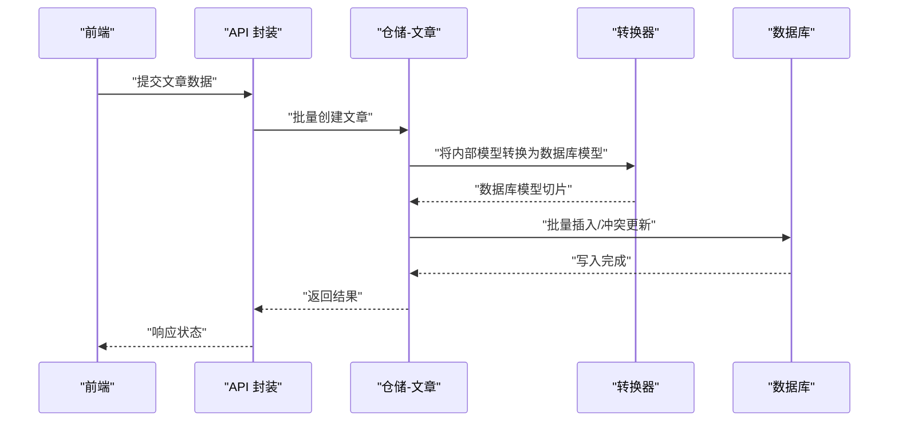
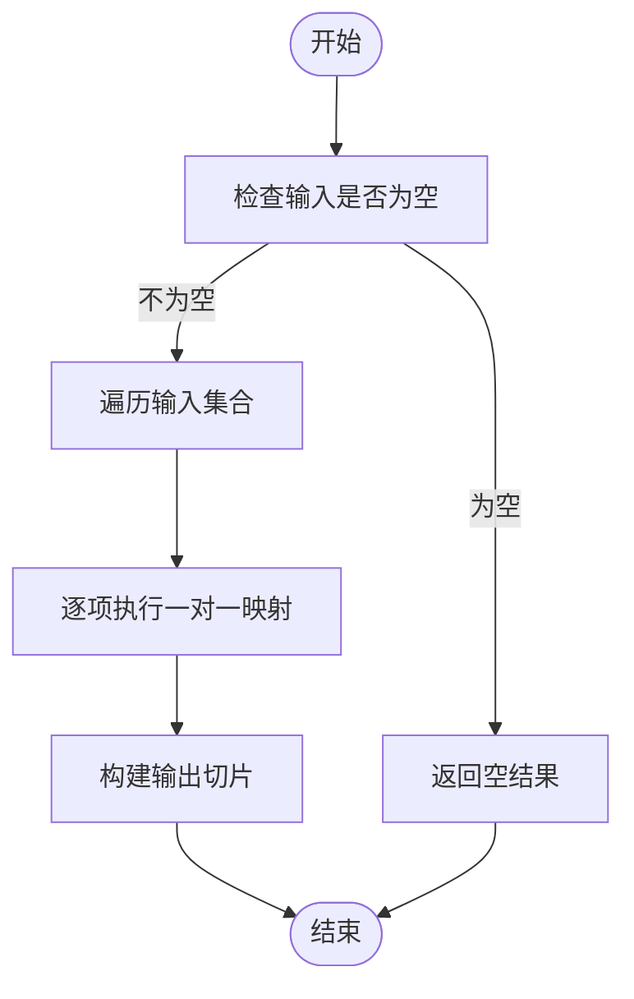
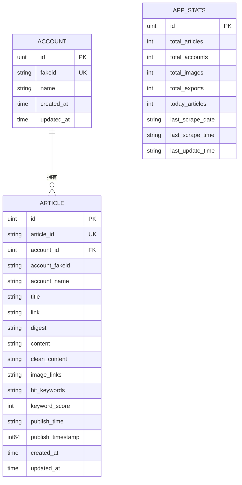
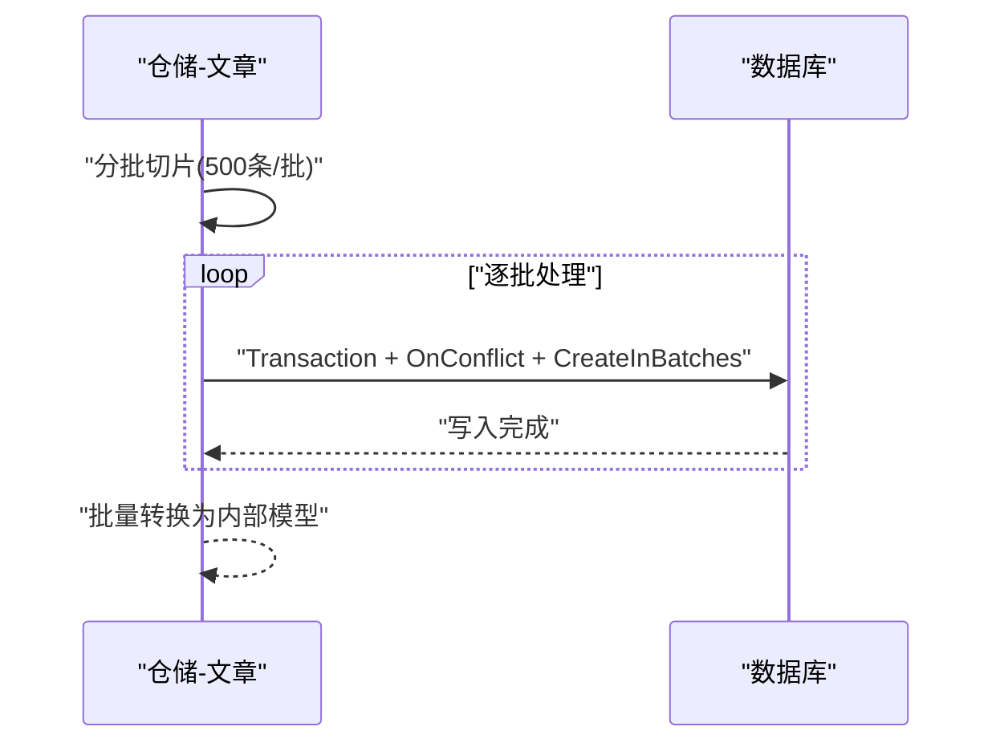
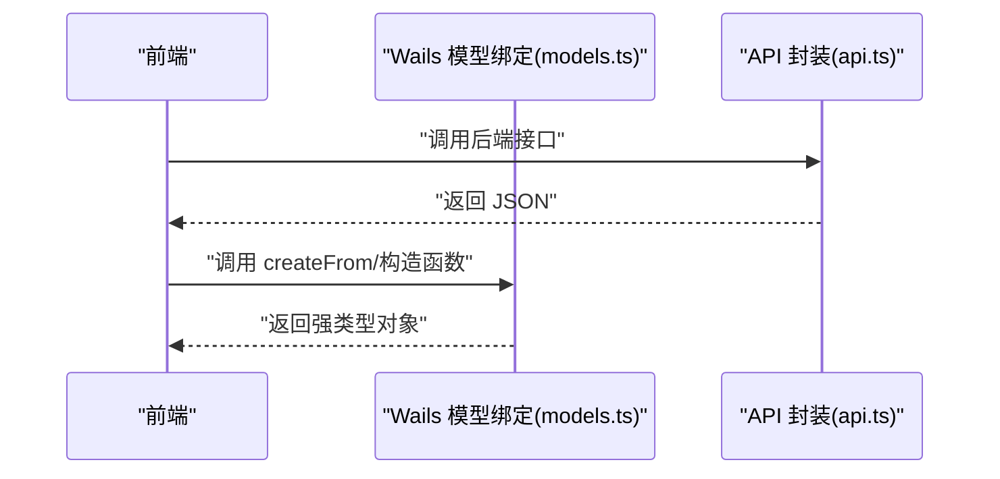
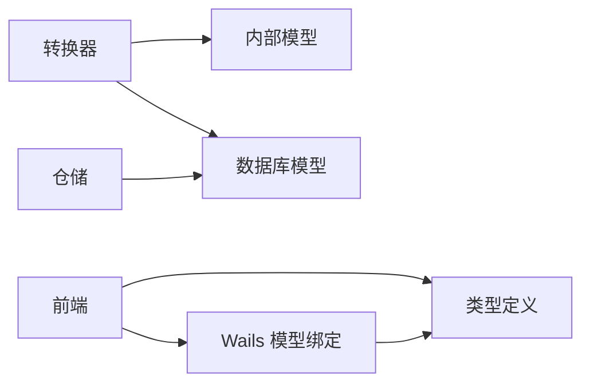

# 数据转换与映射

<cite>
**本文引用的文件**
- [backend/internal/database/converter.go](file://backend/internal/database/converter.go)
- [backend/internal/database/models/article.go](file://backend/internal/database/models/article.go)
- [backend/internal/database/models/account.go](file://backend/internal/database/models/account.go)
- [backend/internal/database/models/app_stats.go](file://backend/internal/database/models/app_stats.go)
- [backend/internal/models/article.go](file://backend/internal/models/article.go)
- [backend/internal/models/account.go](file://backend/internal/models/account.go)
- [backend/internal/models/analytics.go](file://backend/internal/models/analytics.go)
- [backend/internal/models/appdata.go](file://backend/internal/models/appdata.go)
- [backend/internal/repository/article_repo.go](file://backend/internal/repository/article_repo.go)
- [backend/internal/repository/analytics_repo.go](file://backend/internal/repository/analytics_repo.go)
- [frontend/src/types/article.ts](file://frontend/src/types/article.ts)
- [frontend/src/types/account.ts](file://frontend/src/types/account.ts)
- [frontend/src/services/api.ts](file://frontend/src/services/api.ts)
- [frontend/wailsjs/go/models.ts](file://frontend/wailsjs/go/models.ts)
</cite>

## 目录
1. [简介](#简介)
2. [项目结构](#项目结构)
3. [核心组件](#核心组件)
4. [架构总览](#架构总览)
5. [详细组件分析](#详细组件分析)
6. [依赖分析](#依赖分析)
7. [性能考虑](#性能考虑)
8. [故障排查指南](#故障排查指南)
9. [结论](#结论)
10. [附录](#附录)

## 简介
本文件系统性阐述 WeMediaSpider 后端与前端在“数据转换与映射”方面的设计与实现，重点覆盖：
- 后端模型与数据库模型之间的转换机制（结构体转换、字段映射、数据类型适配）
- 转换器的设计模式与实现策略（一对一映射、一对多关系处理、嵌套对象转换）
- 数据验证与清洗流程（空值处理、格式转换、默认值设置）
- 转换性能优化策略与批量转换机制
- 前后端数据传输的序列化与反序列化过程
- 转换测试与质量保证措施

## 项目结构
WeMediaSpider 的数据转换涉及三层：
- 后端内部模型层：面向业务逻辑的结构体，用于 API 返回与前端交互
- 数据库模型层：面向持久化的 GORM 结构体，定义表结构与索引
- 转换器层：负责在上述两层之间进行双向转换，并提供批量转换与派生数据计算

```mermaid
graph TB
subgraph "后端"
A["内部模型<br/>backend/internal/models/*"]
C["转换器<br/>backend/internal/database/converter.go"]
D["数据库模型<br/>backend/internal/database/models/*"]
R1["仓储-文章<br/>backend/internal/repository/article_repo.go"]
R2["仓储-分析<br/>backend/internal/repository/analytics_repo.go"]
end
subgraph "前端"
F1["类型定义<br/>frontend/src/types/*"]
F2["Wails 模型绑定<br/>frontend/wailsjs/go/models.ts"]
F3["API 封装<br/>frontend/src/services/api.ts"]
end
A <- --> C
C --> D
D --> R1
D --> R2
F1 --> F2
F2 --> F3
```

图表来源
- [backend/internal/database/converter.go:1-103](file://backend/internal/database/converter.go#L1-L103)
- [backend/internal/database/models/article.go:1-31](file://backend/internal/database/models/article.go#L1-L31)
- [backend/internal/database/models/account.go:1-19](file://backend/internal/database/models/account.go#L1-L19)
- [backend/internal/models/article.go:1-36](file://backend/internal/models/article.go#L1-L36)
- [backend/internal/models/account.go:1-19](file://backend/internal/models/account.go#L1-L19)
- [backend/internal/repository/article_repo.go:1-168](file://backend/internal/repository/article_repo.go#L1-L168)
- [backend/internal/repository/analytics_repo.go:1-284](file://backend/internal/repository/analytics_repo.go#L1-L284)
- [frontend/src/types/article.ts:1-29](file://frontend/src/types/article.ts#L1-L29)
- [frontend/src/types/account.ts:1-15](file://frontend/src/types/account.ts#L1-L15)
- [frontend/wailsjs/go/models.ts:180-574](file://frontend/wailsjs/go/models.ts#L180-L574)
- [frontend/src/services/api.ts:1-161](file://frontend/src/services/api.ts#L1-L161)

章节来源
- [backend/internal/database/converter.go:1-103](file://backend/internal/database/converter.go#L1-L103)
- [backend/internal/database/models/article.go:1-31](file://backend/internal/database/models/article.go#L1-L31)
- [backend/internal/database/models/account.go:1-19](file://backend/internal/database/models/account.go#L1-L19)
- [backend/internal/models/article.go:1-36](file://backend/internal/models/article.go#L1-L36)
- [backend/internal/models/account.go:1-19](file://backend/internal/models/account.go#L1-L19)
- [backend/internal/repository/article_repo.go:1-168](file://backend/internal/repository/article_repo.go#L1-L168)
- [backend/internal/repository/analytics_repo.go:1-284](file://backend/internal/repository/analytics_repo.go#L1-L284)
- [frontend/src/types/article.ts:1-29](file://frontend/src/types/article.ts#L1-L29)
- [frontend/src/types/account.ts:1-15](file://frontend/src/types/account.ts#L1-L15)
- [frontend/wailsjs/go/models.ts:180-574](file://frontend/wailsjs/go/models.ts#L180-L574)
- [frontend/src/services/api.ts:1-161](file://frontend/src/services/api.ts#L1-L161)

## 核心组件
- 转换器模块：提供数据库模型与内部模型之间的双向转换函数，以及派生数据计算（如今日文章数、账户名集合等）
- 仓储层：负责数据库访问与批量写入，配合转换器完成数据落库与读取
- 内部模型与数据库模型：分别定义业务与持久化层面的数据结构
- 前端类型与 Wails 模型绑定：定义前端消费的数据结构，并通过自动生成的模型类完成序列化/反序列化

章节来源
- [backend/internal/database/converter.go:11-103](file://backend/internal/database/converter.go#L11-L103)
- [backend/internal/repository/article_repo.go:42-74](file://backend/internal/repository/article_repo.go#L42-L74)
- [backend/internal/models/article.go:5-36](file://backend/internal/models/article.go#L5-L36)
- [backend/internal/database/models/article.go:5-31](file://backend/internal/database/models/article.go#L5-L31)
- [frontend/wailsjs/go/models.ts:180-574](file://frontend/wailsjs/go/models.ts#L180-L574)

## 架构总览
下图展示从前端请求到数据库落库，再到分析统计与返回的完整数据流。



图表来源
- [backend/internal/repository/article_repo.go:42-74](file://backend/internal/repository/article_repo.go#L42-L74)
- [backend/internal/database/converter.go:11-30](file://backend/internal/database/converter.go#L11-L30)
- [frontend/src/services/api.ts:1-161](file://frontend/src/services/api.ts#L1-L161)

## 详细组件分析

### 转换器设计与实现
- 双向映射
  - ConvertToDBArticle：将内部模型 Article 转换为数据库模型 Article
  - ConvertToAppArticle：将数据库模型 Article 转换为内部模型 Article
- 批量转换
  - ConvertToAppArticles：将数据库模型切片批量转换为内部模型切片
- 派生数据
  - ConvertToAppData：将数据库统计模型 AppStats 与账户名集合组合为内部 AppData
  - CalculateTodayArticles：基于发布时间戳计算今日文章数
  - ExtractAccountNames：从文章列表中去重提取账户名集合



图表来源
- [backend/internal/database/converter.go:52-59](file://backend/internal/database/converter.go#L52-L59)

章节来源
- [backend/internal/database/converter.go:11-103](file://backend/internal/database/converter.go#L11-L103)

### 数据模型与字段映射
- 文章模型映射要点
  - 主键与唯一索引：ArticleID（数据库模型）对应内部模型 ID
  - 时间字段：PublishTimestamp（数据库模型）与 PublishTime（字符串格式）双向映射
  - 文本字段：Content/CleanContent/ImageLinks/HitKeywords 等以文本存储，前端以字符串形式消费
  - 关系字段：AccountID 与 Account 表建立外键关联
- 公众号模型映射要点
  - Account 表与 Article 表通过 AccountID 关联
  - 前端 Account 类型包含额外字段（如 alias、signature），内部模型仅保留必要字段
- 应用统计模型映射要点
  - AppStats 单例模式，包含总量、今日量、最后爬取时间等派生指标
  - 转换器将统计结果与账户名集合合并为 AppData



图表来源
- [backend/internal/database/models/article.go:5-31](file://backend/internal/database/models/article.go#L5-L31)
- [backend/internal/database/models/account.go:5-19](file://backend/internal/database/models/account.go#L5-L19)
- [backend/internal/database/models/app_stats.go:5-24](file://backend/internal/database/models/app_stats.go#L5-L24)

章节来源
- [backend/internal/database/models/article.go:5-31](file://backend/internal/database/models/article.go#L5-L31)
- [backend/internal/database/models/account.go:5-19](file://backend/internal/database/models/account.go#L5-L19)
- [backend/internal/database/models/app_stats.go:5-24](file://backend/internal/database/models/app_stats.go#L5-L24)
- [backend/internal/models/article.go:5-36](file://backend/internal/models/article.go#L5-L36)
- [backend/internal/models/account.go:3-12](file://backend/internal/models/account.go#L3-L12)

### 批量转换与性能优化
- 批量写入策略
  - 仓储层使用事务包裹，分批（每批 500 条）批量插入，并启用 ON CONFLICT DO UPDATE 实现幂等更新
- 转换器批量处理
  - ConvertToAppArticles 对切片进行循环映射，避免重复分配与拷贝
- 性能建议
  - 控制批次大小，平衡内存占用与吞吐
  - 在转换前进行必要的字段清洗（如 Markdown 图片链接清理），减少数据库冗余存储
  - 利用数据库索引（如 PublishTimestamp、AccountFakeid）加速查询与排序



图表来源
- [backend/internal/repository/article_repo.go:42-74](file://backend/internal/repository/article_repo.go#L42-L74)
- [backend/internal/database/converter.go:52-59](file://backend/internal/database/converter.go#L52-L59)

章节来源
- [backend/internal/repository/article_repo.go:42-74](file://backend/internal/repository/article_repo.go#L42-L74)
- [backend/internal/database/converter.go:52-59](file://backend/internal/database/converter.go#L52-L59)

### 数据验证与清洗
- 字段清洗
  - Markdown 图片链接清理：在分析与导出前，移除内容中的图片语法，降低存储体积并提升关键词提取准确性
- 空值与默认值
  - 数据库模型字段默认值由 GORM 定义（如 KeywordScore 默认 0）
  - 转换器在缺失字段时保持零值或空字符串，确保前端可解析
- 时间处理
  - PublishTimestamp 作为统一时间基准；ConvertToAppData 中根据中国时区计算今日起始时间，用于统计今日文章数

章节来源
- [backend/internal/repository/analytics_repo.go:187-192](file://backend/internal/repository/analytics_repo.go#L187-L192)
- [backend/internal/database/converter.go:76-88](file://backend/internal/database/converter.go#L76-L88)
- [backend/internal/database/models/article.go:19-21](file://backend/internal/database/models/article.go#L19-L21)

### 嵌套对象与一对多关系处理
- 一对多关系
  - Account 与 Article 通过 AccountID 建立一对多关联；查询分析时可按公众号分组统计时间分布与活跃度
- 嵌套对象
  - 内部分析模型包含多个嵌套结构（如时间分布、关键词频率、账号活跃度），转换器将其映射为前端可消费的扁平结构
  - 前端 Wails 模型类提供 convertValues 方法，递归将 JSON 数据转换为对应的 TypeScript 类实例

章节来源
- [backend/internal/database/models/account.go:12-12](file://backend/internal/database/models/account.go#L12-L12)
- [backend/internal/repository/analytics_repo.go:82-151](file://backend/internal/repository/analytics_repo.go#L82-L151)
- [backend/internal/models/analytics.go:10-52](file://backend/internal/models/analytics.go#L10-L52)
- [frontend/wailsjs/go/models.ts:187-203](file://frontend/wailsjs/go/models.ts#L187-L203)

### 前后端序列化与反序列化
- 前端类型定义
  - Article、Account、ArticleList、ArticleFilter 等接口定义与后端内部模型字段一一对应
- Wails 模型绑定
  - 自动生成的 models.ts 提供 createFrom/构造函数，将后端返回的 JSON 自动映射为前端类实例
  - convertValues 支持数组与对象的递归转换，便于处理嵌套结构
- API 封装
  - api.ts 汇总了所有后端暴露的 API，前端通过这些封装函数发起请求并接收响应



图表来源
- [frontend/wailsjs/go/models.ts:180-574](file://frontend/wailsjs/go/models.ts#L180-L574)
- [frontend/src/services/api.ts:49-101](file://frontend/src/services/api.ts#L49-L101)
- [frontend/src/types/article.ts:1-29](file://frontend/src/types/article.ts#L1-L29)
- [frontend/src/types/account.ts:1-15](file://frontend/src/types/account.ts#L1-L15)

章节来源
- [frontend/src/types/article.ts:1-29](file://frontend/src/types/article.ts#L1-L29)
- [frontend/src/types/account.ts:1-15](file://frontend/src/types/account.ts#L1-L15)
- [frontend/wailsjs/go/models.ts:180-574](file://frontend/wailsjs/go/models.ts#L180-L574)
- [frontend/src/services/api.ts:1-161](file://frontend/src/services/api.ts#L1-L161)

### 转换测试与质量保证
- 测试建议
  - 单元测试：针对转换器函数（如 ConvertToDBArticle、ConvertToAppArticle）编写断言，覆盖字段映射、空值、边界值
  - 批量测试：对 ConvertToAppArticles 进行大样本测试，验证性能与内存占用
  - 集成测试：结合仓储层批量写入，验证 ON CONFLICT 更新逻辑与幂等性
  - 前端测试：利用 Wails 模型绑定的 createFrom，验证 JSON 到类实例的正确转换
- 质量保障
  - 使用 GORM 默认值与非空约束，确保数据库层数据一致性
  - 在转换器中显式处理缺失字段，避免空指针或异常
  - 对时间字段进行统一格式化与时区处理，避免跨时区问题

章节来源
- [backend/internal/database/converter.go:11-103](file://backend/internal/database/converter.go#L11-L103)
- [backend/internal/repository/article_repo.go:42-74](file://backend/internal/repository/article_repo.go#L42-L74)
- [frontend/wailsjs/go/models.ts:180-574](file://frontend/wailsjs/go/models.ts#L180-L574)

## 依赖分析
- 转换器依赖内部模型与数据库模型，同时被仓储层调用
- 仓储层依赖数据库驱动与 GORM，负责数据持久化与批量操作
- 前端依赖 Wails 自动生成的模型绑定与类型定义，确保前后端契约一致



图表来源
- [backend/internal/database/converter.go:1-103](file://backend/internal/database/converter.go#L1-L103)
- [backend/internal/repository/article_repo.go:1-168](file://backend/internal/repository/article_repo.go#L1-L168)
- [frontend/wailsjs/go/models.ts:180-574](file://frontend/wailsjs/go/models.ts#L180-L574)
- [frontend/src/types/article.ts:1-29](file://frontend/src/types/article.ts#L1-L29)

章节来源
- [backend/internal/database/converter.go:1-103](file://backend/internal/database/converter.go#L1-L103)
- [backend/internal/repository/article_repo.go:1-168](file://backend/internal/repository/article_repo.go#L1-L168)
- [frontend/wailsjs/go/models.ts:180-574](file://frontend/wailsjs/go/models.ts#L180-L574)
- [frontend/src/types/article.ts:1-29](file://frontend/src/types/article.ts#L1-L29)

## 性能考虑
- 批量写入：仓储层采用分批事务写入，减少单次事务开销
- 冲突更新：ON CONFLICT DO UPDATE 避免重复主键导致的失败重试
- 索引优化：在 PublishTimestamp、AccountFakeid 等常用查询字段上建立索引
- 转换成本：批量转换器避免重复分配，减少 GC 压力
- 前端渲染：Wails 模型绑定一次性完成 JSON 到类实例的转换，降低前端解析成本

## 故障排查指南
- 写入失败
  - 检查 ON CONFLICT 配置与字段列表是否匹配
  - 确认批次大小与数据库连接池配置
- 映射异常
  - 核对转换器字段映射是否遗漏或错位
  - 检查前端类型定义与后端内部模型字段是否一致
- 时间显示异常
  - 确认 PublishTimestamp 与前端展示时区一致
  - 检查 ConvertToAppData 的今日起始时间计算逻辑
- 前端对象为空
  - 确认 Wails 模型绑定的 createFrom 是否被调用
  - 检查 JSON 字段命名与类属性是否一致

章节来源
- [backend/internal/repository/article_repo.go:42-74](file://backend/internal/repository/article_repo.go#L42-L74)
- [backend/internal/database/converter.go:11-103](file://backend/internal/database/converter.go#L11-L103)
- [frontend/wailsjs/go/models.ts:180-574](file://frontend/wailsjs/go/models.ts#L180-L574)

## 结论
WeMediaSpider 的数据转换体系通过清晰的三层划分与严格的字段映射，实现了后端业务模型与数据库模型的高效转换，并通过批量处理与冲突更新保障了性能与一致性。前端通过 Wails 自动生成的模型绑定，完成了从 JSON 到强类型的无缝转换。整体设计兼顾了扩展性与可维护性，适合在持续迭代中引入新的转换场景与优化策略。

## 附录
- 示例路径
  - 文章模型转换：[ConvertToDBArticle:11-30](file://backend/internal/database/converter.go#L11-L30)、[ConvertToAppArticle:32-49](file://backend/internal/database/converter.go#L32-L49)
  - 批量转换：[ConvertToAppArticles:52-59](file://backend/internal/database/converter.go#L52-L59)
  - 批量写入：[BatchCreate:42-74](file://backend/internal/repository/article_repo.go#L42-L74)
  - 前端模型绑定：[models.ts:180-574](file://frontend/wailsjs/go/models.ts#L180-L574)
  - 前端类型定义：[article.ts:1-29](file://frontend/src/types/article.ts#L1-L29)、[account.ts:1-15](file://frontend/src/types/account.ts#L1-L15)
  - API 封装：[api.ts:1-161](file://frontend/src/services/api.ts#L1-L161)