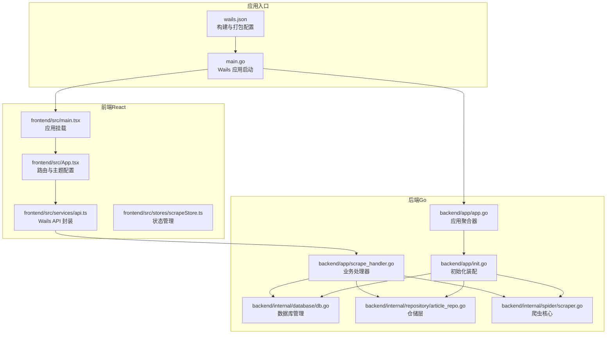
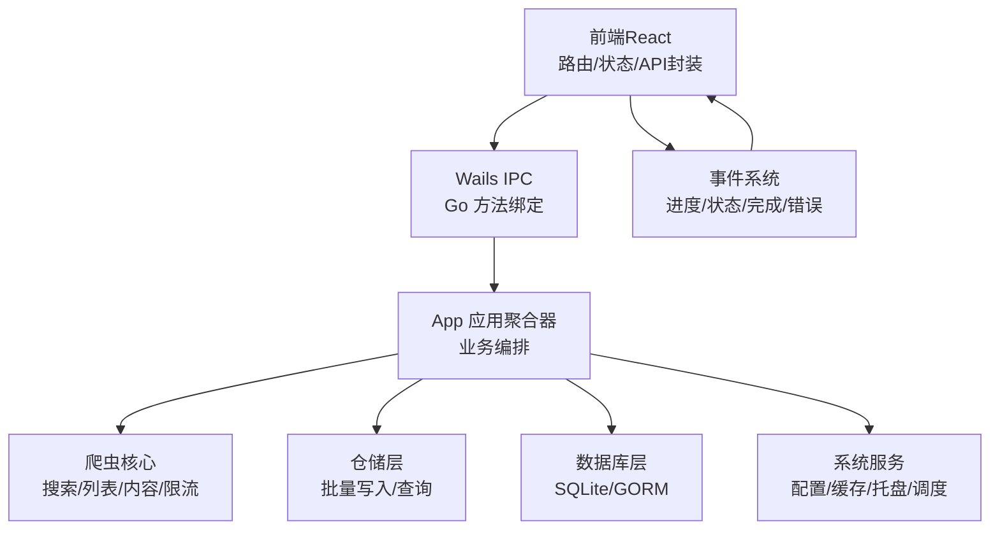
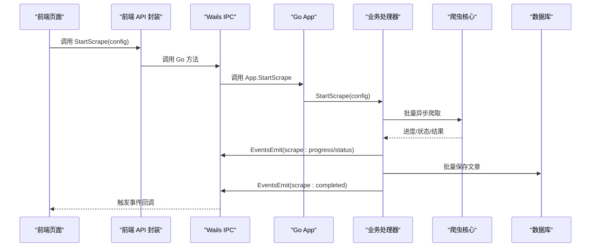
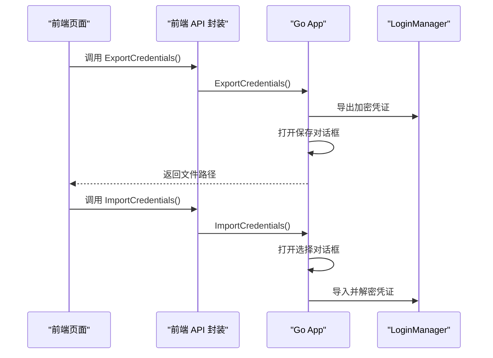
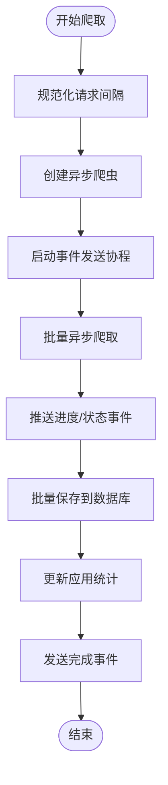
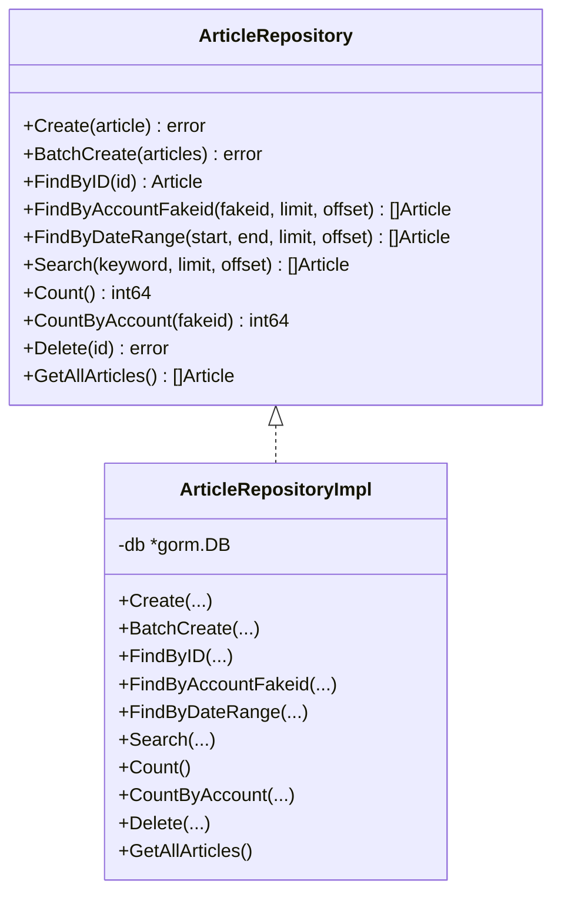
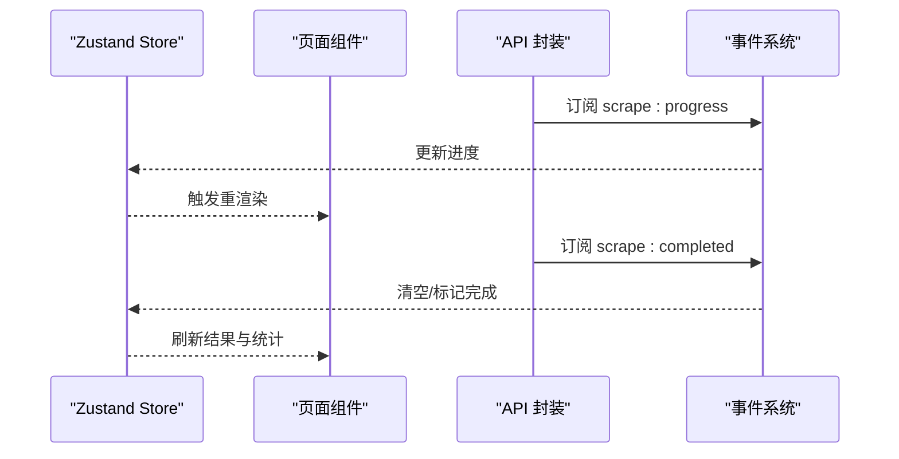
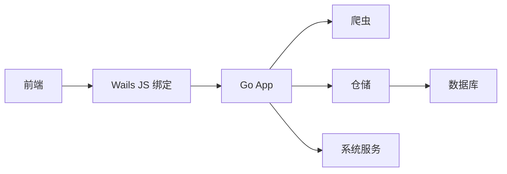

# 架构设计

<cite>
**本文引用的文件**
- [main.go](file://main.go)
- [wails.json](file://wails.json)
- [backend/app/app.go](file://backend/app/app.go)
- [backend/app/init.go](file://backend/app/init.go)
- [backend/app/scrape_handler.go](file://backend/app/scrape_handler.go)
- [backend/app/data_handler.go](file://backend/app/data_handler.go)
- [backend/internal/database/db.go](file://backend/internal/database/db.go)
- [backend/internal/repository/article_repo.go](file://backend/internal/repository/article_repo.go)
- [backend/internal/spider/scraper.go](file://backend/internal/spider/scraper.go)
- [frontend/src/main.tsx](file://frontend/src/main.tsx)
- [frontend/src/App.tsx](file://frontend/src/App.tsx)
- [frontend/src/services/api.ts](file://frontend/src/services/api.ts)
- [frontend/src/stores/scrapeStore.ts](file://frontend/src/stores/scrapeStore.ts)
- [frontend/package.json](file://frontend/package.json)
- [README.md](file://README.md)
</cite>

## 目录
1. [引言](#引言)
2. [项目结构](#项目结构)
3. [核心组件](#核心组件)
4. [架构总览](#架构总览)
5. [详细组件分析](#详细组件分析)
6. [依赖分析](#依赖分析)
7. [性能考虑](#性能考虑)
8. [故障排查指南](#故障排查指南)
9. [结论](#结论)
10. [附录](#附录)

## 引言
本架构设计文档面向 WeMediaSpider 项目，系统性阐述其基于 Wails v2 的桌面应用架构，涵盖表现层、业务逻辑层与数据访问层的职责划分，以及 Go 后端与 React 前端通过 Wails 实现的无缝集成方式（IPC 通信与事件机制）。文档同时解释模块化设计原则、各功能模块间的依赖关系与交互模式，并给出从前端用户操作到后端处理再到数据库存储的完整数据流。最后提供系统边界定义、组件交互图与关键技术决策说明，并总结架构演进历史与未来扩展方向。

## 项目结构
WeMediaSpider 采用前后端分离的模块化组织方式：
- 后端（Go）：位于 backend/ 目录，按领域拆分为 app、internal（database、repository、spider、scheduler、analytics 等）、pkg（公共工具与基础设施）
- 前端（React + TypeScript）：位于 frontend/ 目录，包含页面、组件、服务封装与类型定义
- 构建与打包：通过 Wails 配置文件统一管理构建脚本与产物输出



**图表来源**
- [main.go:23-90](file://main.go#L23-L90)
- [wails.json:1-29](file://wails.json#L1-L29)
- [frontend/src/main.tsx:18-24](file://frontend/src/main.tsx#L18-L24)
- [frontend/src/App.tsx:28-84](file://frontend/src/App.tsx#L28-L84)
- [frontend/src/services/api.ts:49-101](file://frontend/src/services/api.ts#L49-L101)
- [frontend/src/stores/scrapeStore.ts:19-64](file://frontend/src/stores/scrapeStore.ts#L19-L64)
- [backend/app/app.go:25-83](file://backend/app/app.go#L25-L83)
- [backend/app/init.go:43-134](file://backend/app/init.go#L43-L134)
- [backend/app/scrape_handler.go:125-244](file://backend/app/scrape_handler.go#L125-L244)
- [backend/internal/database/db.go:24-69](file://backend/internal/database/db.go#L24-L69)
- [backend/internal/repository/article_repo.go:27-74](file://backend/internal/repository/article_repo.go#L27-L74)
- [backend/internal/spider/scraper.go:50-69](file://backend/internal/spider/scraper.go#L50-L69)

**章节来源**
- [README.md:86-103](file://README.md#L86-L103)
- [main.go:23-90](file://main.go#L23-L90)
- [wails.json:1-29](file://wails.json#L1-L29)
- [frontend/src/main.tsx:18-24](file://frontend/src/main.tsx#L18-L24)
- [frontend/src/App.tsx:28-84](file://frontend/src/App.tsx#L28-L84)
- [frontend/package.json:11-21](file://frontend/package.json#L11-L21)

## 核心组件
- 应用入口与窗口管理：main.go 负责 Wails 应用初始化、单实例控制、窗口尺寸计算与生命周期回调注册，并将 App 实例绑定到前端以供 IPC 调用。
- 应用聚合器 App：backend/app/app.go 定义 App 结构体，聚合登录、爬取、缓存、数据库、仓储、调度、托盘等子系统，作为业务编排中心。
- 初始化装配：backend/app/init.go 将配置、数据库、服务（登录、调度、分析）与仓储进行装配，形成可运行的应用上下文。
- 业务处理器：backend/app/scrape_handler.go 与 data_handler.go 提供前端调用的业务方法，负责登录、搜索、批量爬取、进度与状态事件推送、图片下载、数据文件管理等。
- 数据访问层：backend/internal/repository/article_repo.go 定义仓储接口与实现，提供批量写入、条件查询、统计等能力。
- 数据库层：backend/internal/database/db.go 负责 SQLite 连接、GORM 配置、WAL 模式、连接池与自动迁移。
- 爬虫核心：backend/internal/spider/scraper.go 实现公众号搜索、文章列表与内容抓取、Markdown 转换、图片链接提取、智能重试与限流。
- 前端入口与路由：frontend/src/main.tsx 与 frontend/src/App.tsx 分别负责 React 应用挂载与全局路由、主题与国际化配置。
- API 封装与事件监听：frontend/src/services/api.ts 将 Wails 生成的 Go 方法映射为前端可用的 API，并提供事件订阅/退订函数。
- 状态管理：frontend/src/stores/scrapeStore.ts 使用 Zustand 管理爬取过程中的文章、进度与账号状态等前端状态。

**章节来源**
- [main.go:23-90](file://main.go#L23-L90)
- [backend/app/app.go:25-83](file://backend/app/app.go#L25-L83)
- [backend/app/init.go:43-134](file://backend/app/init.go#L43-L134)
- [backend/app/scrape_handler.go:125-244](file://backend/app/scrape_handler.go#L125-L244)
- [backend/app/data_handler.go:19-49](file://backend/app/data_handler.go#L19-L49)
- [backend/internal/repository/article_repo.go:13-25](file://backend/internal/repository/article_repo.go#L13-L25)
- [backend/internal/database/db.go:24-69](file://backend/internal/database/db.go#L24-L69)
- [backend/internal/spider/scraper.go:50-69](file://backend/internal/spider/scraper.go#L50-L69)
- [frontend/src/main.tsx:18-24](file://frontend/src/main.tsx#L18-L24)
- [frontend/src/App.tsx:28-84](file://frontend/src/App.tsx#L28-L84)
- [frontend/src/services/api.ts:49-101](file://frontend/src/services/api.ts#L49-L101)
- [frontend/src/stores/scrapeStore.ts:19-64](file://frontend/src/stores/scrapeStore.ts#L19-L64)

## 架构总览
WeMediaSpider 采用分层架构：
- 表现层（前端）：React + Ant Design + Zustand，负责用户交互、路由与状态管理，通过 Wails 生成的 JS 绑定调用后端方法并接收事件。
- 业务逻辑层（App）：聚合各子系统，协调登录、爬取、缓存、调度与托盘等，提供统一的业务 API。
- 数据访问层：仓储接口与实现，封装数据库操作，支持批量写入与条件查询。
- 数据持久化层：SQLite + GORM，启用 WAL、连接池与外键约束，保障并发与一致性。
- 爬虫与网络层：HTTP 客户端、限流器、Markdown 转换与图片提取，具备智能重试与容错。



**图表来源**
- [frontend/src/services/api.ts:49-101](file://frontend/src/services/api.ts#L49-L101)
- [backend/app/app.go:25-83](file://backend/app/app.go#L25-L83)
- [backend/app/scrape_handler.go:125-244](file://backend/app/scrape_handler.go#L125-L244)
- [backend/internal/repository/article_repo.go:27-74](file://backend/internal/repository/article_repo.go#L27-L74)
- [backend/internal/database/db.go:24-69](file://backend/internal/database/db.go#L24-L69)

## 详细组件分析

### Wails 集成与 IPC 通信
- 应用启动与绑定：main.go 在 OnStartup 中调用 application.Startup，并将 application 绑定到前端，使前端可通过 Wails 生成的 JS API 直接调用 Go 方法。
- 事件机制：后端在业务处理过程中通过 runtime.EventsEmit 发送事件（如 scrape:progress、scrape:status、scrape:completed、scrape:error、image:*），前端通过 events.onXxx 订阅并在 UI 中实时展示。
- 文件对话框：通过 runtime.OpenFileDialog/runtime.SaveFileDialog 与系统原生对话框集成，提升用户体验。
- 前端 API 封装：frontend/src/services/api.ts 将 Wails 生成的方法与事件包装为语义化的函数，便于页面直接调用。



**图表来源**
- [main.go:62-77](file://main.go#L62-L77)
- [backend/app/scrape_handler.go:125-244](file://backend/app/scrape_handler.go#L125-L244)
- [frontend/src/services/api.ts:104-160](file://frontend/src/services/api.ts#L104-L160)

**章节来源**
- [main.go:62-77](file://main.go#L62-L77)
- [backend/app/scrape_handler.go:125-244](file://backend/app/scrape_handler.go#L125-L244)
- [frontend/src/services/api.ts:49-101](file://frontend/src/services/api.ts#L49-L101)
- [frontend/src/services/api.ts:104-160](file://frontend/src/services/api.ts#L104-L160)

### 登录与凭证管理
- 登录状态查询与清理：App.GetLoginStatus、ClearLoginCache 由前端调用，后端委托 LoginManager 处理。
- 凭证导入/导出：ExportCredentials/ImportCredentials 通过系统文件对话框与 runtime 交互，数据经 LoginManager 加密处理后写入/读取文件。



**图表来源**
- [backend/app/scrape_handler.go:39-102](file://backend/app/scrape_handler.go#L39-L102)

**章节来源**
- [backend/app/scrape_handler.go:39-102](file://backend/app/scrape_handler.go#L39-L102)

### 爬取流程与并发控制
- 异步爬取：App.StartScrape 创建 AsyncScraper，使用通道向前端推送进度与状态事件；完成后批量保存至数据库并更新统计。
- 并发与限流：爬虫内部使用 RateLimiter 控制请求速率，避免触发目标站点风控；App 层对 scraper/imageDownloader 使用互斥锁保护并发赋值。
- 内容提取与清洗：爬虫从文章页提取内容 HTML，进行 Markdown 转换与图片链接提取，支持智能重试与多种选择器适配。



**图表来源**
- [backend/app/scrape_handler.go:125-244](file://backend/app/scrape_handler.go#L125-L244)
- [backend/internal/spider/scraper.go:50-69](file://backend/internal/spider/scraper.go#L50-L69)

**章节来源**
- [backend/app/scrape_handler.go:125-244](file://backend/app/scrape_handler.go#L125-L244)
- [backend/internal/spider/scraper.go:50-69](file://backend/internal/spider/scraper.go#L50-L69)

### 数据模型与仓储
- 仓储接口：ArticleRepository 定义常用 CRUD 与查询方法，支持按账号、日期范围、关键词检索与统计。
- 批量写入优化：实现中使用事务与批量插入，结合 ON CONFLICT DO UPDATE，避免重复写入并保持幂等。
- 数据库配置：SQLite + GORM，启用 WAL、连接池与外键约束，保证高并发下的稳定性与一致性。



**图表来源**
- [backend/internal/repository/article_repo.go:13-25](file://backend/internal/repository/article_repo.go#L13-L25)
- [backend/internal/repository/article_repo.go:27-74](file://backend/internal/repository/article_repo.go#L27-L74)

**章节来源**
- [backend/internal/repository/article_repo.go:13-25](file://backend/internal/repository/article_repo.go#L13-L25)
- [backend/internal/repository/article_repo.go:27-74](file://backend/internal/repository/article_repo.go#L27-L74)
- [backend/internal/database/db.go:24-69](file://backend/internal/database/db.go#L24-L69)

### 前端状态与事件驱动
- 状态管理：scrapeStore 统一维护文章列表、进度、账号状态与爬取开关，支持增量添加与更新。
- 事件驱动：前端通过 events.onScrapeProgress/onScrapeStatus/onScrapeCompleted/onScrapeError 订阅后端事件，实时刷新 UI。
- 路由与主题：App.tsx 配置 Ant Design 主题、语言与路由，页面组件按需渲染。



**图表来源**
- [frontend/src/stores/scrapeStore.ts:19-64](file://frontend/src/stores/scrapeStore.ts#L19-L64)
- [frontend/src/services/api.ts:104-160](file://frontend/src/services/api.ts#L104-L160)
- [frontend/src/App.tsx:28-84](file://frontend/src/App.tsx#L28-L84)

**章节来源**
- [frontend/src/stores/scrapeStore.ts:19-64](file://frontend/src/stores/scrapeStore.ts#L19-L64)
- [frontend/src/services/api.ts:104-160](file://frontend/src/services/api.ts#L104-L160)
- [frontend/src/App.tsx:28-84](file://frontend/src/App.tsx#L28-L84)

## 依赖分析
- 组件耦合与内聚：App 作为聚合器，向上承接前端调用，向下协调各子系统，内聚性高；仓储与数据库层通过接口隔离，降低耦合。
- 外部依赖：Wails 提供 IPC 与事件桥接；GORM/SQLite 提供 ORM 与存储；Ant Design/React/Vite 提供前端生态；goquery/markdown 转换与限流工具。
- 潜在循环依赖：当前结构清晰，未发现直接循环依赖；若后续扩展，应避免在 app 层直接引入前端类型。



**图表来源**
- [frontend/src/services/api.ts:49-101](file://frontend/src/services/api.ts#L49-L101)
- [backend/app/app.go:25-83](file://backend/app/app.go#L25-L83)
- [backend/internal/repository/article_repo.go:27-74](file://backend/internal/repository/article_repo.go#L27-L74)
- [backend/internal/database/db.go:24-69](file://backend/internal/database/db.go#L24-L69)

**章节来源**
- [frontend/src/services/api.ts:49-101](file://frontend/src/services/api.ts#L49-L101)
- [backend/app/app.go:25-83](file://backend/app/app.go#L25-L83)
- [backend/internal/repository/article_repo.go:27-74](file://backend/internal/repository/article_repo.go#L27-L74)
- [backend/internal/database/db.go:24-69](file://backend/internal/database/db.go#L24-L69)

## 性能考虑
- 数据库性能：启用 WAL 模式、连接池与外键约束，批量写入使用事务与 ON CONFLICT DO UPDATE，减少磁盘写放大。
- 爬取性能：限流器动态调节请求间隔，智能重试与多种内容选择器适配，降低失败率与重试成本。
- 前端性能：Zustand 精简状态更新路径，事件驱动避免轮询；路由按需加载页面组件。
- 资源管理：App 层对并发资源（scraper/imageDownloader）加锁，防止竞态；Wails 生命周期钩子确保资源释放。

[本节为通用性能讨论，无需特定文件引用]

## 故障排查指南
- 登录与凭证：若导出/导入失败，检查文件权限与加密流程；确认 LoginManager 状态与缓存清理。
- 爬取异常：关注 scrape:error 事件，区分取消与非取消错误；检查网络与限流策略。
- 数据库问题：确认 AutoMigrate 是否成功，检查 WAL 与连接池配置；必要时重建数据库。
- 前端事件：确认事件订阅是否正确，store 状态是否被更新；检查路由与主题配置。

**章节来源**
- [backend/app/scrape_handler.go:233-241](file://backend/app/scrape_handler.go#L233-L241)
- [backend/internal/database/db.go:82-109](file://backend/internal/database/db.go#L82-L109)
- [frontend/src/services/api.ts:104-160](file://frontend/src/services/api.ts#L104-L160)

## 结论
WeMediaSpider 通过 Wails 实现了 Go 后端与 React 前端的深度集成，采用分层架构与模块化设计，将业务逻辑、数据访问与系统服务清晰分离。前端通过 IPC 与事件机制与后端紧密协作，实现了从用户操作到数据持久化的完整闭环。数据库层以 SQLite + GORM 提供高性能与可靠性，爬虫层具备稳健的限流与容错能力。整体架构具备良好的可维护性与扩展性，适合持续演进与功能增强。

[本节为总结性内容，无需特定文件引用]

## 附录

### 系统边界与组件交互图
- 边界定义：前端仅通过 Wails 生成的 API 与事件与后端交互；后端通过仓储与数据库层访问数据；爬虫层仅依赖网络与限流工具。
- 交互图：见“架构总览”与“Wails 集成与 IPC 通信”。

```mermaid
graph TB
subgraph "外部系统"
OS["操作系统/浏览器"]
end
subgraph "WeMediaSpider"
FE["前端"]
BE["后端"]
DB["数据库"]
end
OS --> FE
FE <- --> BE
BE --> DB
```

[本图为概念性边界示意，无需图表来源]

### 关键技术决策说明
- Wails v2：统一桌面应用开发体验，前后端共享一套构建流程与产物。
- SQLite + GORM：轻量、易部署、跨平台，满足中小规模数据存储需求。
- Ant Design + React：成熟的 UI 生态与组件体系，提升开发效率与一致性。
- 事件驱动：通过 Wails 事件系统实现前后端解耦，提升交互响应性。
- 批量写入与幂等：仓储层采用批量插入与 ON CONFLICT DO UPDATE，兼顾性能与一致性。

**章节来源**
- [wails.json:1-29](file://wails.json#L1-L29)
- [frontend/package.json:11-21](file://frontend/package.json#L11-L21)
- [backend/internal/database/db.go:24-69](file://backend/internal/database/db.go#L24-L69)
- [backend/internal/repository/article_repo.go:48-74](file://backend/internal/repository/article_repo.go#L48-L74)

### 架构演进与未来扩展
- 演进背景：README 提及 v2.0.0 架构重构，建议全新安装并提供迁移工具，强调模块化与安全性提升。
- 扩展方向：可引入微服务化（如独立导出服务）、分布式爬取（队列与工作节点）、指标监控与可观测性、插件化扩展点等。

**章节来源**
- [README.md:33-45](file://README.md#L33-L45)