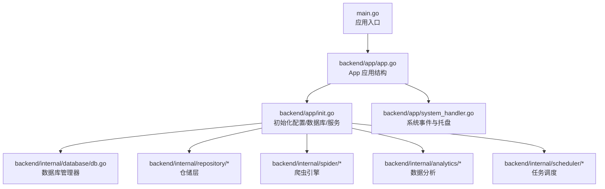
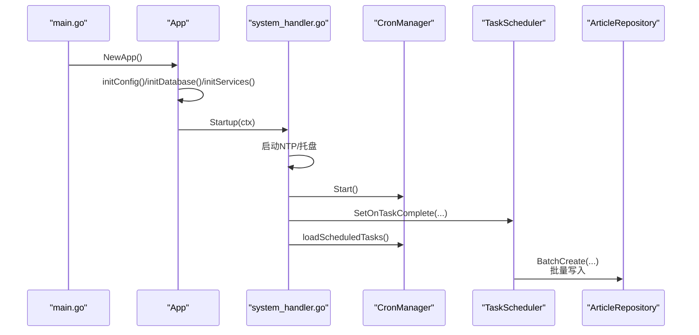
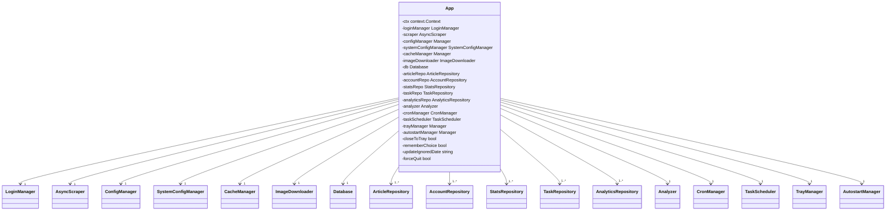
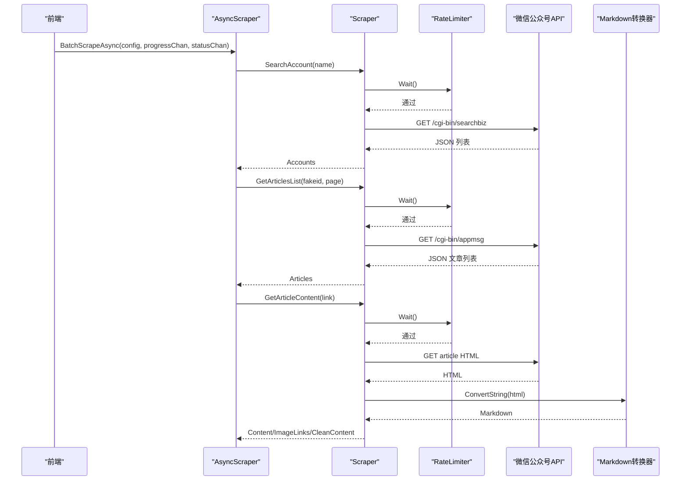
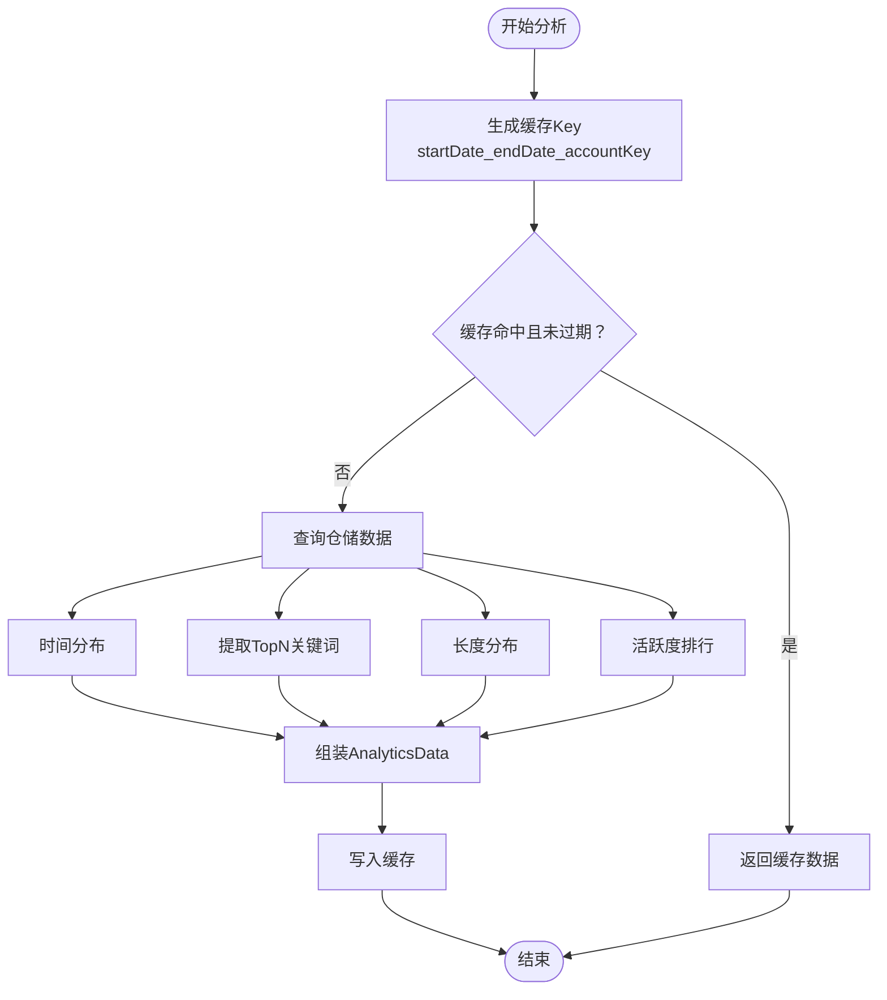
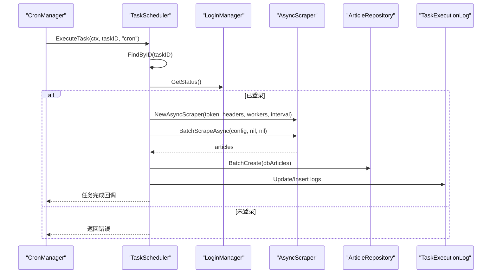
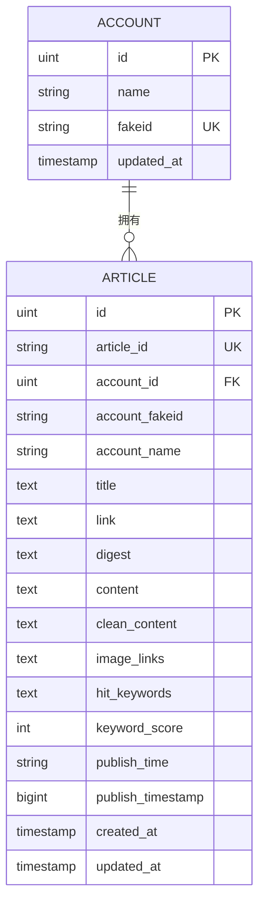
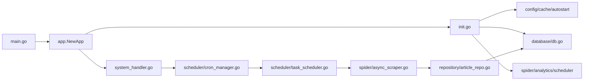

# 核心模块

<cite>
**本文引用的文件**
- [main.go](file://main.go)
- [app.go](file://backend/app/app.go)
- [init.go](file://backend/app/init.go)
- [system_handler.go](file://backend/app/system_handler.go)
- [scraper.go](file://backend/internal/spider/scraper.go)
- [async_scraper.go](file://backend/internal/spider/async_scraper.go)
- [analyzer.go](file://backend/internal/analytics/analyzer.go)
- [keyword.go](file://backend/internal/analytics/keyword.go)
- [cache.go](file://backend/internal/analytics/cache.go)
- [task_scheduler.go](file://backend/internal/scheduler/task_scheduler.go)
- [cron_manager.go](file://backend/internal/scheduler/cron_manager.go)
- [db.go](file://backend/internal/database/db.go)
- [article_repo.go](file://backend/internal/repository/article_repo.go)
- [article_model.go](file://backend/internal/database/models/article.go)
- [analytics_models.go](file://backend/internal/models/analytics.go)
</cite>

## 目录
1. [简介](#简介)
2. [项目结构](#项目结构)
3. [核心组件](#核心组件)
4. [架构总览](#架构总览)
5. [详细组件分析](#详细组件分析)
6. [依赖关系分析](#依赖关系分析)
7. [性能考量](#性能考量)
8. [故障排查指南](#故障排查指南)
9. [结论](#结论)
10. [附录](#附录)

## 简介
本文件聚焦 WeMediaSpider 的核心模块，系统性阐述应用生命周期管理、依赖注入机制与系统初始化流程；深入解析爬虫引擎的并发爬取机制、反爬虫应对策略与数据解析流程；详解数据分析模块的关键词提取算法、数据可视化与缓存策略；说明任务调度模块的定时任务管理、Cron 表达式解析与执行监控机制；并解释数据库设计与 ORM 映射关系、数据访问层的仓储模式实现。每个模块均提供代码示例路径、配置选项与使用模式，帮助读者快速理解与扩展。

## 项目结构
后端采用分层与职责分离的设计：应用入口负责生命周期与初始化；内部模块按功能域划分（spider、analytics、scheduler、database、repository、config、cache、tray 等）；前端通过 Wails 桥接调用后端能力。核心初始化流程贯穿应用、服务、数据库与仓储层，形成清晰的依赖注入链路。

**图表来源**
- [main.go:23-91](file://main.go#L23-L91)
- [app.go:52-83](file://backend/app/app.go#L52-L83)
- [init.go:44-135](file://backend/app/init.go#L44-L135)

**章节来源**
- [main.go:23-91](file://main.go#L23-L91)
- [app.go:52-83](file://backend/app/app.go#L52-L83)
- [init.go:44-135](file://backend/app/init.go#L44-L135)

## 核心组件
- 应用生命周期与初始化：应用入口负责单实例、窗口尺寸计算与 Wails 生命周期绑定；App 结构体集中持有所有子系统实例，并通过 initConfig/initDatabase/initServices 完成依赖注入。
- 爬虫引擎：基于 HTTP 客户端与 goquery 的解析器，结合速率限制器与重试机制，实现稳定的数据抓取与内容清洗。
- 数据分析模块：关键词提取（TF-IDF）、时间分布、长度分布与活跃度排行，并提供缓存策略。
- 任务调度模块：基于 cron 的定时任务管理，支持 Cron 表达式解析与执行监控。
- 数据库与仓储：SQLite + GORM，仓储层实现批量写入、冲突处理与查询封装。

**章节来源**
- [app.go:25-83](file://backend/app/app.go#L25-L83)
- [init.go:44-135](file://backend/app/init.go#L44-L135)
- [scraper.go:25-69](file://backend/internal/spider/scraper.go#L25-L69)
- [analyzer.go:17-39](file://backend/internal/analytics/analyzer.go#L17-L39)
- [task_scheduler.go:20-45](file://backend/internal/scheduler/task_scheduler.go#L20-L45)
- [db.go:18-69](file://backend/internal/database/db.go#L18-L69)
- [article_repo.go:13-74](file://backend/internal/repository/article_repo.go#L13-L74)

## 架构总览
应用启动后，先进行系统时间同步与托盘初始化，随后启动定时任务管理器并加载持久化的定时任务；爬虫与分析器在需要时按配置动态创建；数据库连接池与 WAL 模式确保高性能与可靠性；仓储层统一抽象数据访问，支持批量写入与冲突更新。

**图表来源**
- [main.go:46-84](file://main.go#L46-L84)
- [system_handler.go:22-86](file://backend/app/system_handler.go#L22-L86)
- [task_scheduler.go:129-233](file://backend/internal/scheduler/task_scheduler.go#L129-L233)
- [article_repo.go:42-74](file://backend/internal/repository/article_repo.go#L42-L74)

## 详细组件分析

### 应用生命周期与依赖注入
- 应用入口负责单实例检测、窗口尺寸计算与 Wails 生命周期绑定；在 OnStartup 中调用 App.Startup 完成系统初始化。
- App.NewApp 调用 initConfig/initDatabase/initServices，分别创建缓存、自启动、系统配置、数据库、仓储与服务实例，并注入 App 结构体。
- system_handler.go 在 Startup 中启动 NTP 时间同步、托盘、定时任务管理器，并注册任务完成事件回调；Shutdown 中有序关闭各子系统。

**图表来源**
- [app.go:25-50](file://backend/app/app.go#L25-L50)

**章节来源**
- [main.go:46-84](file://main.go#L46-L84)
- [app.go:52-83](file://backend/app/app.go#L52-L83)
- [init.go:44-135](file://backend/app/init.go#L44-L135)
- [system_handler.go:22-105](file://backend/app/system_handler.go#L22-L105)

### 爬虫引擎架构与并发控制
- Scraper：封装 HTTP 客户端、速率限制器、Markdown 转换器与请求头；提供搜索公众号、获取文章列表、获取文章内容等方法。
- AsyncScraper：在 Scraper 基础上，通过 RateLimiter 串行化所有 API 请求，确保请求间隔与频率控制；支持上下文取消、状态与进度通道。
- 反爬虫策略：随机 User-Agent、请求头设置、频率限制器自适应调整、智能重试、内容选择器多方案回退、图片 URL 清洗与 Markdown 转换。
- 数据解析流程：goquery 解析 HTML，优先 #js_content，其次 .rich_media_content，再退至 article 标签；处理懒加载图片 data-src；转 Markdown 并清洗 HTML。

**图表来源**
- [async_scraper.go:31-273](file://backend/internal/spider/async_scraper.go#L31-L273)
- [scraper.go:50-442](file://backend/internal/spider/scraper.go#L50-L442)

**章节来源**
- [async_scraper.go:15-281](file://backend/internal/spider/async_scraper.go#L15-L281)
- [scraper.go:25-541](file://backend/internal/spider/scraper.go#L25-L541)

### 数据分析模块：关键词提取、可视化与缓存
- Analyzer：聚合时间分布、关键词、长度分布、活跃度排行；支持按公众号筛选与缓存；缓存 TTL 默认 30 分钟。
- 关键词提取：基于 gse 分词器，使用 TF-IDF 计算词频，结合综合过滤规则（长度、标点、纯英文、特殊字符、是否包含中文、常见虚词等）。
- 可视化与缓存：Analyzer 返回结构化数据（时间分布、TopN 关键词、长度分布、活跃度排行），前端据此渲染图表；AnalyticsCache 提供内存缓存与定期清理。

**图表来源**
- [analyzer.go:46-106](file://backend/internal/analytics/analyzer.go#L46-L106)
- [cache.go:23-94](file://backend/internal/analytics/cache.go#L23-L94)
- [keyword.go:25-89](file://backend/internal/analytics/keyword.go#L25-L89)

**章节来源**
- [analyzer.go:17-281](file://backend/internal/analytics/analyzer.go#L17-L281)
- [keyword.go:13-276](file://backend/internal/analytics/keyword.go#L13-L276)
- [cache.go:11-94](file://backend/internal/analytics/cache.go#L11-L94)
- [analytics_models.go:10-52](file://backend/internal/models/analytics.go#L10-L52)

### 任务调度模块：定时任务管理与执行监控
- CronManager：基于 robfig/cron，支持秒级精度；提供添加、移除、更新任务与解析 Cron 表达式；记录 taskID->entryID 映射。
- TaskScheduler：执行任务时创建可取消上下文、记录执行日志、调用 AsyncScraper 批量爬取、保存文章、更新任务统计与状态；支持任务取消与并发运行状态跟踪。
- 执行监控：通过 SetOnTaskComplete 回调向前端广播任务完成事件，携带状态、文章数与错误信息。

**图表来源**
- [cron_manager.go:54-93](file://backend/internal/scheduler/cron_manager.go#L54-L93)
- [task_scheduler.go:52-127](file://backend/internal/scheduler/task_scheduler.go#L52-L127)
- [task_scheduler.go:129-233](file://backend/internal/scheduler/task_scheduler.go#L129-L233)

**章节来源**
- [cron_manager.go:17-119](file://backend/internal/scheduler/cron_manager.go#L17-L119)
- [task_scheduler.go:20-270](file://backend/internal/scheduler/task_scheduler.go#L20-L270)

### 数据库设计与仓储模式
- 数据库：SQLite + GORM，WAL 模式、连接池配置、外键约束与同步模式；AutoMigrate 自动迁移账户、文章、应用统计、定时任务与执行日志表。
- 模型映射：Article 模型包含唯一标识、公众号关联、发布时间戳与索引；Account 与 Article 一对多关联。
- 仓储模式：ArticleRepository 接口定义常用查询与批量写入；实现中使用事务与 ON CONFLICT DO UPDATE 实现幂等写入；支持分页、搜索与统计。

**图表来源**
- [article_model.go:5-31](file://backend/internal/database/models/article.go#L5-L31)
- [db.go:82-109](file://backend/internal/database/db.go#L82-L109)

**章节来源**
- [db.go:18-115](file://backend/internal/database/db.go#L18-L115)
- [article_repo.go:13-168](file://backend/internal/repository/article_repo.go#L13-L168)
- [article_model.go:5-31](file://backend/internal/database/models/article.go#L5-L31)

## 依赖关系分析
- 初始化阶段：main.go -> app.NewApp -> initConfig/initDatabase/initServices -> App 注入各子系统。
- 运行阶段：App.Startup -> CronManager.Start -> TaskScheduler.ExecuteTask -> AsyncScraper -> Repository -> DB。
- 关键依赖：App 对 LoginManager、AsyncScraper、CronManager、TaskScheduler、Analyzer、Repository、DB 的组合依赖；各模块通过接口与结构体解耦。

**图表来源**
- [main.go:46-84](file://main.go#L46-L84)
- [init.go:44-135](file://backend/app/init.go#L44-L135)
- [system_handler.go:69-85](file://backend/app/system_handler.go#L69-L85)
- [task_scheduler.go:129-233](file://backend/internal/scheduler/task_scheduler.go#L129-L233)
- [article_repo.go:42-74](file://backend/internal/repository/article_repo.go#L42-L74)

**章节来源**
- [main.go:46-84](file://main.go#L46-L84)
- [init.go:44-135](file://backend/app/init.go#L44-L135)
- [system_handler.go:69-85](file://backend/app/system_handler.go#L69-L85)

## 性能考量
- 爬取性能：速率限制器确保请求间隔与自适应调整，避免触发频率限制；AsyncScraper 串行化 API 调用，简化并发复杂度；批量写入与 ON CONFLICT 更新减少重复写入。
- 数据库性能：WAL 模式、连接池上限与生命周期、外键约束与同步模式平衡性能与一致性；AutoMigrate 仅在启动时执行。
- 缓存策略：Analyzer 缓存 30 分钟，定期清理协程清理过期项，降低重复计算成本。
- 前端交互：任务完成事件通过 Wails 事件系统推送，避免轮询带来的资源消耗。

## 故障排查指南
- 爬取失败与频率限制：检查速率限制器记录与错误日志；当出现“频率限制”提示时，应适当增大请求间隔或降低并发。
- 内容解析失败：确认 HTML 选择器回退逻辑是否生效；检查 Markdown 转换器输出与图片 URL 清洗结果。
- 任务执行异常：查看 TaskExecutionLog 的状态、错误信息与持续时间；确认登录状态与 Token 有效性。
- 数据库连接问题：检查 SQLite 文件路径、WAL 模式与连接池配置；必要时重启应用以释放连接。
- 缓存异常：使用 Analyzer.ClearCache 清空缓存后重试；确认缓存 Key 生成逻辑与 TTL 设置。

**章节来源**
- [async_scraper.go:108-126](file://backend/internal/spider/async_scraper.go#L108-L126)
- [task_scheduler.go:92-127](file://backend/internal/scheduler/task_scheduler.go#L92-L127)
- [analyzer.go:272-275](file://backend/internal/analytics/analyzer.go#L272-L275)
- [db.go:24-69](file://backend/internal/database/db.go#L24-L69)

## 结论
WeMediaSpider 通过清晰的模块划分与依赖注入，实现了从应用生命周期、爬虫引擎、数据分析到任务调度与数据库访问的完整闭环。速率限制与反爬虫策略保障了稳定性，缓存与批量写入提升了性能，Wails 桥接提供了良好的桌面端体验。建议在生产环境中进一步完善错误恢复与可观测性指标，以提升系统的鲁棒性与可运维性。

## 附录
- 配置选项与使用模式
  - 系统配置：关闭到托盘、记住用户选择、更新忽略日期；通过 system_handler.go 的 Set/Get 方法与系统配置管理器交互。
  - 爬取配置：请求间隔（min/max/默认）、最大工作者数、最大页数、日期范围、关键词过滤、是否包含内容；通过 TaskScheduler 的 executeScrape 解析并驱动 AsyncScraper。
  - Cron 表达式：支持秒级精度；通过 CronManager.AddTask/AddFunc 注册任务；ParseCronExpression 验证表达式并计算下次运行时间。
  - 数据库：SQLite 路径位于用户主目录下的 .wemediaspider 目录；AutoMigrate 自动创建表结构与初始化统计记录。
  - 关键词提取：支持中文分词与 TF-IDF 计算；内置综合过滤词表与正则规则，确保关键词质量。

**章节来源**
- [system_handler.go:121-210](file://backend/app/system_handler.go#L121-L210)
- [task_scheduler.go:129-189](file://backend/internal/scheduler/task_scheduler.go#L129-L189)
- [cron_manager.go:54-119](file://backend/internal/scheduler/cron_manager.go#L54-L119)
- [db.go:24-109](file://backend/internal/database/db.go#L24-L109)
- [keyword.go:25-89](file://backend/internal/analytics/keyword.go#L25-L89)