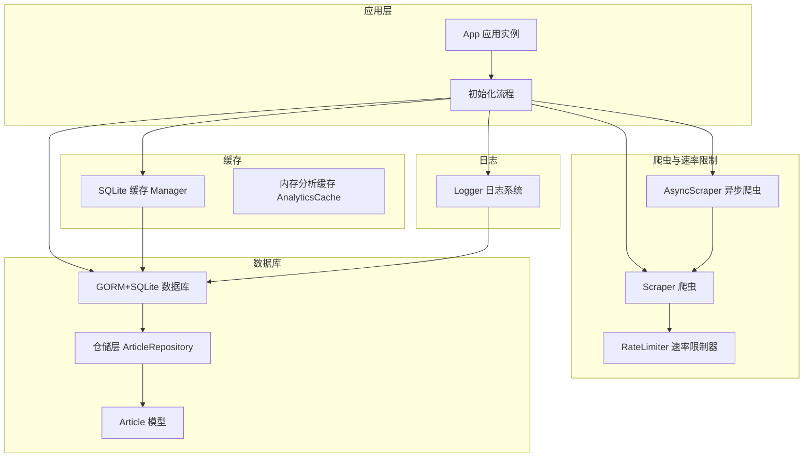
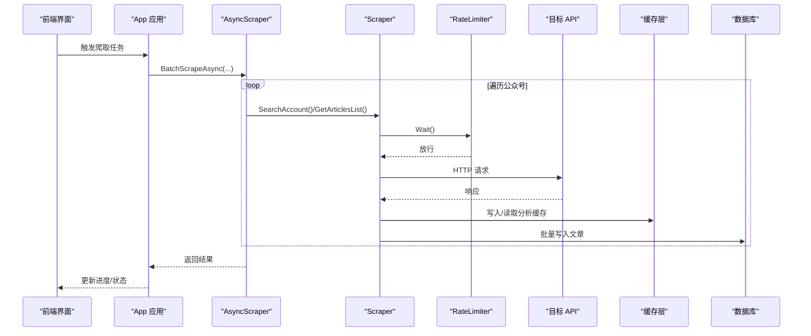
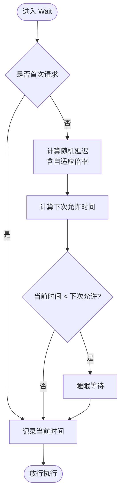
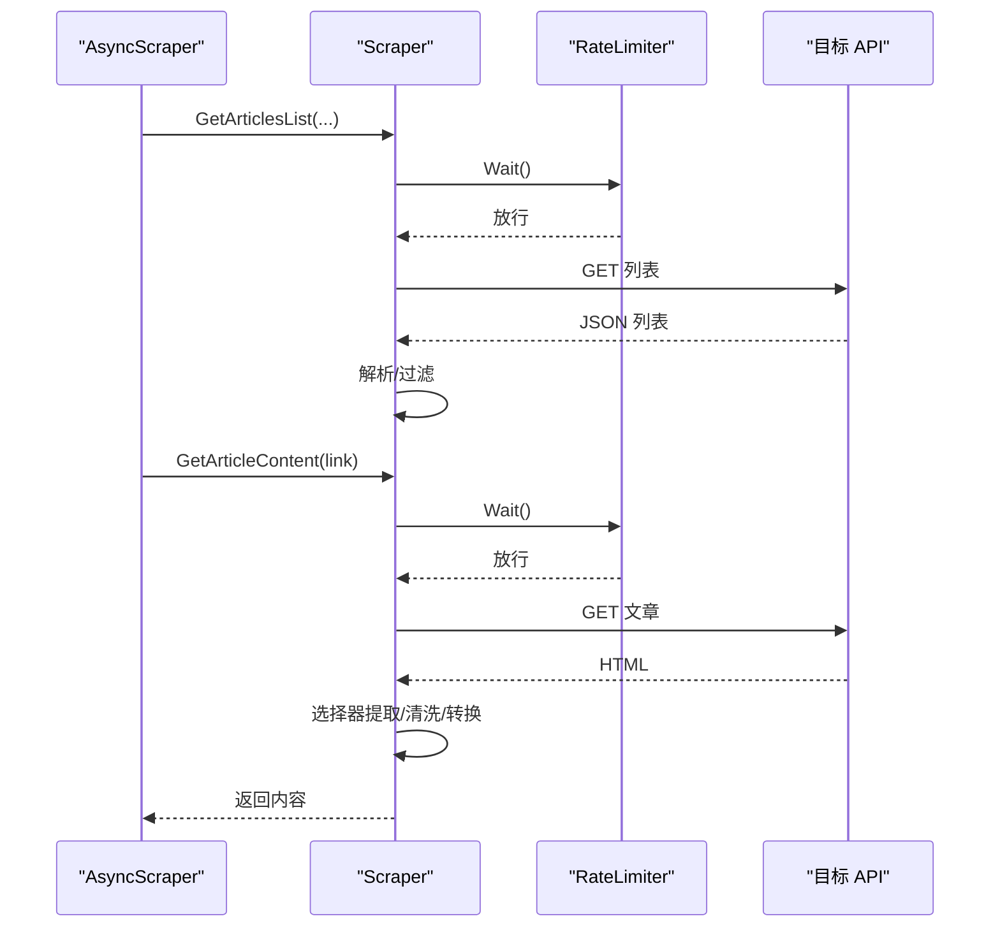
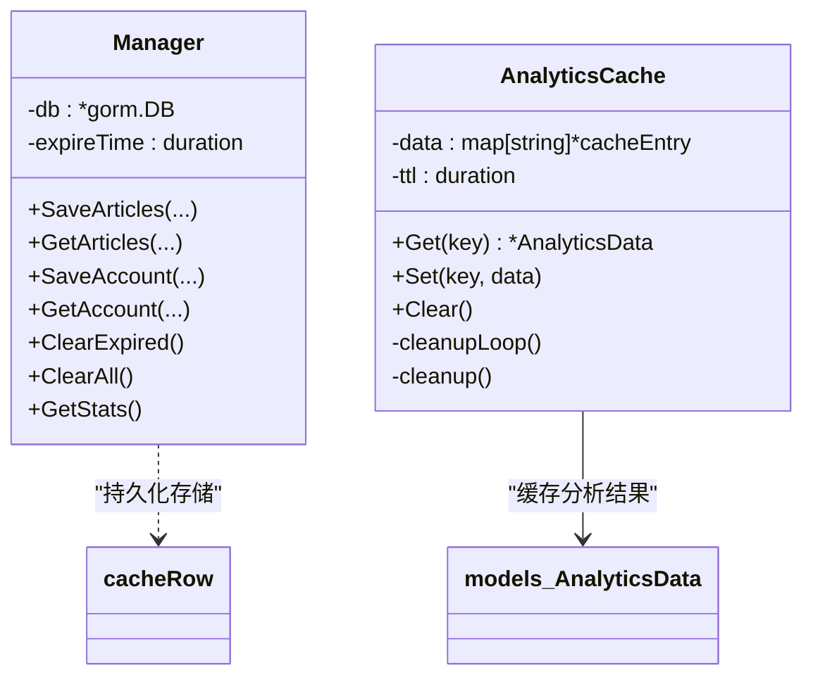
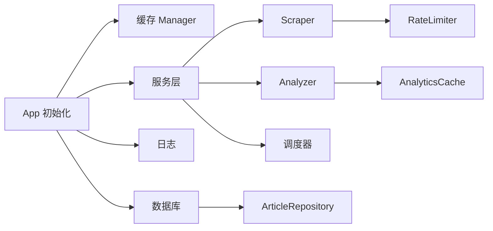

# 性能调优

<cite>
**本文引用的文件**
- [backend/internal/cache/manager.go](file://backend/internal/cache/manager.go)
- [backend/internal/analytics/cache.go](file://backend/internal/analytics/cache.go)
- [backend/internal/analytics/analyzer.go](file://backend/internal/analytics/analyzer.go)
- [backend/pkg/utils/ratelimiter.go](file://backend/pkg/utils/ratelimiter.go)
- [backend/internal/spider/scraper.go](file://backend/internal/spider/scraper.go)
- [backend/internal/spider/async_scraper.go](file://backend/internal/spider/async_scraper.go)
- [backend/internal/database/db.go](file://backend/internal/database/db.go)
- [backend/internal/repository/article_repo.go](file://backend/internal/repository/article_repo.go)
- [backend/internal/database/models/article.go](file://backend/internal/database/models/article.go)
- [backend/pkg/logger/logger.go](file://backend/pkg/logger/logger.go)
- [backend/app/init.go](file://backend/app/init.go)
- [backend/app/app.go](file://backend/app/app.go)
- [backend/internal/models/config.go](file://backend/internal/models/config.go)
</cite>

## 目录
1. [简介](#简介)
2. [项目结构](#项目结构)
3. [核心组件](#核心组件)
4. [架构总览](#架构总览)
5. [详细组件分析](#详细组件分析)
6. [依赖关系分析](#依赖关系分析)
7. [性能考量](#性能考量)
8. [故障排查指南](#故障排查指南)
9. [结论](#结论)
10. [附录](#附录)

## 简介
本文件面向 WeMediaSpider 的性能调优目标，系统梳理应用在内存管理、并发控制、资源优化、缓存策略、速率限制、数据库查询与索引、性能监控与基准测试等方面的现状与优化建议。文档以代码为依据，结合可视化图示，帮助开发者与运维人员快速定位问题并实施改进。

## 项目结构
WeMediaSpider 采用 Go 语言开发，前后端分离（Wails 框架），后端服务负责爬虫、数据分析、缓存与数据库交互。性能相关的关键模块集中在以下子系统：
- 爬虫与速率限制：内部爬虫与速率限制器
- 缓存：本地 SQLite 缓存与内存分析缓存
- 数据库：GORM + SQLite，连接池与 PRAGMA 优化
- 日志：多路输出（控制台、文件、缓冲）以降低 IO 压力
- 应用初始化：集中装配缓存、数据库、分析器等组件



图表来源
- [backend/app/app.go:25-50](file://backend/app/app.go#L25-L50)
- [backend/app/init.go:43-134](file://backend/app/init.go#L43-L134)
- [backend/internal/spider/scraper.go:25-33](file://backend/internal/spider/scraper.go#L25-L33)
- [backend/internal/spider/async_scraper.go:15-21](file://backend/internal/spider/async_scraper.go#L15-L21)
- [backend/internal/cache/manager.go:27-31](file://backend/internal/cache/manager.go#L27-L31)
- [backend/internal/database/db.go:18-22](file://backend/internal/database/db.go#L18-L22)
- [backend/internal/repository/article_repo.go:13-25](file://backend/internal/repository/article_repo.go#L13-L25)
- [backend/internal/database/models/article.go:5-25](file://backend/internal/database/models/article.go#L5-L25)
- [backend/pkg/logger/logger.go:12-16](file://backend/pkg/logger/logger.go#L12-L16)

章节来源
- [backend/app/app.go:25-85](file://backend/app/app.go#L25-L85)
- [backend/app/init.go:43-134](file://backend/app/init.go#L43-L134)

## 核心组件
- 速率限制器：串行化请求，内置自适应延迟与指数退避，保障对外 API 的稳定性与合规性。
- 爬虫：统一的 HTTP 客户端与超时控制，内容提取与 Markdown 转换，支持重试与错误记录。
- 缓存：两层缓存策略（SQLite 持久化缓存 + 内存分析缓存），配合 TTL 与定期清理。
- 数据库：连接池与 SQLite PRAGMA 优化，批量写入与 ON CONFLICT 更新，减少磁盘写放大。
- 日志：多路输出与缓冲，避免频繁落盘，支持运行时动态调整日志级别。

章节来源
- [backend/pkg/utils/ratelimiter.go:12-133](file://backend/pkg/utils/ratelimiter.go#L12-L133)
- [backend/internal/spider/scraper.go:25-69](file://backend/internal/spider/scraper.go#L25-L69)
- [backend/internal/cache/manager.go:27-149](file://backend/internal/cache/manager.go#L27-L149)
- [backend/internal/analytics/cache.go:11-94](file://backend/internal/analytics/cache.go#L11-L94)
- [backend/internal/database/db.go:18-115](file://backend/internal/database/db.go#L18-L115)
- [backend/internal/repository/article_repo.go:42-74](file://backend/internal/repository/article_repo.go#L42-L74)
- [backend/pkg/logger/logger.go:18-109](file://backend/pkg/logger/logger.go#L18-L109)

## 架构总览
WeMediaSpider 的性能相关架构围绕“串行化速率限制 + 多层缓存 + 连接池优化 + 批量写入”展开。爬虫请求在速率限制器处串行化，避免触发目标站点的频率限制；分析阶段使用内存缓存加速热点查询；数据库层通过连接池与 PRAGMA 参数提升吞吐；仓储层采用批量写入与冲突更新策略，降低重复写入成本。



图表来源
- [backend/internal/spider/async_scraper.go:31-273](file://backend/internal/spider/async_scraper.go#L31-L273)
- [backend/internal/spider/scraper.go:71-261](file://backend/internal/spider/scraper.go#L71-L261)
- [backend/pkg/utils/ratelimiter.go:41-65](file://backend/pkg/utils/ratelimiter.go#L41-L65)
- [backend/internal/analytics/analyzer.go:46-106](file://backend/internal/analytics/analyzer.go#L46-L106)
- [backend/internal/repository/article_repo.go:42-74](file://backend/internal/repository/article_repo.go#L42-L74)

## 详细组件分析

### 速率限制器（RateLimiter）
- 设计要点
  - 串行化 Wait：互斥锁保证同一时刻仅一个请求在等待或执行，确保请求间隔严格满足 [min, max]。
  - 自适应延迟：连续失败次数增加延迟倍率，上限控制在 2x，避免雪崩。
  - 指数退避：针对单次获取内容的重试，采用 2^attempt × 基础延迟，并加入 ±20% 抖动，最大延迟限制为 2 分钟。
- 性能影响
  - 通过串行化显著降低对外部 API 的突发压力，提高成功率与稳定性。
  - 自适应与退避机制在异常时自动延长间隔，避免被封禁风险。
- 优化建议
  - 动态调整 min/max 间隔：根据目标站点的反馈（如 429/5xx）动态增大间隔。
  - 为不同 API 接口设置差异化速率限制，避免“一刀切”。



图表来源
- [backend/pkg/utils/ratelimiter.go:41-82](file://backend/pkg/utils/ratelimiter.go#L41-L82)

章节来源
- [backend/pkg/utils/ratelimiter.go:12-133](file://backend/pkg/utils/ratelimiter.go#L12-L133)

### 爬虫（Scraper 与 AsyncScraper）
- 设计要点
  - 统一 HTTP 客户端与超时（30 秒），随机 User-Agent，串行化请求。
  - 文章内容获取支持最多 3 次重试，每次重试采用递增退避；成功/失败均记录到速率限制器。
  - 内容提取采用多选择器回退策略，图片 URL 清洗与 Markdown 转换。
  - AsyncScraper 串行批量处理，逐个公众号、逐页、逐文串行获取，便于控制速率与状态上报。
- 性能影响
  - 串行化有效避免并发导致的限流与超时，提升整体成功率。
  - 内容提取与转换为 CPU 密集型，建议在高负载场景下适当放宽请求间隔。
- 优化建议
  - 对文章内容获取增加“失败即停”策略（如遇到频率限制），避免无效重试。
  - 在网络波动较大时启用更长的超时与更大的退避上限。



图表来源
- [backend/internal/spider/async_scraper.go:94-239](file://backend/internal/spider/async_scraper.go#L94-L239)
- [backend/internal/spider/scraper.go:153-293](file://backend/internal/spider/scraper.go#L153-L293)
- [backend/pkg/utils/ratelimiter.go:41-65](file://backend/pkg/utils/ratelimiter.go#L41-L65)

章节来源
- [backend/internal/spider/scraper.go:25-69](file://backend/internal/spider/scraper.go#L25-L69)
- [backend/internal/spider/async_scraper.go:15-281](file://backend/internal/spider/async_scraper.go#L15-L281)

### 缓存管理（SQLite 缓存与分析缓存）
- SQLite 缓存（持久化）
  - 表结构：桶（bucket）、键（key）、数据（data）、时间戳（timestamp）。
  - 过期策略：按配置的小时数计算过期时间，支持清理过期与全部清除。
  - 用途：存储文章与公众号信息，减少重复网络请求与解析。
- 内存分析缓存（临时加速）
  - TTL 控制，默认 30 分钟，定期清理协程每 5 分钟扫描一次。
  - 用途：加速分析数据的热点读取，避免重复计算。
- 性能影响
  - SQLite 缓存降低网络与解析开销；内存缓存显著缩短分析路径。
  - 定期清理避免内存膨胀，但需平衡清理频率与命中率。
- 优化建议
  - 针对高频查询（如按公众号聚合）增加专用索引或分区。
  - 评估缓存命中率与内存占用，动态调整 TTL 与清理周期。



图表来源
- [backend/internal/cache/manager.go:27-149](file://backend/internal/cache/manager.go#L27-L149)
- [backend/internal/analytics/cache.go:11-94](file://backend/internal/analytics/cache.go#L11-L94)

章节来源
- [backend/internal/cache/manager.go:27-149](file://backend/internal/cache/manager.go#L27-L149)
- [backend/internal/analytics/cache.go:11-94](file://backend/internal/analytics/cache.go#L11-L94)
- [backend/internal/analytics/analyzer.go:46-106](file://backend/internal/analytics/analyzer.go#L46-L106)

### 数据库与仓储（查询优化与索引策略）
- 连接池与 PRAGMA
  - 最大打开连接：25；空闲连接：5；连接最大生命周期：5 分钟。
  - WAL 模式、缓存大小、同步模式、外键约束开启，平衡性能与一致性。
- 批量写入与冲突更新
  - 批次大小 500，使用 ON CONFLICT DO UPDATE，避免重复写入与主键冲突。
- 查询优化
  - 文章模型已建立多处索引（如 account_fakeid、publish_timestamp、created_at），有利于分页与排序。
  - 仓储查询支持 limit/offset 与排序，建议结合业务场景添加复合索引。
- 性能影响
  - 连接池与 WAL 显著提升并发写入与读取性能；批量写入减少事务开销。
  - 合理的索引可大幅降低分析类查询的扫描成本。
- 优化建议
  - 针对高频查询（按日期范围、按公众号分组）评估复合索引设计。
  - 对搜索类查询（LIKE）考虑使用 FTS5 或预处理关键词表，减少模糊匹配成本。

```mermaid
erDiagram
ARTICLES {
uint id PK
string article_id UK
uint account_id
string account_fakeid IDX
string account_name
text title
text link
text digest
text content
text clean_content
text image_links
string hit_keywords
int keyword_score
string publish_time
bigint publish_timestamp IDX
time created_at IDX
time updated_at
}
ACCOUNTS {
uint id PK
string fakeid UK
string name
string alias
string signature
string avatar
int service_type
time created_at
time updated_at
}
ARTICLES }o--|| ACCOUNTS : "属于"
```

图表来源
- [backend/internal/database/models/article.go:5-25](file://backend/internal/database/models/article.go#L5-L25)

章节来源
- [backend/internal/database/db.go:18-115](file://backend/internal/database/db.go#L18-L115)
- [backend/internal/repository/article_repo.go:42-74](file://backend/internal/repository/article_repo.go#L42-L74)
- [backend/internal/database/models/article.go:5-25](file://backend/internal/database/models/article.go#L5-L25)

### 日志系统（IO 与缓冲）
- 多路输出：控制台、内存缓冲、文件（Lumberjack 轮转）。
- 动态级别：运行时可切换 debug/info/warn/error，降低生产环境日志开销。
- 性能影响：缓冲与文件轮转减少频繁 IO，适合高吞吐场景。
- 优化建议：在性能测试时临时开启 debug，结束后恢复 info，避免长期高开销日志。

章节来源
- [backend/pkg/logger/logger.go:18-109](file://backend/pkg/logger/logger.go#L18-L109)

## 依赖关系分析
- 组件耦合
  - App 初始化集中装配缓存、数据库、分析器与调度器，降低跨模块耦合。
  - 爬虫依赖速率限制器，避免直接竞争外部资源。
  - 仓储层封装数据库访问，便于后续引入连接池与索引优化。
- 外部依赖
  - GORM/SQLite：ORM 与轻量化存储，适合桌面应用。
  - goquery/markdown 转换：内容提取与格式化，注意 CPU 与内存消耗。
- 循环依赖
  - 当前结构清晰，未发现循环依赖迹象。



图表来源
- [backend/app/init.go:43-134](file://backend/app/init.go#L43-L134)
- [backend/internal/spider/scraper.go:25-33](file://backend/internal/spider/scraper.go#L25-L33)
- [backend/internal/analytics/analyzer.go:17-39](file://backend/internal/analytics/analyzer.go#L17-L39)
- [backend/internal/repository/article_repo.go:13-25](file://backend/internal/repository/article_repo.go#L13-L25)

章节来源
- [backend/app/init.go:43-134](file://backend/app/init.go#L43-L134)

## 性能考量
- 内存管理
  - 内容提取与 Markdown 转换会产生大量字符串与 DOM 对象，建议在高并发场景下调小批量大小或放宽请求间隔。
  - 分析缓存使用 map 存储，定期清理协程每 5 分钟运行；可根据内存占用调整 TTL 与清理频率。
- 并发控制
  - 爬虫层采用串行化，避免并发导致的限流与不稳定；若业务允许，可在“获取正文”阶段引入细粒度并发（仍受速率限制器保护）。
  - 数据库连接池默认 25，建议根据机器核数与目标 API 延迟动态调整。
- 资源优化
  - SQLite PRAGMA（WAL、cache_size、synchronous、foreign_keys）已启用，建议结合实际磁盘与内存情况微调。
  - 日志系统采用缓冲与文件轮转，生产环境建议保持 info 级别。
- 缓存策略
  - SQLite 缓存过期时间由配置决定（默认 96 小时），建议根据数据新鲜度需求调整。
  - 分析缓存 TTL 默认 30 分钟，适合热点数据加速；建议在长时间运行场景下增加缓存统计接口以便观测命中率。

章节来源
- [backend/internal/analytics/cache.go:72-94](file://backend/internal/analytics/cache.go#L72-L94)
- [backend/internal/cache/manager.go:34-58](file://backend/internal/cache/manager.go#L34-L58)
- [backend/internal/database/db.go:49-62](file://backend/internal/database/db.go#L49-L62)
- [backend/pkg/logger/logger.go:87-101](file://backend/pkg/logger/logger.go#L87-L101)

## 故障排查指南
- 频率限制与重试
  - 爬虫在遇到“频率限制”错误时会清空已获取数据并停止，避免进一步触发风控；建议放宽请求间隔或减少并发。
- 速率限制器异常
  - 若出现持续高延迟，检查失败计数是否过高（自适应倍率会叠加），必要时重置或调整 min/max。
- 数据库写入卡顿
  - 检查连接池使用情况与 WAL 模式；大批量写入时确认批次大小与 ON CONFLICT 策略生效。
- 缓存命中低
  - 检查缓存 key 生成逻辑与 TTL；对热点查询增加索引或引入二级缓存。

章节来源
- [backend/internal/spider/async_scraper.go:110-122](file://backend/internal/spider/async_scraper.go#L110-L122)
- [backend/pkg/utils/ratelimiter.go:84-98](file://backend/pkg/utils/ratelimiter.go#L84-L98)
- [backend/internal/repository/article_repo.go:42-74](file://backend/internal/repository/article_repo.go#L42-L74)
- [backend/internal/analytics/analyzer.go:46-106](file://backend/internal/analytics/analyzer.go#L46-L106)

## 结论
WeMediaSpider 的性能优化以“串行化速率限制 + 多层缓存 + 连接池与 WAL + 批量写入”为核心策略。通过合理的 TTL、索引与连接池配置，可在保证稳定性的同时提升吞吐与响应速度。建议在生产环境中持续监控缓存命中率、数据库写入延迟与日志开销，并根据业务变化动态调整速率限制与缓存策略。

## 附录
- 性能监控指标建议
  - 爬取成功率、平均响应时间、失败重试次数、速率限制器当前延迟。
  - 数据库连接池使用率、事务提交耗时、批量写入吞吐。
  - 缓存命中率（内存与 SQLite）、缓存条目数量、清理频率。
  - 日志级别切换频率、文件轮转大小与压缩耗时。
- 基准测试方法
  - 固定请求间隔与并发策略，对相同数据集重复执行，统计 P50/P95 响应时间与错误率。
  - 分别测试“串行 + 速率限制”与“放宽速率限制”的差异，评估稳定性与性能权衡。
  - 对分析查询（按日期范围、按公众号分组）进行索引优化前后对比。