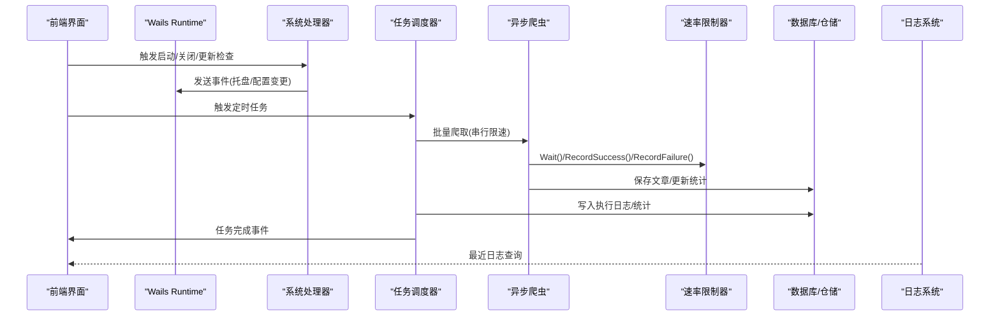
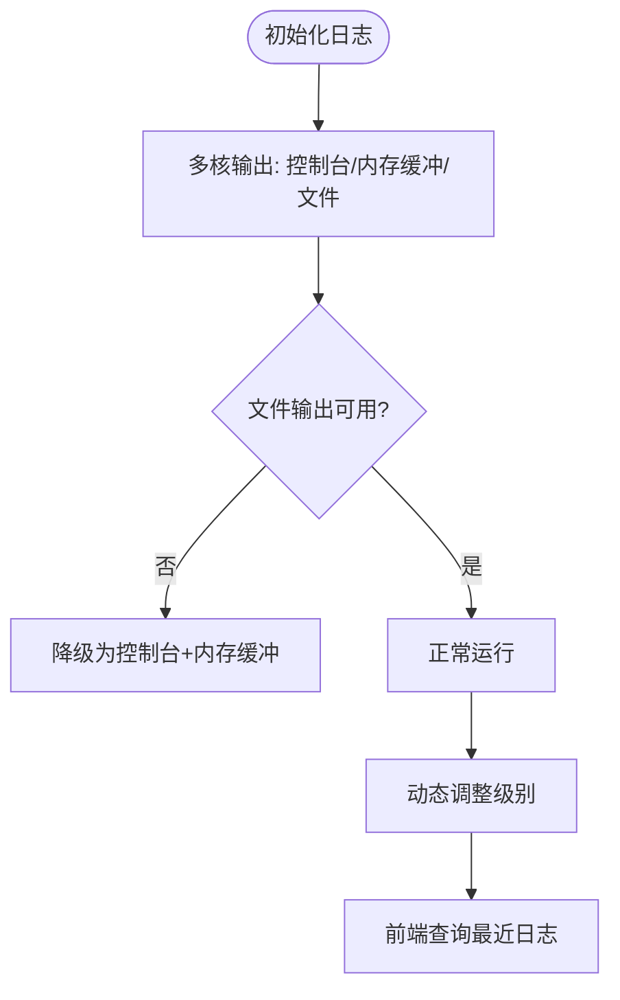
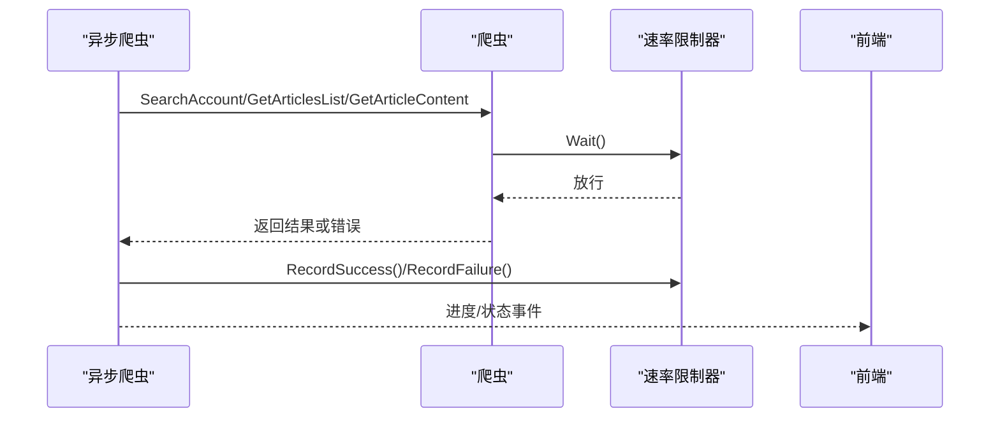
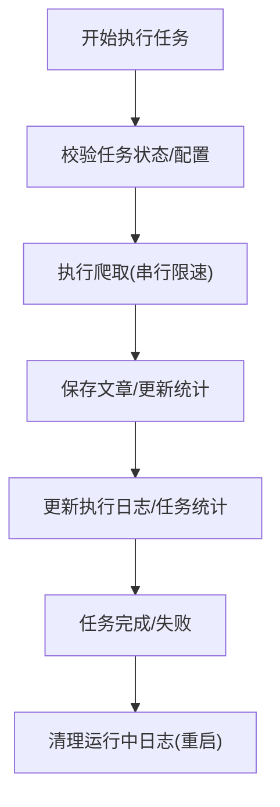
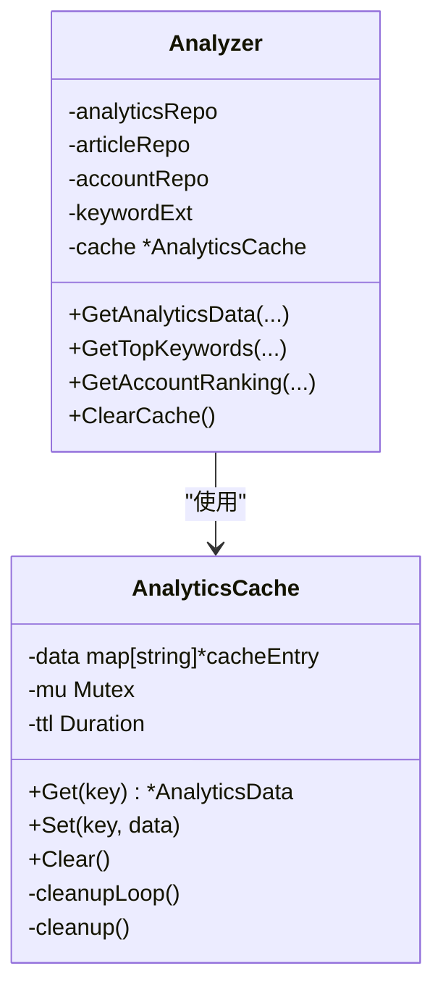
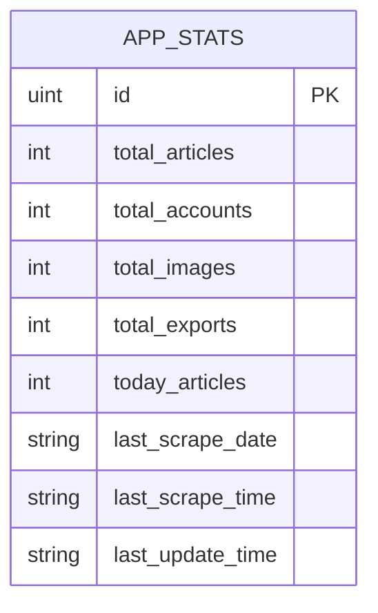
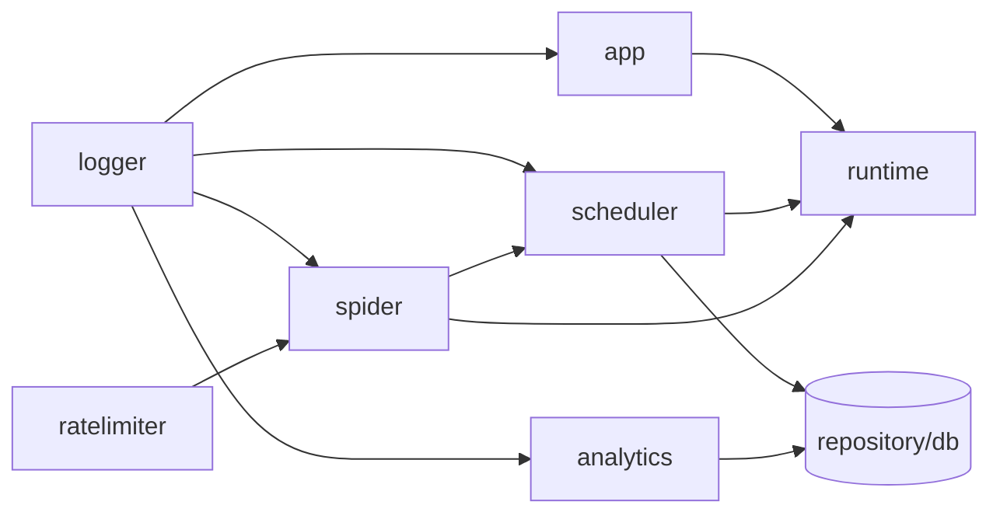

# 监控告警

<cite>
**本文引用的文件**
- [app.go](file://backend/app/app.go)
- [system_handler.go](file://backend/app/system_handler.go)
- [scrape_handler.go](file://backend/app/scrape_handler.go)
- [logger.go](file://backend/pkg/logger/logger.go)
- [buffer.go](file://backend/pkg/logger/buffer.go)
- [ratelimiter.go](file://backend/pkg/utils/ratelimiter.go)
- [scraper.go](file://backend/internal/spider/scraper.go)
- [async_scraper.go](file://backend/internal/spider/async_scraper.go)
- [task_scheduler.go](file://backend/internal/scheduler/task_scheduler.go)
- [analyzer.go](file://backend/internal/analytics/analyzer.go)
- [cache.go](file://backend/internal/analytics/cache.go)
- [stats_repo.go](file://backend/internal/repository/stats_repo.go)
- [app_stats.go](file://backend/internal/database/models/app_stats.go)
- [task_repo.go](file://backend/internal/repository/task_repo.go)
- [errors.go](file://backend/pkg/errors/errors.go)
- [runtime.d.ts](file://frontend/wailsjs/runtime/runtime.d.ts)
- [models.ts](file://frontend/wailsjs/go/models.ts)
</cite>

## 目录
1. [简介](#简介)
2. [项目结构](#项目结构)
3. [核心组件](#核心组件)
4. [架构总览](#架构总览)
5. [详细组件分析](#详细组件分析)
6. [依赖关系分析](#依赖关系分析)
7. [性能考量](#性能考量)
8. [故障排查指南](#故障排查指南)
9. [结论](#结论)
10. [附录](#附录)

## 简介
本文件面向 WeMediaSpider 的监控与告警体系，结合现有代码实现，给出可落地的监控方案与告警配置建议。内容覆盖日志系统配置与级别管理、关键性能指标（成功率、响应时间、错误率）采集方法、数据分析模块的监控与异常检测、告警规则与通知机制、以及系统健康检查与故障自动恢复策略。

## 项目结构
WeMediaSpider 采用前后端分离的桌面应用架构，后端以 Go 语言实现，前端基于 Wails 框架。监控与告警相关的关键位置如下：
- 日志系统：全局日志初始化、内存缓冲、文件落盘与级别动态调整
- 爬虫与调度：串行限速、重试、进度与状态事件上报
- 数据统计：应用统计模型与仓储层更新
- 前端通知：Wails Runtime 的通知能力

```mermaid
graph TB
subgraph "后端"
APP["App 应用入口<br/>初始化服务/日志/数据库"]
SYS["系统处理器<br/>启动/关闭/托盘/更新检查"]
SCR["爬取处理器<br/>登录/搜索/爬取/取消"]
LOG["日志系统<br/>控制台/内存缓冲/文件"]
RL["速率限制器<br/>串行化/自适应退避"]
SCH["任务调度器<br/>执行/记录/统计"]
ANA["分析器<br/>缓存/统计/排行"]
DB[("数据库/仓储")]
end
subgraph "前端"
RT["Wails Runtime<br/>事件/通知"]
end
APP --> SYS
APP --> SCR
APP --> SCH
APP --> ANA
APP --> LOG
APP --> DB
SCR --> RL
SCH --> DB
ANA --> DB
SYS --> RT
SCR --> RT
SCH --> RT
```

图表来源
- [app.go:52-83](file://backend/app/app.go#L52-L83)
- [system_handler.go:22-86](file://backend/app/system_handler.go#L22-L86)
- [scrape_handler.go:126-244](file://backend/app/scrape_handler.go#L126-L244)
- [logger.go:19-84](file://backend/pkg/logger/logger.go#L19-L84)
- [ratelimiter.go:44-82](file://backend/pkg/utils/ratelimiter.go#L44-L82)
- [task_scheduler.go:52-127](file://backend/internal/scheduler/task_scheduler.go#L52-L127)
- [analyzer.go:46-106](file://backend/internal/analytics/analyzer.go#L46-L106)

章节来源
- [app.go:52-83](file://backend/app/app.go#L52-L83)
- [system_handler.go:22-86](file://backend/app/system_handler.go#L22-L86)
- [scrape_handler.go:126-244](file://backend/app/scrape_handler.go#L126-L244)
- [logger.go:19-84](file://backend/pkg/logger/logger.go#L19-L84)
- [ratelimiter.go:44-82](file://backend/pkg/utils/ratelimiter.go#L44-L82)
- [task_scheduler.go:52-127](file://backend/internal/scheduler/task_scheduler.go#L52-L127)
- [analyzer.go:46-106](file://backend/internal/analytics/analyzer.go#L46-L106)

## 核心组件
- 日志系统：支持控制台、内存缓冲、文件落盘三路输出，动态调整日志级别，提供最近日志查询与清空
- 速率限制器：串行化请求，内置自适应退避与失败计数，保障对目标站点的合规访问
- 爬虫与异步爬取：统一的请求封装、重试与内容提取，支持进度与状态事件上报
- 任务调度器：周期任务执行、执行日志记录、统计更新、运行中任务清理
- 数据分析器与缓存：聚合分析、缓存与 TTL 管理
- 应用统计：文章/账号/图片/导出等指标的持久化更新
- 前端通知：通过 Wails Runtime 发送系统通知

章节来源
- [logger.go:19-109](file://backend/pkg/logger/logger.go#L19-L109)
- [ratelimiter.go:44-133](file://backend/pkg/utils/ratelimiter.go#L44-L133)
- [scraper.go:263-293](file://backend/internal/spider/scraper.go#L263-L293)
- [async_scraper.go:31-273](file://backend/internal/spider/async_scraper.go#L31-L273)
- [task_scheduler.go:52-127](file://backend/internal/scheduler/task_scheduler.go#L52-L127)
- [analyzer.go:46-106](file://backend/internal/analytics/analyzer.go#L46-L106)
- [stats_repo.go:29-71](file://backend/internal/repository/stats_repo.go#L29-L71)
- [runtime.d.ts:276-330](file://frontend/wailsjs/runtime/runtime.d.ts#L276-L330)

## 架构总览
下图展示监控与告警在系统中的位置与交互：

图表来源
- [system_handler.go:75-85](file://backend/app/system_handler.go#L75-L85)
- [task_scheduler.go:52-127](file://backend/internal/scheduler/task_scheduler.go#L52-L127)
- [async_scraper.go:31-273](file://backend/internal/spider/async_scraper.go#L31-L273)
- [ratelimiter.go:84-98](file://backend/pkg/utils/ratelimiter.go#L84-L98)
- [stats_repo.go:56-71](file://backend/internal/repository/stats_repo.go#L56-L71)
- [logger.go:19-84](file://backend/pkg/logger/logger.go#L19-L84)

## 详细组件分析

### 日志系统与级别管理
- 初始化：控制台输出、内存缓冲、文件输出（lumberjack），失败时降级为仅控制台输出
- 动态级别：支持运行时调整 debug/info/warn/error
- 前端访问：提供最近日志读取与清空，便于问题定位
- 建议：生产环境默认 info，问题排查时临时提升至 debug；结合文件轮转与保留策略

图表来源
- [logger.go:19-84](file://backend/pkg/logger/logger.go#L19-L84)
- [logger.go:87-101](file://backend/pkg/logger/logger.go#L87-L101)
- [system_handler.go:576-600](file://backend/app/system_handler.go#L576-L600)

章节来源
- [logger.go:19-109](file://backend/pkg/logger/logger.go#L19-L109)
- [buffer.go:18-59](file://backend/pkg/logger/buffer.go#L18-L59)
- [system_handler.go:576-600](file://backend/app/system_handler.go#L576-L600)

### 爬虫与速率限制（成功率/响应时间/错误率）
- 串行化与自适应：Wait() 保证最小间隔；RecordSuccess()/RecordFailure() 动态延长等待
- 重试机制：文章内容获取最多重试若干次，指数退避与抖动
- 进度与状态：通过通道向前端推送进度与状态事件
- 指标采集建议：
  - 成功率：成功/失败计数来自速率限制器记录与错误返回
  - 响应时间：任务调度器记录开始/结束时间与持续毫秒数
  - 错误率：错误计数/总请求数，区分网络、解析、频率限制等类型

图表来源
- [async_scraper.go:31-273](file://backend/internal/spider/async_scraper.go#L31-L273)
- [scraper.go:263-293](file://backend/internal/spider/scraper.go#L263-L293)
- [ratelimiter.go:84-98](file://backend/pkg/utils/ratelimiter.go#L84-L98)

章节来源
- [async_scraper.go:31-273](file://backend/internal/spider/async_scraper.go#L31-L273)
- [scraper.go:263-293](file://backend/internal/spider/scraper.go#L263-L293)
- [ratelimiter.go:44-133](file://backend/pkg/utils/ratelimiter.go#L44-L133)

### 任务调度与执行日志（健康检查/自动恢复）
- 执行流程：校验任务、创建执行日志、执行爬取、更新日志与任务统计
- 健康检查：运行中任务状态清理（重启后标记为 canceled），避免僵尸任务
- 自动恢复：失败任务可重试；频率限制触发时清空已获数据并停止当前账号处理

图表来源
- [task_scheduler.go:52-127](file://backend/internal/scheduler/task_scheduler.go#L52-L127)
- [task_repo.go:122-128](file://backend/internal/repository/task_repo.go#L122-L128)

章节来源
- [task_scheduler.go:52-127](file://backend/internal/scheduler/task_scheduler.go#L52-L127)
- [task_repo.go:122-128](file://backend/internal/repository/task_repo.go#L122-L128)

### 数据分析与缓存（异常检测）
- 缓存：30 分钟 TTL，定期清理过期项，支持强制刷新
- 异常检测建议：缓存命中率低、计算耗时突增、关键词提取为空等场景触发告警
- 与前端交互：分析器返回数据包含缓存时间，便于前端判断新鲜度

图表来源
- [cache.go:11-94](file://backend/internal/analytics/cache.go#L11-L94)
- [analyzer.go:17-106](file://backend/internal/analytics/analyzer.go#L17-L106)

章节来源
- [cache.go:11-94](file://backend/internal/analytics/cache.go#L11-L94)
- [analyzer.go:17-106](file://backend/internal/analytics/analyzer.go#L17-L106)

### 应用统计与导出（指标来源）
- 统计模型：文章总数、账号数、今日文章数、最后抓取时间等
- 更新接口：批量保存文章后更新统计，图片下载完成后增量计数
- 指标用途：页面展示、告警阈值参考

图表来源
- [app_stats.go:5-24](file://backend/internal/database/models/app_stats.go#L5-L24)

章节来源
- [stats_repo.go:29-71](file://backend/internal/repository/stats_repo.go#L29-L71)
- [app_stats.go:5-24](file://backend/internal/database/models/app_stats.go#L5-L24)

### 前端通知与事件（告警通知）
- 通知能力：初始化通知、发送通知、注册分类、移除通知等
- 事件通道：任务完成、爬取进度/状态、图片下载进度/完成/错误等
- 建议：将高频错误与异常状态映射为通知，便于用户及时干预

章节来源
- [runtime.d.ts:276-330](file://frontend/wailsjs/runtime/runtime.d.ts#L276-L330)
- [system_handler.go:75-85](file://backend/app/system_handler.go#L75-L85)
- [scrape_handler.go:154-176](file://backend/app/scrape_handler.go#L154-L176)
- [scrape_handler.go:273-281](file://backend/app/scrape_handler.go#L273-L281)
- [models.ts:494-525](file://frontend/wailsjs/go/models.ts#L494-L525)

## 依赖关系分析
- 日志系统被广泛使用于各模块，是监控与排障的基础
- 速率限制器贯穿爬取链路，是稳定性与合规性的关键
- 任务调度器依赖登录状态、爬虫与仓储层，负责执行与统计
- 分析器依赖仓储与缓存，提供聚合视图
- 前端通过 Runtime 接收事件并触发通知

图表来源
- [logger.go:19-84](file://backend/pkg/logger/logger.go#L19-L84)
- [ratelimiter.go:44-82](file://backend/pkg/utils/ratelimiter.go#L44-L82)
- [scraper.go:50-69](file://backend/internal/spider/scraper.go#L50-L69)
- [task_scheduler.go:31-45](file://backend/internal/scheduler/task_scheduler.go#L31-L45)
- [analyzer.go:26-39](file://backend/internal/analytics/analyzer.go#L26-L39)

章节来源
- [logger.go:19-84](file://backend/pkg/logger/logger.go#L19-L84)
- [ratelimiter.go:44-82](file://backend/pkg/utils/ratelimiter.go#L44-L82)
- [scraper.go:50-69](file://backend/internal/spider/scraper.go#L50-L69)
- [task_scheduler.go:31-45](file://backend/internal/scheduler/task_scheduler.go#L31-L45)
- [analyzer.go:26-39](file://backend/internal/analytics/analyzer.go#L26-L39)

## 性能考量
- 串行限速：通过互斥锁与随机间隔保证合规访问，避免被风控
- 缓存策略：分析器缓存 30 分钟，减少重复计算；定期清理过期项
- 批量写入：任务完成后批量保存文章，降低数据库压力
- 日志落盘：lumberjack 轮转，避免磁盘占用过大

章节来源
- [ratelimiter.go:44-82](file://backend/pkg/utils/ratelimiter.go#L44-L82)
- [cache.go:72-94](file://backend/internal/analytics/cache.go#L72-L94)
- [task_scheduler.go:191-233](file://backend/internal/scheduler/task_scheduler.go#L191-L233)
- [logger.go:72-84](file://backend/pkg/logger/logger.go#L72-L84)

## 故障排查指南
- 登录状态：检查登录状态与 Token 有效性，必要时导出/导入凭证
- 爬取失败：查看最近日志、频率限制提示、网络错误；确认重试机制是否生效
- 任务卡死：检查运行中日志是否清理，重启后状态会被标记为 canceled
- 错误类型：使用统一错误包装，便于前端识别与提示

章节来源
- [scrape_handler.go:20-37](file://backend/app/scrape_handler.go#L20-L37)
- [system_handler.go:576-600](file://backend/app/system_handler.go#L576-L600)
- [task_repo.go:122-128](file://backend/internal/repository/task_repo.go#L122-L128)
- [errors.go:27-41](file://backend/pkg/errors/errors.go#L27-L41)

## 结论
WeMediaSpider 的监控与告警体系以日志、速率限制、任务执行日志与统计为核心，结合前端通知实现闭环。建议在此基础上补充：
- 指标采集：成功率、响应时间、错误率、缓存命中率
- 告警规则：阈值触发、趋势异常、频率限制告警
- 通知机制：邮件/IM/系统通知联动
- 自动恢复：失败重试、频率限制退避、任务取消与清理

## 附录

### 关键性能指标定义与采集点
- 爬取成功率
  - 计算方式：成功文章数 / 总请求数
  - 采集点：速率限制器记录、任务执行日志
- 响应时间
  - 计算方式：任务结束时间 - 开始时间（毫秒）
  - 采集点：任务调度器
- 错误率
  - 计算方式：错误计数 / 总请求数
  - 采集点：速率限制器记录、错误类型分类

章节来源
- [ratelimiter.go:84-98](file://backend/pkg/utils/ratelimiter.go#L84-L98)
- [task_scheduler.go:92-127](file://backend/internal/scheduler/task_scheduler.go#L92-L127)

### 告警规则与通知机制建议
- 规则示例
  - 成功率低于阈值持续一段时间
  - 响应时间超过阈值
  - 错误率异常升高
  - 缓存命中率骤降
- 通知渠道
  - 系统通知（已具备）
  - 邮件/IM（可扩展）
- 事件映射
  - 任务完成/失败、爬取进度/错误、图片下载进度/完成/错误

章节来源
- [runtime.d.ts:276-330](file://frontend/wailsjs/runtime/runtime.d.ts#L276-L330)
- [system_handler.go:75-85](file://backend/app/system_handler.go#L75-L85)
- [scrape_handler.go:154-176](file://backend/app/scrape_handler.go#L154-L176)
- [scrape_handler.go:273-281](file://backend/app/scrape_handler.go#L273-L281)