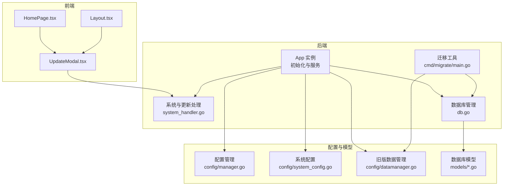
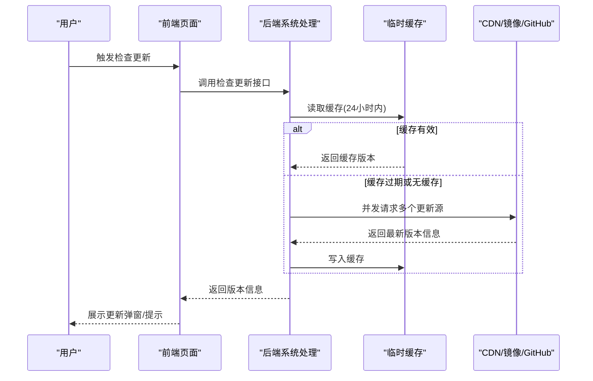
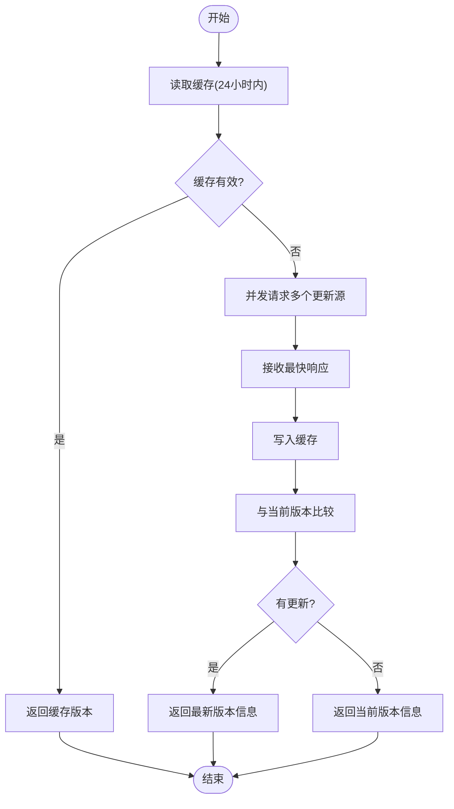
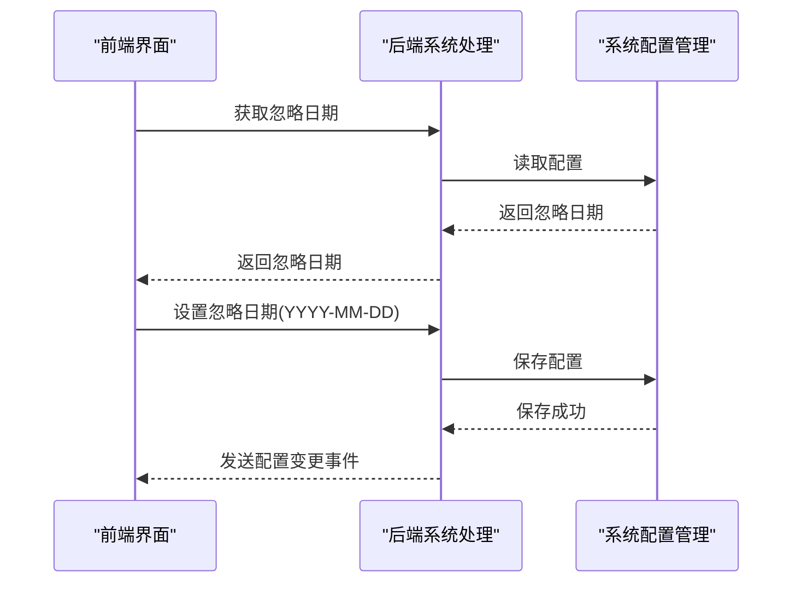
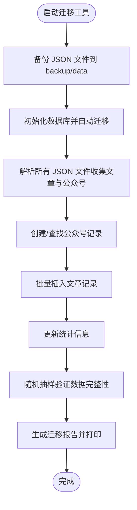
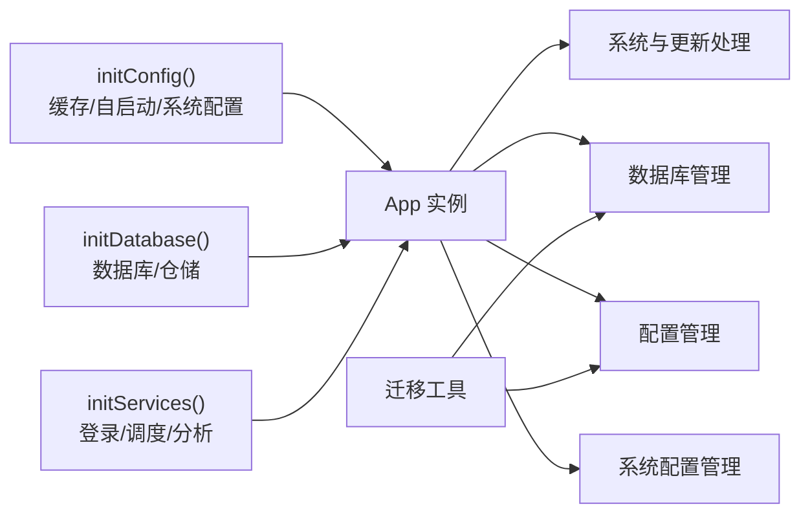

# 维护与更新

<cite>
**本文引用的文件**
- [version.json](file://version.json)
- [main.go](file://main.go)
- [backend/app/init.go](file://backend/app/init.go)
- [backend/app/system_handler.go](file://backend/app/system_handler.go)
- [backend/cmd/migrate/main.go](file://backend/cmd/migrate/main.go)
- [backend/internal/database/db.go](file://backend/internal/database/db.go)
- [backend/internal/database/models/article.go](file://backend/internal/database/models/article.go)
- [backend/internal/database/models/account.go](file://backend/internal/database/models/account.go)
- [backend/internal/database/models/app_stats.go](file://backend/internal/database/models/app_stats.go)
- [backend/internal/database/models/scheduled_task.go](file://backend/internal/database/models/scheduled_task.go)
- [backend/internal/config/manager.go](file://backend/internal/config/manager.go)
- [backend/internal/config/system_config.go](file://backend/internal/config/system_config.go)
- [backend/internal/config/datamanager.go](file://backend/internal/config/datamanager.go)
- [frontend/src/pages/HomePage.tsx](file://frontend/src/pages/HomePage.tsx)
- [frontend/src/components/Layout.tsx](file://frontend/src/components/Layout.tsx)
- [frontend/src/components/UpdateModal.tsx](file://frontend/src/components/UpdateModal.tsx)
</cite>

## 目录
1. [简介](#简介)
2. [项目结构](#项目结构)
3. [核心组件](#核心组件)
4. [架构总览](#架构总览)
5. [详细组件分析](#详细组件分析)
6. [依赖关系分析](#依赖关系分析)
7. [性能考量](#性能考量)
8. [故障排查指南](#故障排查指南)
9. [结论](#结论)
10. [附录](#附录)

## 简介
本文件面向 WeMediaSpider 的维护者与使用者，系统性阐述应用的维护流程、更新机制、版本管理与版本号策略、数据迁移工具使用方法与流程、配置文件的版本兼容与升级注意事项、应用更新的发布与回滚策略，以及数据备份与恢复操作指南，并解释热更新与零停机更新的实现方式。

## 项目结构
WeMediaSpider 采用前后端分离架构：后端使用 Go 语言与 Wails 框架，前端基于 React/Vite。更新检查与系统配置位于后端，前端负责展示与交互；数据库采用 SQLite，迁移由后端自动完成；迁移工具独立于主程序运行，支持从旧版 JSON 数据迁移到新版数据库。



**图表来源**
- [frontend/src/pages/HomePage.tsx:40-176](file://frontend/src/pages/HomePage.tsx#L40-L176)
- [frontend/src/components/Layout.tsx:93-135](file://frontend/src/components/Layout.tsx#L93-L135)
- [frontend/src/components/UpdateModal.tsx:1-141](file://frontend/src/components/UpdateModal.tsx#L1-L141)
- [backend/app/system_handler.go:279-363](file://backend/app/system_handler.go#L279-L363)
- [backend/internal/database/db.go:18-115](file://backend/internal/database/db.go#L18-L115)
- [backend/cmd/migrate/main.go:37-124](file://backend/cmd/migrate/main.go#L37-L124)
- [backend/internal/config/manager.go:16-69](file://backend/internal/config/manager.go#L16-L69)
- [backend/internal/config/system_config.go:25-108](file://backend/internal/config/system_config.go#L25-L108)
- [backend/internal/config/datamanager.go:26-175](file://backend/internal/config/datamanager.go#L26-L175)

**章节来源**
- [backend/app/init.go:43-135](file://backend/app/init.go#L43-L135)
- [backend/app/system_handler.go:279-363](file://backend/app/system_handler.go#L279-L363)
- [backend/internal/database/db.go:18-115](file://backend/internal/database/db.go#L18-L115)
- [backend/cmd/migrate/main.go:37-124](file://backend/cmd/migrate/main.go#L37-L124)
- [backend/internal/config/manager.go:16-69](file://backend/internal/config/manager.go#L16-L69)
- [backend/internal/config/system_config.go:25-108](file://backend/internal/config/system_config.go#L25-L108)
- [backend/internal/config/datamanager.go:26-175](file://backend/internal/config/datamanager.go#L26-L175)
- [frontend/src/pages/HomePage.tsx:40-176](file://frontend/src/pages/HomePage.tsx#L40-L176)
- [frontend/src/components/Layout.tsx:93-135](file://frontend/src/components/Layout.tsx#L93-L135)
- [frontend/src/components/UpdateModal.tsx:1-141](file://frontend/src/components/UpdateModal.tsx#L1-L141)

## 核心组件
- 应用初始化与服务装配：负责缓存、自启动、系统配置、数据库、仓储层、登录管理、任务调度与分析器的初始化。
- 系统与更新处理：提供版本查询、多源并发检查更新、缓存控制、忽略更新日期持久化、事件通知前端。
- 数据库与模型：SQLite 数据库初始化、WAL 模式、连接池、外键约束、自动迁移与统计初始化。
- 配置管理：用户配置与系统配置的加载、保存与默认值处理。
- 迁移工具：从旧版 JSON 数据目录备份并导入到数据库，生成迁移报告并进行完整性校验。
- 前端更新交互：弹窗展示更新信息、今日不再提示、手动检查更新、打开下载链接。

**章节来源**
- [backend/app/init.go:43-135](file://backend/app/init.go#L43-L135)
- [backend/app/system_handler.go:279-363](file://backend/app/system_handler.go#L279-L363)
- [backend/internal/database/db.go:82-115](file://backend/internal/database/db.go#L82-L115)
- [backend/internal/config/manager.go:27-69](file://backend/internal/config/manager.go#L27-L69)
- [backend/internal/config/system_config.go:42-108](file://backend/internal/config/system_config.go#L42-L108)
- [backend/cmd/migrate/main.go:68-124](file://backend/cmd/migrate/main.go#L68-L124)
- [frontend/src/components/UpdateModal.tsx:20-141](file://frontend/src/components/UpdateModal.tsx#L20-L141)

## 架构总览
WeMediaSpider 的更新与维护围绕“后端检查更新 + 前端展示交互 + 数据库迁移”展开。后端通过多源并发检查版本，缓存结果并在前端触发更新提示；系统配置持久化支持“今日不再提示”；数据库自动迁移保证模型演进；迁移工具独立运行，确保数据安全过渡。



**图表来源**
- [backend/app/system_handler.go:279-363](file://backend/app/system_handler.go#L279-L363)
- [frontend/src/pages/HomePage.tsx:63-100](file://frontend/src/pages/HomePage.tsx#L63-L100)
- [frontend/src/components/Layout.tsx:93-109](file://frontend/src/components/Layout.tsx#L93-L109)

**章节来源**
- [backend/app/system_handler.go:279-363](file://backend/app/system_handler.go#L279-L363)
- [frontend/src/pages/HomePage.tsx:46-100](file://frontend/src/pages/HomePage.tsx#L46-L100)
- [frontend/src/components/Layout.tsx:93-109](file://frontend/src/components/Layout.tsx#L93-L109)

## 详细组件分析

### 版本管理与版本号策略
- 版本号来源：后端固定返回当前版本字符串；前端通过 API 获取版本信息并与本地比较。
- 更新检查：后端并发请求 GitHub Releases、jsdelivr CDN、ghproxy 镜像，取最快响应作为最终结果；结果缓存 24 小时。
- 版本号格式：遵循语义化版本（主.次.补丁），比较算法逐段数值比较。
- 发布策略：版本信息由远端 version.json 提供，包含最新版本、更新地址与发布说明。



**图表来源**
- [backend/app/system_handler.go:279-363](file://backend/app/system_handler.go#L279-L363)
- [version.json:1-6](file://version.json#L1-L6)

**章节来源**
- [backend/app/system_handler.go:258-260](file://backend/app/system_handler.go#L258-L260)
- [backend/app/system_handler.go:279-363](file://backend/app/system_handler.go#L279-L363)
- [version.json:1-6](file://version.json#L1-L6)

### 更新机制与前端交互
- 前端在首页与布局组件中提供“检查更新”入口与弹窗展示。
- 支持“稍后”、“立即更新”、“今日不再提示”三种操作；“今日不再提示”会持久化忽略日期。
- 后端提供获取/设置忽略日期的接口，变更后通过事件通知前端刷新状态。



**图表来源**
- [frontend/src/pages/HomePage.tsx:46-122](file://frontend/src/pages/HomePage.tsx#L46-L122)
- [frontend/src/components/Layout.tsx:124-135](file://frontend/src/components/Layout.tsx#L124-L135)
- [backend/app/system_handler.go:165-189](file://backend/app/system_handler.go#L165-L189)
- [backend/internal/config/system_config.go:42-108](file://backend/internal/config/system_config.go#L42-L108)

**章节来源**
- [frontend/src/pages/HomePage.tsx:46-122](file://frontend/src/pages/HomePage.tsx#L46-L122)
- [frontend/src/components/Layout.tsx:124-135](file://frontend/src/components/Layout.tsx#L124-L135)
- [frontend/src/components/UpdateModal.tsx:20-141](file://frontend/src/components/UpdateModal.tsx#L20-L141)
- [backend/app/system_handler.go:165-189](file://backend/app/system_handler.go#L165-L189)
- [backend/internal/config/system_config.go:42-108](file://backend/internal/config/system_config.go#L42-L108)

### 数据迁移工具使用与流程
迁移工具独立运行，从用户主目录下的数据目录读取旧版 JSON 文件，备份到备份目录，然后初始化数据库并执行自动迁移，批量导入文章与公众号，更新统计，进行完整性校验，并生成迁移报告。



**图表来源**
- [backend/cmd/migrate/main.go:68-124](file://backend/cmd/migrate/main.go#L68-L124)
- [backend/cmd/migrate/main.go:126-172](file://backend/cmd/migrate/main.go#L126-L172)
- [backend/cmd/migrate/main.go:174-257](file://backend/cmd/migrate/main.go#L174-L257)
- [backend/cmd/migrate/main.go:259-297](file://backend/cmd/migrate/main.go#L259-L297)
- [backend/cmd/migrate/main.go:299-331](file://backend/cmd/migrate/main.go#L299-L331)

**章节来源**
- [backend/cmd/migrate/main.go:37-124](file://backend/cmd/migrate/main.go#L37-L124)
- [backend/cmd/migrate/main.go:126-172](file://backend/cmd/migrate/main.go#L126-L172)
- [backend/cmd/migrate/main.go:174-257](file://backend/cmd/migrate/main.go#L174-L257)
- [backend/cmd/migrate/main.go:259-297](file://backend/cmd/migrate/main.go#L259-L297)
- [backend/cmd/migrate/main.go:299-331](file://backend/cmd/migrate/main.go#L299-L331)

### 配置文件的版本兼容与升级注意事项
- 用户配置：config.json 由配置管理器加载与保存，默认值兼容旧字段（如请求间隔字段兼容旧名称）。
- 系统配置：system_config.json 包含关闭到托盘、记住选择、忽略更新日期等；若文件缺失则生成默认配置并保存。
- 旧版数据：appdata.json 仍可读取，但已标注废弃，建议迁移至数据库统计模型。
- 升级注意事项：新增字段不会影响旧配置加载；若未来删除字段，需在配置管理器中提供兼容逻辑或迁移脚本。

**章节来源**
- [backend/internal/config/manager.go:27-69](file://backend/internal/config/manager.go#L27-L69)
- [backend/internal/config/system_config.go:42-108](file://backend/internal/config/system_config.go#L42-L108)
- [backend/internal/config/datamanager.go:3-18](file://backend/internal/config/datamanager.go#L3-L18)

### 数据库模型与迁移
- 数据库初始化：SQLite，启用 WAL、设置连接池、外键约束、同步模式等；自动迁移表结构。
- 模型定义：账号、文章、应用统计、定时任务等；应用统计为单例模式，初始化时确保记录存在。
- 迁移工具：先备份 JSON，再自动迁移数据库表结构，最后批量导入数据并更新统计。

```mermaid
erDiagram
ACCOUNT {
uint ID PK
string Fakeid UK
string Name
time CreatedAt
time UpdatedAt
}
ARTICLE {
uint ID PK
string ArticleID UK
uint AccountID FK
string AccountFakeid
string AccountName
text Title
text Link
text Digest
text Content
text CleanContent
text ImageLinks
text HitKeywords
int KeywordScore
string PublishTime
int64 PublishTimestamp
time CreatedAt
time UpdatedAt
}
APP_STATS {
uint ID PK CK(ID=1)
int TotalArticles
int TotalAccounts
int TotalImages
int TotalExports
int TodayArticles
string LastScrapeDate
string LastScrapeTime
string LastUpdateTime
time CreatedAt
time UpdatedAt
}
SCHEDULED_TASK {
uint ID PK
string Name
text Description
string CronExpression
bool Enabled
text ScrapeConfig
time LastRunTime
time NextRunTime
string LastRunStatus
text LastRunError
int TotalRuns
int SuccessRuns
int FailedRuns
time CreatedAt
time UpdatedAt
}
ACCOUNT ||--o{ ARTICLE : "拥有"
```

**图表来源**
- [backend/internal/database/models/account.go:5-19](file://backend/internal/database/models/account.go#L5-L19)
- [backend/internal/database/models/article.go:5-31](file://backend/internal/database/models/article.go#L5-L31)
- [backend/internal/database/models/app_stats.go:5-24](file://backend/internal/database/models/app_stats.go#L5-L24)
- [backend/internal/database/models/scheduled_task.go:5-28](file://backend/internal/database/models/scheduled_task.go#L5-L28)

**章节来源**
- [backend/internal/database/db.go:82-115](file://backend/internal/database/db.go#L82-L115)
- [backend/internal/database/models/account.go:5-19](file://backend/internal/database/models/account.go#L5-L19)
- [backend/internal/database/models/article.go:5-31](file://backend/internal/database/models/article.go#L5-L31)
- [backend/internal/database/models/app_stats.go:5-24](file://backend/internal/database/models/app_stats.go#L5-L24)
- [backend/internal/database/models/scheduled_task.go:5-28](file://backend/internal/database/models/scheduled_task.go#L5-L28)

### 发布流程与回滚策略
- 发布流程：
  - 在远端仓库更新 version.json，包含最新版本号、更新地址与发布说明。
  - 前端通过后端 API 获取版本信息并展示更新弹窗。
  - 用户确认后打开下载链接进行安装。
- 回滚策略：
  - 若新版本存在问题，可通过修改远端 version.json 或部署旧版本包进行回滚。
  - 建议保留最近一次迁移备份目录，以便必要时回滚数据库。

**章节来源**
- [version.json:1-6](file://version.json#L1-L6)
- [backend/app/system_handler.go:365-476](file://backend/app/system_handler.go#L365-L476)
- [frontend/src/components/UpdateModal.tsx:124-135](file://frontend/src/components/UpdateModal.tsx#L124-L135)

### 数据备份与恢复操作指南
- 备份：
  - 迁移工具会自动将旧版 JSON 数据备份到 backup/data 目录。
  - 数据库文件位于用户主目录下的 .wemediaspider 目录中，可直接复制该文件进行备份。
- 恢复：
  - 数据库恢复：停止应用，替换 wemedia.db 文件后重启应用。
  - 配置恢复：恢复 system_config.json 与 config.json 至对应目录。
  - 迁移恢复：若需要重新导入旧数据，可再次运行迁移工具，它会跳过已存在的记录并生成新的备份。

**章节来源**
- [backend/cmd/migrate/main.go:126-172](file://backend/cmd/migrate/main.go#L126-L172)
- [backend/internal/database/db.go:24-69](file://backend/internal/database/db.go#L24-L69)
- [backend/internal/config/system_config.go:25-40](file://backend/internal/config/system_config.go#L25-L40)
- [backend/internal/config/manager.go:16-25](file://backend/internal/config/manager.go#L16-L25)

### 热更新与零停机更新
- 热更新：当前实现为前端弹窗提示用户前往下载链接进行更新，属于“非热”更新。
- 零停机更新：后端提供平滑关闭流程（关闭定时任务、分析器、缓存与数据库），前端可配合在下载完成后重启应用，实现近似零停机体验。
- 建议：若需真正热更新，可在部署层引入进程替换或容器编排方案，当前代码未内置热更新逻辑。

**章节来源**
- [backend/app/system_handler.go:88-105](file://backend/app/system_handler.go#L88-L105)
- [frontend/src/components/UpdateModal.tsx:124-135](file://frontend/src/components/UpdateModal.tsx#L124-L135)

## 依赖关系分析
后端初始化阶段按顺序装配各子系统，数据库与仓储层在应用启动时初始化并自动迁移；系统配置与用户配置分别由不同管理器负责；迁移工具与主程序共享数据库与仓储层依赖。



**图表来源**
- [backend/app/init.go:43-135](file://backend/app/init.go#L43-L135)
- [backend/app/system_handler.go:279-363](file://backend/app/system_handler.go#L279-L363)
- [backend/internal/database/db.go:82-115](file://backend/internal/database/db.go#L82-L115)
- [backend/cmd/migrate/main.go:37-124](file://backend/cmd/migrate/main.go#L37-L124)

**章节来源**
- [backend/app/init.go:43-135](file://backend/app/init.go#L43-L135)
- [backend/app/system_handler.go:279-363](file://backend/app/system_handler.go#L279-L363)
- [backend/internal/database/db.go:82-115](file://backend/internal/database/db.go#L82-L115)
- [backend/cmd/migrate/main.go:37-124](file://backend/cmd/migrate/main.go#L37-L124)

## 性能考量
- 数据库性能：启用 WAL 模式、设置连接池、外键约束与同步模式，平衡性能与可靠性。
- 更新检查：多源并发请求，取最快响应并缓存 24 小时，降低网络延迟与失败风险。
- 日志与事件：后端提供日志缓冲与事件发射，便于前端实时查看与调试。

**章节来源**
- [backend/internal/database/db.go:54-62](file://backend/internal/database/db.go#L54-L62)
- [backend/app/system_handler.go:302-363](file://backend/app/system_handler.go#L302-L363)
- [backend/app/system_handler.go:576-600](file://backend/app/system_handler.go#L576-L600)

## 故障排查指南
- 更新检查失败：
  - 检查网络连通性与代理设置；确认远端 version.json 可访问。
  - 查看后端日志中的缓存读写与多源请求结果。
- 忽略更新无效：
  - 确认系统配置文件保存成功；检查前端事件是否正确接收。
- 数据迁移失败：
  - 检查旧版 JSON 文件是否可读；确认备份目录权限；查看迁移报告与日志。
- 数据库异常：
  - 检查 SQLite 文件权限与磁盘空间；必要时重建数据库并重新导入。

**章节来源**
- [backend/app/system_handler.go:365-476](file://backend/app/system_handler.go#L365-L476)
- [backend/internal/config/system_config.go:191-209](file://backend/internal/config/system_config.go#L191-L209)
- [backend/cmd/migrate/main.go:126-172](file://backend/cmd/migrate/main.go#L126-L172)
- [backend/internal/database/db.go:24-69](file://backend/internal/database/db.go#L24-L69)

## 结论
WeMediaSpider 的维护与更新体系以“后端多源并发检查 + 前端弹窗提示 + 数据库自动迁移 + 配置持久化”为核心，具备良好的扩展性与可维护性。建议在后续版本中引入更完善的热更新与灰度发布能力，并持续优化迁移工具的幂等性与错误恢复能力。

## 附录
- 版本信息来源：远端 version.json 提供最新版本号、更新地址与发布说明。
- 配置位置：用户主目录下的 .wemediaspider 目录，包含 config.json、system_config.json、appdata.json（已废弃）与数据库文件。
- 迁移工具：独立可执行文件，运行前请确保旧版数据目录存在且可读。

**章节来源**
- [version.json:1-6](file://version.json#L1-L6)
- [backend/internal/config/manager.go:16-25](file://backend/internal/config/manager.go#L16-L25)
- [backend/internal/config/system_config.go:25-40](file://backend/internal/config/system_config.go#L25-L40)
- [backend/internal/config/datamanager.go:26-47](file://backend/internal/config/datamanager.go#L26-L47)
- [backend/cmd/migrate/main.go:37-66](file://backend/cmd/migrate/main.go#L37-L66)