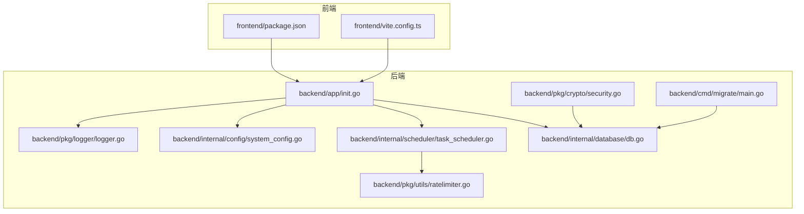
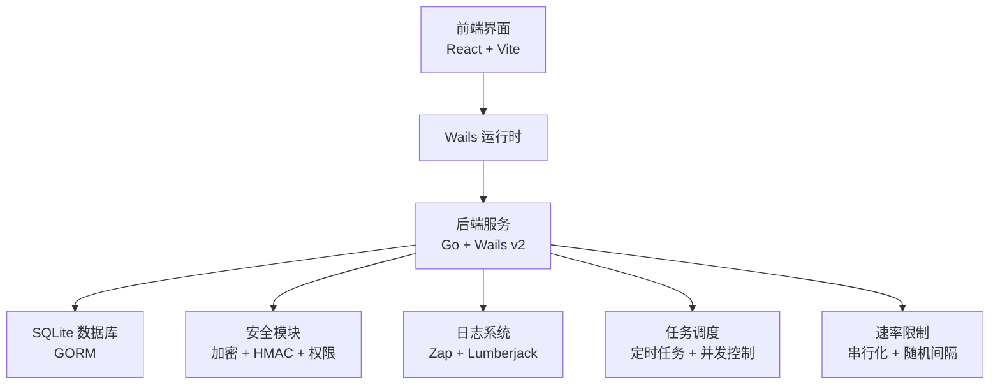
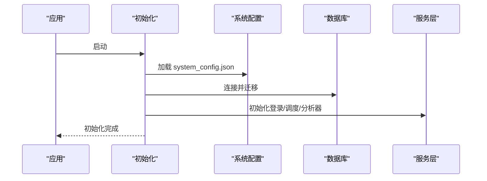
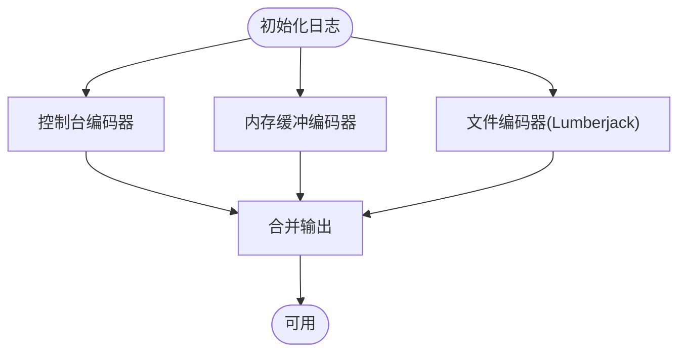
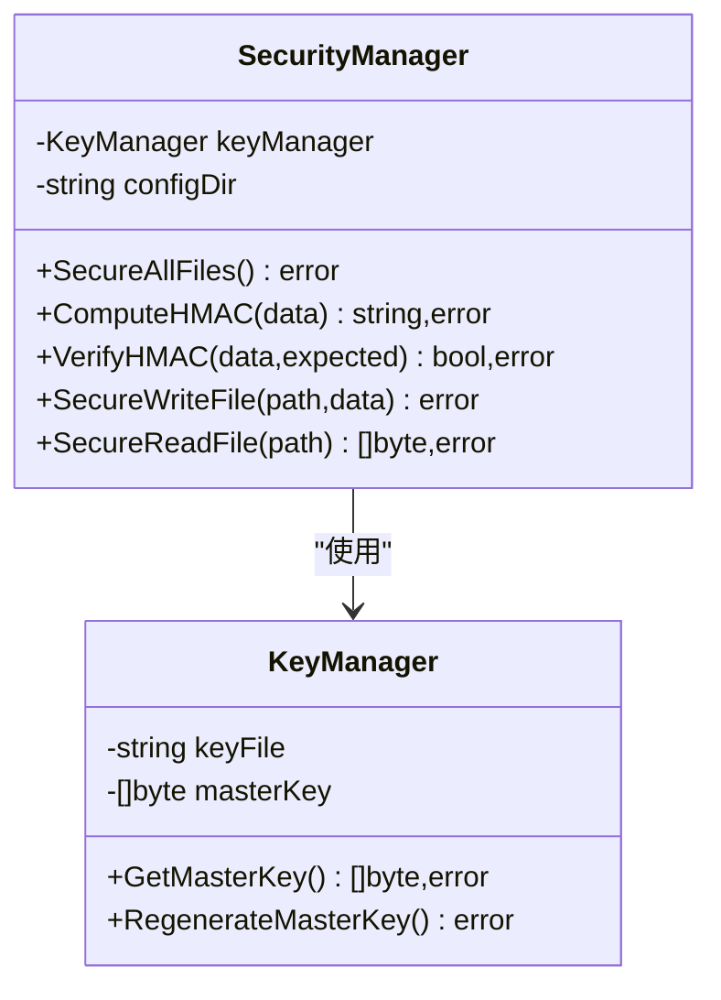
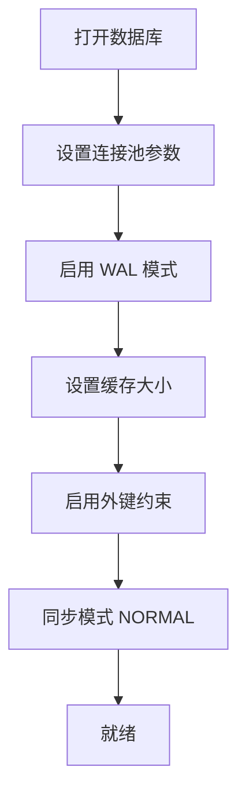
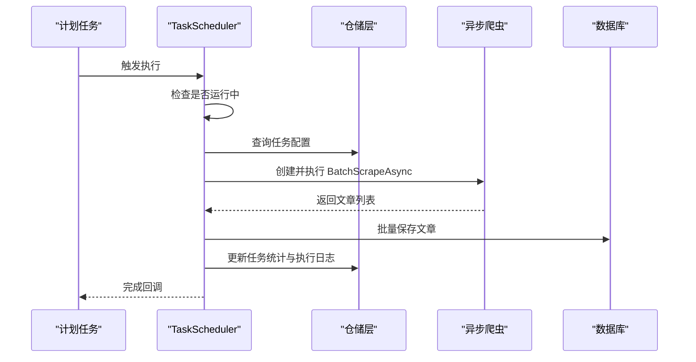
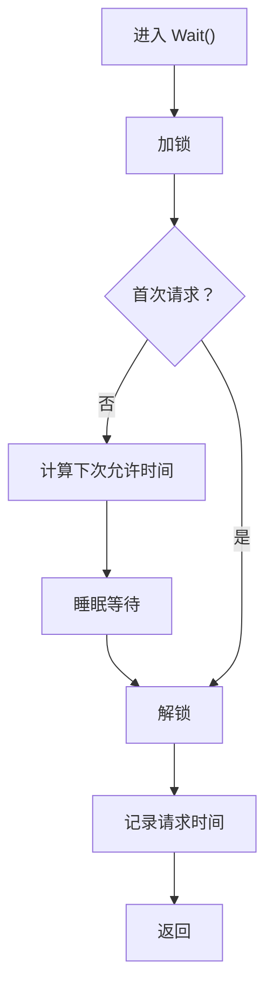
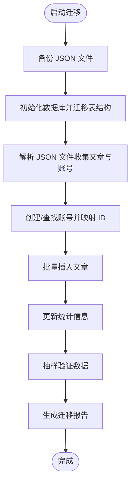
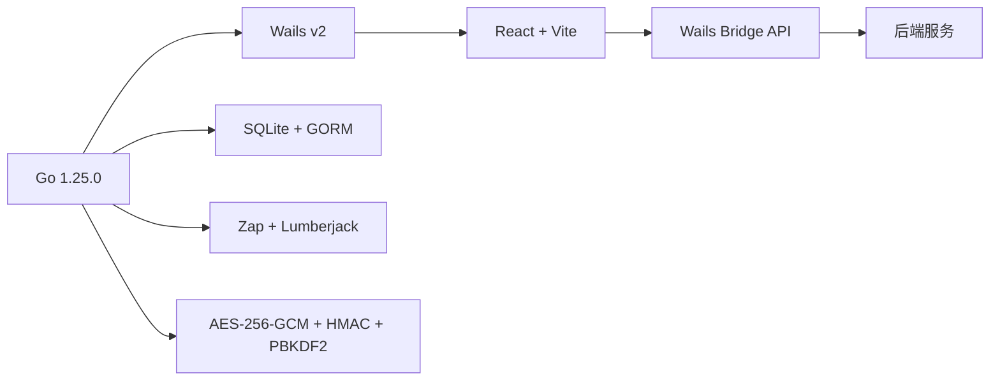

# 部署与运维

<cite>
**本文引用的文件**
- [README.md](file://README.md)
- [SECURITY.md](file://SECURITY.md)
- [version.json](file://version.json)
- [wails.json](file://wails.json)
- [go.mod](file://go.mod)
- [backend/cmd/migrate/main.go](file://backend/cmd/migrate/main.go)
- [backend/app/init.go](file://backend/app/init.go)
- [backend/pkg/logger/logger.go](file://backend/pkg/logger/logger.go)
- [backend/internal/config/system_config.go](file://backend/internal/config/system_config.go)
- [backend/pkg/crypto/security.go](file://backend/pkg/crypto/security.go)
- [backend/pkg/utils/ratelimiter.go](file://backend/pkg/utils/ratelimiter.go)
- [backend/internal/scheduler/task_scheduler.go](file://backend/internal/scheduler/task_scheduler.go)
- [backend/internal/database/db.go](file://backend/internal/database/db.go)
- [frontend/package.json](file://frontend/package.json)
- [frontend/vite.config.ts](file://frontend/vite.config.ts)
</cite>

## 目录
1. [简介](#简介)
2. [项目结构](#项目结构)
3. [核心组件](#核心组件)
4. [架构总览](#架构总览)
5. [详细组件分析](#详细组件分析)
6. [依赖关系分析](#依赖关系分析)
7. [性能考虑](#性能考虑)
8. [故障排除指南](#故障排除指南)
9. [结论](#结论)
10. [附录](#附录)

## 简介
本文件面向生产环境的部署与运维团队，提供 WeMediaSpider 的完整部署与运维指南。内容涵盖：
- 生产环境配置要求与部署流程
- 构建与打包选项（含平台差异）
- 性能调优（内存、并发、资源）
- 监控与告警设置
- 日志管理与故障排除
- 数据备份与恢复策略
- 版本管理与升级流程（含数据迁移）
- 安全加固与合规要求

## 项目结构
WeMediaSpider 采用前后端分离架构：后端基于 Go + Wails v2，前端基于 React + TypeScript + Vite。应用通过 Wails 将前端渲染与后端服务整合为单体桌面应用。

图示来源
- [backend/app/init.go:1-135](file://backend/app/init.go#L1-L135)
- [backend/pkg/logger/logger.go:1-109](file://backend/pkg/logger/logger.go#L1-L109)
- [backend/internal/config/system_config.go:1-108](file://backend/internal/config/system_config.go#L1-L108)
- [backend/pkg/crypto/security.go:1-160](file://backend/pkg/crypto/security.go#L1-L160)
- [backend/internal/database/db.go:1-115](file://backend/internal/database/db.go#L1-L115)
- [backend/internal/scheduler/task_scheduler.go:1-270](file://backend/internal/scheduler/task_scheduler.go#L1-L270)
- [backend/pkg/utils/ratelimiter.go:1-133](file://backend/pkg/utils/ratelimiter.go#L1-L133)
- [backend/cmd/migrate/main.go:1-332](file://backend/cmd/migrate/main.go#L1-L332)
- [frontend/package.json:1-30](file://frontend/package.json#L1-L30)
- [frontend/vite.config.ts:1-8](file://frontend/vite.config.ts#L1-L8)

章节来源
- [README.md:1-118](file://README.md#L1-L118)
- [wails.json:1-29](file://wails.json#L1-L29)
- [frontend/package.json:1-30](file://frontend/package.json#L1-L30)
- [frontend/vite.config.ts:1-8](file://frontend/vite.config.ts#L1-L8)

## 核心组件
- 应用初始化与配置
  - 初始化缓存、自启动、系统配置
  - 初始化数据库连接与迁移
  - 初始化服务：登录管理、任务调度、分析器
- 日志系统
  - 控制台、内存缓冲、文件滚动日志
  - 运行时动态调整日志级别
- 安全管理
  - 主密钥派生、文件权限、HMAC 完整性校验、加密存储
- 数据库
  - SQLite + GORM，连接池、WAL、缓存、外键、同步模式
- 定时任务与调度
  - 任务执行、并发控制、取消、执行日志
- 速率限制
  - 请求串行化、随机间隔、失败自适应、指数退避
- 数据迁移
  - 从旧版 JSON 数据迁移到 SQLite，生成迁移报告

章节来源
- [backend/app/init.go:1-135](file://backend/app/init.go#L1-L135)
- [backend/pkg/logger/logger.go:1-109](file://backend/pkg/logger/logger.go#L1-L109)
- [backend/pkg/crypto/security.go:1-160](file://backend/pkg/crypto/security.go#L1-L160)
- [backend/internal/database/db.go:1-115](file://backend/internal/database/db.go#L1-L115)
- [backend/internal/scheduler/task_scheduler.go:1-270](file://backend/internal/scheduler/task_scheduler.go#L1-L270)
- [backend/pkg/utils/ratelimiter.go:1-133](file://backend/pkg/utils/ratelimiter.go#L1-L133)
- [backend/cmd/migrate/main.go:1-332](file://backend/cmd/migrate/main.go#L1-L332)

## 架构总览
WeMediaSpider 在生产环境中以单体桌面应用形式运行，后端负责业务逻辑、数据库、定时任务、日志与安全；前端提供可视化界面与交互。Wails 配置决定打包产物名称、安装模式与 Windows NSIS 行为。

图示来源
- [wails.json:1-29](file://wails.json#L1-L29)
- [backend/internal/database/db.go:1-115](file://backend/internal/database/db.go#L1-L115)
- [backend/pkg/crypto/security.go:1-160](file://backend/pkg/crypto/security.go#L1-L160)
- [backend/pkg/logger/logger.go:1-109](file://backend/pkg/logger/logger.go#L1-L109)
- [backend/internal/scheduler/task_scheduler.go:1-270](file://backend/internal/scheduler/task_scheduler.go#L1-L270)
- [backend/pkg/utils/ratelimiter.go:1-133](file://backend/pkg/utils/ratelimiter.go#L1-L133)

## 详细组件分析

### 应用初始化与配置
- 初始化顺序
  - 缓存管理器、自启动管理器、系统配置管理器
  - 数据库连接与自动迁移
  - 登录管理器、任务调度器、计划任务管理器、分析器
- 系统配置
  - 存储于用户主目录下的 system_config.json
  - 默认值与加载/保存逻辑
- 配置目录
  - 所有配置与数据位于用户主目录下的 .wemediaspider

图示来源
- [backend/app/init.go:44-135](file://backend/app/init.go#L44-L135)
- [backend/internal/config/system_config.go:42-108](file://backend/internal/config/system_config.go#L42-L108)

章节来源
- [backend/app/init.go:1-135](file://backend/app/init.go#L1-L135)
- [backend/internal/config/system_config.go:1-108](file://backend/internal/config/system_config.go#L1-L108)

### 日志系统
- 输出目标
  - 控制台（人类可读）
  - 内存缓冲（前端浮窗日志）
  - 文件（JSON，Lumberjack 滚动，压缩，保留 30 天）
- 目录
  - ~/.wemediaspider/logs/app.log
- 动态级别
  - 运行时可切换 debug/info/warn/error

图示来源
- [backend/pkg/logger/logger.go:18-85](file://backend/pkg/logger/logger.go#L18-L85)

章节来源
- [backend/pkg/logger/logger.go:1-109](file://backend/pkg/logger/logger.go#L1-L109)

### 安全管理与加密存储
- 加密与完整性
  - AES-256-GCM 加密 + HMAC-SHA256 完整性校验
  - 自定义文件格式 ZGSWX（魔数、版本、时间戳、盐、nonce、密文、认证标签）
- 密钥管理
  - PBKDF2 派生主密钥，迭代 100,000 次，不持久化主密钥
  - master.key 存放盐与种子，权限 0600
- 文件权限
  - login_cache.json、wemedia.db、cache.db 权限 0600
- 升级与兼容
  - 自动从明文/旧格式升级至新格式，并记录日志

图示来源
- [backend/pkg/crypto/security.go:12-160](file://backend/pkg/crypto/security.go#L12-L160)

章节来源
- [SECURITY.md:1-260](file://SECURITY.md#L1-L260)
- [backend/pkg/crypto/security.go:1-160](file://backend/pkg/crypto/security.go#L1-L160)

### 数据库与连接池
- 连接池
  - 最大连接数 25，空闲 5，生命周期 5 分钟
- SQLite 优化
  - WAL 模式、缓存大小、外键约束、同步模式 NORMAL
- 自动迁移
  - 账户、文章、应用统计、定时任务、执行日志

图示来源
- [backend/internal/database/db.go:49-62](file://backend/internal/database/db.go#L49-L62)

章节来源
- [backend/internal/database/db.go:1-115](file://backend/internal/database/db.go#L1-L115)

### 定时任务与调度
- 任务执行
  - 串行化执行，避免重复运行
  - 记录执行日志（开始/结束、耗时、文章数、状态、错误）
- 并发控制
  - 由任务调度器维护运行中任务集合，支持取消
- 爬取配置
  - 支持 RecentDays 动态日期范围、请求间隔、最大工作线程

图示来源
- [backend/internal/scheduler/task_scheduler.go:52-189](file://backend/internal/scheduler/task_scheduler.go#L52-L189)

章节来源
- [backend/internal/scheduler/task_scheduler.go:1-270](file://backend/internal/scheduler/task_scheduler.go#L1-L270)

### 速率限制与并发控制
- 串行化请求队列
  - 互斥锁串行化 Wait 调用，确保请求间最小/最大间隔
- 自适应退避
  - 失败次数越多，延迟倍增上限 2.0
- 指数退避
  - 最大延迟 2 分钟，带随机抖动

图示来源
- [backend/pkg/utils/ratelimiter.go:44-65](file://backend/pkg/utils/ratelimiter.go#L44-L65)

章节来源
- [backend/pkg/utils/ratelimiter.go:1-133](file://backend/pkg/utils/ratelimiter.go#L1-L133)

### 数据迁移工具
- 目标
  - 从旧版 JSON 数据迁移到 SQLite，生成迁移报告
- 步骤
  - 备份 JSON 文件 → 初始化数据库并自动迁移 → 迁移文章与账号 → 更新统计 → 校验数据 → 生成报告
- 目录
  - 数据目录 ~/.wemediaspider/data
  - 备份目录 ~/.wemediaspider/backup

图示来源
- [backend/cmd/migrate/main.go:68-124](file://backend/cmd/migrate/main.go#L68-L124)

章节来源
- [backend/cmd/migrate/main.go:1-332](file://backend/cmd/migrate/main.go#L1-L332)

## 依赖关系分析
- 技术栈
  - 后端：Go 1.25.0，Wails v2，SQLite + GORM，Zap 日志，Lumberjack 滚动
  - 前端：React 18，TypeScript，Ant Design，Vite
- 平台差异
  - Windows：NSIS 安装模式 perMachine，默认安装目录 Program Files，启用 WebView2 Runtime 安装器
  - 其他平台：通过 Wails CLI 构建对应平台可执行文件

图示来源
- [go.mod:1-85](file://go.mod#L1-L85)
- [wails.json:20-27](file://wails.json#L20-L27)

章节来源
- [go.mod:1-85](file://go.mod#L1-L85)
- [wails.json:1-29](file://wails.json#L1-L29)

## 性能考虑
- 内存管理
  - 日志系统内置内存缓冲，避免频繁磁盘 IO；生产中建议保持默认缓冲大小
  - 前端页面组件按需加载，避免一次性渲染大量图表
- 并发控制
  - 任务调度器串行化执行，避免重复触发；可通过任务配置调整最大工作线程
  - 速率限制器确保请求间隔，减少风控风险
- 资源优化
  - SQLite 连接池参数已针对中小规模数据优化；高并发场景建议评估数据库分片或外部数据库
  - 启用 WAL 模式提升写入吞吐，合理设置同步模式平衡性能与可靠性
- 爬取策略
  - 合理设置请求间隔与并发度，结合失败自适应退避，降低封禁概率

章节来源
- [backend/pkg/logger/logger.go:18-85](file://backend/pkg/logger/logger.go#L18-L85)
- [backend/internal/scheduler/task_scheduler.go:167-173](file://backend/internal/scheduler/task_scheduler.go#L167-L173)
- [backend/pkg/utils/ratelimiter.go:67-82](file://backend/pkg/utils/ratelimiter.go#L67-L82)
- [backend/internal/database/db.go:49-62](file://backend/internal/database/db.go#L49-L62)

## 故障排除指南
- 启动失败
  - 检查用户目录 ~/.wemediaspider 是否可写，确认 system_config.json、wemedia.db、master.key 权限
  - 查看日志目录 ~/.wemediaspider/logs/app.log，定位错误
- 数据库异常
  - 若迁移失败，使用迁移工具备份旧数据后重试
  - 检查 SQLite 连接池与 WAL 模式配置
- 登录/凭证问题
  - 确认 login_cache.json 的 HMAC 校验通过；必要时重新登录并导出/导入凭证
- 日志级别
  - 运行时动态调整为 debug 以获取更详细信息，结束后恢复为 info

章节来源
- [backend/pkg/logger/logger.go:58-84](file://backend/pkg/logger/logger.go#L58-L84)
- [backend/cmd/migrate/main.go:76-91](file://backend/cmd/migrate/main.go#L76-L91)
- [backend/internal/database/db.go:37-68](file://backend/internal/database/db.go#L37-L68)
- [backend/pkg/crypto/security.go:117-154](file://backend/pkg/crypto/security.go#L117-L154)

## 结论
WeMediaSpider 提供了完整的生产级部署与运维能力：安全的加密存储、完善的日志体系、可扩展的数据库与任务调度、以及清晰的数据迁移工具。遵循本文档的部署与运维实践，可在保证安全与稳定性的前提下，实现高效的爬取与管理。

## 附录

### 生产环境配置要求
- 操作系统
  - Windows（NSIS 安装），Linux/macOS（Wails CLI 构建）
- 运行时依赖
  - WebView2（Windows，随安装器自动安装）
- 目录与权限
  - ~/.wemediaspider（含 master.key、login_cache.json、wemedia.db、cache.db、logs）

章节来源
- [wails.json:20-27](file://wails.json#L20-L27)
- [SECURITY.md:187-206](file://SECURITY.md#L187-L206)

### 部署流程
- 开发环境准备
  - Go 1.25+、Node.js 16+、Wails CLI
- 构建应用
  - 前端：npm run build
  - 后端：wails build
- 安装与运行
  - Windows：使用 NSIS 安装器（perMachine），默认安装目录 Program Files
  - 其他平台：运行生成的可执行文件

章节来源
- [README.md:47-71](file://README.md#L47-L71)
- [wails.json:5-8](file://wails.json#L5-L8)
- [frontend/package.json:6-10](file://frontend/package.json#L6-L10)

### 监控与告警
- 日志监控
  - 使用 Lumberjack 滚动日志，建议配合集中式日志系统（如 ELK/Fluentd）采集
- 健康检查
  - 定期检查数据库连接池状态、任务执行日志、速率限制器失败计数
- 告警阈值建议
  - 连续失败计数超过阈值触发告警
  - 数据库连接池超时或拒绝连接告警

章节来源
- [backend/pkg/logger/logger.go:72-81](file://backend/pkg/logger/logger.go#L72-L81)
- [backend/pkg/utils/ratelimiter.go:92-98](file://backend/pkg/utils/ratelimiter.go#L92-L98)

### 日志管理
- 输出目标
  - 控制台、内存缓冲（前端浮窗）、文件（JSON，滚动压缩）
- 级别切换
  - 运行时动态调整
- 归档与保留
  - 保留 30 天，最大 10MB/文件，最多 5 个备份

章节来源
- [backend/pkg/logger/logger.go:18-109](file://backend/pkg/logger/logger.go#L18-L109)

### 数据备份与恢复
- 备份对象
  - ~/.wemediaspider/wemedia.db、~/.wemediaspider/cache.db、~/.wemediaspider/master.key、~/.wemediaspider/login_cache.json
- 备份策略
  - 增量与全量结合，定期校验完整性
- 恢复流程
  - 停止应用 → 备份现有数据 → 恢复目标文件 → 启动应用验证

章节来源
- [SECURITY.md:187-206](file://SECURITY.md#L187-L206)

### 版本管理与升级
- 版本信息
  - version.json 中包含版本号与更新地址
- 升级流程
  - 备份 ~/.wemediaspider → 运行迁移工具 → 启动新版本
- 数据迁移
  - 从旧版 JSON 数据迁移到 SQLite，生成迁移报告

章节来源
- [version.json:1-6](file://version.json#L1-L6)
- [README.md:33-45](file://README.md#L33-L45)
- [backend/cmd/migrate/main.go:37-66](file://backend/cmd/migrate/main.go#L37-L66)

### 安全加固与合规
- 加密与完整性
  - AES-256-GCM + HMAC-SHA256，PBKDF2 密钥派生
- 文件权限
  - 0600 权限，启动时自动修复
- 合规性
  - 符合 OWASP、NIST、PCI DSS、GDPR 要求
- 审计与轮换
  - 定期审计日志，必要时轮换主密钥

章节来源
- [SECURITY.md:137-236](file://SECURITY.md#L137-L236)