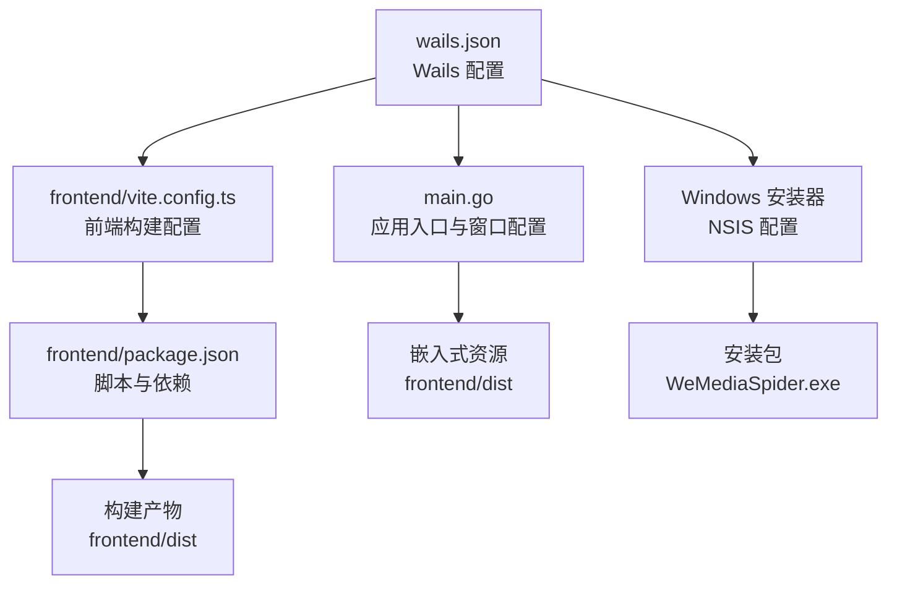
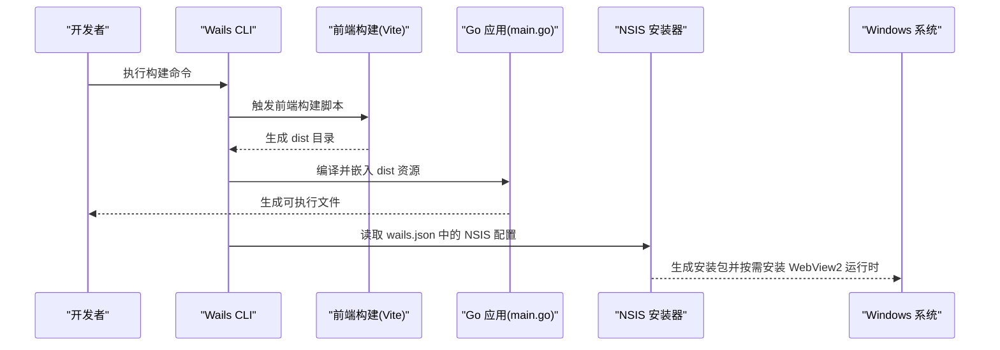
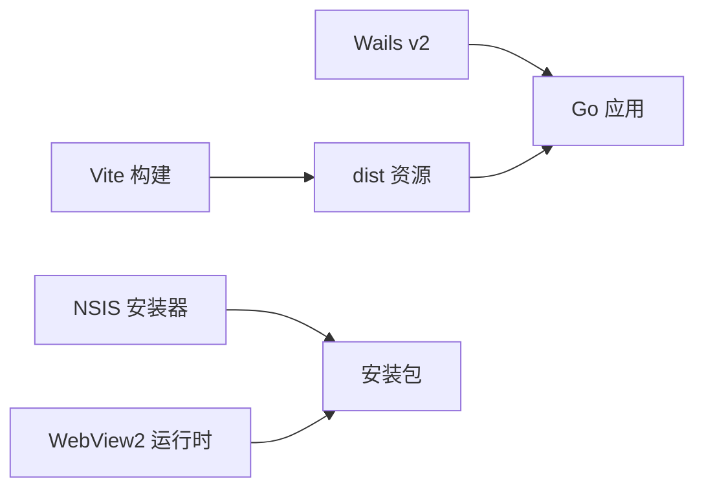

# 部署配置

<cite>
**本文引用的文件**
- [wails.json](file://wails.json)
- [main.go](file://main.go)
- [vite.config.ts](file://frontend/vite.config.ts)
- [package.json](file://frontend/package.json)
- [version.json](file://version.json)
- [go.mod](file://go.mod)
- [README.md](file://README.md)
- [.gitignore](file://.gitignore)
</cite>

## 目录
1. [简介](#简介)
2. [项目结构](#项目结构)
3. [核心组件](#核心组件)
4. [架构总览](#架构总览)
5. [详细组件分析](#详细组件分析)
6. [依赖分析](#依赖分析)
7. [性能考虑](#性能考虑)
8. [故障排查指南](#故障排查指南)
9. [结论](#结论)
10. [附录](#附录)

## 简介
本文件面向 WeMediaSpider 的部署与发布流程，聚焦于 Wails 配置文件的各项参数、前端构建与开发服务器设置、Windows 平台安装器与 WebView2 运行时集成、以及跨平台部署差异与优化建议。同时提供生产环境部署最佳实践与安全配置要点，帮助团队在不同环境中稳定交付应用。

## 项目结构
WeMediaSpider 采用前后端分离的 Wails 应用结构：Go 后端负责业务逻辑与系统交互，React/Vite 前端负责用户界面与交互；Wails 负责桥接前后端并打包为桌面应用。构建产物通过 Wails 配置与前端构建脚本协同生成，并在 Windows 平台使用 NSIS 安装器进行分发。

**图示来源**
- [wails.json:1-29](file://wails.json#L1-L29)
- [main.go:20-21](file://main.go#L20-L21)
- [vite.config.ts:1-8](file://frontend/vite.config.ts#L1-L8)
- [package.json:1-30](file://frontend/package.json#L1-L30)

**章节来源**
- [wails.json:1-29](file://wails.json#L1-L29)
- [main.go:20-21](file://main.go#L20-L21)
- [vite.config.ts:1-8](file://frontend/vite.config.ts#L1-L8)
- [package.json:1-30](file://frontend/package.json#L1-L30)
- [README.md:66-70](file://README.md#L66-L70)

## 核心组件
- Wails 应用配置（wails.json）
  - 应用基本信息：名称、输出文件名、作者信息、产品元数据（公司、产品、版本、版权、备注）。
  - 前端集成：安装命令、构建命令、开发模式监视与服务器地址。
  - Windows 平台：图标、NSIS 安装器模式与目录、WebView2 运行时安装器开关。
- 应用入口与资源嵌入（main.go）
  - 使用 embed 将前端构建产物作为静态资源嵌入二进制。
  - 初始化窗口尺寸、背景色、启动回调、关闭拦截、绑定业务对象。
- 前端构建与开发（frontend/vite.config.ts、frontend/package.json）
  - Vite 插件与默认配置。
  - npm 脚本：dev、build、preview。
- 版本与更新（version.json）
  - 当前版本、更新地址、发行说明。
- 依赖与工具链（go.mod、README.md、.gitignore）
  - Go 版本、Wails 依赖、Node.js 环境要求、构建与开发命令、忽略项。

**章节来源**
- [wails.json:1-29](file://wails.json#L1-L29)
- [main.go:20-21](file://main.go#L20-L21)
- [vite.config.ts:1-8](file://frontend/vite.config.ts#L1-L8)
- [package.json:1-30](file://frontend/package.json#L1-L30)
- [version.json:1-6](file://version.json#L1-L6)
- [go.mod:1-85](file://go.mod#L1-L85)
- [README.md:47-70](file://README.md#L47-L70)
- [.gitignore:1-3](file://.gitignore#L1-L3)

## 架构总览
下图展示从配置到最终安装包的关键路径：Wails 配置驱动前端构建与资源嵌入，main.go 在运行时加载嵌入资源并初始化窗口；Windows 平台通过 NSIS 安装器打包并可选安装 WebView2 运行时。

**图示来源**
- [wails.json:5-8](file://wails.json#L5-L8)
- [package.json:6-10](file://frontend/package.json#L6-L10)
- [main.go:20-21](file://main.go#L20-L21)
- [wails.json:20-27](file://wails.json#L20-L27)

## 详细组件分析

### Wails 配置详解（wails.json）
- 应用基本信息
  - 名称与输出文件名：用于生成可执行文件与安装包标识。
  - 作者信息：可为空，便于分发与合规。
  - 产品元数据：包含公司名、产品名、版本、版权、备注，影响安装器与系统属性。
- 前端集成
  - 安装命令：用于首次或 CI 环境准备依赖。
  - 构建命令：定义生产构建流程。
  - 开发模式监视与服务器地址：自动探测开发服务器地址，便于热重载与调试。
- Windows 平台特定
  - 图标：应用图标文件路径。
  - NSIS 安装器：
    - 安装模式：按机器范围安装。
    - 安装目录：默认安装到 64 位程序目录下的固定路径。
    - WebView2 运行时安装器：启用后，安装包会在缺少运行时的情况下自动安装。
- 版本管理
  - 与 version.json 的版本字段配合，确保安装包与更新提示一致。

**章节来源**
- [wails.json:1-29](file://wails.json#L1-L29)
- [version.json:1-6](file://version.json#L1-L6)

### 前端构建与开发服务器（frontend/vite.config.ts、frontend/package.json）
- Vite 配置
  - 默认插件集，满足 React + TypeScript 场景。
  - 无需额外自定义即可适配 Wails 的资源嵌入与开发模式。
- npm 脚本
  - dev：启动开发服务器，结合 Wails 的开发模式自动探测地址。
  - build：先类型检查，再进行生产构建，输出至 dist。
  - preview：本地预览构建结果。
- 依赖
  - React、Ant Design、路由、图表等 UI 与工具库。
  - Vite、TypeScript、React 插件等开发与构建依赖。

**章节来源**
- [vite.config.ts:1-8](file://frontend/vite.config.ts#L1-L8)
- [package.json:1-30](file://frontend/package.json#L1-L30)

### 应用入口与资源嵌入（main.go）
- 资源嵌入
  - 使用 embed 将前端 dist 目录整体嵌入二进制，避免运行时外部文件依赖。
- 窗口与生命周期
  - 动态计算窗口尺寸，设置最小宽高与背景色。
  - OnStartup：初始化应用、处理静默启动（隐藏到托盘）。
  - OnShutdown：优雅关闭。
  - OnBeforeClose：阻止意外关闭，确保任务完成或确认退出。
- 平台选项
  - Windows 选项中控制 Webview 透明度与图标显示，便于定制外观。

**章节来源**
- [main.go:20-21](file://main.go#L20-L21)
- [main.go:52-84](file://main.go#L52-L84)

### 版本与更新（version.json）
- 版本号：与应用元数据保持一致，便于安装器与更新检查。
- 更新地址：指向 GitHub Releases，供应用内检查更新。
- 发行说明：简要描述本次更新内容，提升用户感知。

**章节来源**
- [version.json:1-6](file://version.json#L1-L6)

### 构建与开发命令（README.md、go.mod、.gitignore）
- 开发命令
  - wails dev：启动开发模式，自动监听前端变化并热重载。
- 生产构建
  - wails build：编译 Go 代码、嵌入前端资源、生成可执行文件。
- 环境要求
  - Go 版本与 Wails 依赖版本明确，Node.js 版本要求与前端脚本相匹配。
- 忽略项
  - 构建产物与 node_modules 被忽略，避免污染仓库。

**章节来源**
- [README.md:47-70](file://README.md#L47-L70)
- [go.mod:1-85](file://go.mod#L1-L85)
- [.gitignore:1-3](file://.gitignore#L1-L3)

## 依赖分析
- Wails 与 Go 工具链
  - 使用 Wails v2 作为核心框架，Go 语言版本满足现代特性需求。
- 前端生态
  - React + TypeScript + Vite 提供高效的开发体验与稳定的构建流程。
- 安装器与运行时
  - NSIS 安装器与 WebView2 运行时集成，降低用户环境门槛。

**图示来源**
- [go.mod:15](file://go.mod#L15)
- [wails.json:20-27](file://wails.json#L20-L27)

**章节来源**
- [go.mod:1-85](file://go.mod#L1-L85)
- [wails.json:20-27](file://wails.json#L20-L27)

## 性能考虑
- 前端构建优化
  - 使用 Vite 的原生快速冷启动与热更新能力，减少开发等待时间。
  - 生产构建阶段启用压缩与 Tree-shaking，减小包体。
- 资源嵌入策略
  - 将 dist 整体嵌入二进制，避免运行时 IO 与路径问题，提高启动稳定性。
- 窗口与渲染
  - 合理设置最小尺寸与背景色，避免首屏闪烁与布局抖动。
- 安装器体积
  - 仅在需要时启用 WebView2 安装器，平衡安装包大小与兼容性。

[本节为通用指导，不直接分析具体文件，故无“章节来源”]

## 故障排查指南
- 开发模式无法热更新
  - 确认前端脚本与 Wails 的开发服务器地址配置一致。
  - 检查 Node.js 版本是否满足前端脚本要求。
- 构建失败或资源未嵌入
  - 确保前端构建成功生成 dist 目录。
  - 检查 main.go 中嵌入路径与实际 dist 结构一致。
- 安装后无法启动或黑屏
  - 检查 WebView2 是否正确安装或允许安装。
  - 查看应用日志与错误提示，确认资源加载路径。
- 版本不一致导致更新异常
  - 对齐 wails.json 与 version.json 的版本号，确保更新检查正常。

**章节来源**
- [wails.json:5-8](file://wails.json#L5-L8)
- [package.json:6-10](file://frontend/package.json#L6-L10)
- [main.go:20-21](file://main.go#L20-L21)
- [wails.json:20-27](file://wails.json#L20-L27)
- [version.json:1-6](file://version.json#L1-L6)

## 结论
通过合理配置 Wails 与前端构建工具链，WeMediaSpider 能够在 Windows 平台上实现一键安装、自动运行时安装与稳定的资源加载。结合版本管理与安装器优化，可在不同环境中提供一致且可靠的用户体验。建议在生产环境遵循本文的安全与性能建议，持续完善自动化构建与发布流程。

[本节为总结性内容，不直接分析具体文件，故无“章节来源”]

## 附录
- 快速参考
  - 开发：wails dev
  - 构建：wails build
  - 环境：Go 与 Node.js 版本要求见 go.mod 与 package.json
  - 忽略项：build/bin、node_modules、frontend/dist

**章节来源**
- [README.md:47-70](file://README.md#L47-L70)
- [go.mod:1-85](file://go.mod#L1-L85)
- [.gitignore:1-3](file://.gitignore#L1-L3)