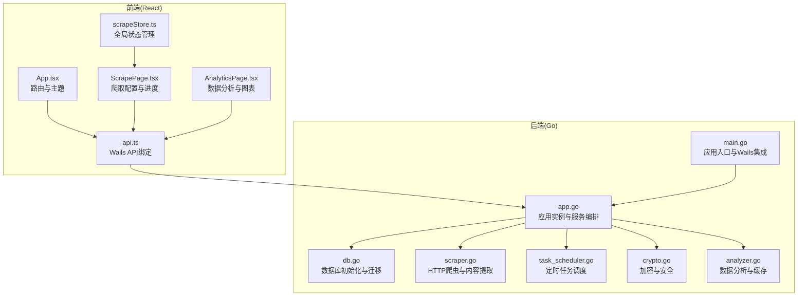
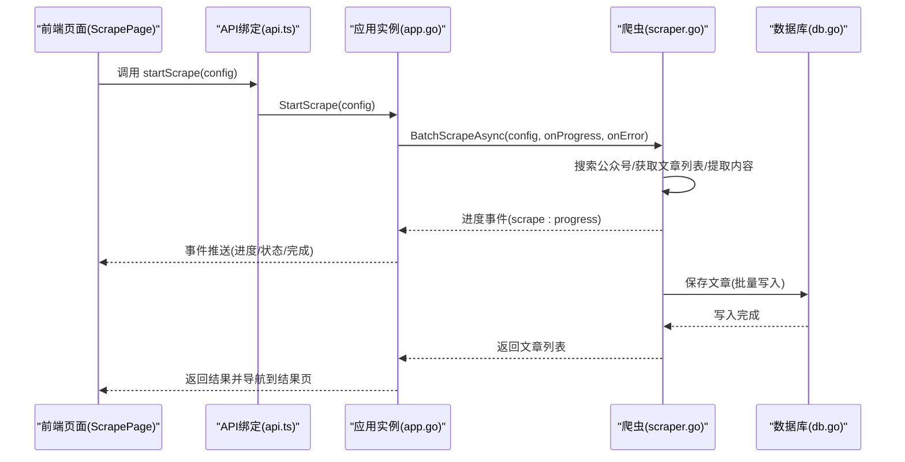
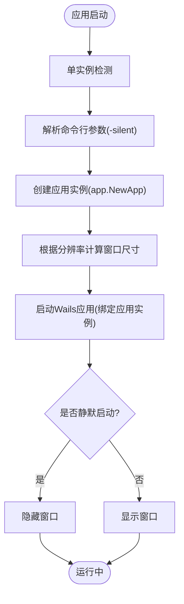
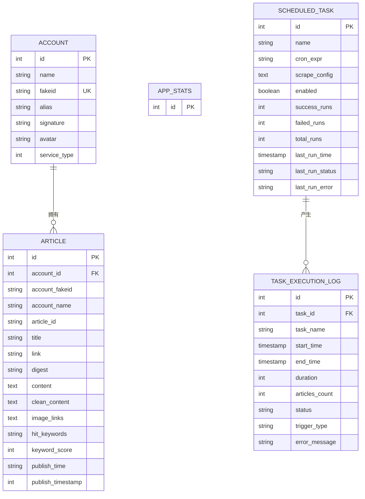
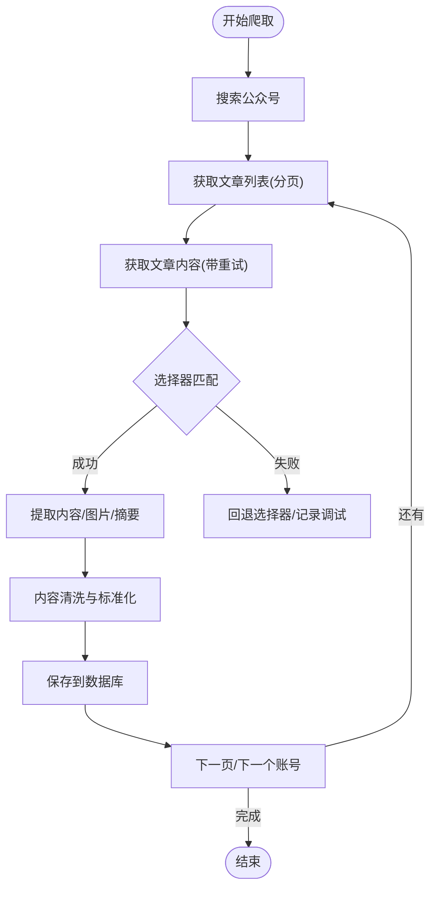
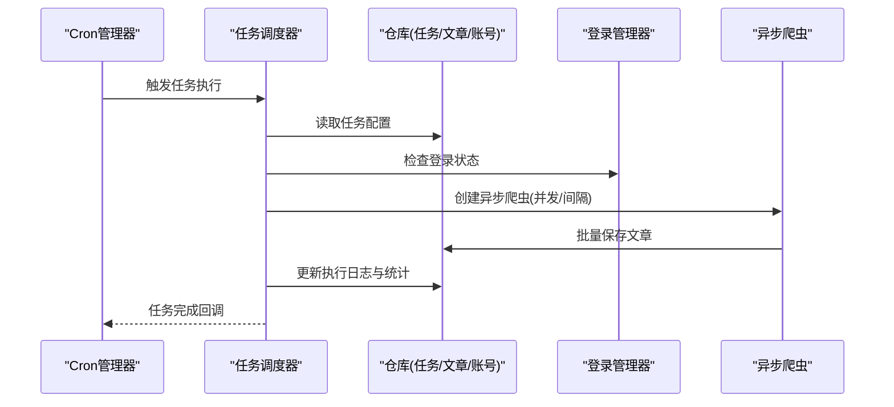
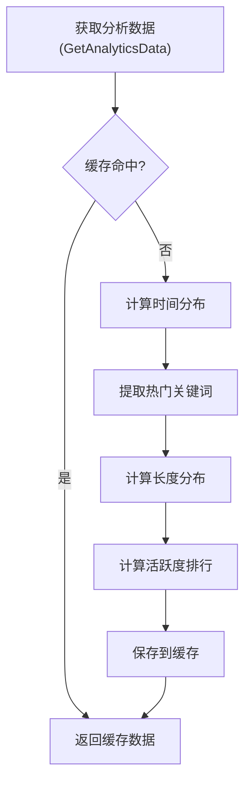
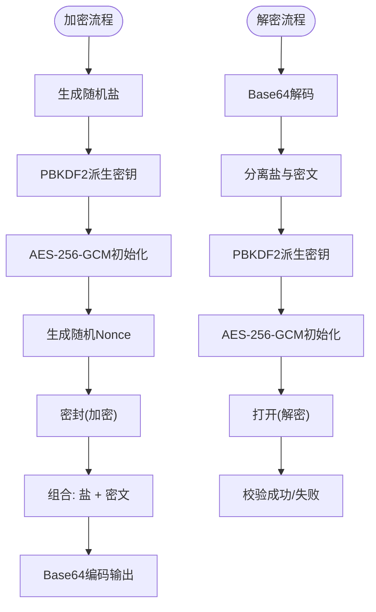
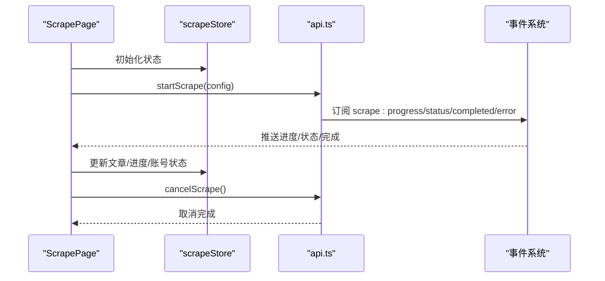
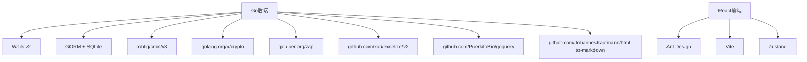

# 项目概述

<cite>
**本文档引用的文件**
- [README.md](file://README.md)
- [main.go](file://main.go)
- [wails.json](file://wails.json)
- [go.mod](file://go.mod)
- [backend/app/app.go](file://backend/app/app.go)
- [frontend/src/App.tsx](file://frontend/src/App.tsx)
- [backend/internal/database/db.go](file://backend/internal/database/db.go)
- [backend/internal/spider/scraper.go](file://backend/internal/spider/scraper.go)
- [frontend/src/pages/ScrapePage.tsx](file://frontend/src/pages/ScrapePage.tsx)
- [frontend/src/pages/AnalyticsPage.tsx](file://frontend/src/pages/AnalyticsPage.tsx)
- [backend/internal/scheduler/task_scheduler.go](file://backend/internal/scheduler/task_scheduler.go)
- [backend/pkg/crypto/crypto.go](file://backend/pkg/crypto/crypto.go)
- [frontend/src/services/api.ts](file://frontend/src/services/api.ts)
- [frontend/src/stores/scrapeStore.ts](file://frontend/src/stores/scrapeStore.ts)
- [backend/internal/analytics/analyzer.go](file://backend/internal/analytics/analyzer.go)
</cite>

## 目录
1. [简介](#简介)
2. [项目结构](#项目结构)
3. [核心组件](#核心组件)
4. [架构总览](#架构总览)
5. [详细组件分析](#详细组件分析)
6. [依赖关系分析](#依赖关系分析)
7. [性能考量](#性能考量)
8. [故障排除指南](#故障排除指南)
9. [结论](#结论)

## 简介
WeMediaSpider 是一款基于 Go 语言与 React 框架开发的桌面应用程序，专注于微信公众号文章的智能爬取与分析。该应用通过 Wails v2 将 Go 后端与 React 前端无缝集成，提供批量化、可视化、可扩展的桌面体验。核心能力包括：
- 批量爬取：支持多公众号并发抓取，实时展示进度与状态
- 定时任务：可视化配置定时爬取，支持每日/每周/间隔执行
- 数据分析：文章时间分布图表、关键词词云、活跃度排行等
- 多格式导出：Excel、CSV、JSON、Markdown
- 图片下载：批量下载文章图片
- 数据库存储：SQLite + GORM，高效查询与持久化
- 安全加密：AES-256-GCM + HMAC 完整性校验，保障敏感数据安全
- 智能缓存：避免重复请求，提升性能与稳定性

技术选型优势：
- Wails v2：将 Go 的高性能与 React 的现代化前端结合，构建跨平台桌面应用
- SQLite + GORM：轻量易用、零依赖、易于部署与迁移
- Chrome DevTools Protocol（CDP）相关技术栈：用于模拟浏览器行为与反爬对抗（本项目采用 HTTP 请求与解析策略）
- React + TypeScript + Ant Design + Vite：现代化前端生态，组件化与类型安全

## 项目结构
项目采用前后端分离与模块化组织方式：
- backend：Go 后端，包含应用逻辑、数据库、爬虫、定时任务、分析、导出、安全等模块
- frontend：React 前端，包含页面、组件、服务、状态管理与类型定义
- build：构建产物目录
- wails.json：Wails 应用配置，定义应用元信息、打包与安装选项
- go.mod/go.sum：Go 依赖管理

**图表来源**
- [frontend/src/App.tsx:1-88](file://frontend/src/App.tsx#L1-L88)
- [frontend/src/pages/ScrapePage.tsx:1-800](file://frontend/src/pages/ScrapePage.tsx#L1-L800)
- [frontend/src/pages/AnalyticsPage.tsx:1-304](file://frontend/src/pages/AnalyticsPage.tsx#L1-L304)
- [frontend/src/services/api.ts:1-161](file://frontend/src/services/api.ts#L1-L161)
- [frontend/src/stores/scrapeStore.ts:1-65](file://frontend/src/stores/scrapeStore.ts#L1-L65)
- [main.go:1-91](file://main.go#L1-L91)
- [backend/app/app.go:1-85](file://backend/app/app.go#L1-L85)
- [backend/internal/database/db.go:1-115](file://backend/internal/database/db.go#L1-L115)
- [backend/internal/spider/scraper.go:1-541](file://backend/internal/spider/scraper.go#L1-L541)
- [backend/internal/scheduler/task_scheduler.go:1-270](file://backend/internal/scheduler/task_scheduler.go#L1-L270)
- [backend/pkg/crypto/crypto.go:1-314](file://backend/pkg/crypto/crypto.go#L1-L314)
- [backend/internal/analytics/analyzer.go:1-281](file://backend/internal/analytics/analyzer.go#L1-L281)

**章节来源**
- [README.md:86-103](file://README.md#L86-L103)
- [wails.json:1-29](file://wails.json#L1-L29)
- [go.mod:1-85](file://go.mod#L1-L85)

## 核心组件
- 应用入口与集成：Wails v2 将 Go 后端与 React 前端桥接，实现桌面应用的窗口管理、事件通信与资源嵌入
- 应用实例：集中管理登录、爬虫、缓存、数据库、仓库、分析、调度、托盘与开机自启等功能模块
- 数据库与模型：SQLite + GORM，自动迁移与 WAL 模式优化，支持应用统计、定时任务与执行日志等表
- 爬虫引擎：基于 HTTP 请求与 HTML 解析，支持内容提取、图片链接处理、关键词过滤与智能重试
- 定时任务：基于 Cron 表达式，支持最近 N 天动态日期范围、执行日志与并发控制
- 数据分析：时间分布、关键词词云、长度分布与活跃度排行，并内置缓存机制
- 安全与加密：PBKDF2 派生密钥，AES-256-GCM 加密，.zgswx 文件格式封装与完整性校验
- 前端页面与状态：React 页面组件、API 服务绑定、全局状态管理与实时事件监听

**章节来源**
- [main.go:23-91](file://main.go#L23-L91)
- [backend/app/app.go:25-85](file://backend/app/app.go#L25-L85)
- [backend/internal/database/db.go:18-115](file://backend/internal/database/db.go#L18-L115)
- [backend/internal/spider/scraper.go:25-541](file://backend/internal/spider/scraper.go#L25-L541)
- [backend/internal/scheduler/task_scheduler.go:20-270](file://backend/internal/scheduler/task_scheduler.go#L20-L270)
- [backend/internal/analytics/analyzer.go:17-281](file://backend/internal/analytics/analyzer.go#L17-L281)
- [backend/pkg/crypto/crypto.go:20-314](file://backend/pkg/crypto/crypto.go#L20-L314)
- [frontend/src/App.tsx:15-88](file://frontend/src/App.tsx#L15-L88)
- [frontend/src/services/api.ts:48-101](file://frontend/src/services/api.ts#L48-L101)
- [frontend/src/stores/scrapeStore.ts:4-65](file://frontend/src/stores/scrapeStore.ts#L4-L65)

## 架构总览
WeMediaSpider 采用“桌面应用 + 前后端分离”的架构设计，Wails v2 作为桥接层，使前端通过 Wails JS API 调用后端方法，后端通过事件系统向前端推送进度与状态。

**图表来源**
- [frontend/src/pages/ScrapePage.tsx:413-482](file://frontend/src/pages/ScrapePage.tsx#L413-L482)
- [frontend/src/services/api.ts:48-101](file://frontend/src/services/api.ts#L48-L101)
- [backend/app/app.go:25-85](file://backend/app/app.go#L25-L85)
- [backend/internal/spider/scraper.go:1-541](file://backend/internal/spider/scraper.go#L1-L541)
- [backend/internal/database/db.go:18-115](file://backend/internal/database/db.go#L18-L115)

## 详细组件分析

### 应用入口与窗口管理
- 单实例检测与窗口尺寸适配
- 隐藏系统标题栏，透明背景与最小化到托盘
- 开机自启与静默启动支持

**图表来源**
- [main.go:23-91](file://main.go#L23-L91)

**章节来源**
- [main.go:23-91](file://main.go#L23-L91)
- [wails.json:1-29](file://wails.json#L1-L29)

### 数据库与模型
- SQLite + GORM：自动迁移、WAL 模式、连接池与外键约束
- 模型：公众号、文章、应用统计、定时任务、任务执行日志

**图表来源**
- [backend/internal/database/db.go:82-109](file://backend/internal/database/db.go#L82-L109)

**章节来源**
- [backend/internal/database/db.go:18-115](file://backend/internal/database/db.go#L18-L115)

### 爬虫引擎与内容提取
- 支持搜索公众号、获取文章列表、提取文章内容与图片链接
- 智能重试、频率限制、多种内容选择器与图片处理
- 关键词过滤与内容清洗

**图表来源**
- [backend/internal/spider/scraper.go:72-261](file://backend/internal/spider/scraper.go#L72-L261)
- [backend/internal/spider/scraper.go:264-442](file://backend/internal/spider/scraper.go#L264-L442)

**章节来源**
- [backend/internal/spider/scraper.go:25-541](file://backend/internal/spider/scraper.go#L25-L541)

### 定时任务调度
- Cron 表达式解析与任务执行
- 最近 N 天动态日期范围、执行日志与并发控制
- 任务完成回调与统计更新

**图表来源**
- [backend/internal/scheduler/task_scheduler.go:52-189](file://backend/internal/scheduler/task_scheduler.go#L52-L189)

**章节来源**
- [backend/internal/scheduler/task_scheduler.go:20-270](file://backend/internal/scheduler/task_scheduler.go#L20-L270)

### 数据分析与缓存
- 时间分布、关键词词云、长度分布与活跃度排行
- 关键词提取与缓存机制，支持强制刷新

**图表来源**
- [backend/internal/analytics/analyzer.go:46-106](file://backend/internal/analytics/analyzer.go#L46-L106)

**章节来源**
- [backend/internal/analytics/analyzer.go:17-281](file://backend/internal/analytics/analyzer.go#L17-L281)

### 安全与加密
- PBKDF2 派生密钥，AES-256-GCM 加密与解密
- .zgswx 文件格式封装，包含魔数、版本、盐值与随机 Nonce
- 文件读写与格式验证

**图表来源**
- [backend/pkg/crypto/crypto.go:34-121](file://backend/pkg/crypto/crypto.go#L34-L121)
- [backend/pkg/crypto/crypto.go:134-195](file://backend/pkg/crypto/crypto.go#L134-L195)
- [backend/pkg/crypto/crypto.go:197-260](file://backend/pkg/crypto/crypto.go#L197-L260)

**章节来源**
- [backend/pkg/crypto/crypto.go:1-314](file://backend/pkg/crypto/crypto.go#L1-L314)

### 前端页面与交互
- 路由与主题：暗色主题、国际化与布局组件
- 爬取页面：配置表单、进度条、账号状态、常用公众号、关键词筛选
- 分析页面：时间分布图、词云图、颜色与字号配置、导出功能
- API 服务：统一绑定 Wails 方法与事件监听
- 状态管理：Zustand 全局状态，维护文章、进度与账号状态

**图表来源**
- [frontend/src/pages/ScrapePage.tsx:413-482](file://frontend/src/pages/ScrapePage.tsx#L413-L482)
- [frontend/src/stores/scrapeStore.ts:19-65](file://frontend/src/stores/scrapeStore.ts#L19-L65)
- [frontend/src/services/api.ts:103-161](file://frontend/src/services/api.ts#L103-L161)

**章节来源**
- [frontend/src/App.tsx:15-88](file://frontend/src/App.tsx#L15-L88)
- [frontend/src/pages/ScrapePage.tsx:1-800](file://frontend/src/pages/ScrapePage.tsx#L1-L800)
- [frontend/src/pages/AnalyticsPage.tsx:1-304](file://frontend/src/pages/AnalyticsPage.tsx#L1-L304)
- [frontend/src/services/api.ts:1-161](file://frontend/src/services/api.ts#L1-L161)
- [frontend/src/stores/scrapeStore.ts:1-65](file://frontend/src/stores/scrapeStore.ts#L1-L65)

## 依赖关系分析
- 技术栈依赖：Go 生态（Wails、GORM、SQLite、cron）、前端生态（React、Ant Design、Vite）
- 外部库：Chrome DevTools Protocol 相关库用于浏览器自动化（本项目以 HTTP 爬取为主），Markdown 转换、Excel 导出、日志与时间工具等

**图表来源**
- [go.mod:5-22](file://go.mod#L5-L22)

**章节来源**
- [go.mod:1-85](file://go.mod#L1-L85)

## 性能考量
- 数据库性能：WAL 模式、连接池、外键约束与同步模式调优，减少锁竞争与提升并发
- 爬取性能：频率限制器与智能重试，避免触发风控；多选择器容错与图片链接预处理
- 前端性能：事件驱动的增量更新、缓存与防抖、分页与虚拟滚动（页面层面）
- 定时任务：并发控制与执行日志，避免重复执行与资源浪费

## 故障排除指南
- 登录状态异常：检查登录接口与缓存清理，确认 Token 与 Headers 有效性
- 爬取中断或频率限制：降低请求间隔、启用智能重试、检查网络与代理
- 数据库连接失败：确认数据库路径与权限、WAL 模式与连接池配置
- 定时任务未执行：核对 Cron 表达式、任务状态与执行日志
- 加密/解密失败：确认密码与盐值一致性、.zgswx 文件格式与魔数校验

**章节来源**
- [backend/internal/spider/scraper.go:263-293](file://backend/internal/spider/scraper.go#L263-L293)
- [backend/internal/database/db.go:54-62](file://backend/internal/database/db.go#L54-L62)
- [backend/internal/scheduler/task_scheduler.go:60-71](file://backend/internal/scheduler/task_scheduler.go#L60-L71)
- [backend/pkg/crypto/crypto.go:197-260](file://backend/pkg/crypto/crypto.go#L197-L260)

## 结论
WeMediaSpider 通过 Wails v2 将 Go 的高性能与 React 的现代前端体验融合，构建了功能完备、可扩展且易维护的桌面应用。其模块化设计与清晰的职责划分，使得批量爬取、定时任务、数据分析、多格式导出与安全加密等能力得以稳定协同工作。对于初学者，应用提供了直观的图形界面与丰富的可视化功能；对于有经验的开发者，其良好的架构与完善的模块边界便于二次开发与定制。